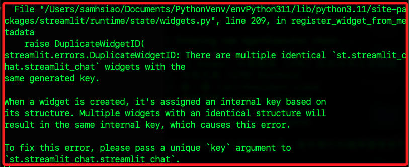

# 其他補充功能

_暫時不分類_

<br>

## 兩側對話

1. 安裝套件。

    ```bash
    pip install streamlit_chat
    ```

<br>

2. 程式碼。

    ```python
    import streamlit as st
    # 引入 message 函数
    from streamlit_chat import message


    # 自訂一個寫入訊息的函數，參數有：角色、內容，並預設會儲存
    def write_message(role, content, save=True):
        # 儲存
        if save:
            # 依據傳入的角色將訊息寫入 session_state
            st.session_state.messages.append({"role": role, "content": content})

        # 根據角色顯示消息
        if role == "user":
            # 用戶消息，對齊右側
            message(content, is_user=True)
        else:
            # 助手消息，對齊左側
            message(content, is_user=False)


    # 初始化消息列表
    if "messages" not in st.session_state:
        st.session_state.messages = []

    # 測試消息
    write_message("user", "嗨，你好嗎？")
    write_message("assistant", "謝謝，我很好。")

    # 顯示所有消息
    for msg in st.session_state.messages:
        write_message(msg["role"], msg["content"], save=False)
    ```

<br>

3. 顯示。

    

<br>

4. 會顯示錯誤：這是因為有多個 streamlit_chat 元件使用了相同的內部鍵。

    

<br>

5. 為每個 message 函數呼叫提供一個唯一的 key 參數，可透過使用訊息的索引或其他唯一識別來產生唯一的 key 參數，然後在 write_message 函數內部以及循環顯示訊息時都需要提供這個 key 參數。

<br>

6. 修正後腳本。

    ```python
    import streamlit as st
    from streamlit_chat import message  # 引入 message 函數


    # 自訂一個寫入訊息的函數，參數有：角色、內容，並預設會儲存
    def write_message(role, content, save=True):
        # 儲存
        if save:
            # 依據傳入的角色將訊息寫入 session_state
            st.session_state.messages.append({"role": role, "content": content})

        # 根據角色顯示消息
        key = f"{role}_{len(st.session_state.messages)}"
        if role == "user":
            # 用戶消息，對齊右側
            message(content, is_user=True, key=key)
        else:
            # 助手消息，對齊左側
            message(content, is_user=False, key=key)


    # 初始化消息列表
    if "messages" not in st.session_state:
        st.session_state.messages = []

    # 測試消息
    write_message("user", "哈囉，你好嗎？")
    write_message("assistant", "嗨～我很好，謝謝。")

    # 顯示所有消息
    for index, msg in enumerate(st.session_state.messages):
        key = f"{msg['role']}_{index}"
        message(msg["content"], is_user=(msg["role"] == "user"), key=key)
    ```

<br>

___

_END_