_關於這個專案原本是個很好的教程，不過似乎發生了版本的衝突導致於無法運行，這裡暫時擱置，所以 `01_專案 Streamlit_ChatBot` 暫時先到這 。_

<br>

# Stramlit + ChatBot

_這是一個完整的專案，可在本地、Codespace、Streamlit 服務器上運行。_

<br>

## 說明

1. 這個筆記是基於官方的 [GraphAcademy 教程](https://graphacademy.neo4j.com/courses/llm-chatbot-python/1-project-setup/) 所進行的拓展，不過教程在後半段不太清楚且有部分錯誤，這裡進行修正並彙整過程紀錄。

    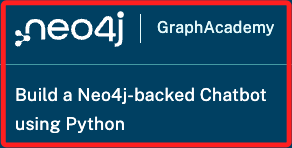

<br>

1. 範例中的腳本可參考 [GitHub](https://github.com/neo4j-graphacademy/llm-chatbot-python?tab=readme-ov-file)，在操作中也會透過 `Git` 指令克隆這個倉庫。

<br>

3. 關於 `向量索引`的部分，可以參考另外筆記，也可參考 [LangChain 官方文件 - Neo4j Vector Index](https://python.langchain.com/v0.1/docs/integrations/vectorstores/neo4jvector/)，或 [neo4j 官方文件 － Vector search indexes](https://neo4j.com/docs/cypher-manual/current/indexes/semantic-indexes/vector-indexes/)。

<br>

## 步驟

1. 檢查 Python 版本：因為專案會使用 `Langchain` 模組，但是模組目前不支援 `Python 3.12` 以上版本，所以開始進行前，請確認本機當前 Python 的版本號。

    ```bash
    python --version
    ```

    

<br>

2. 建立虛擬環境：開啟終端機，透過指令進入自己管理 Python 虛擬環境的路徑中建立，這裡示範的路徑是 `~/Documents/PythonVenv`。

    ```bash
    cd ~/Documents/PythonVenv && python -m venv envllmChatBot
    ```

<br>

3. 編輯環境參數。

    ```bash
    nano ~/.zshrc
    ```

<br>

4. 在 `.zshrc` 文件中加入以下代碼，通常寫在最下方即可，然後透過組合鍵將文件儲存 `control+o` 並退出 `control+x`。

    ```bash
    source /Users/samhsiao/Documents/PythonVenv/envllmChatBot/bin/activate
    ```

<br>

5. 啟動虛擬環境。

    ```bash
    source ~/.zshrc
    ```

<br>

6. 進入要存放的路徑中，這裡示範存放在桌面，然後下載 git，並進入下載的資料夾。

    ```bash
    cd ~/Desktop && git clone https://github.com/neo4j-graphacademy/llm-chatbot-python && cd llm-chatbot-python
    ```

<br>

7. 透過指令查看 `requirements.txt` 文件中預設了哪些模組。

    ```bash
    cat requirements.txt
    ```

    

<br>

8. 安裝套件；透過指令安裝 `requirements.txt` 文件中指定的模組與對應的版本；另外，指令中透過 `echo` 添加一個套件，這是因為實作時發現缺少了這個套件，故在此將其加入。

    ```bash
    echo "langchainhub" >> requirements.txt && pip install -r requirements.txt
    ```

<br>

9. 可再次確認 `requirements.txt` 的內容。

    ```bash
    cat requirements.txt
    ```

    _結果如下_

    ```txt
    langchain
    openai
    langchain_openai
    neo4j-driver
    streamlit
    langchainhub
    ```

<br>

10. _特別說明_，關於 `langchainhub` 模組在後續的實作中會報錯缺少這個套件，通常可在當下再透過以下的指令手動進行安裝，而在前面之所以先將它加入 `requirements.txt` 批次安裝，主要是可避免建立容器時還需在 `devcontainer.json` 文件中添加設置指令的麻煩。

    ```bash
    pip install langchainhub
    ```

<br>

11. 如有提示要更新就照做。

    ```bash
    pip install --upgrade pip
    ```

<br>

12. 嘗試運行主腳本 `bot.py`。

    ```bash
    streamlit run bot.py
    ```

<br>

13. 當前的機器人只會回應相同訊息。

    

<br>

14. 使用組合鍵 `control+c` 退出運行，然後開啟 VSCode 並再次運行，在這裡這樣做並無其他用意，只是為了確保是在專案資料夾中開啟 VSCode。

    ```bash
    code . && streamlit run bot.py
    ```

<br>

## 建立 LLM 實體

1. 進入 [OpenAI 官網](platform.openai.com) 取得 API Key，這裡先跳過說明，假設已取得。

<br>

2. 在敏感資訊部分，使用 `dotenv` 處理並以 `.env` 來儲存 `OPENAI_API_KEY` 及 `OPENAI_MODEL` 等變數；其中模型版本部分可選用 `GPT-3.5 Turbo` 的 `gpt-3.5-turbo`，若有具有付費會員者可換 `GPT-4` 的 `gpt-4-turbo`，另外務必記得將 `.env` 寫入 `.gitignore`，由於 `.gitignore` 已存在於範例中且已納入 `.env`，所以這裡僅提示建立 `.env` 文件。

   ```bash
   touch .env
   ```

<br>

3. 關於模型介紹可閱讀 [官網](https://platform.openai.com/docs/models/models) 說明，特別注意，假如是要填入 `模型代號`，要再參考下方的說明。

   _這是說明_

   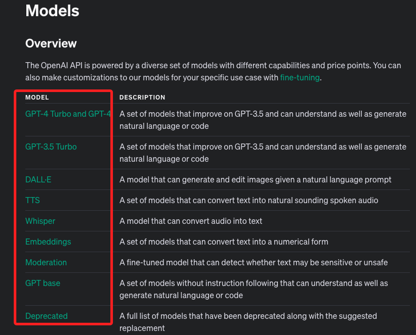

   _這是代號_

   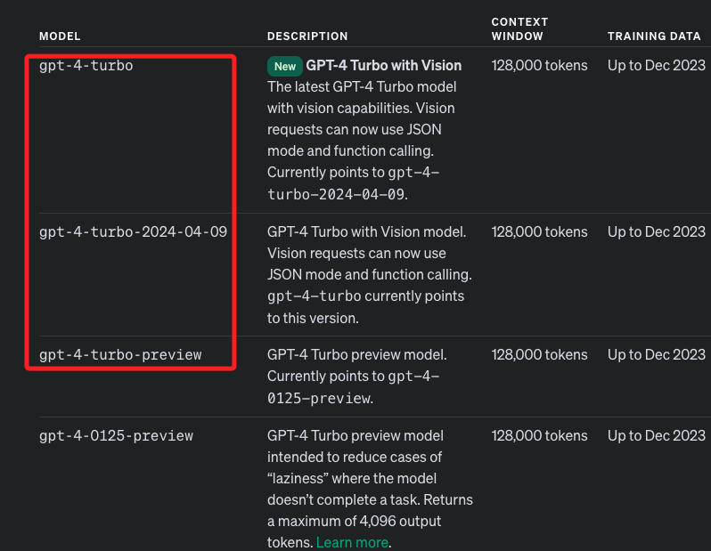

<br>

4. 範例中的 `.gitignore` 文件已經將 `.env` 寫入，可以不用添加。

   ```json
   __pycache__
   # 之後若部署在 Streamlit 服務器上會使用到
   .streamlit/secrets.toml
   .env
   .DS_Store
   ```

<br>

5. 在 `.env` 寫入敏感資訊，其中 `OPENAI_API_KEY` 部分填入自己的 `API Key`，而 `OPENAI_MODEL` 可查詢 [官網](https://platform.openai.com/docs/models/models)；由於 `.env` 文件並非腳本，所以字串部分無需加上引號，等號兩側也無需間隔，但若加上間隔或引號亦無妨。

   ```json
   OPENAI_API_KEY=sk-...
   OPENAI_MODEL=gpt-4-turbo
   ```

<br>

6. 安裝套件。

   ```bash
   pip install python-dotenv
   ```

<br>

7. 改寫官方的 `llm.py`：導入 `dotenv` 讀取 OpenAPI 所需的敏感資訊。

   ```python
   # llm.py
   from langchain_openai import ChatOpenAI
   from langchain_openai import OpenAIEmbeddings
   # 載入庫
   import os
   from dotenv import load_dotenv
   # 載入環境變數
   load_dotenv()

   # 取得環境變數
   OPENAI_API_KEY = os.getenv("OPENAI_API_KEY")
   OPENAI_MODEL = os.getenv("OPENAI_MODEL")

   # 建立 ChatOpenAI 實體
   llm = ChatOpenAI(
       openai_api_key=OPENAI_API_KEY,
       model=OPENAI_MODEL,
   )

   # OpenAIEmbeddings 是用來生成和處理嵌入向量（embeddings）
   # 這些嵌入向量是從使用 OpenAI 模型（如 GPT-4）生成的文本中獲取的
   embeddings = OpenAIEmbeddings(openai_api_key=OPENAI_API_KEY)

   ```

<br>

8. 補充說明，在 `llm.py` 中的 `embeddings = OpenAIEmbeddings(openai_api_key=OPENAI_API_KEY)` 代碼設置將用於在 `vector.py` 中導入並設置向量索引。

<br>

## Neo4j Sandbox

1. 建立 [Neo4j Sandbox](https://sandbox.neo4j.com/onboarding)，進入後點擊 `Next`。

   

<br>

2. 任意輸入一些基本資訊，然後點擊 `Complete` 完成。

   

<br>

3. 點擊名稱 `Recommendations` 可展開，切換到 `Connection via drivers`，然後點擊 `Python`，將下方腳本中的 `URL`、`username`、`password` 等訊息寫入 `.env` 文件。

   

<br>

4. 在 `.env` 文件中添加前一個步驟取得的 Sandbox 資訊。

   ```bash
   OPENAI_API_KEY=sk-...
   OPENAI_MODEL=gpt-4-turbo

   NEO4J_URI = "neo4j://3.89.23.242:7687"
   NEO4J_USERNAME = "neo4j"
   NEO4J_PASSWORD = "stencil-interface-buckets"
   ```

<br>

5. 點擊 `Open` 進行測試，預設是使用 `Open with Browser`。

   

<br>

6. 預設會使用 `neo4j+s` 連線，這裡使用預設的內容即可。

   

<br>

7. `Connect URL` 使用預設，切換到 `Username / Password`，貼上前面複製的密碼，接著點擊連線 `Connect`。

   

<br>

8. 若連線資訊正確，便會進入連線畫面。

   

<br>

## 編輯腳本

_完成以上步驟後，回頭繼續編輯腳本，特別注意，此時還不要點擊版本控制 。_

<br>

1. 接著編輯 `graph.py`：將使用 `dotenv` 的相關代碼寫入。

   ```bash
   # graph.py
   from langchain_community.graphs import Neo4jGraph
   # dotenv
   import os
   from dotenv import load_dotenv
   # 環境參數
   load_dotenv()

   # 取得環境變數
   NEO4J_URI = os.getenv("NEO4J_URI")
   NEO4J_USERNAME = os.getenv("NEO4J_USERNAME")
   NEO4J_PASSWORD = os.getenv("NEO4J_PASSWORD")

   # Neo4j Graph
   graph = Neo4jGraph(
       url=NEO4J_URI,
       username=NEO4J_USERNAME,
       password=NEO4J_PASSWORD,
   )

   ```

<br>

2. 接著編輯 `agent.py`：改寫原本腳本中的 `generate_response()` 函數，加入一些邏輯來判斷透過 `prompt` 語句產生的回應 `response` 是否有例外發生，避免程序崩潰。

   ```python
   # agent.py
   from langchain.tools import Tool
   from langchain.agents import AgentExecutor, create_react_agent
   from langchain import hub
   from langchain.chains.conversation.memory import ConversationBufferWindowMemory
   from solutions.llm import llm
   from solutions.tools.vector import kg_qa
   from solutions.tools.finetuned import cypher_qa

   # tools 的列表定義了其他狀況發生時的設定
   tools = [
       Tool.from_function(
           name="General Chat",
           description="For general chat not covered by other tools",
           func=llm.invoke,
           return_direct=True,
       ),
       Tool.from_function(
           name="Cypher QA",
           description="Provide info about movies questions using Cypher",
           func=cypher_qa,
           return_direct=True,
       ),
       Tool.from_function(
           name="Vector Search Index",
           description="Provides info about movie plots using Vector Search",
           func=kg_qa,
           return_direct=True,
       ),
   ]

   # 調用 langchain 函數 ConversationBufferWindowMemory
   memory = ConversationBufferWindowMemory(
       memory_key="chat_history",
       k=5,
       return_messages=True,
   )

   # 調用 langchain 函數 hub.pull() 生成
   agent_prompt = hub.pull("hwchase17/react-chat")
   # 調用 langchain 函數 create_react_agent，傳入 `llm`、`tools`、`Agent 的回應`
   agent = create_react_agent(llm, tools, agent_prompt)
   agent_executor = AgentExecutor(
       agent=agent, tools=tools, memory=memory, verbose=True
   )

   # 這是原本的函數，改寫添加了判斷的機制
   # def generate_response(prompt):
   #     response = agent_executor.invoke({"input": prompt})
   #     return response["output"]


   def generate_response(prompt):
       try:
           # 回應
           response = agent_executor.invoke({"input": prompt})
           #
           if isinstance(response['output'], dict):
               print('=agent.py -> 備註：回應是一個 dict=')
               response_output = ''
               for item in response['output']:
                   if response_output:
                       response_output += ', '
                   response_output += str(item)
           else:
               # 回應訊息
               print('=agent.py -> 備註：回應訊息=')
               response_output = str(response['output'])
           return response_output
       except Exception as e:
           print('=agent.py -> 備註：回應發生錯誤=')
           return f"Error processing response: {str(e)}"

   ```

<br>

3. 改寫 `vector.py`：主要是載入 `dotenv` 相關設定，另外也刪除一些無謂的註解。

   ```python
   # vector.py
   from langchain_community.vectorstores.neo4j_vector import Neo4jVector
   from langchain.chains import RetrievalQA
   from solutions.llm import llm, embeddings
   # 載入套件
   import os
   from dotenv import load_dotenv
   # 載入環境變數
   load_dotenv()

   # 取得環境變數
   NEO4J_URI = os.getenv("NEO4J_URI")
   NEO4J_USERNAME = os.getenv("NEO4J_USERNAME")
   NEO4J_PASSWORD = os.getenv("NEO4J_PASSWORD")

   neo4jvector = Neo4jVector.from_existing_index(
       embeddings,                 # <1>
       url=NEO4J_URI,              # <2>
       username=NEO4J_USERNAME,    # <3>
       password=NEO4J_PASSWORD,    # <4>
       index_name="moviePlots",    # <5>
       node_label="Movie",         # <6>
       text_node_property="plot",  # <7>
       embedding_node_property="plotEmbedding",  # <8>
       retrieval_query="""
       RETURN
           node.plot AS text,
           score,
           {
               title: node.title,
               directors: [ (person)-[:DIRECTED]->(node) | person.name ],
               actors: [ (person)-[r:ACTED_IN]->(node) | [person.name, r.role] ],
               tmdbId: node.tmdbId,
               source: 'https://www.themoviedb.org/movie/'+ node.tmdbId
           } AS metadata
       """,
   )

   retriever = neo4jvector.as_retriever()

   kg_qa = RetrievalQA.from_chain_type(
       llm,  # <1>
       chain_type="stuff",  # <2>
       retriever=retriever,  # <3>
   )

   ```

<br>

4. 彙整後修改主腳本 `bot.py`：導入 `generate_response()` 函數。

   ```python
   # bot.py
   import streamlit as st
   # 寫入訊息到 session state
   from utils import write_message
   # 從自訂模組中導入生成回應的函數
   from solutions.agent import generate_response

   # 設置頁面配置，包括標題和頁面圖標
   st.set_page_config("Ebert", page_icon=":movie_camera:")

   # 檢查 session_state 中是否已存在 `messages`` 鍵
   if "messages" not in st.session_state:
       # 如果不存在就進行初始化
       st.session_state.messages = [
           {
               "role": "assistant",
               "content": "Hi, How can I help you?",
           },
       ]


   # 定義一個處理提交動作的函數
   def handle_submit(message):
       # 顯示加載動畫
       with st.spinner("Thinking..."):
           print(f'===bot.py -> message(用戶)：類型 {type(message)}:{message}===')
           # 調用 generate_response 來處理消息並獲取回應
           response = generate_response(message)
           # 使用 write_message 函數將回應寫入 session_state
           write_message("assistant", response)


   print('=01_bot.py=')
   # 遍歷 session_state 中的 messages 並逐一顯示
   for message in st.session_state.messages:
       print(f'===bot.py -> message(機器)：類型 {type(message)}:{message}===')
       write_message(
           # 消息的角色
           message["role"],
           # 消息内容
           message["content"],
           # 這裡設置 save 為 False，表示不將此消息再次保存到 session_state
           save=False
       )

   # 利用 Streamlit 的 chat_input 獲取用戶輸入
   # 假如用戶輸入的不是空白
   if prompt := st.chat_input("怎麼了？有話就說吧～"):
       # 使用自訂 `utils` 中的函數，將用戶的輸入作為一條消息保存
       write_message("user", prompt)
       # 處理用戶輸入的消息
       handle_submit(prompt)

   ```

<br>

5. 修改功能腳本 `utils.py`：並無額外變更，只是添加了一些 `輸出` 代碼來觀察運行過程中的數據傳送與處裡。

   ```python
   # utility.py
   import streamlit as st


   # 參數：角色、內容、是否儲存
   def write_message(role, content, save=True):
       print('=utility.py -> 調用 `write_message` 處理訊息=')
       """
       這是一個輔助函數，將訊息保存到 `session state`，然後將訊息寫入 UI
       """
       # 如果 save 參數為 True，則將訊息添加到 session_state 中的 messages 列表
       if save:
           print('=utility.py -> 添加訊息到 session_state=')
           st.session_state.messages.append({
               # 消息的角色，例如 'user' 或 'assistant'
               "role": role,
               # 消息的內容
               "content": content
           })
       else:
           print('=utility.py -> 不添加訊息到 session_state=')

       # 寫入 UI
       # 使用 Streamlit 的 chat_message 上下文管理器來顯示訊息
       # 這將根據訊息的角色來在界面上分配適當的樣式
       with st.chat_message(role):
           # 使用 markdown 函數將內容格式化後顯示在 UI 上
           st.markdown(content)

   ```

<br>

## 補充其他尚未修正的腳本

_僅刪除不必要內容及排版，可直接複製貼上覆蓋原本的代碼 。_

<br>

1. **cypher.py**

   ```python
   # cypher.py
   from langchain.chains import GraphCypherQAChain

   from llm import llm
   from graph import graph

   cypher_qa = GraphCypherQAChain.from_llm(
       llm,            # <1>
       graph=graph,    # <2>
   )

   ```

<br>

2. **fewshot.py**

   ```python
   # fewshot.py
   from langchain.chains import GraphCypherQAChain
   from langchain.prompts.prompt import PromptTemplate
   from solutions.llm import llm
   from solutions.graph import graph

   CYPHER_GENERATION_TEMPLATE = """
   You are an expert Neo4j Developer translating user questions into Cypher to
   answer questions about movies and provide recommendations.
   Convert the user's question based on the schema.

   Use only the provided relationship types and properties in the schema.
   Do not use any other relationship types or properties that are not provided.

   Fine Tuning:

   For movie titles that begin with "The", move "the" to the end.
   For example "The 39 Steps" becomes "39 Steps,
   The" or "the matrix" becomes "Matrix, The".

   Example Cypher Statements:

   1. How to find how many degrees of separation there are between two people:
   '''
   MATCH path = shortestPath(
   (p1:Person {{name: "Actor 1"}})-[:ACTED_IN|DIRECTED*]-
   (p2:Person {{name: "Actor 2"}})
   )
   WITH path, p1, p2, relationships(path) AS rels
   RETURN
   p1 {{ .name, .born, link:'https://www.themoviedb.org/person/'+ p1.tmdbId }}
   AS start,
   p2 {{ .name, .born, link:'https://www.themoviedb.org/person/'+ p2.tmdbId }}
   AS end,
   reduce(output = '', i in range(0, length(path)-1) |
       output + CASE
       WHEN i = 0 THEN
       startNode(rels[i]).name + CASE WHEN type(rels[i]) = 'ACTED_IN' THEN '
       played '+ rels[i].role +' in 'ELSE ' directed ' END +
       endNode(rels[i]).title
       ELSE
           ' with '+ startNode(rels[i]).name + ', who '+ CASE WHEN type(rels[i]) =
           'ACTED_IN' THEN 'played '+ rels[i].role +' in '
       ELSE 'directed '
       END + endNode(rels[i]).title
       END
   ) AS pathBetweenPeople
   '''

   Schema:
   {schema}

   Question:
   {question}
   """
   cypher_prompt = PromptTemplate.from_template(CYPHER_GENERATION_TEMPLATE)


   cypher_qa = GraphCypherQAChain.from_llm(
       llm, graph=graph, verbose=True, cypher_prompt=cypher_prompt
   )

   ```

<br>

3. **finetuned.py**

   ```python
   # finetuned.py
   from langchain.chains import GraphCypherQAChain
   from langchain.prompts.prompt import PromptTemplate
   from solutions.llm import llm
   from solutions.graph import graph

   CYPHER_GENERATION_TEMPLATE = """
   You are an expert Neo4j Developer translating user questions into
   Cypher to answer questions about movies and provide recommendations.
   Convert the user's question based on the schema.

   Use only the provided relationship types and properties in the schema.
   Do not use any other relationship types or properties that are not provided.

   Fine Tuning:

   For movie titles that begin with "The", move "the" to the end.
   For example "The 39 Steps" becomes "39 Steps,
   The" or "the matrix" becomes "Matrix, The".


   Schema:
   {schema}

   Question:
   {question}

   Cypher Query:
   """
   cypher_prompt = PromptTemplate.from_template(CYPHER_GENERATION_TEMPLATE)
   cypher_qa = GraphCypherQAChain.from_llm(
       llm,
       graph=graph,
       verbose=True,
       cypher_prompt=cypher_prompt
   )

   ```

<br>

4. **general.py**

   ```python
   # general.py
   from langchain.tools import Tool
   from solutions import llm

   tools = [
       Tool.from_function(
           name="General Chat",
           description="For general chat not covered by other tools",
           func=llm.invoke,
           return_direct=True
       )
   ]

   ```

<br>

5. **prompts.py**

   ```python
   # from langchain.prompts.prompt import PromptTemplate
   # from langchain.prompts.chat import (
   #     ChatPromptTemplate,
   #     SystemMessagePromptTemplate,
   #     HumanMessagePromptTemplate,
   # )

   # from langchain.chains import GraphCypherQAChain


   # from langchain.chains.graph_qa.prompts import {
   #   CYPHER_GENERATION_PROMPT, CYPHER_QA_PROMPT
   # }

   FEWSHOT_CYPHER_GENERATION_TEMPLATE = """
   You are an expert Neo4j Developer translating user questions
   into Cypher to answer questions about movies and provide recommendations.
   Convert the user's question based on the schema.
   For movie titles that begin with "The", move "the" to the end,
   For example "The 39 Steps" becomes "39 Steps,
   The" or "the matrix" becomes "Matrix, The".

   If no context is returned, do not attempt to answer the question.

   Use only the provided relationship types and properties in the schema.
   Do not use any other relationship types or properties that are not provided.

   Schema:
   {schema}

   Examples:

   Find movies and their genres:
   MATCH (m:Movie)-[:IN_GENRE]->(g)
   WHERE m.title = "Goodfellas"
   RETURN m.title AS title, collect(g.name) AS genres

   Recommend a movie by actor:
   MATCH (subject:Person)-[:ACTED_IN|DIRECTED]->(m)<-[:ACTED_IN|DIRECTED]-(p),
   (p)-[role:ACTED_IN|DIRECTED]->(m2)
   WHERE subject.name = "Al Pacino"
   RETURN
   m2.title AS recommendation,
   collect([ p.name, type(role) ]) AS peopleInCommon,
   [ (m)-[:IN_GENRE]->(g)<-[:IN_GENRE]-(m2) | g.name ] AS genresInCommon
   ORDER BY size(incommon) DESC, size(genresInCommon) DESC LIMIT 2

   Note: Do not include any explanations or apologies in your responses.
   Do not respond to any questions that might ask anything else than
   for you to construct a Cypher statement.
   Do not include any text except the generated Cypher statement.

   Use Neo4j 5 Cypher syntax.
   When checking a property is not null, use `IS NOT NULL`.

   Question: {question}
   """

   ```

<br>

6. **scoped.py**

   ```python
   # scoped.py
   from langchain.agents import AgentExecutor, create_react_agent
   from langchain.tools import Tool
   from langchain.chains.conversation.memory import ConversationBufferWindowMemory
   from solutions.llm import llm
   from solutions.tools.vector import kg_qa
   from solutions.tools.finetuned import cypher_qa
   from langchain.prompts import PromptTemplate


   tools = [
       Tool.from_function(
           name="General Chat",
           description="For general chat not covered by other tools",
           func=llm.invoke,
           return_direct=True,
       ),
       Tool.from_function(
           name="Cypher QA",
           description="Provide info about movies questions using Cypher",
           func=cypher_qa,
           return_direct=True,
       ),
       Tool.from_function(
           name="Vector Search Index",
           description="Provides info about movie plots using Vector Search",
           func=kg_qa,
           return_direct=True,
       ),
   ]

   memory = ConversationBufferWindowMemory(
       memory_key="chat_history",
       k=5,
       return_messages=True,
   )


   agent_prompt = PromptTemplate.from_template(
       """
       You are a movie expert providing information about movies.
       Be as helpful as possible and return as much information as possible.
       Do not answer any questions that do not relate to movies,
       actors or directors.

       Do not answer any questions using your pre-trained knowledge,
       only use the info provided in the context.

       TOOLS:
       ------

       You have access to the following tools:

       {tools}

       To use a tool, please use the following format:

       '''
       Thought: Do I need to use a tool? Yes
       Action: the action to take, should be one of [{tool_names}]
       Action Input: the input to the action
       Observation: the result of the action
       '''

       When you have a response to say to the Human,
       or if you do not need to use a tool, you MUST use the format:

       '''
       Thought: Do I need to use a tool? No
       Final Answer: [your response here]
       '''

       Begin!

       Previous conversation history:
       {chat_history}

       New input: {input}
       {agent_scratchpad}
   """
   )

   agent = create_react_agent(llm, tools, agent_prompt)
   agent_executor = AgentExecutor(
       agent=agent, tools=tools, memory=memory, verbose=True
   )

   ```

<br>

## 刪除沒用到的文件

1. 刪除文件，其中 `.streamlit` 在後續步驟會重新建立。

   ```bash
   sudo rm -rf .gitpod.yml README.adoc examples .streamlit
   ```

<br>

## 刪除原本的原始檔控制

1. 這是網路下載的倉庫，內含原倉庫原始檔控制的設定文件 `.git`。

   

<br>

2. 刪除原有的 Git 設定，過一下左側插件圖標上的藍點自然會消失，或是關閉開啟中的專案後消失。

   ```bash
   rm -rf .git
   ```

<br>

## 測試與除錯

_暫時無法排除_

<br>

_後續要開始進行容器打包，所以在這先進行運行測試，尤其這個實作開始是成功的，後來運行不知原因又
發生錯誤，這裡做個排除紀錄 。_

<br>

1. 發生 `向量索引名稱不存在` 的錯誤。

```vbnet
ValueError: The specified vector index name does not exist. Make sure to check if you spelled it correctly
```

<br>

2. 使用以下腳本檢查向量索引。

   ```python
   from neo4j import GraphDatabase

   # 設定 Neo4j 資料庫的 URI 和認證資訊
   URI = "neo4j+s://bfc46ed1.databases.neo4j.io"
   AUTH = ("neo4j", "8Yc-sCEfoQN5XjrKlV4VqqMilhv6HM4jLrwzLf2P-Ic")

   # 建立 Neo4j 連接
   driver = GraphDatabase.driver(URI, auth=AUTH)

   def create_vector_index():
       with driver.session(database="neo4j") as session:
           result = session.run("SHOW INDEXES")
           indexes = result.data()
           index_names = [index['name'] for index in indexes]
           if 'moviePlots' not in index_names:
               session.run(
                   """
                   CREATE INDEX moviePlots FOR (m:Movie) ON (m.plotEmbedding)
                   """
               )
               print("向量索引 moviePlots 已創建")
           else:
               print("向量索引 moviePlots 已存在")

   def check_indexes():
       with driver.session(database="neo4j") as session:
           result = session.run("SHOW INDEXES")
           indexes = result.data()
           for index in indexes:
               print(index)
           if any(index['name'] == 'moviePlots' for index in indexes):
               print("向量索引 moviePlots 確實存在")
           else:
               print("向量索引 moviePlots 不存在")

   if __name__ == "__main__":
       create_vector_index()
       check_indexes()
       driver.close()
   ```

<br>

3. 查詢結果。

   

<br>

4. 嘗試透過腳本運行 Cypher 語法 `DROP INDEX moviePlots` 刪除索引。

   ```python
   from neo4j import GraphDatabase

   # 設定 Neo4j 資料庫的 URI 和認證資訊
   URI = "neo4j+s://bfc46ed1.databases.neo4j.io"
   AUTH = ("neo4j", "8Yc-sCEfoQN5XjrKlV4VqqMilhv6HM4jLrwzLf2P-Ic")

   # 建立 Neo4j 連接
   driver = GraphDatabase.driver(URI, auth=AUTH)

   def drop_vector_index():
       with driver.session(database="neo4j") as session:
           session.run(
               """
               DROP INDEX moviePlots
               """
           )
           print("向量索引 moviePlots 已刪除")

   def check_indexes():
       with driver.session(database="neo4j") as session:
           result = session.run("SHOW INDEXES")
           indexes = result.data()
           for index in indexes:
               print(index)
               if index["name"] == "moviePlots":
                   print("向量索引 moviePlots 存在")
                   return True
           print("向量索引 moviePlots 不存在")
           return False

   if __name__ == "__main__":
       if check_indexes():
           drop_vector_index()
       else:
           print("向量索引 moviePlots 不存在，無需刪除")
       driver.close()
   ```

<br>

## 打包為容器

_在 VSCode 中操作_

1. 開啟 `命令選擇區`。

   

<br>

2. 建立容器。

   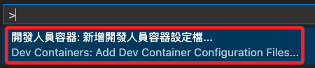

<br>

3. 將設定新增到工作區。

   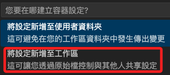

<br>

4. 使用 Python3。

   

<br>

5. 由於前面提及的版本限制，這裡選擇 `3.10 bulleye`。

   

<br>

6. 不用選取任何功能。

   

<br>

7. 完成時在容器中重新開啟。

   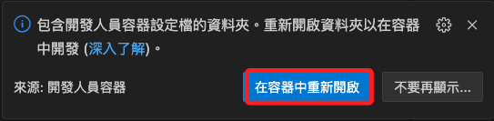

<br>

8. 會添加設定資料夾與檔案，但內容僅有命名與原來映像，可手動刪除無用的註解。

   

<br>

9. 編輯 `devcontainer.json`，除了將版本號改為 `python:3.10-bullseye`，並添加指令使榮器在建立後考會安裝指定的套件，包含 `requirements.txt`、`streamlit`、`python-dotenv`，其中 `streamlit` 已寫入 `requirements.txt`，但 `python-dotenv` 在部署在雲端時無需安裝，所以要另外以指令進行安裝。

   ```json
   {
       // 命名
       "name": "Python 3",
       // 映像
       "image": "mcr.microsoft.com/devcontainers/python:3.10-bullseye",
       // 容器啟動後執行指令進行安裝 `requirements.txt`、`streamlit`、`python-dotenv`
       "updateContentCommand": "[ -f requirements.txt ] && pip3 install --user -r requirements.txt; pip3 install --user streamlit python-dotenv; echo '✅ Packages installed and Requirements met'",
       // 運行主腳本：可加入參數
       // --server.enableCORS false：允許應用接受來自不同埠或域的請求
       // --server.enableXsrfProtection false：禁用保護，在開發階段使用以避免遇到與 CSRF 保護相關的問題
       "postAttachCommand": "streamlit run bot.py"
   }

   ```

<br>

10. 將 `streamlit` 寫入的 `requirements.txt`。

    ```txt
    langchain
    openai
    langchain_openai
    langchainhub
    neo4j-driver
    streamlit
    ```

<br>

11. 延續上一點，同時將 `devcontainer.json` 文件也修改一下，將 `streamlit` 的安裝指令拿掉。

    ```json
    {
        // 命名
        "name": "Python 3",
        // 映像
        "image": "mcr.microsoft.com/devcontainers/python:3.10-bullseye",
        // 容器啟動後執行指令進行安裝
        "updateContentCommand": "[ -f requirements.txt ] && pip3 install --user -r requirements.txt; pip3 install --user python-dotenv; echo '✅ Packages installed and Requirements met'",
        // 運行主腳本：可使用參數
        // --server.enableCORS false：允許應用接受來自不同埠或域的請求
        // --server.enableXsrfProtection false：禁用保護，在開發階段使用以避免遇到與 CSRF 保護相關的問題
        "postAttachCommand": "streamlit run bot.py"
    }

    ```

<br>

12. 修改過設定文件後要重建容器。

    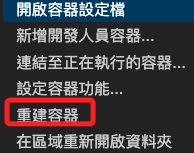

<br>

13. VSCode 左下方的連線顯示連入容器就表示完成。

    

<br>

14. 這裡直接按下 `ENTER` 即可。

    

<br>

15. 此時可在本地容器運行並進行問答。

    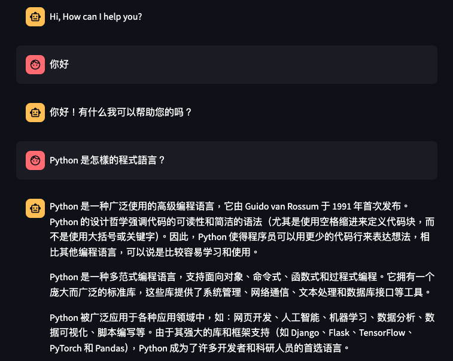

<br>

## 部署到 GitHub

1. 點擊 `原始檔控制`。

   

<br>

2. 發佈到 GitHub。

   

<br>

3. 自訂一個名稱，然後點擊公開。

   

<br>

4. 在 GitHub 上開啟。

   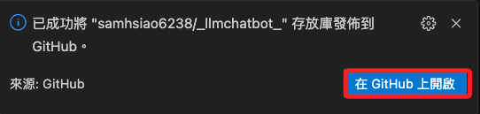

<br>

5. 點擊 `Code` 並建立 `Codespace`。

   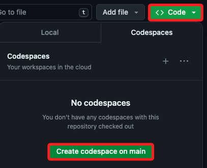

<br>

6. 過程中可以點擊 `View logs` 觀察即時訊息，確保沒有錯誤發生。

   

_顯示完成時先不急著動作，因為還有一些安裝程序是在建立好之後進行的。_

<br>

7. 看到 `Streamlit` 服務啟動時，可以點擊 `以瀏覽器開啟`，或查看所有的轉接埠。

   

<br>

8. 接著就會看到發生錯誤，因為那些敏感資訊都已經被排除了。

   

<br>

## 加入敏感資訊

_排除前一個步驟的錯誤訊息_

<br>

1. 在 Codespace 專案資料夾的根目錄中手動建立 `.env` 文件，並將本地的內容複製貼上，用以測試腳本的運行，因為 `.gitignore` 文件是有同步的，所以若更新倉庫不會有安全外洩問題。

   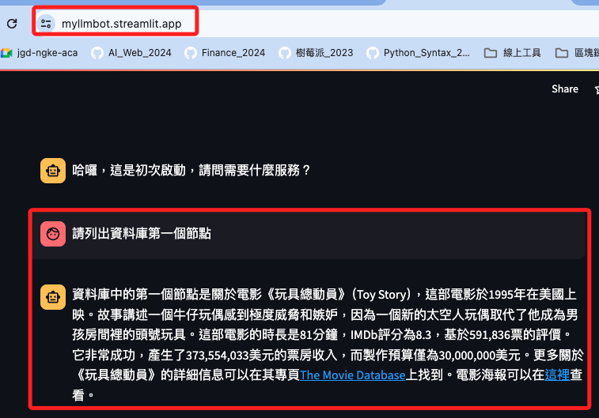

<br>

2. 刷新網頁後，Bot 就可以順利運行。

   

<br>

3. 測試一下重建容器。

   

<br>

4. 完成後會自動啟動服務，開啟瀏覽器便可進行對話。

   

<br>

5. 正常運行。

   

<br>

## 部署到 Streamlit 服務器上

_回到本機操作，在 Codespace 也是可以。_

<br>

1. 在專案根目錄中建立一個 `.streamlit` 資料夾，並添加一個 `secrets.toml` 文件。

   

<br>

2. 將 `.env` 文件中的內容複製到 `secrets.toml` 文件中，因為在 `.toml` 格式中，等號右側的是 `字串值` ，所以必須加上引號，此時基於 `一致性原則` 可在等號兩側都加上一個空白字元。

   

<br>

3. 同樣要把 `secrets.toml` 文件加入 `.gitignore` 中，這部分預設已經寫入。

   ```bash
   # 敏感資訊
   .streamlit/secrets.toml
   .env
   ```

<br>

4. 進入 Streamlit [官網](https://streamlit.io/) 並點擊 `Sign in`，可使用 Google 或 GitHub 帳號登入。

   

<br>

5. 假如選擇 Google，接下來還是會詢問是否連結 GitHub 帳號。

   

<br>

6. 填寫完畢點擊 `Continue` 完成設定。

   

<br>

## 建立專案

1. New app。

   

<br>

2. 部署：選取倉庫，最重要的是要修改主腳本的名稱，在這個專案中為 `bot.py`，然後可自訂一個公網名稱，尾綴固定是 `streamlit.app`。

   

<br>

3. 接著可點擊 `Advanced settings...`

   

<br>

4. 假如未進行設定就進入下一步，會因為尚未設定敏感資訊而出錯的。

   

<br>

5. 那就必須回到主控台，在專案右側點擊 `...` 顯示更多來展開，並點擊設定 `Settings`。

   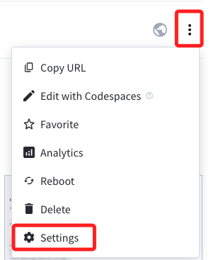

<br>

6. 然後切換到 `Secrets` 進行密鑰等環境參數設定，但特別注意的是，透過這樣的設定步驟將無法選擇 `Python version`，在某些情境下可能會出錯。

   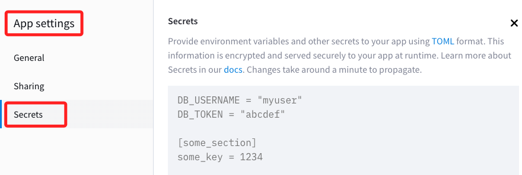

<br>

7. 回到前面 `Advanced settings...` 的步驟，點擊後進入，首先選擇跟容器相同版本的 `3.10`。

   

<br>

8. 在 `Secrets` 的部分，因為 `secrets.toml` 文件是排除同步的，所以要將 `secrets.toml` 的內容複製貼在 Streamlit 服務器上。

   

<br>

9. 至此，應該要去修改 `graph.py`、`llm.py`、`vector.py` 三個腳本中原本如下圖使用 `os.getenv()` 的部分，因應 `Secrets` 的環境設置而改為 `st.secrets["<鍵>"]`，但這樣的修改模式將使得腳本在不同環境下運作時，又得再次手動修改，相當很麻煩。

   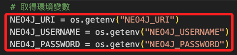

<br>

10. 延續上一點，為了避免這樣的繁瑣，可在專案中添加一個模組 `secret.py` 來判斷所處在的運作環境為何，這裡示範將這個腳本置於 `tools` 資料夾中，函數名稱為 `get_secret()`。

    ```python
    # secret.py
    # 原本沒有導入 dotenv，這裡要添加
    import os
    from dotenv import load_dotenv
    #
    load_dotenv()

    # 新增判斷函數
    def get_secret(key):
        try:
            # 嘗試從 Streamlit secrets 獲取敏感資訊
            return st.secrets[key]
        except AttributeError:
            # 如果 st.secrets 沒有該鍵或 st.secrets 未被設定，則從環境變量中獲取
            return os.getenv(key)
    ```

<br>

11. 分別在  `graph.py`、`llm.py`、`vector.py` 導入函數，其中  `graph.py` 及 `vector.py` 改寫如下。

    _graph.py_

    ```python
    # graph.py
    from langchain_community.graphs import Neo4jGraph
    # 導入自訂函數
    from solutions.tools.secret import get_secret

    # 讀取環境變數
    NEO4J_URI = get_secret("NEO4J_URI")
    NEO4J_USERNAME = get_secret("NEO4J_USERNAME")
    NEO4J_PASSWORD = get_secret("NEO4J_PASSWORD")

    # Neo4j Graph
    graph = Neo4jGraph(
        url=NEO4J_URI,
        username=NEO4J_USERNAME,
        password=NEO4J_PASSWORD,
    )

    ```

    _vector.py_

    ```python
    # vector.py
    from langchain_community.vectorstores.neo4j_vector import Neo4jVector
    from langchain.chains import RetrievalQA
    from solutions.llm import llm, embeddings
    # 導入自訂函數
    from solutions.tools.secret import get_secret

    # 讀取環境變數
    NEO4J_URI = get_secret("NEO4J_URI")
    NEO4J_USERNAME = get_secret("NEO4J_USERNAME")
    NEO4J_PASSWORD = get_secret("NEO4J_PASSWORD")

    neo4jvector = Neo4jVector.from_existing_index(
        embeddings,                 # <1>
        url=NEO4J_URI,              # <2>
        username=NEO4J_USERNAME,    # <3>
        password=NEO4J_PASSWORD,    # <4>
        index_name="moviePlots",    # <5>
        node_label="Movie",         # <6>
        text_node_property="plot",  # <7>
        embedding_node_property="plotEmbedding",  # <8>
        retrieval_query="""
        RETURN
            node.plot AS text,
            score,
            {
                title: node.title,
                directors: [ (person)-[:DIRECTED]->(node) | person.name ],
                actors: [ (person)-[r:ACTED_IN]->(node) | [person.name, r.role] ],
                tmdbId: node.tmdbId,
                source: 'https://www.themoviedb.org/movie/'+ node.tmdbId
            } AS metadata
        """,
    )

    retriever = neo4jvector.as_retriever()

    kg_qa = RetrievalQA.from_chain_type(
        llm,  # <1>
        chain_type="stuff",  # <2>
        retriever=retriever,  # <3>
    )

    ```

<br>

12. 另外 `llm.py` 需要的是 OpenAPI 的 API Key，所以改寫內容與另外兩個腳本不同。

    ```python
    # llm.py
    from langchain_openai import ChatOpenAI
    from langchain_openai import OpenAIEmbeddings
    # 導入自訂函數
    from solutions.tools.secret import get_secret

    # 改寫
    OPENAI_API_KEY = get_secret("OPENAI_API_KEY")
    OPENAI_MODEL = get_secret("OPENAI_MODEL")

    # 建立 ChatOpenAI 實體
    llm = ChatOpenAI(
        openai_api_key=OPENAI_API_KEY,
        model=OPENAI_MODEL,
    )

    # OpenAIEmbeddings 是用來生成和處理嵌入向量（embeddings）
    # 這些嵌入向量是從使用 OpenAI 模型（如 GPT-4）生成的文本中獲取的
    embeddings = OpenAIEmbeddings(openai_api_key=OPENAI_API_KEY)

    ```

<br>

13. 無論以上程序是在本機修改或在 Codespace 進行編輯，都記得要記得同步。

    

<br>

14. 進入 Streamlit 主控台，因為專案的設定改變了，所以要進行 `Reboot`，假如只是內容改變可以不用重啟。

    

<br>

15. 完成後會出現關於套件 `dotenv` 的錯誤，因為服務器上無法安裝這個套件。

    

<br>

16. 修改 `secret.py` 中的 `get_secret()`，將 `dotenv` 的使用移入所在環境判斷的區塊內，只有確認在本機或容器中運行時才導入使用；特別注意，除了要新增 `import streamlit as st`，還要將 `from dotenv import load_dotenv` 註解或刪除。

    ```python
    # secret.py
    import streamlit as st
    import os
    # from dotenv import load_dotenv

    # 判斷環境取得密鑰
    # def get_secret(key):
    #     try:
    #         # 嘗試從 Streamlit secrets 獲取敏感資訊
    #         return st.secrets[key]
    #     except AttributeError:
    #         # 如果 st.secrets 沒有該鍵或 st.secrets 未被設定，則從環境變量中獲取
    #         return os.getenv(key)

    # 改寫
    def get_secret(key):
        # 檢查是否在 Streamlit 雲端環境中運行，Streamlit 雲端環境會設置特定的環境變量
        if 'STREAMLIT_SHARING_MODE' in os.environ:
            # 在 Streamlit 雲端，使用 st.secrets 讀取配置
            try:
                return st.secrets[key]
            except KeyError:
                print(f"Key {key} not found in Streamlit secrets.")
        else:
            # 在本機環境，嘗試從 .env 文件讀取配置
            from dotenv import load_dotenv
            load_dotenv()  # 讀取 .env 文件中的環境變量
            secret_value = os.getenv(key)
            if secret_value is not None:
                return secret_value
            else:
                print(f"Key {key} not found in environment variables.")
    ```

<br>

17. 然後進入 Streamlit 服務器的 `Secrets` 中加入一個新的變數 `STREAMLIT_SHARING_MODE`，這是設計用來判斷當前環境是否為 Streamlit 服務器的一個機制。

    ```bash
    STREAMLIT_SHARING_MODE = 1
    ```

    

<br>

18. 切記本機或 Codespace 要進行同步，另外 Streamlit 服務器更新設定都要 `Reboot`；至此無論在 `本機虛擬環境中`、`本機的容器中`、 `Codespace 容器中`，或是部署在 `Streamlit 服務器上` 的應用皆可正常運行了。

    

<br>

## 補上四個修改的腳本

1. **secret.py**

   ```python
   # secret.py
   import streamlit as st
   import os


   # 自訂函數
   def get_secret(key):
       # 檢查是否在 Streamlit 雲端環境中運行，Streamlit 雲端環境會設置特定的環境變量
       if "STREAMLIT_SHARING_MODE" in os.environ:
           # 在 Streamlit 雲端，使用 st.secrets 讀取配置
           try:
               return st.secrets[key]
           except KeyError:
               print(f"Key {key} not found in Streamlit secrets.")
       else:
           # 在本機環境，嘗試從 .env 文件讀取配置
           from dotenv import load_dotenv

           load_dotenv()  # 讀取 .env 文件中的環境變量
           secret_value = os.getenv(key)
           if secret_value is not None:
               return secret_value
           else:
               print(f"Key {key} not found in environment variables.")

   ```

<br>

2. **graph.py**

   ```python
   # graph.py
   # 導入自訂函數
   from solutions.tools.secret import get_secret
   from langchain_community.graphs import Neo4jGraph

   # 取得環境變數
   NEO4J_URI = get_secret("NEO4J_URI")
   NEO4J_USERNAME = get_secret("NEO4J_USERNAME")
   NEO4J_PASSWORD = get_secret("NEO4J_PASSWORD")

   # Neo4j Graph
   graph = Neo4jGraph(
       url=NEO4J_URI,
       username=NEO4J_USERNAME,
       password=NEO4J_PASSWORD,
   )

   ```

<br>

3. **llm.py**

   ```python
   # llm.py
   # 導入自訂函數
   from solutions.tools.secret import get_secret
   from langchain_openai import ChatOpenAI
   from langchain_openai import OpenAIEmbeddings

   # 取的環境變數
   OPENAI_API_KEY = get_secret("OPENAI_API_KEY")
   OPENAI_MODEL = get_secret("OPENAI_MODEL")

   # 建立 ChatOpenAI 實體
   llm = ChatOpenAI(
       openai_api_key=OPENAI_API_KEY,
       model=OPENAI_MODEL,
   )

   # OpenAIEmbeddings 是用來生成和處理嵌入向量（embeddings）
   # 這些嵌入向量是從使用 OpenAI 模型（如 GPT-4）生成的文本中獲取的
   embeddings = OpenAIEmbeddings(openai_api_key=OPENAI_API_KEY)

   ```

<br>

4. **vector.py**

   ```python
   # vector.py
   from langchain_community.vectorstores.neo4j_vector import Neo4jVector
   from langchain.chains import RetrievalQA
   from solutions.llm import llm, embeddings
   # 導入自訂函數
   from solutions.tools.secret import get_secret

   # 讀取環境變數
   NEO4J_URI = get_secret("NEO4J_URI")
   NEO4J_USERNAME = get_secret("NEO4J_USERNAME")
   NEO4J_PASSWORD = get_secret("NEO4J_PASSWORD")

   neo4jvector = Neo4jVector.from_existing_index(
       embeddings,                 # <1>
       url=NEO4J_URI,              # <2>
       username=NEO4J_USERNAME,    # <3>
       password=NEO4J_PASSWORD,    # <4>
       index_name="moviePlots",    # <5>
       node_label="Movie",         # <6>
       text_node_property="plot",  # <7>
       embedding_node_property="plotEmbedding",  # <8>
       retrieval_query="""
       RETURN
           node.plot AS text,
           score,
           {
               title: node.title,
               directors: [ (person)-[:DIRECTED]->(node) | person.name ],
               actors: [ (person)-[r:ACTED_IN]->(node) | [person.name, r.role] ],
               tmdbId: node.tmdbId,
               source: 'https://www.themoviedb.org/movie/'+ node.tmdbId
           } AS metadata
       """,
   )

   retriever = neo4jvector.as_retriever()

   kg_qa = RetrievalQA.from_chain_type(
       llm,  # <1>
       chain_type="stuff",  # <2>
       retriever=retriever,  # <3>
   )

   ```

<br>

## 關於 OpenAPI

1. 使用付費服務要特別關注 [使用量](https://platform.openai.com/usage)。

   

<br>

2. 會有詳細的用量與帳單資訊。

   

<br>

---

_END_
