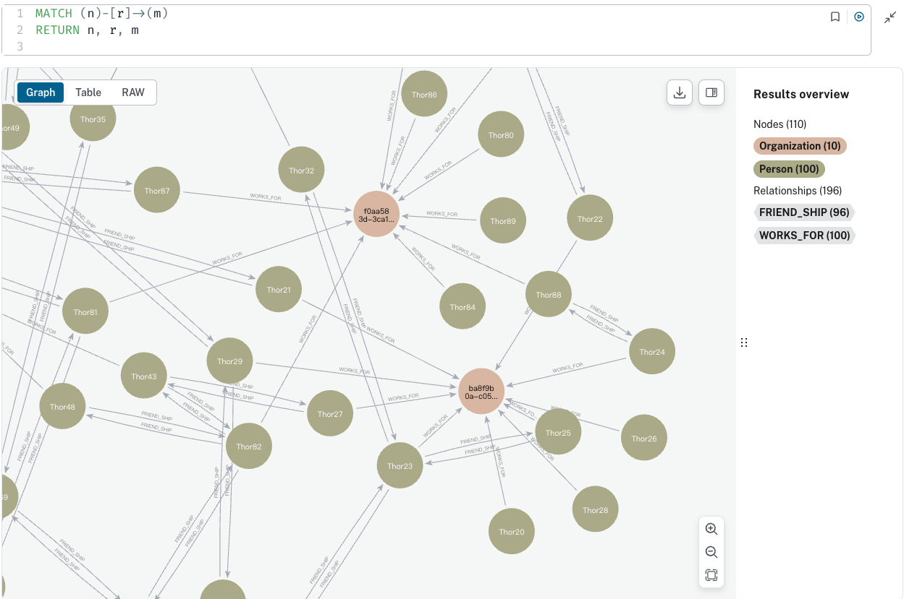

# 建立友誼關係

_在現有的基礎上_

<br>

## 說明

1. 程式碼。

    ```python
    from neo4j import GraphDatabase
    import random

    # 設定 Neo4j 資料庫的 URI 和認證資訊
    URI = "neo4j+s://bfc46ed1.databases.neo4j.io"
    AUTH = ("neo4j", "8Yc-sCEfoQN5XjrKlV4VqqMilhv6HM4jLrwzLf2P-Ic")
    # 設定每個組織的員工人數上限
    employee_threshold = 10

    def main():
        # 上下文管理：使用 GraphDatabase 連接到 Neo4j 資料庫
        with GraphDatabase.driver(URI, auth=AUTH) as driver:
            # 建立會話
            with driver.session(database="neo4j") as session:
                # 重複 100 次，也就是添加 100 個員工
                for i in range(100):
                    # 生成員工名稱，這裡以 `Thor` 最為前綴、序號作為後綴
                    name = f"Thor{i}"
                    # 執行寫入交易，添加員工並獲取組織 ID
                    org_id = session.execute_write(employ_person_tx, name)
                    # 輸出結果
                    print(f"將員工 {name} 加入組織 {org_id}")

                # 隨機為部分員工建立友誼關係
                create_random_friendships(session)

                # 統計並顯示資料庫中的資訊
                display_database_statistics(session)

    def employ_person_tx(tx, name):
        # 使用 `MERGE` 達成如果已存在則不重複建立
        result = tx.run("""
            MERGE (p:Person {name: $name})
            RETURN p.name AS name
            """, name=name
        )

        # 確保每個人只有一個 `WORKS_FOR` 關係
        result = tx.run("""
            MATCH (p:Person {name: $name})-[:WORKS_FOR]->(o:Organization)
            RETURN o.id AS id, COUNT{(p)-[r:WORKS_FOR]->(o)} AS employees_n
            LIMIT 1
        """, name=name)
        
        org = result.single()

        if org is None:
            # 獲取最近建立的組織 ID 及其相關聯的員工數量
            result = tx.run("""
                MATCH (o:Organization)
                RETURN o.id AS id, COUNT{(p:Person)-[r:WORKS_FOR]->(o)} AS employees_n
                ORDER BY o.created_date DESC
                LIMIT 1
            """)
            org = result.single()

            # 如果最近的組織沒有員工，則拋出異常
            if org is not None and org["employees_n"] == 0:
                raise Exception("最新建立的組織是空的。")
                # 交易將回滾 -> 連 Person 都不會建立!

            # 如果組織員工數未達上限，將該員工添加到該組織
            if org is not None and org.get("employees_n") < employee_threshold:
                result = tx.run("""
                    MATCH (o:Organization {id: $org_id})
                    MATCH (p:Person {name: $name})
                    MERGE (p)-[r:WORKS_FOR]->(o)
                    RETURN $org_id AS id
                    """, org_id=org["id"], name=name
                )
            # 如果組織員工數已達上限，建立一個新的組織並將該員工添加到新組織
            else:
                result = tx.run("""
                    MATCH (p:Person {name: $name})
                    CREATE (o:Organization {id: randomuuid(), created_date: datetime()})
                    MERGE (p)-[r:WORKS_FOR]->(o)
                    RETURN o.id AS id
                    """, name=name
                )

            # 傳出：新員工所屬的組織 ID
            return result.single()["id"]
        else:
            # 如果該員工已經有一個 `WORKS_FOR` 關係，直接返回組織 ID
            return org["id"]

    def create_random_friendships(session):
        """隨機為部分員工建立友誼關係"""
        # 取得所有員工的名稱
        result = session.run("MATCH (p:Person) RETURN p.name AS name")
        employees = [record["name"] for record in result]

        # 隨機挑選部分員工建立友誼關係
        for i in range(len(employees) // 2):
            person1 = random.choice(employees)
            person2 = random.choice(employees)
            if person1 != person2:
                session.execute_write(create_friendship_tx, person1, person2)

    def create_friendship_tx(tx, person1, person2):
        # 確認 FRIEND_SHIP 關係是否已經存在，如果不存在則建立
        result = tx.run("""
            MATCH (p1:Person {name: $person1})-[r:FRIEND_SHIP]-(p2:Person {name: $person2})
            RETURN r
            """, person1=person1, person2=person2
        )

        if result.single() is None:
            # 建立雙向 FRIEND_SHIP 關係
            tx.run("""
                MATCH (p1:Person {name: $person1}), (p2:Person {name: $person2})
                MERGE (p1)-[:FRIEND_SHIP]->(p2)
                MERGE (p2)-[:FRIEND_SHIP]->(p1)
                """, person1=person1, person2=person2
            )

    def display_database_statistics(session):
        """統計並顯示資料庫中的資訊"""
        # 查詢總節點數量
        node_count_result = session.run("MATCH (n) RETURN COUNT(n) AS node_count")
        node_count = node_count_result.single()["node_count"]
        
        # 查詢總關係數量
        relationship_count_result = session.run("MATCH ()-[r]->() RETURN COUNT(r) AS relationship_count")
        relationship_count = relationship_count_result.single()["relationship_count"]
        
        # 查詢各類型節點數量
        node_labels_result = session.run("MATCH (n) RETURN DISTINCT labels(n) AS labels, COUNT(n) AS count")
        node_labels = node_labels_result.data()
        
        # 查詢各類型關係數量
        relationship_types_result = session.run("MATCH ()-[r]->() RETURN TYPE(r) AS type, COUNT(r) AS count")
        relationship_types = relationship_types_result.data()

        # 顯示結果
        print(f"總節點數量: {node_count}")
        print(f"總關係數量: {relationship_count}")
        print("各類型節點數量:")
        for record in node_labels:
            print(f"{record['labels']}: {record['count']}")
        print("各類型關係數量:")
        for record in relationship_types:
            print(f"{record['type']}: {record['count']}")

    if __name__ == "__main__":
        main()
    ```

<br>

2. 結果。

    ```json
    總節點數量: 110
    總關係數量: 196
    各類型節點數量:
    ['Person']: 100
    ['Organization']: 10
    各類型關係數量:
    WORKS_FOR: 100
    FRIEND_SHIP: 96
    ```

<br>

## Cypher 語法
 
1. 查看所有節點和屬性。

    ```json
    MATCH (n)
    RETURN n
    ```

    

<br>

2. 查看所有節點、關係及屬性，並指定指回傳 `MATCH (n)-[r]->(m)` 的關係。

    ```json
    MATCH (n)-[r]->(m)
    RETURN n, r, m
    ```

    

<br>

3. 局部放大。

    

<br>

4. 特別說明，假如想找出兩個節點之間的關係無論其方向性，則語法修改一下，將方向拿掉。

    ```json
    MATCH (n)-[r]-(m)
    RETURN n, r, m
    ```

<br>

___

_END_