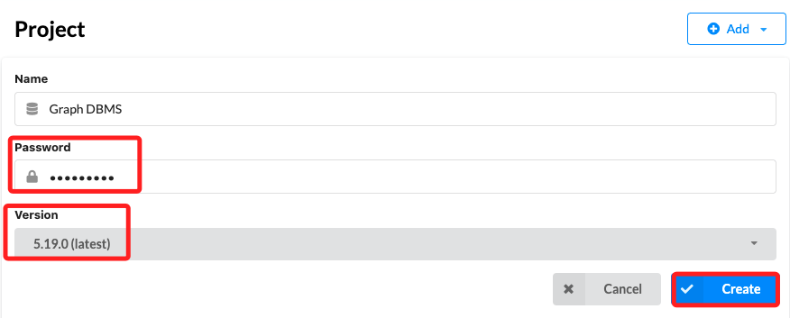
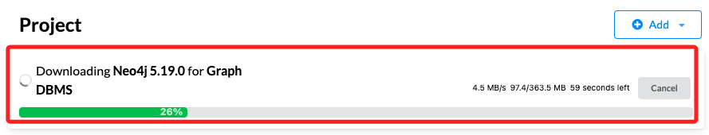
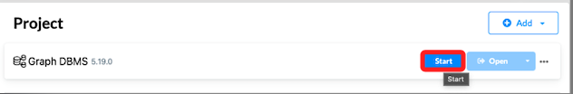
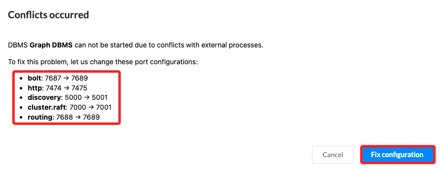
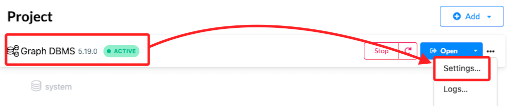
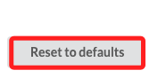
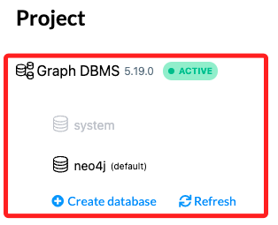
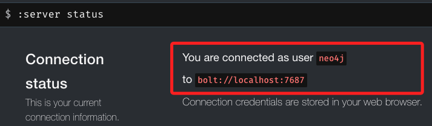

# 安裝 Neo4j

_這裡主要示範的是使用 Desktop 進行操作_

<br>

## 建立本地專案

1. 新增 `Local DBMS`，點擊 `Next`。

    

<br>

2. 使用預設的命名 `Graph DBMS`，自訂密碼為 `sam112233`，選擇最新版本 `5.19.0`，預設也會是最新版 `latest`，然後點擊建立 `Create`。

    

<br>

3. 需要等待一下，進度條會顯示進度。

    

<br>

4. 完成時點擊 `Start`。

    

<br>

5. 會自動處理衝突，點擊修理 `Fix configuration`。

    

    ```json
    bolt: 7687 → 7689
    http: 7474 → 7475
    discovery: 5000 → 5001
    cluster.raft: 7000 → 7001
    routing: 7688 → 7689
    ```

<br>

6. 還是衝突，就再點擊一次。

    

<br>

7. 無法排除，先點擊取消 `Cancel`，再點擊資料庫右側的 `Settings`

    

<br>

8. 點擊左下角的 `Reset to defaults`。

    

<br>

9. 重新啟動後即可完成。

    

<br>

10. 點擊右側的 `Open`。

    

<br>

## 資料庫操作

1. 查詢狀態，特別注意，指令是以分號 `:` 開頭，不可省略。

    ```bash
    :server status
    ```
    

<br>

## 使用 Homebrew 安裝 neo4j

1. 使用 brew 安裝 neo4j。

    ```bash
    brew install neo4j
    ```

<br>

2. 啟動。

    ```bash
    neo4j start
    ```

<br>
___

_END_
