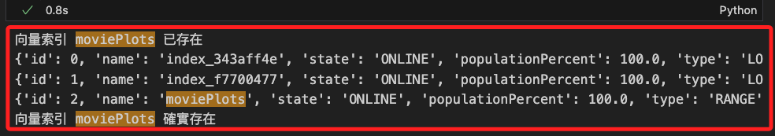

# 各種的錯誤排除紀錄

<br>

## 關於向量索引

1. 發生 `向量索引名稱不存在` 的錯誤。

    ```vbnet
    ValueError: The specified vector index name does not exist. Make sure to check if you spelled it correctly
    ```

<br>

2. 使用以下腳本檢查向量索引。

    ```python
    from neo4j import GraphDatabase

    # 設定 Neo4j 資料庫的 URI 和認證資訊
    URI = "neo4j+s://bfc46ed1.databases.neo4j.io"
    AUTH = ("neo4j", "8Yc-sCEfoQN5XjrKlV4VqqMilhv6HM4jLrwzLf2P-Ic")

    # 建立 Neo4j 連接
    driver = GraphDatabase.driver(URI, auth=AUTH)

    def create_vector_index():
        with driver.session(database="neo4j") as session:
            result = session.run("SHOW INDEXES")
            indexes = result.data()
            index_names = [index['name'] for index in indexes]
            if 'moviePlots' not in index_names:
                session.run(
                    """
                    CREATE INDEX moviePlots FOR (m:Movie) ON (m.plotEmbedding)
                    """
                )
                print("向量索引 moviePlots 已建立")
            else:
                print("向量索引 moviePlots 已存在")

    def check_indexes():
        with driver.session(database="neo4j") as session:
            result = session.run("SHOW INDEXES")
            indexes = result.data()
            for index in indexes:
                print(index)
            if any(index['name'] == 'moviePlots' for index in indexes):
                print("向量索引 moviePlots 確實存在")
            else:
                print("向量索引 moviePlots 不存在")

    if __name__ == "__main__":
        create_vector_index()
        check_indexes()
        driver.close()
    ```

<br>

3. 查詢結果。

    

<br>

4. 嘗試透過腳本運行 Cypher 語法 `DROP INDEX moviePlots` 刪除索引。

    ```python
    from neo4j import GraphDatabase

    # 設定 Neo4j 資料庫的 URI 和認證資訊
    URI = "neo4j+s://bfc46ed1.databases.neo4j.io"
    AUTH = ("neo4j", "8Yc-sCEfoQN5XjrKlV4VqqMilhv6HM4jLrwzLf2P-Ic")

    # 建立 Neo4j 連接
    driver = GraphDatabase.driver(URI, auth=AUTH)

    def drop_vector_index():
        with driver.session(database="neo4j") as session:
            session.run(
                """
                DROP INDEX moviePlots
                """
            )
            print("向量索引 moviePlots 已刪除")

    def check_indexes():
        with driver.session(database="neo4j") as session:
            result = session.run("SHOW INDEXES")
            indexes = result.data()
            for index in indexes:
                print(index)
                if index["name"] == "moviePlots":
                    print("向量索引 moviePlots 存在")
                    return True
            print("向量索引 moviePlots 不存在")
            return False

    if __name__ == "__main__":
        if check_indexes():
            drop_vector_index()
        else:
            print("向量索引 moviePlots 不存在，無需刪除")
        driver.close()
    ```

<br>

___

_END_