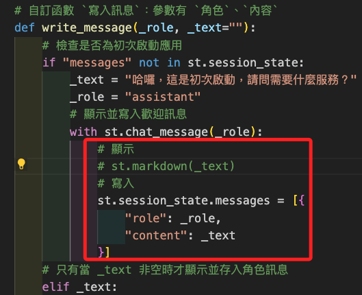

# 處理提交

_接下來進行用戶訊息提交後的處理，這部分相對複雜，將拆解多章節說明_

<br>

## 當前狀態

1. 說明：當前是在 `handle_submit` 中模擬了一個訊息 `_reponse` 作為助理的回應，並傳給 `write_message` 作為參數顯示在對話上，所以在接下來的工作中，將透過代碼來生成這個模擬的回應 `_reponse` 內容。

    ```python
    # 自訂函數：處理提交訊息
    def handle_submit(message):
        # 助理
        with st.spinner('讓我思考一下...'):
            sleep(1)
            _reponse = "我還無法回應你的問題。"
            write_message("assistant", _reponse)
    ```

<br>

2. 建立一個生成回應的函數 `generate_response`，由於需引用 `LangChain` 等套件，為便於管理，將建立新的模組 `agent.py` 進行管理。

    ```bash
    touch agent.py
    ```

<br>

3. 編輯 `agent.py`。

    ```python
    def generate_response(prompt):
        # _response = "我還無法回應你的問題"
        # 改用自訂模組內的函數
        _reponse = generate_response(message)
        return _response
    ```

<br>

4. 在主腳本 `bot.py` 導入自訂模組的自訂函數。

    ```python
    from agent import generate_response
    ```

<br>

5. 修改 `handle_submit`。

    ```python
    # 自訂函數：處理提交訊息
    def handle_submit(message):
        # 助理
        with st.spinner('讓我思考一下...'):
            sleep(1)
            # 使用自訂模組內的函數
            _reponse = generate_response(message)
            write_message("assistant", _reponse)
    ```

<br>

6. 可嘗試運行應用，此時可進行對話，但只能保留最後一則對話。

    

<br>

## 遍歷對話紀錄

1. 當前只能顯示最後一個訊息，所以修改主腳本 `bot.py`，在 `檢查是否為初次啟動應用之後`、`用戶輸入新訊息的代碼區塊之前`，先遍歷當前 `session_state.messages` 中的紀錄並顯示在對話中。

    ```python
    # 遍歷訊息狀態中的鍵 `messages` 的值
    for message in st.session_state.messages:
        write_message(
            message['role'],
            message['content']
        )
    ```

<br>

2. 但初次運行時，出現 `顯示兩次初次啟動` 的錯誤邏輯。

    

<br>

3. 但也觀察到，除此之後的對話是可正常顯示並覆蓋了其中一次的重複對話。

    

<br>

4. 這是由於 `歡迎訊息` 在 `初始化訊息 write_message("assistant")` 時已經顯示了一次，接著在 `遍歷歷史訊息 st.session_state.messages` 時又重新顯示了一次；為了解決這個問題，考慮在 `初始化訊息` 時僅寫入 `session_state` 而不顯示，而遍歷時才將歷史紀錄完全顯示，修改如以下圖示註解了顯示訊息的代碼，並觀察是否排除當前的邏輯謬誤。

    

<br>

5. 重新運行後發現依舊存在邏輯謬誤，這時 `助手 assistant` 還是會顯示兩次對話，只是第一次對話是空白訊息，這代表多做了一次 `st.chat_message`。

    

<br>

6. 改寫 `write_message` 來排除以上問題。

    ```python
    def write_message(_role, _text=""):
        if "messages" not in st.session_state:
            _text = "哈囉，這是初次啟動，請問需要什麼服務？"
            _role = "assistant"
            st.session_state.messages = [{
                "role": _role,
                "content": _text
            }]
        elif _text:
            with st.chat_message(_role):
                st.markdown(_text)
                st.session_state.messages.append(
                    {"role": _role, "content": _text}
                )
    ```

<br>

7. 當前完整的主腳本 `bot.py`。

    ```python
    import streamlit as st
    from time import sleep
    from agent import generate_response

    # 網頁頁籤與圖標
    st.set_page_config(
        page_title="柱子",
        page_icon=":tada:",
        layout="wide"
    )


    # 自訂函數 `寫入訊息`：參數有 `角色`、`內容`
    def write_message(_role, _text=""):
        # 檢查是否為初次啟動應用
        if "messages" not in st.session_state:
            _text = "哈囉，這是初次啟動，請問需要什麼服務？"
            _role = "assistant"
            # 顯示並寫入歡迎訊息
            st.session_state.messages = [{
                "role": _role,
                "content": _text
            }]
        # 只有當 _text 非空時才顯示並存入角色訊息
        elif _text:
            # 顯示並存入角色訊息
            with st.chat_message(_role):
                # 顯示
                st.markdown(_text)
                # 若需要保存，則保存訊息
                st.session_state.messages.append(
                    {"role": _role, "content": _text}
                )


    # 自訂函數：處理提交訊息
    def handle_submit(message):
        # 助理
        with st.spinner('讓我思考一下...'):
            sleep(1)
            # _reponse = "我還無法回應你的問題。"
            # 使用自訂模組內的函數
            _reponse = generate_response(message)
            write_message("assistant", _reponse)


    # 檢查是否為初次啟動
    write_message("assistant")

    # 遍歷訊息狀態中的鍵 `messages` 的值
    for message in st.session_state.messages[:]:
        with st.chat_message(message['role']):
            st.markdown(message['content'])

    #
    if prompt := st.chat_input("怎麼了？有話就說吧～"):
        # 用戶
        write_message("user", prompt)
        # 助理
        handle_submit(prompt)

    # 查看
    print(st.session_state.messages, '\n')

    ```

## 改寫 `write_message`

1. _特別說明_，當前是將 `檢查是否為初次啟動` 寫在 `write_message` 函數中，這樣的思路是 `歡迎訊息` 也是一種 `write_message`，雖然這部分僅僅只會執行一次，並無實質 `重用` 的問題，若要將其獨立為一個檢查函數，或許會讓 `write_message` 更加易讀。

<br>

2. 新增一個檢查函數 `is_first_run`。

    ```python
    # 自訂函數：檢查是否為初次啟動
    def is_first_run():
        # 假如是初次運行
        if "messages" not in st.session_state:
            _text = "哈囉，這是初次啟動，請問需要什麼服務？"
            _role = "assistant"
            # 顯示並寫入歡迎訊息
            st.session_state.messages = [{
                "role": _role,
                "content": _text
            }]
    ```

<br>

3. 將原本調用 `write_message` 檢查的代碼改用新函數。

    ```python
    # 檢查是否為初次啟動
    # write_message("assistant")
    is_first_run()
    ```

<br>

4. 修改 `write_message` 函數，僅檢查是否有訊息輸入，有新的訊息輸入才會寫入訊息。

    ```python
    # 自訂函數 `寫入訊息`：參數有 `角色`、`內容`
    def write_message(_role, _text=""):
        # 只有當 _text 非空時才顯示並存入角色訊息
        if _text:
            # 顯示並存入角色訊息
            with st.chat_message(_role):
                # 顯示
                st.markdown(_text)
                # 若需要保存，則保存訊息
                st.session_state.messages.append(
                    {"role": _role, "content": _text}
                )
    ```

<br>

___

_以上完成初步的對話，只是回復訊息的邏輯尚未撰寫。_