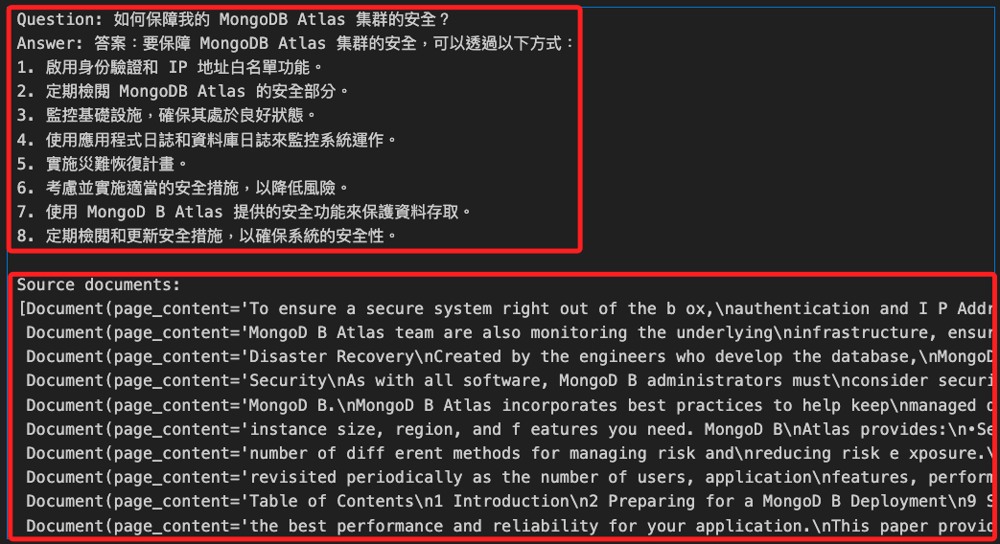

# MongoDB 整合 LangChain

_使用 LangChain 整合 MongoDB Atlas 建立 `向量索引` 並進行 `向量搜索` 。_

<br>

## 說明

1. 本筆記出處 [MongoDB 官方說明](https://www.mongodb.com/docs/atlas/atlas-vector-search/ai-integrations/langchain/)，說明如何使用 `LangChain` 與 `MongoDB Atlas 向量搜索` 來構建 `LLM` 應用程式並實現 `索引增強生成 RAG（Retrieval-Augmented Generation）`。

<br>

2. 通過這個筆記中的實作步驟，可以設置環境、存儲數據、創建向量索引，並運行各種向量搜索查詢，最終實現 `根據語義相似性` 回答問題的功能。

<br>

## 向量索引 `Vector Index`

1. 向量索引是一種數據結構和技術，用於在高維向量空間中高效地存儲和檢索數據點，每個數據點（如文本、圖像或其他多媒體）將以數學上的向量進行表示，而這些向量是通過嵌入技術（例如深度學習模型）從原始數據中生成的。

<br>

2. 在大量數據中，通過構建向量索引可快速地找到與查詢向量相似的數據點，這對於需要實時響應的應用非常重要。

<br>

3. 向量索引使得能夠根據語義相似性而非單純的關鍵字匹配來檢索數據，提高了搜索的準確性和相關性。

<br>

4. 使用專門的索引結構（如 Annoy、FAISS）可以顯著加速向量間的相似性搜索，達到實時檢索的效果。

<br>

## 向量搜索 `Vector Search`

1. 向量搜索是指在向量空間中查找與給定查詢 `向量最相似的數據點` 的過程，這通常涉及計算查詢向量與索引中向量之間的距離（例如餘弦相似度、歐氏距離），並返回距離最小的數據點。

<br>

2. 傳統的關鍵字搜索基於 `文本匹配`，可能無法有效捕捉語義上的相似性，向量搜索能夠 `根據語義相關性` 找到更合適的結果。

<br>

3. 在 `檢索增強生成（RAG）` 應用中，向量搜索能夠從資料庫中檢索出與查詢語句語義相似的文檔，提供更豐富的上下文給生成模型（如 GPT-4），從而生成更準確和相關的回答。

<br>

4. 向量搜索廣泛應用於推薦系統、相似圖片查找、自然語言處理（NLP）中的文檔檢索等領域。

<br>

## 實作一個範例

_這個範例的功能是使用 Atlas Vector Search 和 LangChain 來實現基於向量搜索的檢索增強生成（RAG）應用，以回答一個有關 MongoDB Atlas 集群安全性問題的例子。_

<br>

1. 實例化檢索器：將 Atlas Vector Search 實例化為檢索器，用於根據相似度搜索來查找相關文檔。

2. 定義提示模板：建立一個提示模板，指導模型如何回答問題。

3. 創建 OpenAI 聊天模型：使用 OpenAI 的 ChatGPT 模型來生成回答。

4. 格式化文檔：定義一個函數，用於將文檔內容格式化為字符串。

5. 建立問答鏈：通過結合檢索器、提示模板和聊天模型，建立一個處理問答的鏈。

6. 提出問題並獲取回答：向這個鏈提出一個問題，並獲取回答。

7. 打印源文檔：最後，查找並打印與問題相關的源文檔。

<br>

## 環境設置

1. 安裝庫。

    ```bash
    pip install --upgrade --quiet langchain langchain-mongodb langchain-openai pymongo pypdf
    ```

<br>

2. 導入所需的庫。

    ```python
    import getpass, os, pymongo, pprint
    from langchain_community.document_loaders import PyPDFLoader
    from langchain_core.output_parsers import StrOutputParser
    from langchain_core.runnables import RunnablePassthrough
    from langchain_mongodb import MongoDBAtlasVectorSearch
    from langchain_openai import ChatOpenAI, OpenAIEmbeddings
    from langchain.prompts import PromptTemplate
    from langchain.text_splitter import RecursiveCharacterTextSplitter
    from pymongo import MongoClient
    ```

<br>

3. 設置環境變量：執行以下代碼並按提示輸入您的 OpenAI API Key 和 Atlas 集群的 SRV 連接字符串。

    ```python
    os.environ["OPENAI_API_KEY"] = getpass.getpass("OpenAI API Key:")
    ATLAS_CONNECTION_STRING = getpass.getpass("MongoDB Atlas SRV Connection String:")
    ```

<br>

4. 特別注意，連結字串應使用以下格式。

    ```python
    `mongodb+srv://<username>:<password>@<clusterName>.<hostname>.mongodb.net`
    ```

<br>

## 使用 Atlas 作為向量存儲

_將自定義數據加載到 Atlas 並實例化為向量數據庫。_

<br>

1. 連接到自己的 Atlas 集群。

    ```python
    # 建立連線
    client = MongoClient(ATLAS_CONNECTION_STRING)
    # 定義資料庫與集合名稱
    db_name = "MyDatabase2024"
    collection_name = "MyCollection2024"
    atlas_collection = client[db_name][collection_name]
    vector_search_index = "vector_index"
    ```

<br>

2. 加載範例數據：使用以下代碼從指定的 URL 檢索 PDF 並加載原始文本數據，然後使用文本拆分器將數據拆分為較小的文檔。

    ```python
    # 載入 PDF
    loader = PyPDFLoader("https://query.prod.cms.rt.microsoft.com/cms/api/am/binary/RE4HkJP")
    data = loader.load()
    # 分割文件
    text_splitter = RecursiveCharacterTextSplitter(chunk_size=200, chunk_overlap=20)
    docs = text_splitter.split_documents(data)
    # 列印
    docs[0]
    ```

<br>

3. 實例化向量存儲：使用以下代碼從示例文檔創建一個名為 `vector_search` 的向量存儲。

    ```python
    # 建立向量儲存
    vector_search = MongoDBAtlasVectorSearch.from_documents(
        documents = docs,
        embedding = OpenAIEmbeddings(disallowed_special=()),
        collection = atlas_collection,
        index_name = vector_search_index
    )
    ```

<br>

## 創建 Atlas 向量搜索索引

_以 `MyDatabase2024.MyCollection2024` 為例_

<br>

1. 要在向量存儲上運行向量搜索查詢，需要在 `MyDatabase2024.MyCollection2024` 集合上創建 Atlas 向量搜索索引。

<br>

2. 進入 Atlas 中的集群頁面。

   - 如果未顯示，從導航欄中的組織菜單中選擇包含所需項目的組織。

   - 如果未顯示，從項目菜單中選擇所需項目。

   - 如果未顯示集群頁面，點擊側邊欄中的 Database。

<br>

3. 轉到 Atlas Search 頁面 -> 點擊集群名稱 -> 點擊 Atlas Search 標籤。

    

<br>

4. 定義 Atlas 向量搜索索引：點擊 Create Search Index。

    

<br>

5. 在 Atlas Vector Search 下，選擇 JSON Editor 然後點擊 Next。

    

<br>

6. 在 Database 和 Collection 部分，找到 `MyDatabase2024` 數據庫，並選擇 `MyCollection2024` 集合。

    

<br>

7. 在 Index Name 欄位中輸入 `vector_index`。

    

<br>

8. 用以下索引定義替換默認定義。

    ```json
    {
        "fields": [
            {
                "type": "vector",
                "path": "embedding",
                "numDimensions": 1536,
                "similarity": "cosine"
            },
            {
                "type": "filter",
                "path": "page"
            }
        ]
    }
    ```

<br>

9. 然後點擊 Next。 

    

<br>

10. 創建搜索索引：審查索引定義，然後點擊 Create Search Index。

    

<br>

11. 關閉 You're All Set! 的模態窗口，等待索引構建完成。

    

<br>

## 運行向量搜索查詢

_索引構建完成後，返回運行向量搜索查詢_

<br>

1. 語義搜索：使用以下代碼執行基本的語義搜索。

    ```python
    query = "MongoDB Atlas security"
    results = vector_search.similarity_search(query)
    pprint.pprint(results)
    ```

<br>

2. 檢索增強生成（RAG）：使用以下代碼示例實現 RAG，根據您的數據回答問題。

    ```python
    # 將 Atlas Vector Search 實例化為擷取器
    retriever = vector_search.as_retriever(
        # 指定搜索類型為相似度搜索
        search_type="similarity",
        # 設定查詢時僅返回前 10 個相關性最高的文檔，並且只使用分數高於 0.75 的文檔
        search_kwargs={"k": 10, "score_threshold": 0.75},
    )
    # 定義提示模板
    # template = """
    # Use the following pieces of context to answer the question at the end.
    # If you don't know the answer, just say that you don't know, don't try to make up an answer.
    # {context}
    # Question: {question}
    # """
    template = """
    使用以下內容來回答最後的問題。
    如果你不知道答案，就說你不知道，不要試圖編造答案。
    {context}
    問題：{question}
    """

    # 根據模板創建一個提示對象
    custom_rag_prompt = PromptTemplate.from_template(template)
    # 創建一個 OpenAI 聊天模型
    llm = ChatOpenAI()


    # 定義格式化文檔的函數
    def format_docs(docs):
        return "\n\n".join(doc.page_content for doc in docs)


    # 建立一條鏈來回答有關您的數據的問題
    rag_chain = (
        {"context": retriever | format_docs, "question": RunnablePassthrough()}
        | custom_rag_prompt
        | llm
        | StrOutputParser()
    )
    # 提示這條鏈
    # 問題：如何保障我的 MongoDB Atlas 集群的安全？
    # question = "How can I secure my MongoDB Atlas cluster?"
    question = "如何保障我的 MongoDB Atlas 集群的安全？"

    # 執行查詢，獲取回答
    answer = rag_chain.invoke(question)
    print("Question: " + question)
    print("Answer: " + answer)

    # 返回源文檔，獲取與問題相關的文檔
    documents = retriever.get_relevant_documents(question)
    print("\nSource documents:")
    pprint.pprint(documents)
    ```

<br>

3. 得到以下回覆。

    

<br>

___

_END_
