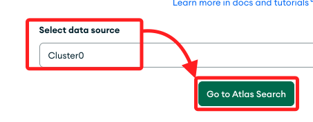
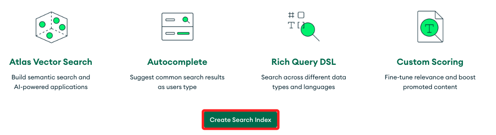
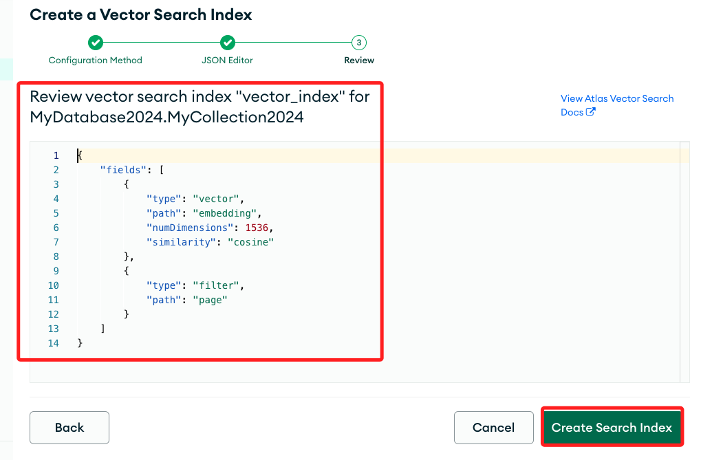

# MongoDB 整合 LangChain

_使用 LangChain 整合 MongoDB Atlas 建立向量索引並進行向量搜索_

<br>

## 說明

1. MongoDB [官方說明](https://www.mongodb.com/docs/atlas/atlas-vector-search/ai-integrations/langchain/)。

<br>

2. 這份指南說明如何使用 `LangChain` 與 `MongoDB Atlas 向量搜索` 來構建 `LLM` 應用程式並實現 `索引增強生成 RAG`。

<br>

3. 通過以下步驟，可以設置環境、存儲數據、創建向量索引，並運行各種向量搜索查詢，最終實現根據語義相似性回答問題的功能。

<br>

## 環境設置

1. 安裝庫。

    ```bash
    pip install --upgrade --quiet langchain langchain-mongodb langchain-openai pymongo pypdf
    ```

<br>

2. 導入所需的庫。

    ```python
    import getpass, os, pymongo, pprint
    from langchain_community.document_loaders import PyPDFLoader
    from langchain_core.output_parsers import StrOutputParser
    from langchain_core.runnables import RunnablePassthrough
    from langchain_mongodb import MongoDBAtlasVectorSearch
    from langchain_openai import ChatOpenAI, OpenAIEmbeddings
    from langchain.prompts import PromptTemplate
    from langchain.text_splitter import RecursiveCharacterTextSplitter
    from pymongo import MongoClient
    ```

<br>

3. 設置環境變量：執行以下代碼並按提示輸入您的 OpenAI API Key 和 Atlas 集群的 SRV 連接字符串。

    ```python
    os.environ["OPENAI_API_KEY"] = getpass.getpass("OpenAI API Key:")
    ATLAS_CONNECTION_STRING = getpass.getpass("MongoDB Atlas SRV Connection String:")
    ```

<br>

4. 特別注意，連結字串應使用以下格式。

    ```python
    `mongodb+srv://<username>:<password>@<clusterName>.<hostname>.mongodb.net`
    ```

<br>

## 使用 Atlas 作為向量存儲

_將自定義數據加載到 Atlas 並實例化為向量數據庫。_

<br>

1. 連接到自己的 Atlas 集群。

    ```python
    # 建立連線
    client = MongoClient(ATLAS_CONNECTION_STRING)
    # 定義資料庫與集合名稱
    db_name = "MyDatabase2024"
    collection_name = "MyCollection2024"
    atlas_collection = client[db_name][collection_name]
    vector_search_index = "vector_index"
    ```

<br>

2. 加載範例數據：使用以下代碼從指定的 URL 檢索 PDF 並加載原始文本數據，然後使用文本拆分器將數據拆分為較小的文檔。

    ```python
    # 載入 PDF
    loader = PyPDFLoader("https://query.prod.cms.rt.microsoft.com/cms/api/am/binary/RE4HkJP")
    data = loader.load()
    # 分割文件
    text_splitter = RecursiveCharacterTextSplitter(chunk_size=200, chunk_overlap=20)
    docs = text_splitter.split_documents(data)
    # 列印
    docs[0]
    ```

<br>

3. 實例化向量存儲：使用以下代碼從示例文檔創建一個名為 `vector_search` 的向量存儲。

    ```python
    # 建立向量儲存
    vector_search = MongoDBAtlasVectorSearch.from_documents(
        documents = docs,
        embedding = OpenAIEmbeddings(disallowed_special=()),
        collection = atlas_collection,
        index_name = vector_search_index
    )
    ```

<br>

## 創建 Atlas 向量搜索索引

_以 `MyDatabase2024.MyCollection2024` 為例_

1. 要在向量存儲上運行向量搜索查詢，需要在 `MyDatabase2024.MyCollection2024` 集合上創建 Atlas 向量搜索索引。

<br>

2. 進入 Atlas 中的集群頁面。

   - 如果未顯示，從導航欄中的組織菜單中選擇包含所需項目的組織。
   - 如果未顯示，從項目菜單中選擇所需項目。
   - 如果未顯示集群頁面，點擊側邊欄中的 Database。

<br>

3. 轉到 Atlas Search 頁面。

   - 點擊集群名稱。
   - 點擊 Atlas Search 標籤。

    

<br>

1. 定義 Atlas 向量搜索索引。

   - 點擊 Create Search Index。

    

   - 在 Atlas Vector Search 下，選擇 JSON Editor 然後點擊 Next。

    

   - 在 Database 和 Collection 部分，找到 `MyDatabase2024` 數據庫，並選擇 `MyCollection2024` 集合。

    

   - 在 Index Name 欄位中輸入 `vector_index`。

    

   - 用以下索引定義替換默認定義。

    ```json
    {
        "fields": [
            {
                "type": "vector",
                "path": "embedding",
                "numDimensions": 1536,
                "similarity": "cosine"
            },
            {
                "type": "filter",
                "path": "page"
            }
        ]
    }
    ```
   - 然後點擊 Next。 

    

<br>

1. 創建搜索索引：審查索引定義，然後點擊 Create Search Index。


    

2. 關閉 You're All Set! 的模態窗口，等待索引構建完成。

    

<br>

## 運行向量搜索查詢

_索引構建完成後，返回運行向量搜索查詢_

<br>

1. 語義搜索：使用以下代碼執行基本的語義搜索。

    ```python
    query = "MongoDB Atlas security"
    results = vector_search.similarity_search(query)
    pprint.pprint(results)
    ```

<br>

2. 檢索增強生成（RAG）：使用以下代碼示例實現 RAG，根據您的數據回答問題：

    ```python
    # 將 Atlas Vector Search 實例化為擷取器
    retriever = vector_search.as_retriever(
    search_type = "similarity",
    search_kwargs = {"k": 10, "score_threshold": 0.75}
    )
    # 定義提示模板
    template = """
    Use the following pieces of context to answer the question at the end.
    If you don't know the answer, just say that you don't know, don't try to make up an answer.
    {context}
    Question: {question}
    """
    #
    custom_rag_prompt = PromptTemplate.from_template(template)
    llm = ChatOpenAI()
    
    def format_docs(docs):
        return "\n\n".join(doc.page_content for doc in docs)
    
    # 建立一條鏈來回答有關您的數據的問題
    rag_chain = (
        { "context": retriever | format_docs, "question": RunnablePassthrough()}
        | custom_rag_prompt
        | llm
        | StrOutputParser()
    )
    # Prompt the chain
    question = "How can I secure my MongoDB Atlas cluster?"
    answer = rag_chain.invoke(question)
    print("Question: " + question)
    print("Answer: " + answer)
    # Return source documents
    documents = retriever.get_relevant_documents(question)
    print("\nSource documents:")
    pprint.pprint(documents)
    ```

<br>

___

_END_
