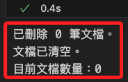
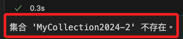
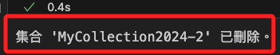
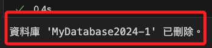
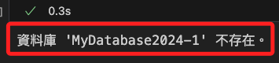

# 刪除指定資料庫對象

<br>

## 刪除指定集合中的文件

_刪除指定集合中的所有文檔並檢查集合是否已清空_

<br>

1. 程式碼。

    ```python
    import streamlit as st
    import os
    from pymongo import MongoClient
    import certifi

    # Set environment variables for API keys
    os.environ["OPENAI_API_KEY"] = st.secrets["OPENAI_API_KEY"]
    ATLAS_CONNECTION_STRING = st.secrets["MONGODB_URL"]

    # Connect to MongoDB Atlas
    client = MongoClient(
        ATLAS_CONNECTION_STRING,
        tlsCAFile=certifi.where()
    )
    db_name = "MyDatabase2024"
    collection_name = "MyCollection2024"
    atlas_collection = client[db_name][collection_name]

    # Function to delete all documents in the collection
    def delete_all_documents():
        result = atlas_collection.delete_many({})
        return result.deleted_count

    # Function to check if the collection is empty
    def check_collection_empty():
        count = atlas_collection.count_documents({})
        return count == 0

    # Delete all documents
    deleted_count = delete_all_documents()
    print(f"已刪除 {deleted_count} 筆文檔。")

    # Check if the collection is empty
    is_empty = check_collection_empty()
    if is_empty:
        print("文檔已清空。")
    else:
        print("文檔仍存在於資料庫中。")

    # Display current document count
    current_count = atlas_collection.count_documents({})
    print(f"目前文檔數量：{current_count}")
    ```

<br>

2. 結果。

    

<br>

## 刪除指定集合

_先檢查集合是否存在，存在則進行刪除_

<br>

1. 程式碼。

    ```python
    import os
    from pymongo import MongoClient
    import certifi
    import streamlit as st

    # 設置環境變數
    os.environ["OPENAI_API_KEY"] = st.secrets["OPENAI_API_KEY"]
    ATLAS_CONNECTION_STRING = st.secrets["MONGODB_URL"]

    # 連接到 MongoDB Atlas
    client = MongoClient(ATLAS_CONNECTION_STRING, tlsCAFile=certifi.where())
    db_name = "MyDatabase2024-1"
    collection_name = "MyCollection2024-2"
    db = client[db_name]

    # 檢查集合是否存在的函數
    def check_collection_exists(database, collection_name):
        collection_list = database.list_collection_names()
        return collection_name in collection_list

    # 刪除指定集合的函數
    def delete_collection():
        if check_collection_exists(db, collection_name):
            db.drop_collection(collection_name)
            print(f"集合 '{collection_name}' 已刪除。")
        else:
            print(f"集合 '{collection_name}' 不存在。")

    # 刪除集合
    delete_collection()
    ```

<br>

2. 集合不存在會進行提示。

    

<br>

3. 存在時會進行刪除。

    

<br>

## 刪除指定資料庫

1. 程式碼。

    ```python
    import os
    from pymongo import MongoClient
    import certifi
    import streamlit as st

    # 設置環境變數
    os.environ["OPENAI_API_KEY"] = st.secrets["OPENAI_API_KEY"]
    ATLAS_CONNECTION_STRING = st.secrets["MONGODB_URL"]

    # 連接到 MongoDB Atlas
    client = MongoClient(
        ATLAS_CONNECTION_STRING, tlsCAFile=certifi.where()
    )
    db_name = "MyDatabase2024"

    # 檢查資料庫是否存在的函數
    def check_database_exists(client, db_name):
        database_list = client.list_database_names()
        return db_name in database_list

    # 刪除指定資料庫的函數
    def delete_database():
        if check_database_exists(client, db_name):
            client.drop_database(db_name)
            print(f"資料庫 '{db_name}' 已刪除。")
        else:
            print(f"資料庫 '{db_name}' 不存在。")

    # 刪除資料庫
    delete_database()
    ```

<br>

2. 存在則進行刪除。

    

<br>

3. 不存在進行提示。

    

<br>

___

_END_