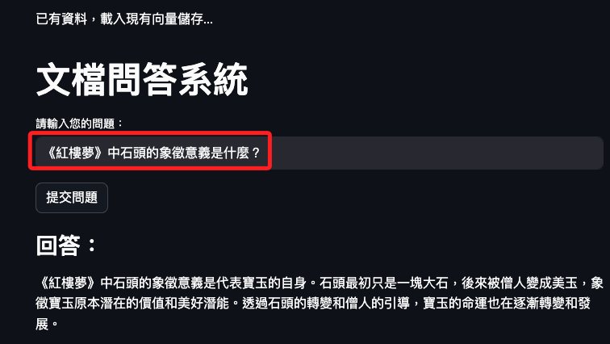
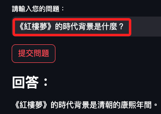

# 向量索引

_讀取 TXT 並建立向量索引系統_

<br>

## 純文本數據

1. 自由格式：數據以 `自然語言` 形式存在，沒有固定的行列結構。

2. 難以檢索和分析：需要使用 `NLP 技術` 如 `分詞`、`命名實體識別`、`主題建模` 等進行處理。

3. 常見形式：文章、日記、社交媒體帖子、聊天記錄等。

## 範例

_讀取純文本文件_

<br>

1. 以下範例展示如何加載純文本文件並將其轉換為向量嵌入，然後存儲在 MongoDB 的向量索引中。

<br>

2. 程式碼。

    ```python
    import os
    import pymongo
    import pprint
    import certifi
    import streamlit as st
    from langchain_community.document_loaders import TextLoader
    from langchain_core.output_parsers import StrOutputParser
    from langchain_core.runnables import RunnablePassthrough
    from langchain_mongodb import MongoDBAtlasVectorSearch
    from langchain_openai import ChatOpenAI, OpenAIEmbeddings
    from langchain.prompts import PromptTemplate
    from langchain.text_splitter import RecursiveCharacterTextSplitter
    from pymongo import MongoClient

    # 環境變數
    os.environ["OPENAI_API_KEY"] = st.secrets["OPENAI_API_KEY"]
    ATLAS_CONNECTION_STRING = st.secrets["MONGODB_URL"]

    # 連線資料庫
    client = MongoClient(ATLAS_CONNECTION_STRING, tlsCAFile=certifi.where())
    db_name = "MyDatabase2024"
    collection_name = "MyCollection2024"
    atlas_collection = client[db_name][collection_name]
    vector_search_index = "vector_index"


    # 載入數據並建立向量儲存
    def initialize_data():
        # Load text file
        loader = TextLoader("紅樓夢.txt")
        data = loader.load()
        # 文件分割器
        text_splitter = RecursiveCharacterTextSplitter(chunk_size=200, chunk_overlap=20)
        # 分割文件
        docs = text_splitter.split_documents(data)
        # 建立向量儲存
        vector_search = MongoDBAtlasVectorSearch.from_documents(
            documents=docs,
            embedding=OpenAIEmbeddings(disallowed_special=()),
            collection=atlas_collection,
            index_name=vector_search_index,
        )
        return vector_search


    # 檢查集合是否存在
    if atlas_collection.count_documents({}) == 0:
        st.write("初始化資料並創建向量存儲...")
        vector_search = initialize_data()
    else:
        st.write("已有資料，載入現有向量儲存...")
        vector_search = MongoDBAtlasVectorSearch(
            collection=atlas_collection,
            embedding=OpenAIEmbeddings(disallowed_special=()),
            index_name=vector_search_index,
        )

    # 標題
    st.title("文檔問答系統")

    # 發問
    question = st.text_input("請輸入您的問題：", "請簡述這個文本的主要內容")

    # 提交
    if st.button("提交問題"):
        # 初始化取回元件
        retriever = vector_search.as_retriever(
            search_type="similarity",
            search_kwargs={"k": 10, "score_threshold": 0.75},
        )
        template = """
        使用以下內容來回答最後的問題。
        如果你不知道答案，就說你不知道，不要試圖編造答案。
        {context}
        問題：{question}
        """
        custom_rag_prompt = PromptTemplate.from_template(template)
        llm = ChatOpenAI()

        def format_docs(docs):
            return "\n\n".join(doc.page_content for doc in docs)

        rag_chain = (
            {"context": retriever | format_docs, "question": RunnablePassthrough()}
            | custom_rag_prompt
            | llm
            | StrOutputParser()
        )

        # 取回相關文件
        documents = retriever.get_relevant_documents(question)
        # 取回答案
        answer = rag_chain.invoke(question)

        # 顯示結果
        st.subheader("回答：")
        st.write(answer)

        # 相關文檔 
        # st.subheader("相關文檔：")
        # for doc in documents:
        #     st.write(doc.page_content)

        # 可顯示原文檔案
        # with st.expander("查看源文檔"):
        #     pprint.pprint(documents)
    ```

<br>

## 互動

_可透過詢問各種問題來測試_

<br>

1. `《紅樓夢》中石頭的象徵意義是什麼？`

    

<br>

2. `《紅樓夢》的時代背景是什麼？`

    

<br>

___

_END_