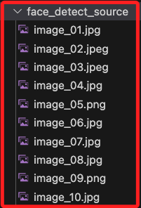
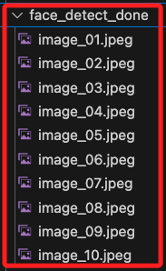
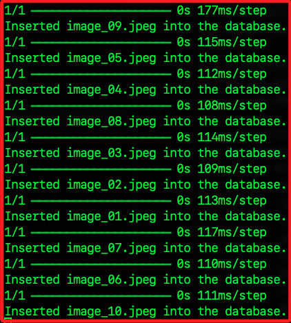
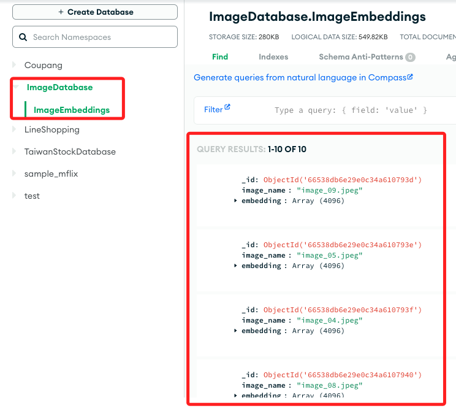
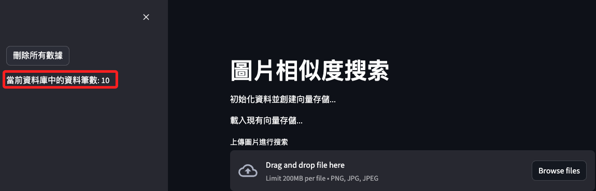
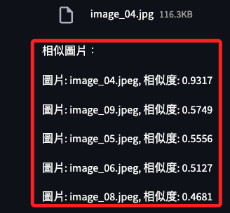
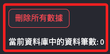
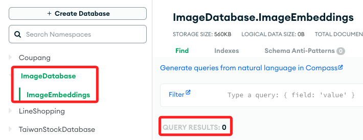
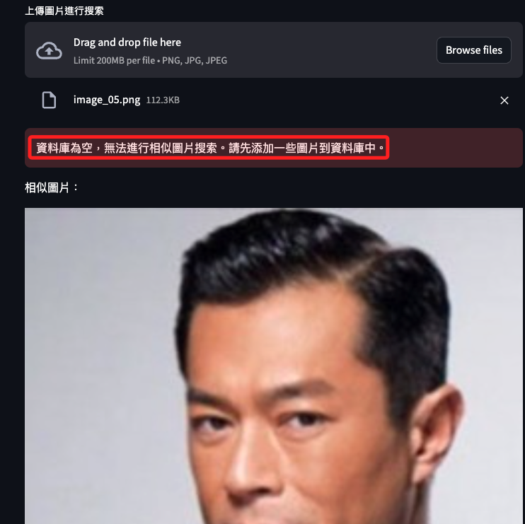

# 圖片向量索引彙整

<br>

## 操作演示

1. 下載任意圖片進入資料夾 `face_detect_source` 之中，副檔名包含 `.png`、`.jpg`、`.jpeg`。

    

<br>

2. 運行轉換相片格式腳本，會建立資料夾 `face_detect_done`，並將轉換好的圖片存在這裡。

    

<br>

3. 運行最終腳本，會建立向量儲存。

    

<br>

4. 查看 MongoDB 專案，可看到建立的資料庫以及集合，還有集合中的文件。

    

<br>

5. 此時網頁會顯示已經有 10 筆資料。

    

<br>

6. 點擊 `Browse file` 上傳任一張圖片進行 `比對`，會顯示比對的相似度結果以及對應的相片，這裡可再進行優化，將圖片更好的排放。

    

<br>

7. 點擊左上角的 `刪除所有數據`，這時終端機出現警示，這裡可再進行優化。

    ```bash
    2024-05-27 03:36:17.089 Please replace `st.experimental_rerun` with `st.rerun`.

    `st.experimental_rerun` will be removed after 2024-04-01.
    ```

<br>

8. 刪除後網頁更新現有資料為 `0`。

    

<br>

9. 資料庫及集合都還在，但是文件數已經歸 `0`。

    

<br>

10. 再次點擊 `Browse files`，會提示 `資料庫為空，無法進行相似圖片搜索。請先添加一些圖片到資料庫中。`。

    

<br>

## 未來優化

1. 添加擴充資料庫或是本地資料夾的邏輯。

2. 優化圖片顯示。

3. 關於 `st.rerun` 的更新。

<br>

___

_END_