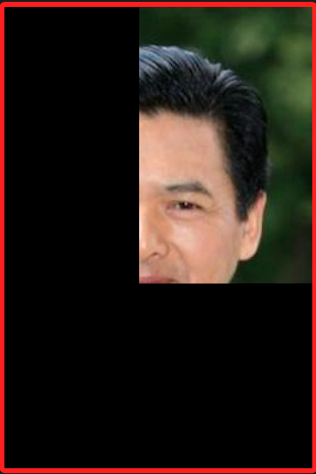
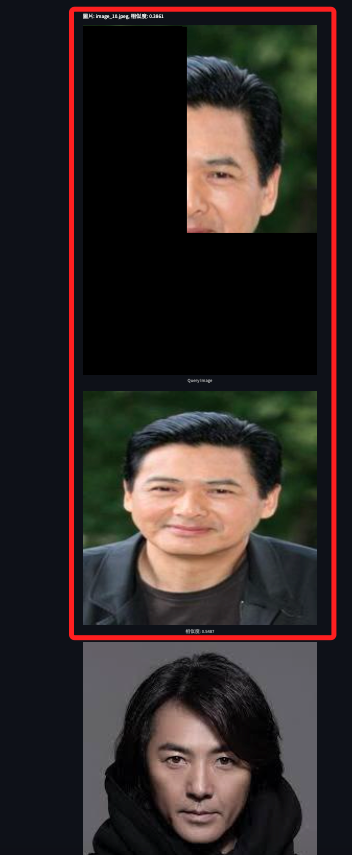
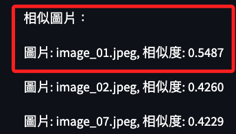

# 部分圖片比對

_進一步觀察 `比對` 與 `辨識` 在應用上的差異_

 

## 說明

1. 當試圖將人臉圖片擷取其中 `1/4` 進行判讀時，傳統的 `人臉辨識` 模型如使用人臉檢測算法 `Haar Cascades`、`Dlib`、`MTCNN`等，可能會無法準確地辨識這是一張人臉，因為它們通常依賴於完整的面部特徵。

    

 

2. 而使用基於 `向量嵌入` 的 `相似度搜索方法` 如 `VGG16特徵提取` 和 `向量比對`，只要擷取的部分仍然保留了一些足夠的特徵，這些方法仍然可以通過 `向量相似度` 來找到與之相似的圖片，這是因為這些方法將圖片轉換為 `高維特徵向量`，即使只是部分圖片，仍然能夠捕捉到一些特徵信息。

 

3. 在前面的範例中，通過將圖片嵌入到向量並存儲到 MongoDB 中，然後使用 `餘弦相似度` 來搜索相似圖片，就能實現對部分圖片的有效比對。

 

## 測試

1. 使用前面提及的 1/4 人臉的圖片。

    

 

2. 運行腳本進行測試，依舊可以正確。

    

 

3. 雖然相似度已經降低，但不會因此無法判讀。

    

 

___

_END_