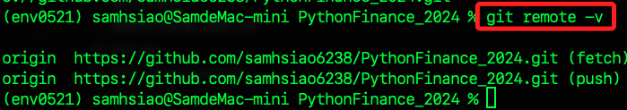

# Git 實務

_剛好遇到錯誤，所以紀錄排除步驟_

<br>

## 說明

1. 忘記將 `secrets.toml` 寫入 `.gitignore`，提交後出現以下錯誤。

    

<br>

2. 查詢哪裡洩漏了 `secrets.toml`。

    ```bash
    git log -p -S "<我的 OpenAI API Key：sk-..."
    ```

<br>

3. 出現以下這樣的 `URL 編碼`。

    

<br>

4. 先透過以下腳本將路徑轉換為一般可讀字串。

    ```python
    import urllib.parse

    # 需要轉換的路徑，假設它是以八進制字符編碼的形式
    encoded_path = "a/D25_neo4j/13_\345\260\210\346\241\210 Noe4jBot/02_\345\205\266\344\273\226\345\212\237\350\203\275\347\257\204\344\276\213/.streamlit/secrets.toml" "b/D25_neo4j/13_\345\260\210\346\241\210 Noe4jBot/02_\345\205\266\344\273\226\345\212\237\350\203\275\347\257\204\344\276\213/.streamlit/secrets.toml"

    # 替換八進制字符為百分號編碼字符
    encoded_path = encoded_path.encode('latin1').decode('unicode_escape').encode('latin1').decode('utf-8')

    # 解碼 URL 編碼路徑
    decoded_path = urllib.parse.unquote(encoded_path)

    print("Encoded Path: ", encoded_path)
    print("Decoded Path: ", decoded_path)
    ```

    _結果_

    ```bash
    Encoded Path:  a/D25_neo4j/13_專案 Noe4jBot/02_其他功能範例/.streamlit/secrets.tomlb/D25_neo4j/13_專案 Noe4jBot/02_其他功能範例/.streamlit/secrets.toml
    Decoded Path:  a/D25_neo4j/13_專案 Noe4jBot/02_其他功能範例/.streamlit/secrets.tomlb/D25_neo4j/13_專案 Noe4jBot/02_其他功能範例/.streamlit/secrets.toml
    ```

<br>

5. 安裝工具。

    ```bash
    pip install git-filter-repo
    ```

<br>

6. 移除文件

    ```bash
    # 例如移除某一個文件
    git filter-repo --path "D25_neo4j/13_專案 Noe4jBot/02_其他功能範例/.streamlit/secrets.toml" --path "D25_neo4j/13_專案 Noe4jBot/02_其他功能範例/03_MongoDB+LangChain.ipynb" --invert-paths --force
    ```

<br>

7. 執行後推送。

    ```bash
    git push origin --force --all
    ```

<br>

8. 發現遠端倉庫丟失。

    

<br>

9. 透過指令查看。

    ```bash
    git remote -v
    ```

<br>

10. 啥也沒有，確實丟失配置。

    

<br>

11. 重新添加倉庫。

    ```bash
    git remote add origin https://github.com/samhsiao6238/PythonFinance_2024.git
    ```

<br>

12. 再次查詢。

    

<br>

13. 添加 `.gitignore`。

    ```bash
    **/secrets.toml
    ```

<br>

14. 強推。

    ```bash
    git push origin --force --all
    ```

<br>

15. 推送完成，但出現新的警告。

    ```bash
    (env0521) samhsiao@SamdeMac-mini PythonFinance_2024 % git push origin --force --all

    Enumerating objects: 7642, done.
    Counting objects: 100% (7642/7642), done.
    Delta compression using up to 8 threads
    Compressing objects: 100% (3914/3914), done.
    Writing objects: 100% (7632/7632), 169.07 MiB | 4.30 MiB/s, done.
    Total 7632 (delta 3543), reused 7612 (delta 3530), pack-reused 0
    remote: Resolving deltas: 100% (3543/3543), completed with 2 local objects.
    remote: warning: See https://gh.io/lfs for more information.
    remote: warning: File D91_書籍範例/01_Python股票×ETF量化交易實戰105個活用技巧/範例程式碼_20231120/三大法人爬蟲資料.csv is 73.63 MB; this is larger than GitHub's recommended maximum file size of 50.00 MB
    remote: warning: GH001: Large files detected. You may want to try Git Large File Storage - https://git-lfs.github.com.
    To https://github.com/samhsiao6238/PythonFinance_2024.git
    + b46bfd9...c72cfe4 main -> main (forced update)
    ```

<br>

16. 這是 GitHub 建議使用 `Git Large File Storage (LFS)` 來處理超過 50MB 的文件，以上排除了推送敏感資訊產生的錯誤，以下將繼續說明大型檔案管理。

<br>

## LFS

1. 安裝。

    _MacOS_
    ```bash
    brew install git-lfs
    ```

    _Windows_
    ```bash
    choco install git-lfs
    ```

<br>

2. 在倉庫中運行指令進行初始化。

    ```bash
    git lfs install
    ```

<br>

3. 跟蹤大型檔案：指定 Git LFS 追蹤所有的 .csv 和 .zip 文件，這將使所有的 .csv 和 .zip 檔案由 Git LFS 管理，從而將這些檔案儲存在 LFS 的遠端存儲，而不是直接儲存在 Git 倉庫中。這樣可以避免超大的文件直接在 Git 倉庫中，防止倉庫變得臃腫。

    ```bash
    git lfs track "*.csv" && git lfs track "*.zip"
    ```

<br>

4. 添加並提交。

    ```bash
    git add .gitattributes
    git add path/to/your/large/file.csv
    git commit -m "Track large files using Git LFS"
    ```

<br>

5. 推送。

    ```bash
    git push origin main
    ```

<br>

6. 完成後觀察 `.gitattributes` 文件，這表明所有的 .csv 和 .zip 檔案以及兩個指定檔案都將由 Git LFS 管理。

    ```bash
    三大法人爬蟲資料.csv filter=lfs diff=lfs merge=lfs -text
    over100.zip filter=lfs diff=lfs merge=lfs -text
    *.csv filter=lfs diff=lfs merge=lfs -text
    *.zip filter=lfs diff=lfs merge=lfs -text
    ```

<br>

## 補充關於 `.gitignore` 的寫法

1. 不追蹤全部的 `.csv` 和 `.zip` 文件

    ```bash
    *.csv
    *.zip
    ```

<br>

2. 不追蹤指定文件名稱，但不限於路徑。

    ```bash
    **/secrets.toml
    ```

<br>

3. 不追蹤指定資料夾內的指定副檔名文件。

    ```bash
    data/*.csv
    ```

<br>

4. 不追蹤指定資料夾及其子資料夾內全部的指定副檔名文件。

    ```bash
    data/**/*.csv
    ```

<br>

## 託管大型檔案但依舊排除部分大型檔案

1. 在 `.gitattributes` 中已經設定了大型檔案的管理。

    ```bash
    *.csv filter=lfs diff=lfs merge=lfs -text
    *.zip filter=lfs diff=lfs merge=lfs -text
    ```

<br>

2. 但依舊可以在 `` 文件中指定忽略指定的大型檔案。

    ```bash
    Python大數據特訓班(第三版)學習資源.zip
    範例程式碼_20231120.zip
    ```

<br>

___

_END_