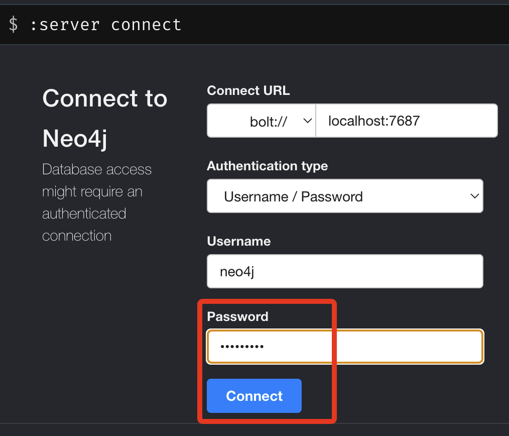
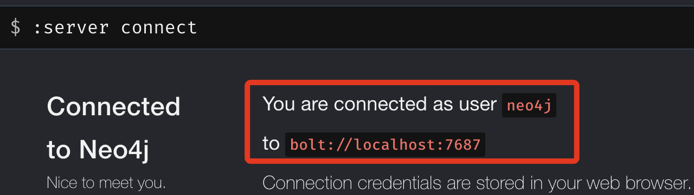
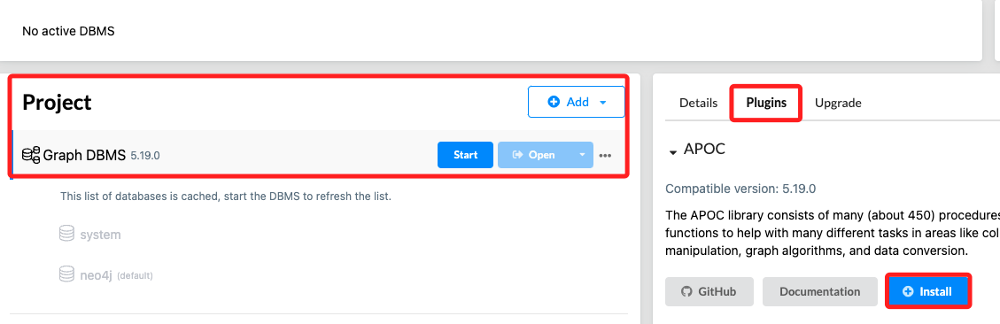
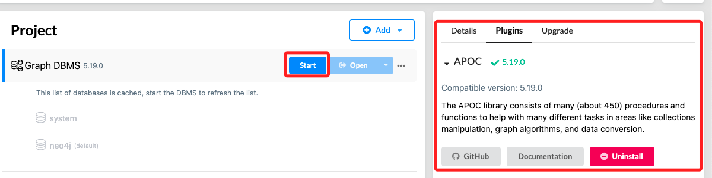
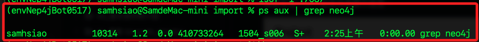
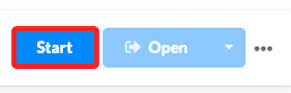
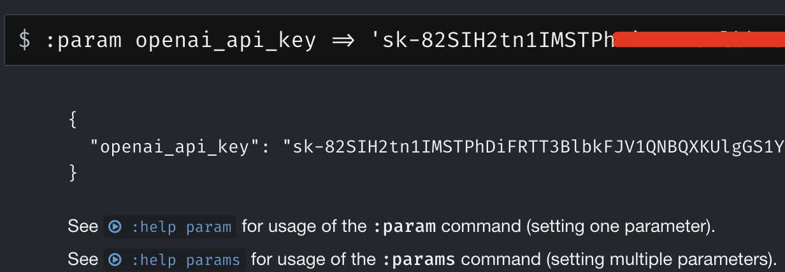
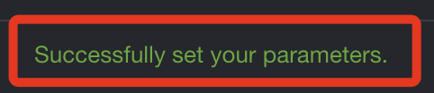
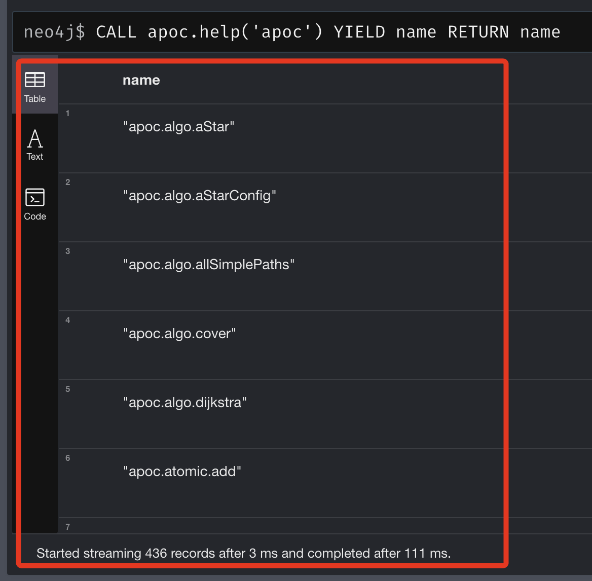
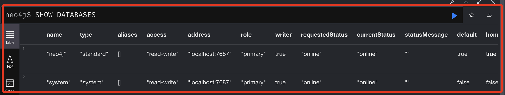

_以下操作尚未成功_

# 建立專案

<br>

## 基本設置

1. 必須先確認前面建立的本地資料庫可正在運行，且可透過 `bolt://localhost:7687` 進行連接 `Connect`。

    

<br>

2. 連線成功會顯示 `You are connected as user neo4j`。

    

<br>

## 安裝

1. 面板安裝，需要在停止的狀態下才會出現面板。

    

<br>

2. 安裝完成重新啟動。

    

<br>

## 設定、查詢與查看日誌

1. 使用 VSCode 編輯 neo4j.conf 文件。

    ```bash
    code /opt/homebrew/Cellar/neo4j/5.19.0/libexec/conf/neo4j.conf
    ```

<br>

2. 若有錯誤可查看日誌。

    ```bash
    tail -n 100 /opt/homebrew/var/log/neo4j/neo4j.log
    ```

<br>

3. 查詢端口佔用。

    ```bash
    lsof -i :7687
    ```

<br>

4. 查詢此時還在運行的進程，僅有 `grep neo4j` 這個進程代表已經沒有 `Neo4j` 相關進程。

    ```bash
    ps aux | grep neo4j
    ```

    

<br>

5. 若有修改設定文件要關閉後重啟。

    

<br>

## 使用 apoc

1. 設置參數。

    

    ```bash
    :param openai_api_key => '<輸入金鑰>'
    ```

<br>

2. 成功時左下角會顯示訊息。

    

<br>

3. 驗證安裝。

    ```bash
    CALL apoc.help('apoc') YIELD name
    RETURN name
    ```

    

<br>

4. 顯示資料庫，可驗證連接狀態。

    ```bash
    SHOW DATABASES
    ```

    

<br>

5. 透過資料庫查詢設定。

    ```bash
    CALL dbms.listConfig() YIELD name, value
    WHERE name = 'server.directories.import' OR name = 'dbms.directories.import'
    RETURN name, value;
    ```

    _得到結果_

    ```json
    name	value
    "server.directories.import"	"/Users/samhsiao/Library/Application Support/Neo4j Desktop/Application/relate-data/dbmss/dbms-c529c4ab-fc9c-4dc5-9572-f0460f901550/import"
    ```

<br>

6. 授權指令。

    ```bash
    chmod 755 /Users/samhsiao/Desktop/neo4j_import
    chmod 644 /Users/samhsiao/Desktop/neo4j_import/fewshot.csv
    ```

<br>

___

_END_