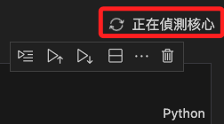
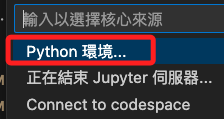
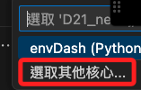
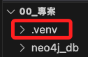

# Neo4j 知識圖

_以中文重新整理官方說明_

<br>

## 環境設置

_先完成以下的套件安裝及環境設置_

<br>

1. Docker + Docker Compose。

2. Neo4j 數據庫應用如 Neo4j Desktop 或雲端實例。

3. 在稍後的操作中將示範使用 `VSCode` 內建的 `venv` 虛擬環境管理。

<br>

## 開始操作

1. 使用 Docker 啟動 Neo4j 數據庫：進入 `docker-compose.yml` 文件所在路徑，接著在終端機使用 Docker Compose 指令來啟動容器中的 Neo4j 數據庫。

   ```bash
   docker-compose up -d
   ```
   
   

<br>

2. 可透過 Docker desktop 觀察到建立了一個容器。

   

<br>

3. 透過以下網址訪問 Neo4j 的 Web UI，預設的用戶名和密碼都是 `neo4j`。

   [http://localhost:7474/browser/](http://localhost:7474/browser/)

   

<br>

4. 按照指示設置新密碼。

   

<br>

5. 另外，也可使用 Neo4j Desktop 進行連線。

   

<br>

6. 點擊右上角 `Add`，然後點擊 `Remote connection`。

   

<br>

7. 使用預設的 `URL`，點擊 `Next`。

   

<br>

8. 輸入 `Username` 及 `Password` 之後點擊 `Save`，`Username` 是預設的 `neo4j`，密碼則是前面步驟重設的。

   

<br>

9. 點擊 `Connect`。

   

<br>

10. 接著 `Open`。

      

<br>

11. 點擊左上角的資料庫圖標展開，目前尚無任何資料，只會看到相同的資料庫名稱。

      

<br>

## 模擬寫入與讀取數據

1. 首先，在專案的根目錄中建立一個 `test.ipynb` 檔案；接著在編輯模擬數據的腳本之前，要先建立運行這個專案的虛擬環境，這裡將示範在 `.ipynb` 檔案環境中建立虛擬環境，當然，使用 `.py` 檔也可以，只是開始的方式略有不同，但在開始之前有一件事非常重要，就是要將 `工作區` 切換到專案的根目錄中，_切記要切換到專案的根目錄中_ ，非常重要，所以先在腳本點擊右鍵，然後點擊 `開啟終端機`，下圖是因為設定關係所以會開啟外部終端機。

   

<br>

2. 接著在終端機中執行以下指令開啟 VSCode。

   

<br>

3. 在腳本中先點擊右上角。

   

<br>

4. 選取 `Python 環境`。

   

<br>

5. 假如已經有核心，則點擊 `選取其他核心`。

   

<br>

6. 建立 Python 環境。

   

<br>

7. 選取 `在目前的工作區中建立 Venv 虛擬環境`，這就是為何要切換工作區的原因，VSCode 預設會將虛擬環境建立在當前的工作區中。

   

<br>

8. 使用 `Python 3.10.11`。

   

<br>

9. 雖然此處已有一個 `requirements.txt`，可以不用選取，之後另行安裝即可，點擊 `確認` 繼續。

   

<br>

10. 完成時可見右上角已經是核心的名稱與版本號。

      

<br>

11. 在專案根目錄中也會顯示虛擬環境安裝的資料夾。

      

<br>

12. 特別強調，同步之前務必確認編輯了 `.gitignore` 文件。

      ```json
      # Python
      venv
      **/__pycache__

      # App Specific
      .env

      # IDE
      .vscode

      # Neo4j local DB
      data
      neo4j_db/data
      neo4j_db/plugins
      ```

<br>

## 配置環境變量

_回到專案中_

<br>

1. 在專案根目錄建立一個 `.env` 檔案，並填入必要的環境變量，包括 Neo4j 的連接配置和 OpenAI API 密鑰；並確認 `.env` 文件已經寫入 `.gitignore` 文件中。

   ```json
   OPENAI_API_KEY=<輸入 API KEY>
   CHATGPT_MODEL=gpt-4-turbo
   NEO4J_DB_URI=neo4j://localhost:7687
   NEO4J_DB_NAME=neo4j
   NEO4J_DB_USER=neo4j
   NEO4J_DB_PASS=neo4j
   NEO4J_ENTITY_NAME_FULLTEXT_INDEX_NAME=idx_node_entity_name_fulltext
   ```

<br>

2. 在根目錄新增終端機，並確認啟動的虛擬環境是正確的。

   

<br>

3. 透過指令安裝所需的 Python 依賴。

   ```bash
   pip install -r requirements.txt
   ```

<br>

## 初始化 Neo4j 數據庫

1. 在專案根目錄下運行初始化腳本以建立 `所需的索引`，這對於在 Neo4j 知識圖中進行全文檢索是必要的

   ```bash
   python ./scripts/add_index_for_neo4j_db.py
   ```

<br>

2. 運行應用：確保所有設定正確無誤後，在根目錄運行主應用程序，切記要在根目錄運行才能正確載入環境參數。

   ```bash
   python ./src/main.py
   ```

<br>

3. 成功啟動後，可輸入語句跟 Bot 開始聊天。

   

<br>

## 編輯腳本

1. 在之前步驟中建立的 `test.ipynb` 文件中，加入以下代碼並且執行。

   ```python
   # 添加一筆資料
   from neo4j import GraphDatabase

   uri = "bolt://localhost:7687"  # Neo4j Bolt URL
   username = "neo4j"
   password = "sam112233"

   # 連接到數據庫
   driver = GraphDatabase.driver(uri, auth=(username, password))

   def add_person(tx, name):
      query = (
         "CREATE (p:Person {name: $name}) "
         "RETURN p"
      )
      return tx.run(query, name=name).single()[0]

   # 新增節點
   with driver.session() as session:
      person = session.write_transaction(add_person, "Alice2")
      print(f"Created: {person['name']}")

   # 關閉數據庫連接
   driver.close()
   ```

<br>

2. 完成時顯示建立了一個資料。

   

<br>

3. 再使用以下腳本進行查詢。

   ```python
   # 查詢資料
   def find_person(tx, name):
      query = (
         "MATCH (p:Person {name: $name}) "
         "RETURN p.name AS name"
      )
      result = tx.run(query, name=name).single()
      return result["name"] if result else "No such person found"

   # 查詢節點
   with driver.session() as session:
      person_name = session.read_transaction(find_person, "Alice2")
      print(f"Found: {person_name}")
   ```

<br>

4. 結果顯示如下。

   

<br>

5. 可使用 Neo4j Desktop 觀察。

   

<br>

6. 回到腳本中多添加幾筆資料，然後在 Neo4j Desktop 查看，可使用介面查詢或語法查詢。

   ```bash
   MATCH (n) RETURN n LIMIT 25
   ```

<br>

7. 輸入語法便會顯示結果。

   

<br>

8. 透過腳本建立具有 `關係` 的數據。

   ```python
   from neo4j import GraphDatabase

   uri = "bolt://localhost:7687"  # Neo4j Bolt URL
   username = "neo4j"
   password = "sam112233"

   # 連接到資料庫
   driver = GraphDatabase.driver(uri, auth=(username, password))


   def add_people_and_relationships(tx):
      # 建立多個人物節點和它們之間的關係
      query = """
         CREATE (a:Person {name: 'Alice'})
         CREATE (b:Person {name: 'Bob'})
         CREATE (c:Person {name: 'Carol'})
         CREATE (d:Person {name: 'Dave'})
         CREATE (e:Person {name: 'Eve'})
         
         CREATE (a)-[:FRIENDS_WITH]->(b)
         CREATE (a)-[:COLLEAGUES_WITH]->(c)
         CREATE (b)-[:FRIENDS_WITH]->(d)
         CREATE (c)-[:COLLEAGUES_WITH]->(d)
         CREATE (d)-[:FRIENDS_WITH]->(e)
         CREATE (e)-[:COLLEAGUES_WITH]->(a)
         
         RETURN a, b, c, d, e
      """
      results = tx.run(query)
      return results.single()  # Return the created nodes


   # 運行事務並列印結果
   with driver.session() as session:
      people = session.write_transaction(add_people_and_relationships)
      print("Created the following nodes:")
      for person in people:
         print(f"Created: {person['name']}")

   # 關閉資料庫連接
   driver.close()
   ```

<br>

9. 再次進入資料庫查詢。

   

<br>

10. 在圖形資料庫中，除了基本的 `關係`，可以進一步建立更多類型的關係以及添加屬性到關係和節點上拓展實體之間的關聯性，如此可建立更豐富的資料模型，從而更細緻地表達實體間的各種連結和特徵。

      ```python
      from neo4j import GraphDatabase

      uri = "bolt://localhost:7687"
      username = "neo4j"
      password = "sam112233"

      # 連接到資料庫
      driver = GraphDatabase.driver(uri, auth=(username, password))

      def add_people_and_complex_relationships(tx):
         # 透過添加關係和節點束性來建立多個人物節點間的多種關係
         query = """
         CREATE (a:Person {name: 'Alice', age: 30, occupation: 'Engineer'})
         CREATE (b:Person {name: 'Bob', age: 25, occupation: 'Designer'})
         CREATE (c:Person {name: 'Carol', age: 33, occupation: 'Manager'})
         CREATE (d:Person {name: 'Dave', age: 45, occupation: 'Developer'})
         CREATE (e:Person {name: 'Eve', age: 29, occupation: 'Analyst'})
         
         CREATE (a)-[:FRIENDS_WITH {since: 2020}]->(b)
         CREATE (a)-[:COLLEAGUES_WITH {since: 2018}]->(c)
         CREATE (b)-[:FRIENDS_WITH {since: 2021}]->(d)
         CREATE (c)-[:COLLEAGUES_WITH {since: 2019}]->(d)
         CREATE (d)-[:FRIENDS_WITH {since: 2019}]->(e)
         CREATE (e)-[:COLLEAGUES_WITH {since: 2021}]->(a)
         CREATE (a)-[:MENTOR_OF {since: 2022}]->(e)
         CREATE (b)-[:WORKS_WITH {on: 'Project X'}]->(c)
         CREATE (d)-[:LIVES_NEAR {distance: '5km'}]->(b)
         
         RETURN a, b, c, d, e
         """
         results = tx.run(query)
         # 傳回建立的節點和關係
         return results.single()

      # 運行並輸出結果
      with driver.session() as session:
         entities = session.write_transaction(add_people_and_complex_relationships)
         print("Created the following nodes and relationships:")
         for entity in entities:
            print(f"Created: {entity['name']} with attributes {dict(entity)}")

      # 關閉資料庫連接
      driver.close()

      ```

<br>

11. 可以點擊左側的關係來切換各種視角。

      

<br>

## 進階腳本

1. 模擬 VOSViwer。

   ```python
   import random
   from neo4j import GraphDatabase

   # Neo4j Bolt URL
   uri = "bolt://localhost:7687"
   username = "neo4j"
   password = "sam112233"

   driver = GraphDatabase.driver(uri, auth=(username, password))

   def create_keyword(tx, keyword):
      query = (
         "MERGE (k:Keyword {name: $name}) "
         "RETURN k"
      )
      return tx.run(query, name=keyword).single()[0]

   def create_paper_with_keywords(tx, title, keywords):
      create_paper_query = (
         "CREATE (p:Paper {title: $title}) "
         "RETURN p"
      )
      paper_node = tx.run(create_paper_query, title=title).single()[0]
      
      for keyword in keywords:
         create_relationship_query = (
               "MATCH (p:Paper {title: $title}), (k:Keyword {name: $keyword}) "
               "MERGE (p)-[:HAS_KEYWORD]->(k)"
         )
         tx.run(create_relationship_query, title=title, keyword=keyword)
      return paper_node

   def simulate_literature_review():
      keywords = ['machine learning', 'data mining', 'artificial intelligence', 
                  'neural networks', 'deep learning', 'big data', 'natural language processing',
                  'computer vision', 'bioinformatics', 'blockchain']
      papers = {f"Paper {i}": random.sample(keywords, k=random.randint(2, 5)) for i in range(1, 101)}

      with driver.session() as session:
         # 確保所有關鍵字都存在於資料庫中
         for keyword in set(sum(papers.values(), [])):
               session.write_transaction(create_keyword, keyword)
         
         # 建立論文及其與關鍵字的關係
         for title, paper_keywords in papers.items():
               session.write_transaction(create_paper_with_keywords, title, paper_keywords)

   if __name__ == "__main__":
      simulate_literature_review()
      print("Simulation of literature review data completed successfully.")
      driver.close()

   ```

<br>

2. 結果。

   

<br>

## 使用 Python 繪圖

1. 從 Neo4j 資料庫中 `提取關鍵字` 及其與文獻的關係數據，然後根據關鍵字 `出現的頻率` 來調整節點的大小。

<br>

2. 先安裝必要的套件。

   ```bash
   pip install matplotlib
   ```

<br>

3. 讀取資料並在本地輸出圖片。

   ```python
   import matplotlib.pyplot as plt
   import networkx as nx
   from neo4j import GraphDatabase

   # Neo4j Bolt URL
   uri = "bolt://localhost:7687"
   username = "neo4j"
   password = "sam112233"

   driver = GraphDatabase.driver(uri, auth=(username, password))

   def fetch_data(tx):
      # 查詢關鍵字和與其相關的文獻數量
      query = """
      MATCH (k:Keyword)<-[:HAS_KEYWORD]-(p:Paper)
      RETURN k.name AS keyword, COUNT(p) AS papers
      """
      return list(tx.run(query))

   def plot_keywords_graph(data):
      G = nx.Graph()
      for record in data:
         keyword, weight = record['keyword'], record['papers']
         G.add_node(keyword, size=weight)
      
      # 新增節點之間的邊，這裡假設是範例，實際需要根據實際資料調整
      for i in range(len(data)):
         for j in range(i + 1, len(data)):
               G.add_edge(data[i]['keyword'], data[j]['keyword'])
      # 使用 Spring 佈局
      pos = nx.spring_layout(G)
      # 調整節點大小
      sizes = [G.nodes[node]['size'] * 100 for node in G]

      # 輸出關鍵字即文獻數量
      print("Keyword and their respective number of papers:")
      for record in data:
         print(f"{record['keyword']}: {record['papers']}")

      # 繪製節點
      nx.draw(G, pos, with_labels=True, node_size=sizes, node_color='lightblue', edge_color='gray')
      
      # 顯示圖形
      plt.title('Keyword Co-occurrence Graph')
      plt.show()

   with driver.session() as session:
      keyword_data = session.read_transaction(fetch_data)
      plot_keywords_graph(keyword_data)

   driver.close()
   ```

<br>

4. 結果。

   

<br>

5. 加入顏色來映射頻率的高低。

   ```python
   import matplotlib.pyplot as plt
   import networkx as nx
   from neo4j import GraphDatabase
   import numpy as np

   # Neo4j Bolt URL
   uri = "bolt://localhost:7687"
   username = "neo4j"
   password = "sam112233"

   driver = GraphDatabase.driver(uri, auth=(username, password))

   def fetch_data(tx):
      # 查詢關鍵字和與其相關的文獻數量
      query = """
      MATCH (k:Keyword)<-[:HAS_KEYWORD]-(p:Paper)
      RETURN k.name AS keyword, COUNT(p) AS papers
      """
      return list(tx.run(query))

   def plot_keywords_graph(data):
      G = nx.Graph()
      papers_counts = [record['papers'] for record in data]
      min_papers = min(papers_counts)
      max_papers = max(papers_counts)

      for record in data:
         keyword, weight = record['keyword'], record['papers']
         G.add_node(keyword, size=weight, count=weight)
      
      for i in range(len(data)):
         for j in range(i + 1, len(data)):
               G.add_edge(data[i]['keyword'], data[j]['keyword'])
      
      pos = nx.spring_layout(G)
      sizes = [G.nodes[node]['size'] * 100 for node in G]
      normalized_counts = [(G.nodes[node]['count'] - min_papers) / (max_papers - min_papers) for node in G]
      cmap = plt.get_cmap('YlOrRd')
      norm = plt.Normalize(vmin=min_papers, vmax=max_papers)

      fig, ax = plt.subplots()
      nx.draw(G, pos, ax=ax, with_labels=True, node_size=sizes, node_color=normalized_counts, cmap=cmap, edge_color='gray')

      sm = plt.cm.ScalarMappable(cmap=cmap, norm=norm)
      sm.set_array([])
      plt.colorbar(sm, ax=ax, label='Normalized Number of Papers')

      plt.title('Keyword Co-occurrence Graph')
      plt.show()

   with driver.session() as session:
      keyword_data = session.read_transaction(fetch_data)
      plot_keywords_graph(keyword_data)

   driver.close()
   ```

<br>

6. 結果。

   

<br>

7. 進一步優化，透過節低的大小來映射頻率的高低。

   ```python
   import matplotlib.pyplot as plt
   import networkx as nx
   from neo4j import GraphDatabase
   import numpy as np

   # Neo4j Bolt URL
   uri = "bolt://localhost:7687"
   username = "neo4j"
   password = "sam112233"

   driver = GraphDatabase.driver(uri, auth=(username, password))

   def fetch_data(tx):
      # 查詢關鍵字和與其相關的文獻數量
      query = """
      MATCH (k:Keyword)<-[:HAS_KEYWORD]-(p:Paper)
      RETURN k.name AS keyword, COUNT(p) AS papers
      """
      return list(tx.run(query))

   def plot_keywords_graph(data):
      G = nx.Graph()
      papers_counts = [record['papers'] for record in data]
      min_papers = min(papers_counts)
      max_papers = max(papers_counts)

      # 根據紙張計數範圍計算尺寸係數
      # 最小的節點的基本大小
      base_size = 300
      # 最大節點的額外大小
      size_range = 800

      for record in data:
         keyword, weight = record['keyword'], record['papers']
         # 標準化權重並應用比例因子
         normalized_weight = (weight - min_papers) / (max_papers - min_papers)
         scaled_size = base_size + normalized_weight * size_range
         G.add_node(keyword, size=scaled_size, count=weight)
      
      for i in range(len(data)):
         for j in range(i + 1, len(data)):
               G.add_edge(data[i]['keyword'], data[j]['keyword'])
      
      pos = nx.spring_layout(G)
      # 使用計算的大小
      sizes = [G.nodes[node]['size'] for node in G]
      normalized_counts = [(G.nodes[node]['count'] - min_papers) / (max_papers - min_papers) for node in G]
      cmap = plt.get_cmap('YlOrRd')
      norm = plt.Normalize(vmin=min_papers, vmax=max_papers)

      fig, ax = plt.subplots()
      nx.draw(G, pos, ax=ax, with_labels=True, node_size=sizes, node_color=normalized_counts, cmap=cmap, edge_color='gray')

      sm = plt.cm.ScalarMappable(cmap=cmap, norm=norm)
      sm.set_array([])
      plt.colorbar(sm, ax=ax, label='Normalized Number of Papers')

      plt.title('Keyword Co-occurrence Graph')
      plt.show()

   with driver.session() as session:
      keyword_data = session.read_transaction(fetch_data)
      plot_keywords_graph(keyword_data)

   driver.close()
   ```

<br>

8. 結果。

   

<br>

9. 再度優化，加入透明度來映射頻率的高低。

   ```python
   import matplotlib.pyplot as plt
   import networkx as nx
   from neo4j import GraphDatabase
   import numpy as np

   # Neo4j Bolt URL
   uri = "bolt://localhost:7687"
   username = "neo4j"
   password = "sam112233"

   driver = GraphDatabase.driver(uri, auth=(username, password))


   def fetch_data(tx):
      # 查詢關鍵字和與其相關的文獻數量
      query = """
      MATCH (k:Keyword)<-[:HAS_KEYWORD]-(p:Paper)
      RETURN k.name AS keyword, COUNT(p) AS papers
      """
      return list(tx.run(query))


   def plot_keywords_graph(data):
      G = nx.Graph()
      papers_counts = [record["papers"] for record in data]
      min_papers = min(papers_counts)
      max_papers = max(papers_counts)

      keywords = [record["keyword"] for record in data]
      for record in data:
         keyword, weight = record["keyword"], record["papers"]
         normalized_weight = (weight - min_papers) / (max_papers - min_papers)
         scaled_size = 300 + normalized_weight * 800  # Scaling node sizes
         G.add_node(keyword, size=scaled_size, count=weight)

      for i in range(len(data)):
         for j in range(i + 1, len(data)):
               G.add_edge(keywords[i], keywords[j])

      pos = nx.spring_layout(G)
      sizes = [G.nodes[node]["size"] for node in G.nodes()]
      normalized_counts = [
         (G.nodes[node]["count"] - min_papers) / (max_papers - min_papers)
         for node in G.nodes()
      ]
      # 生成顏色
      colors = [plt.cm.YlOrRd(count) for count in normalized_counts]

      fig, ax = plt.subplots()
      for node, color, size in zip(G.nodes(), colors, sizes):
         nx.draw_networkx_nodes(
               G,
               pos,
               nodelist=[node],
               node_size=[size],
               node_color=[color],
               alpha=0.3
               + 0.7 * ((G.nodes[node]["count"] - min_papers) / (max_papers - min_papers)),
               ax=ax,
         )
      nx.draw_networkx_edges(G, pos, ax=ax, edge_color="gray")
      nx.draw_networkx_labels(G, pos, ax=ax)

      sm = plt.cm.ScalarMappable(
         cmap=plt.cm.YlOrRd, norm=plt.Normalize(vmin=min_papers, vmax=max_papers)
      )
      sm.set_array([])
      plt.colorbar(sm, ax=ax, label="Normalized Number of Papers")

      plt.title("Keyword Co-occurrence Graph")
      plt.show()


   with driver.session() as session:
      keyword_data = session.read_transaction(fetch_data)
      plot_keywords_graph(keyword_data)

   driver.close()
   ```

<br>

10. 結果。

      

<br>

___

_END_