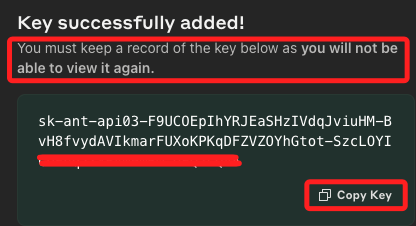
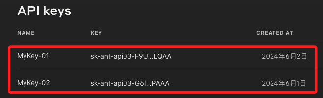

# 開始使用

_使用 Python 應用Claude_

<br>

## 取得金鑰

1. 進入 [官網](https://www.anthropic.com/)，切換到 API，點擊 `Get start now`。

    

<br>

2. 點擊 `Get APIkeys`。

    

<br>

3. 建立 `Create Key`。

    

<br>

4. 任意命名。

    

<br>

5. 複製金鑰，_切記_，這是唯一一次複製的機會。

    

<br>

6. 完成之後會看到列表，但是無法再窺探完整金鑰。

    

<br>

## 建立應用

_展示如何調用 Claude 的 API 進行文本生成，可根據具體需求調整 `prompt`、`max_tokens` 和其他參數來生成不同的文本內容。_

<br>

1. 安裝必要庫。

    ```bash
    # 處理 HTTP 請求
    pip install requests
    ```

<br>

2. 創建腳本。

    ```python
    import requests

    # 設置 API 金鑰
    API_KEY = 'your_api_key_here'

    # 設置 API 端點
    API_ENDPOINT = 'https://api.anthropic.com/claude/v1/generate'

    # 設置請求頭
    headers = {
        'Authorization': f'Bearer {API_KEY}',
        'Content-Type': 'application/json'
    }
    ```

<br>

3. 定義請求函數。

    ```python
    # 定義一個函數來發送請求並處理響應
    def generate_text(prompt, max_tokens=150):
        data = {
            'prompt': prompt,
            'max_tokens': max_tokens,
            'temperature': 0.7
        }

        response = requests.post(API_ENDPOINT, headers=headers, json=data)

        if response.status_code == 200:
            return response.json()['choices'][0]['text']
        else:
            raise Exception(f"Error: {response.status_code}, {response.text}")

    # 測試函數
    prompt = "寫一段關於人工智慧的短文。"
    generated_text = generate_text(prompt)
    print(generated_text)
    ```

<br>

4. 處理生成的文本。

    ```python
    # 收到了生成的文本後進行處理
    def main():
        prompt = "請介紹人工智慧的未來發展趨勢。"
        try:
            generated_text = generate_text(prompt)
            print("生成的文本：")
            print(generated_text)
        except Exception as e:
            print(e)

    if __name__ == "__main__":
        main()
    ```

<br>

## 完整腳本

1. 程式碼。
```python

```

<br>

___

_END_

