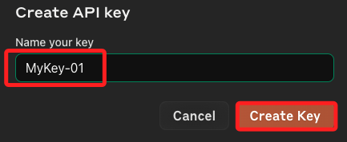
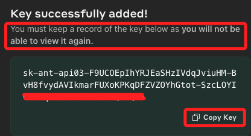
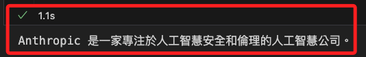

# 開始使用

_建立 Claude 應用_

<br>

## 取得金鑰

1. 進入 [官網](https://www.anthropic.com/)，切換到 API，點擊 `Get start now`。

    

<br>

2. 點擊 `Get APIkeys`。

    

<br>

3. 建立 `Create Key`。

    

<br>

4. 任意命名。

    

<br>

5. 複製金鑰，_切記_，這是唯一一次複製的機會。

    

<br>

6. 完成之後會看到列表，但是無法再窺探完整金鑰。

    

<br>

## 儲值

1. 操作過程中出現負的餘額，得先儲值才能用，先儲值了 $6 (@2024/06/01)。

    

<br>

2. 在 `Plans & billing` 頁籤中可以進行付費並查看相關內容。

    

<br>

3. 也可查看模型的計費資訊。

    

<br>

## 建立應用

_展示如何調用 Claude 的 API 進行文本生成，可根據具體需求調整 `prompt`、`max_tokens` 和其他參數來生成不同的文本內容。_

<br>

1. 安裝必要庫。

    ```bash
    # 處理 HTTP 請求
    pip install requests anthropic python-dotenv
    ```

<br>

2. 載入必要庫以及環境變數。

    ```python
    import anthropic
    import requests
    from dotenv import load_dotenv
    import os

    # 加載環境變量
    load_dotenv()

    # 設置 API 金鑰
    API_KEY = os.getenv('ANTHROP_API_KEY')
    ```

<br>

3. 建立操作實體。

    ```python
    # 創建 Anthropic 客戶端實例
    client = anthropic.Client(api_key=API_KEY)
    ```

<br>

4. 發送請求並輸出結果。

    ```python
    # 發送消息請求
    response = client.completions.create(
        # 使用支持的模型名稱
        model="claude-v1",
        max_tokens_to_sample=100,
        temperature=0.7,
        prompt="\n\nHuman:請用一句話介紹 Anthropic。\n\nAssistant:"
    )

    # 輸出生成的文本
    print(response.completion)
    ```

<br>

## Prompt

1. `Claude API` 使用 `\n\nHuman:` 和 `\n\nAssistant:` 格式來標示對話的角色，這種格式有助於模型區分 `人類用戶` 和 `助手` 的對話，從而生成更連貫和相關的回應。

    

<br>

2. 可參考 [Anthropic API 文檔](https://docs.anthropic.com/en/api/getting-started)。

<br>

## 完整腳本

1. 程式碼。

    ```python
    import anthropic
    import requests
    from dotenv import load_dotenv
    import os

    # 加載環境變量
    load_dotenv()

    # 設置 API 金鑰
    API_KEY = os.getenv('ANTHROP_API_KEY')

    # 創建 Anthropic 客戶端實例
    client = anthropic.Client(api_key=API_KEY)

    # 發送消息請求
    response = client.completions.create(
        # 使用支持的模型名稱
        model="claude-v1",
        max_tokens_to_sample=100,
        temperature=0.7,
        prompt="\n\nHuman:請用一句話介紹 Anthropic。\n\nAssistant:"
    )

    # 輸出生成的文本
    print(response.completion)

    ```

2. 結果。

    

<br>

___

_END_

