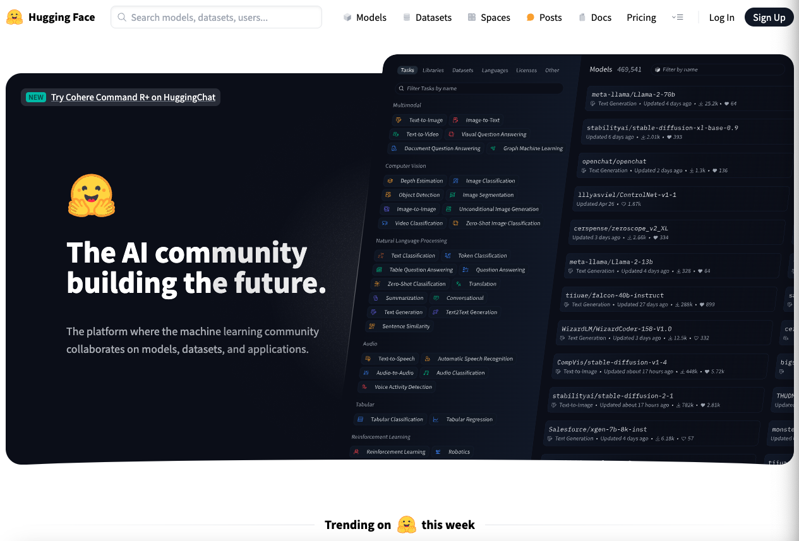
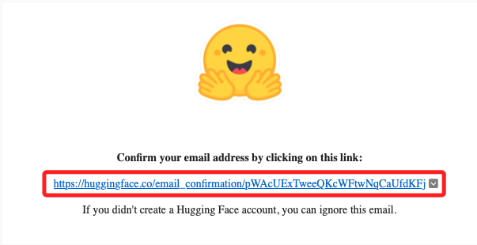
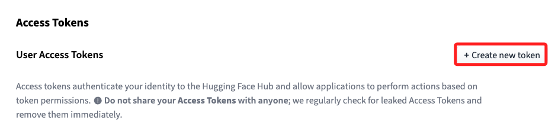

# 實作 Hugging Face 專案的步驟

<br>

# 註冊

1. 登入Huggine Face [官網入口](https://huggingface.co/)

    

<br>

2. 點擊 `Sign Up` 開始註冊，輸入 `Email` 及自訂密碼後點擊 `Next`。

    

<br>

3. 填寫基本資料後 `Create Account`。

    

<br>

4. 驗證。

    

<br>

5. 要進行 `郵件驗證` 才可完成註冊。

    

<br>

6. 若要建立新組織。

    

<br>

7. 填寫未註明 `Optional` 的部分。

    

<br>

## 建立環境

_建立並啟動虛擬環境 `envHuggingface`，細節省略_

<br>

## 安裝套件

_可使用 git 和 git-lfs 介面從 CLI 建立儲存庫，如果要從網站建立儲存庫，可以跳過這個步驟_

<br>

1. 安裝 Hugging Face 所需的核心套件。

    ```bash
    pip install huggingface_hub transformers
    ```

<br>

## 登入和配置

1. 如果已經登入，並且需要切換帳號，可以先登出。

    ```bash
    huggingface-cli logout
    ```

<br>

2. 先登入 [官網](Huggingface.co/settings/tokens) 建立令牌，細節可參考 `03_建立令牌`。

    

<br>

3. 登入 Hugging Face 帳號，在 CLI 中輸入 Token 完成登入。

    ```bash
    huggingface-cli login
    ```

<br>

4. 輸入 `Y` 進行登入。

    

<br>

5. 完成時會顯示儲存路徑。

    

<br>

## 建立和管理儲存庫

_可以根據實際需要選擇其中一個來建立儲存庫_

<br>

1. 如果要建立模型儲存庫。

    ```bash
    huggingface-cli repo create repo_name --type model
    ```

<br>

2. 如果要建立資料集儲存庫。

    ```bash
    huggingface-cli repo create repo_name --type dataset
    ```

<br>

3. 如果要建立一個空間儲存庫，例如用於 Gradio 或 Streamlit 應用程式。

    ```bash
    huggingface-cli repo create repo_name --type space
    ```

<br>

## 使用 git 和 git-lfs

1. 安裝並配置 git-lfs 來管理大文件，如模型權重，可 [參考](https://git-lfs.github.com)。

    ```bash
    git lfs install
    git clone https://huggingface.co/username/repo_name
    ```

<br>

2. 將本地模型文件儲存到指定目錄。

    ```python
    model.save_pretrained("./local_model_directory")
    tokenizer.save_pretrained("./local_model_directory")
    ```

<br>

3. 然後通過 git 提交並推送到儲存庫。

    ```bash
    git add .
    git commit -m "commit from $USER"
    git push
    ```

<br>

## 在程式中使用儲存庫

1. 從儲存庫加載模型和分詞器：使用 Hugging Face 的 transformers 庫來加載儲存於 Hugging Face 儲存庫中的模型和分詞器；如果儲存庫是私有的，使用 `use_auth_token=True` 參數。

    ```python
    from transformers import AutoTokenizer, AutoModel

    tokenizer = AutoTokenizer.from_pretrained("username/my_model_repo")
    model = AutoModel.from_pretrained("username/my_model_repo")
    ```

<br>

## 部署和管理模型

1. 建立新模型儲存庫，通過 Hugging Face 的網站介面來建立新模型，並將本地模型文件推送到新儲存庫。

    

<br>

2. 完成時顯示。

    

<br>

___

_END_