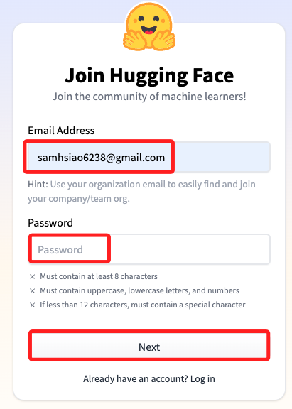
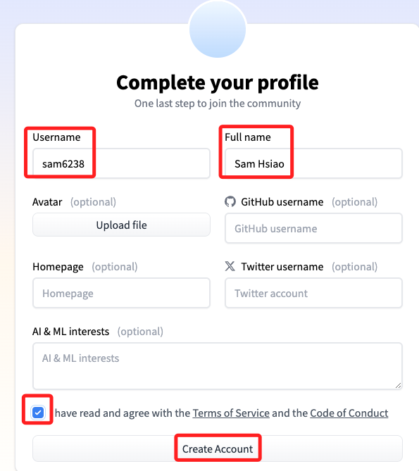
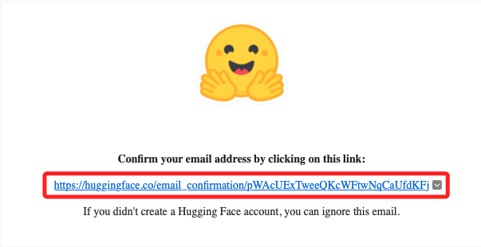
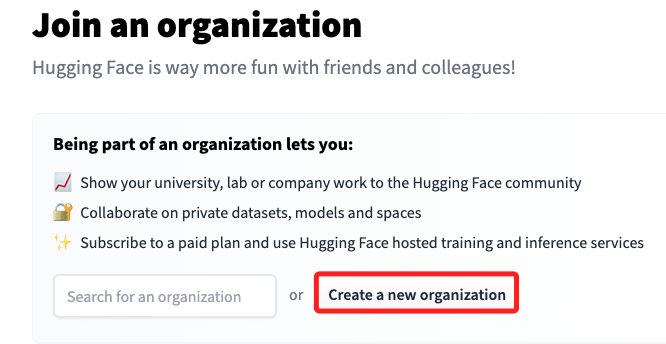
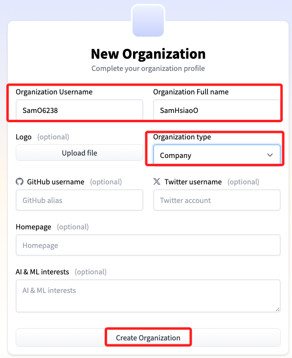
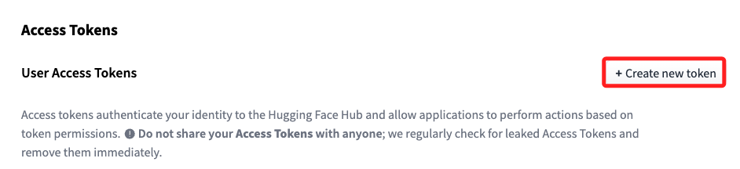
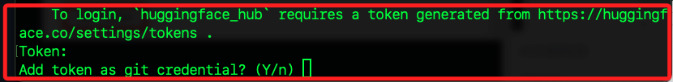
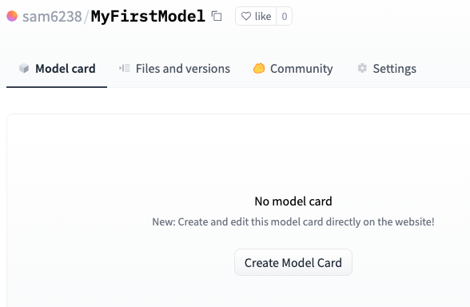

# 註冊

Huggine Face [官網入口](https://huggingface.co/)


<br>

## 步驟說明

1. 點擊 `Sign Up` 開始註冊，輸入 `Email` 及自訂密碼後點擊 `Next`。

    

<br>

2. 填寫基本資料後 `Create Account`。

    

<br>

3. 驗證。

    

<br>

4. 要進行 `郵件驗證` 才可完成註冊。

    

<br>

## 加入或建立組織

1. 若要建立新組織。

    

<br>

2. 填寫未註明 `Optional` 的部分。

    

<br>

## 建立環境

_建立並啟動虛擬環境 `envHuggingface`，細節省略_

<br>

## 官網特別說明

_可使用 git 和 git-lfs 介面從 CLI 建立儲存庫，如果要從網站建立儲存庫，可以跳過這個步驟_

<br>

1. 安裝套件。

    ```bash
    pip install huggingface_hub
    ```

<br>

2. 假如當前系統已經登入 `huggingface_hub`，可先登出。

    ```bash
    huggingface-cli logout
    ```

<br>

3. 假如還沒有 Token，可先登入 [官網](Huggingface.co/settings/tokens) 建立令牌，細節可參考 `03_建立令牌`。

    

<br>

4. 登入。

    ```bash
    huggingface-cli login
    ```

<br>

5. 輸入 `Y` 進行登入。

    

<br>

6. 完成時會顯示儲存路徑。

    

<br>

## 建立 Huggingface 模型

_可以根據實際需要選擇其中一個來建立儲存庫_

<br>

1. 如果要建立模型儲存庫。

    ```bash
    huggingface-cli repo create repo_name --type model
    ```

<br>

2. 如果要建立資料集儲存庫。

    ```bash
    huggingface-cli repo create repo_name --type dataset
    ```

<br>

3. 如果要建立一個空間儲存庫，例如用於 Gradio 或 Streamlit 應用程式。

    ```bash
    huggingface-cli repo create repo_name --type space
    ```

<br>

## git-lfs

1. 確保已經安裝了 git-lfs，可 [參考](https://git-lfs.github.com)。

    ```bash
    git lfs install
    git clone https://huggingface.co/username/repo_name
    ```

<br>

2. 然後添加、提交和推送您想要的任何文件，包括大型文件

    ```bash
    # 透過 `.save_pretrained()` 儲存檔案或將它們移至此處
    git add .
    git commit -m "commit from $USER"
    git push
    ```

<br>

3. 在大多數情況下，如果使用相容庫之一，則可以透過程式碼透過其識別碼存取儲存庫：<使用者名稱/儲存庫名稱>。

    ```bash
    tokenizer = AutoTokenizer.from_pretrained("username/repo_name")
    model = AutoModel.from_pretrained("username/repo_name")
    ```

<br>

## 建立 Huggingface 模型

1. 點擊 `Create a new model`。

    

<br>

2. 完成時顯示。

    

<br>

___

_END_