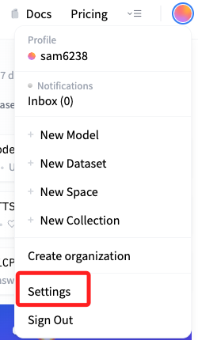
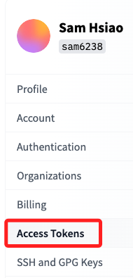
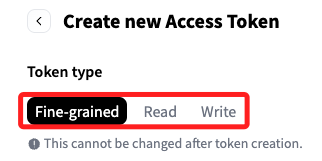
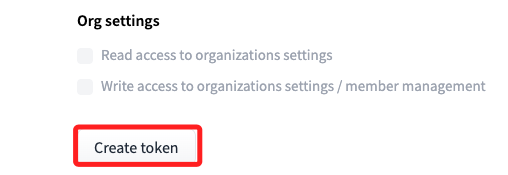

# 取得 Token

 

## 步驟說明 

1. 進入 [官網](https://huggingface.co/)，點擊右上角個人帳號後展開選單，點擊 `Settings`。

    

 

2. 點擊左側的 `Access Tokens` 進入設定 [頁面](https://huggingface.co/settings/tokens)。

    

 

3. 建立新的令牌 `New token`。

    

 

4. 命名、選擇類型，然後點擊生成 Token `Generate a token`。

    

 

5. 點擊 `New token` 完成建立令牌。

    

 

___

_END_