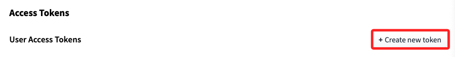

# 取得 Token

 

## 步驟說明 

1. 進入 [官網](https://huggingface.co/)，點擊右上角個人帳號後展開選單，點擊 `Settings`。

    

 

2. 點擊左側的 `Access Tokens` 進入設定 [頁面](https://huggingface.co/settings/tokens)。

    

 

3. 建立新的令牌 `New token`。

    

 

4. 命名、選擇類型，然後點擊生成 Token `Generate a token`。

    

 

5. 點擊 `New token` 完成建立令牌。

    

 

## 必須勾選的項目

1. Repositories

    1) Read access to contents of all repos under your personal namespace：這是基本的讀取權限，允許訪問個人命名空間下的儲存庫內容。
    
    2) Write access to contents/settings of all repos under your personal namespace：這是必須的權限，允許在個人命名空間下的儲存庫中進行寫入和配置更改。這是創建、更新和推送模型到 Hugging Face 平台所必須的權限。

 

2. Inference

    1) Make calls to the serverless Inference API：如果需要使用推論 API，可以選擇這個選項，但這對於創建和推送模型不是必須的。

    2) Make calls to Inference Endpoints：如果需要管理推論端點，可以選擇這個選項，但這對於創建和推送模型也不是必須的。

    3) Manage Inference Endpoints：如果需要管理推論端點，可以選擇這個選項，但這對於創建和推送模型也不是必須的。

 

3. Webhooks（可選）

    1) Create and manage webhooks：如果需要管理 Webhooks，可以選擇這個選項，但這對於創建和推送模型也不是必須的。

 

4. Collections（可選）

    1) Read access to all collections under your personal namespace：如果有集合管理需求，可以選擇這個選項。

    2) Write access to all collections under your personal namespace：如果需要管理集合，可以選擇這個選項。

 

5. Discussions & Posts（可選）

    1) Interact with discussions / Open PRs on repos under your personal namespace：如果需要參與討論或提交 pull requests，可以選擇這個選項。

 

## 必須勾選的最小配置

_這些項目是最小必須的配置，以確保能夠創建、寫入和管理個人命名空間下的模型儲存庫。_

 

1. Read access to contents of all repos under your personal namespace

 

2. Write access to contents/settings of all repos under your personal namespace

 

## 其他注意事項

1. Org permissions：如果需要在組織的命名空間下進行操作，則需要相應的組織權限。但如果只是操作個人命名空間，則不需要特別設置。

 

2. 完成這些選擇後，生成 API token 並使用 `huggingface-cli login` 來配置這個 token，然後應該能夠順利創建和管理的模型儲存庫。

 

___

_END_