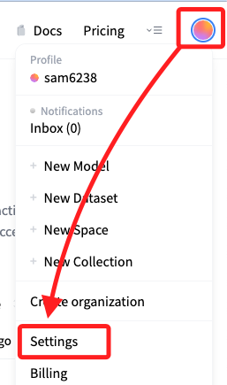
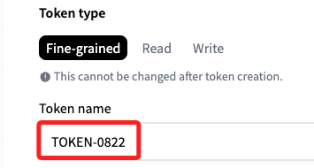
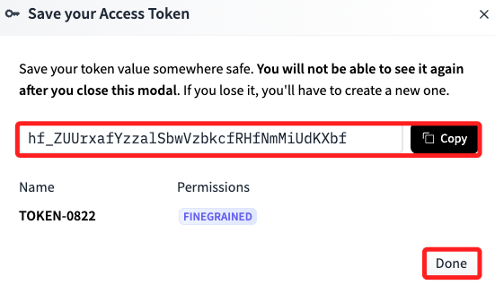
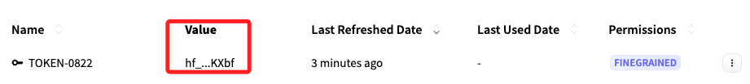
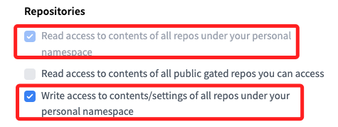

# 取得 Token

 

## 步驟說明 

1. 進入 [官網](https://huggingface.co/)，點擊右上角個人帳號後展開選單，點擊 `Settings`。

    

 

2. 點擊左側的 `Access Tokens` 進入 Tokens 的設定 [頁面](https://huggingface.co/settings/tokens)。

    

 

3. 點擊 `Create new token` 建立新的令牌。

    

 

4. 選擇令牌類型，`Fine-grained` 是客製細項設定，Read 及 Write 分別是讀寫的令牌。

    

 

5. 接著命名，比如這裡命名為 `TOKEN-0822`。

    

 

_注意，細項的部分先省略，在後面補充_

 

6. 點擊最下方的 `Create token` 完成建立令牌。

    

 

7. 跳出視窗提示 `Save your Access Token`，複製之後點擊 `Done`。

    

 

8. 務必記得複製保存 Token，因為之後將無法再次查看。

    

 

## 細部設定

_若選擇 `Fine-grained` 進行細部設定_

1. Repositories

    1) Read access to contents of all repos under your personal namespace：這是基本的讀取權限，允許訪問個人命名空間下的儲存庫內容。
    
    2) Write access to contents/settings of all repos under your personal namespace：允許在個人命名空間下的儲存庫中進行寫入和配置更改，這在建立、更新和推送模型到 Hugging Face 平台時所需的權限；勾選這個項目時，會自動勾選 `Read access to contents of all repos under your personal namespace`。

    

 

2. Inference

    1) Make calls to the serverless Inference API：如果需要使用推論 API，可以選擇這個選項，但這對於建立和推送模型不是必須的。

    2) Make calls to Inference Endpoints：如果需要管理推論端點，可以選擇這個選項，但這對於建立和推送模型也不是必須的。

    3) Manage Inference Endpoints：如果需要管理推論端點，可以選擇這個選項，但這對於建立和推送模型也不是必須的。

 

3. Webhooks（可選）

    1) Access webhooks data

    2) Create and manage webhooks：如果需要管理 Webhooks，可以選擇這個選項，但這對於建立和推送模型也不是必須的。

 

4. Collections（可選）

    1) Read access to all collections under your personal namespace：如果有集合管理需求，可以選擇這個選項。

    2) Write access to all collections under your personal namespace：如果需要管理集合，可以選擇這個選項。

 

5. Discussions & Posts（可選）

    1) Interact with discussions / Open PRs on repos under your personal namespace：如果需要參與討論或提交 pull requests，可以選擇這個選項。

 

## 其他事項

1. Org permissions：如果需要在組織的命名空間下進行操作，則需要相應的組織權限，但如果只是操作個人命名空間，則不需要特別設置。

 

2. 完成這些選擇後，生成 API token 並使用 `huggingface-cli login` 來配置這個 token，然後應該能夠順利建立和管理的模型儲存庫。

 

___

_END_