# pipeline

_更多關於 `transformers` 庫的 `pipeline` 說明可參考 [Hugging Face Transformers 文檔](https://huggingface.co/transformers/main_classes/pipelines.html) 。_

<br>

## 說明

1. `Transformers` 提供 API 和工具下載和訓練最先進的預訓練模型。

2. `pipeline` 可使用 `Hugging Face Hub` 的模型進行推理，支持多種語言、計算機視覺、語音和多模態任務。

3. 以下分做各種應用情境進行範例展示，包含了 `自動語音識別`、`圖像分類`、`自然語言處理`、`多模態` 以及結合 `Gradio` 製作網頁應用。 

<br>

## 自動語音識別 (ASR)

1. 安裝工具，這是要讀取音檔使用的工具。

    ```bash
    brew install ffmpeg
    ```

<br>

2. 程式碼：推薦使用 OpenAI 的 Whisper 模型來進行語音識別。

    ```python
    from transformers import pipeline

    # 推薦使用 Whisper ，這個模型在多語言和不同口音的語音識別任務中表現更好
    transcriber = pipeline(model="openai/whisper-large-v2")

    # 轉換
    result = transcriber("demo.flac")

    # 輸出
    print(result['text'])
    ```

<br>

3. 運行後會下載模型及相關文件。

    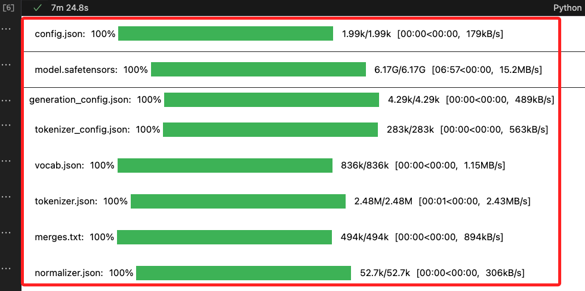

<br>

4. 透過腳本可查詢上述模型緩存的位置。

    ```python
    from transformers import TRANSFORMERS_CACHE

    print(f"緩存位置在：{TRANSFORMERS_CACHE}")
    ```

    _輸出_

    ```bash
    緩存位置在：/Users/samhsiao/.cache/huggingface/hub
    ```

<br>

5. 查詢 `ls ~/.cache/huggingface/hub`。

    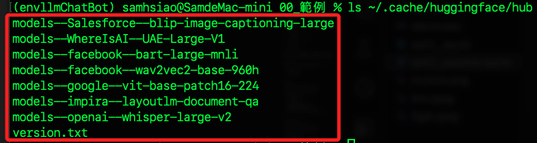

<br>

6. 一次處理多個音頻輸入。

    ```python
    from transformers import pipeline

    # 推薦使用 Whisper ，這個模型在多語言和不同口音的語音識別任務中表現更好
    transcriber = pipeline(model="openai/whisper-large-v2")

    # 轉換
    results = transcriber(
        ["demo.wav", "demo.flac"]
    )
    # 遍歷結果並打印
    for result in results:
        print(result['text'])
    ```

<br>

7. 正確辨識並輸出為中文。

    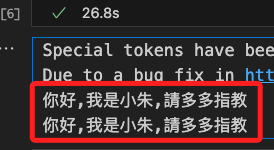

<br>

## 設置設備

1. 指定使用 GPU。

    ```python
    transcriber = pipeline(
        model="openai/whisper-large-v2",
        device=0
    )
    ```

<br>

2. `MacOS` 目前尚不可用。

    ```bash
    NotImplementedError: The operator 'aten::isin.Tensor_Tensor_out' is not currently implemented for the MPS device. If you want this op to be added in priority during the prototype phase of this feature, please comment on https://github.com/pytorch/pytorch/issues/77764. As a temporary fix, you can set the environment variable `PYTORCH_ENABLE_MPS_FALLBACK=1` to use the CPU as a fallback for this op. WARNING: this will be slower than running natively on MPS.
    ```

<br>

## 自動配置模型權重以適應多個設備

1. 安裝套件。

    ```bash
    pip install accelerate
    ```

<br>

2. 程式碼。

    ```python
    transcriber = pipeline(
        model="openai/whisper-large-v2",
        device_map="auto"
    )
    ```

<br>

3. 同樣目前不支援 MacOS。

    ```bash
    NotImplementedError: The operator 'aten::isin.Tensor_Tensor_out' is not currently implemented for the MPS device. If you want this op to be added in priority during the prototype phase of this feature, please comment on https://github.com/pytorch/pytorch/issues/77764. As a temporary fix, you can set the environment variable `PYTORCH_ENABLE_MPS_FALLBACK=1` to use the CPU as a fallback for this op. WARNING: this will be slower than running natively on MPS.
    ```

<br>

## 設置批次大小

1. 設置批次大小以提高推理速度。

    ```python
    transcriber = pipeline(
        model="openai/whisper-large-v2",
        batch_size=2
    )
    #
    result = transcriber("demo.flac")
    #
    print(result['text'])
    ```

<br>

2. 設置前 `20.1s`。

    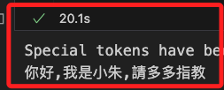

<br>

3. 設置 `batch_size=2` 後為 `19.2s`。

    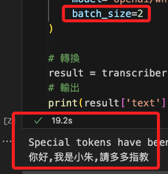

<br>

4. 設置為 `5` 的表現是 `19.1s`。

    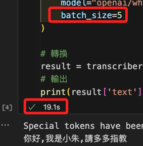

<br>

5. 設定為 `4` 的時候是 `15.6s`，效能最佳。

    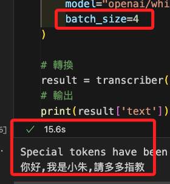

<br>

6. 設置為 `8` 的表現是 `17.5s`。

    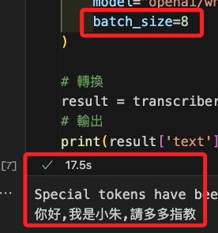

<br>

7. 批次大小的設置對於模型推理速度有一定影響，但這並不總是線性增長的，增大時可能會減少單個輸入的延遲時間，但也需要考慮整體的吞吐量，過大時也可能導致每個批次處理時間過長，從而增加總體延遲，另外，相同的批次也不一定會得到相同得執行時間結果。

<br>

## 處理大數據集

1. 假設有一個數據集包含了 `1000` 筆數據，透過定義數據生成器來 _逐條輸出 `my_data` 中的音檔，以便逐條處理，節省內存_ 。

    ```python
    # 定義數據生成器
    def data_generator(data):
        for item in data:
            yield item
    ```

<br>

2. 代碼。

    ```python
    from transformers import pipeline

    # 假設 my_data 是一個包含 1000 筆文本數據的列表
    my_data = [f"My example {i}" for i in range(1000)]

    # 創建 GPT-2 文本生成 pipeline
    pipe = pipeline(model="openai-community/gpt2")

    # 定義數據生成器
    def data_generator(data):
        for item in data:
            yield item

    # 使用 pipeline 處理數據生成器
    generated_characters = 0
    for output in pipe(data_generator(my_data)):
        # 假設輸出是包含生成文本的字典
        generated_text = output['generated_text']
        generated_characters += len(generated_text)

    print(f"Total generated characters: {generated_characters}")

    ```

<br>

3. 這種情境在處理文本時也是一樣。

    ```python
    from transformers import pipeline

    # 假設 my_data 是一個包含 1000 筆文本數據的列表
    my_data = [f"My example {i}" for i in range(1000)]

    # 創建 GPT-2 文本生成 pipeline
    pipe = pipeline(model="openai-community/gpt2")

    # 定義數據生成器
    def data_generator(data):
        for item in data:
            yield item

    # 使用 pipeline 處理數據生成器
    generated_characters = 0
    for output in pipe(data_generator(my_data)):
        # 假設輸出是包含生成文本的字典
        generated_text = output['generated_text']
        generated_characters += len(generated_text)

    print(f"Total generated characters: {generated_characters}")
    ```

<br>

## 圖像分類

1. 使用圖像分類 pipeline 來分類圖像，同樣地，這也需要下載模型。

    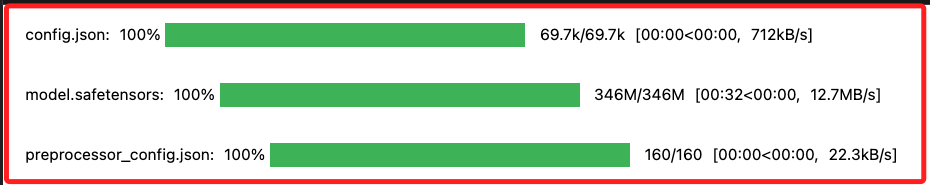

<br>

2. 提供一張相片。

    

<br>

3. 程式碼。

    ```python
    from transformers import pipeline

    vision_classifier = pipeline(
        model="google/vit-base-patch16-224"
    )

    results = vision_classifier(images="tiger.jpeg")
    # 優化輸出格式
    formatted_results = [
        {"Label": result["label"], "Confidence": round(result["score"], 4)}
        for result in results
    ]
    # 輸出結果
    for res in formatted_results:
        print(f"Label: {res['Label']}, Confidence: {res['Confidence']}")
    ```

<br>

4. 輸出結果。

    ```bash
    Label: tiger, Panthera tigris, Confidence: 0.959
    Label: tiger cat, Confidence: 0.0306
    Label: jaguar, panther, Panthera onca, Felis onca, Confidence: 0.0028
    Label: leopard, Panthera pardus, Confidence: 0.0017
    Label: lion, king of beasts, Panthera leo, Confidence: 0.0011
    ```

<br>

5. 多張相片。

    

<br>

6. 順便補充一下展示多張相片的腳本。

    ```python
    from PIL import Image, ImageDraw, ImageFont

    # 圖片文件路徑和標註名稱
    image_files = [
        ("tiger.jpeg", "Tiger"),
        ("lion.jpeg", "Lion"),
        ("cat.jpeg", "Cat")
    ]

    # 設定統一的圖片大小
    target_size = 300

    # 定義函數來調整和裁剪圖片
    def resize_and_crop(image, size):
        width, height = image.size
        # 取最小邊作為裁剪基準
        new_size = min(width, height)
        left = (width - new_size) / 2
        top = (height - new_size) / 2
        right = (width + new_size) / 2
        bottom = (height + new_size) / 2

        # 裁剪圖片
        image = image.crop((left, top, right, bottom))
        # 調整圖片大小
        image = image.resize((size, size), Image.ANTIALIAS)
        return image

    # 打開所有圖片並調整大小
    images = [
        resize_and_crop(Image.open(file), target_size)
        for file, _ in image_files
    ]

    # 計算總寬度和最大高度
    total_width = target_size * len(images)
    max_height = target_size

    # 創建一個新的空白圖像（考慮到標註文字的高度）
    combined_image = Image.new(
        'RGB',
        (total_width, max_height + 30),
        (255, 255, 255)
    )

    # 設置字體（你可以選擇系統中的其他字體）
    font = ImageFont.load_default()

    # 初始化繪圖對象
    draw = ImageDraw.Draw(combined_image)

    # 將每張圖片貼到新圖像上
    x_offset = 0
    for img, (file, name) in zip(images, image_files):
        combined_image.paste(img, (x_offset, 0))
        draw.text(
            (x_offset + target_size // 2 - font.getsize(name)[0] // 2, max_height + 5),
            name,
            font=font,
            fill=(0, 0, 0)
        )
        x_offset += target_size

    # 保存最終合成的圖像
    combined_image.save('combined_image.jpeg')

    # 顯示合成的圖像
    combined_image.show()

    ```

<br>

7. 判斷多張相片的程式碼。

    ```python
    from transformers import pipeline

    # 創建圖像分類的 pipeline
    vision_classifier = pipeline(model="google/vit-base-patch16-224")

    # 處理多張圖像
    image_files = ["tiger.jpeg", "lion.jpeg", "cat.jpeg"]
    results = vision_classifier(images=image_files)

    # 優化輸出格式
    for i, image_results in enumerate(results):
        print(f"Results for {image_files[i]}:")
        formatted_results = [
            {"Label": result["label"], "Confidence": round(result["score"], 4)}
            for result in image_results
        ]
        for res in formatted_results:
            print(f"  Label: {res['Label']}, Confidence: {res['Confidence']}")
        # 添加一個空行以便區分不同圖片的結果
        print()
    ```

<br>

8. 結果。

    ```bash
    Results for tiger.jpeg:
    Label: tiger, Panthera tigris, Confidence: 0.959
    Label: tiger cat, Confidence: 0.0306
    Label: jaguar, panther, Panthera onca, Felis onca, Confidence: 0.0028
    Label: leopard, Panthera pardus, Confidence: 0.0017
    Label: lion, king of beasts, Panthera leo, Confidence: 0.0011

    Results for lion.jpeg:
    Label: lion, king of beasts, Panthera leo, Confidence: 0.758
    Label: leopard, Panthera pardus, Confidence: 0.0372
    Label: cougar, puma, catamount, mountain lion, painter, panther, Felis concolor, Confidence: 0.0365
    Label: lynx, catamount, Confidence: 0.0261
    Label: cheetah, chetah, Acinonyx jubatus, Confidence: 0.0248

    Results for cat.jpeg:
    Label: Egyptian cat, Confidence: 0.669
    Label: tabby, tabby cat, Confidence: 0.1815
    Label: tiger cat, Confidence: 0.1011
    Label: lynx, catamount, Confidence: 0.0097
    Label: Persian cat, Confidence: 0.0073
    ```

<br>

## 自然語言處理

1. 使用 `Hugging Face` 的 `transformers` 庫和 `facebook/bart-large-mnli` 模型進行 `文本分類`，特別是 `多標籤文本分類`，目的是根據模型的預測給出每個標籤的相關性分數。

<br>

2. `candidate_labels` 是一組預定義的標籤，代表文本可能屬於的不同類別，模型會分析文本並判斷它與每個標籤的相關性。

<br>

3. 執行後同樣會下載模型。

    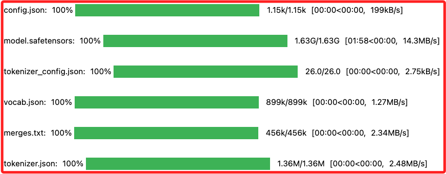

<br>

4. 程式碼。

    ```python
    from transformers import pipeline

    classifier = pipeline(
        model="facebook/bart-large-mnli"
    )
    result = classifier(
        "I have a problem with my iPhone and need it fixed ASAP!",
        candidate_labels=[
            "urgent", "not urgent", "phone", "tablet", "computer"
        ]
    )
    # 格式化輸出結果
    # 檢查結果格式是否為字典，然後提取每個標籤及其對應的分數
    if isinstance(result, dict):
        formatted_results = sorted(
            [
                # 根據分數對結果進行排序並四捨五入，以便顯示最相關的標籤
                {"label": label, "score": round(score, 4)}
                for label, score in zip(result["labels"], result["scores"])
            ],
            key=lambda x: x["score"],
            reverse=True
        )

        # 打印格式化的結果
        print("分類結果：")
        for res in formatted_results:
            print(f"Label: {res['label']}, Score: {res['score']}")
    else:
        print("Unexpected result format:", result)
    ```

<br>

5. 結果：最有可能屬於 `phone` 和 `urgent` 類別。

    ```bash
    分類結果：
    Label: urgent, Score: 0.6274
    Label: phone, Score: 0.365
    Label: computer, Score: 0.0037
    Label: not urgent, Score: 0.0027
    Label: tablet, Score: 0.0012
    ```

<br>

## 多模態

1. 先安裝 Tesseract OCR 引擎，Windows 系統 [透過安裝包安裝](https://github.com/UB-Mannheim/tesseract/wiki)。

    ```bash
    # MacOS
    brew install tesseract
    ```

<br>

2. 然後安裝 Python 包。

    ```bash
    pip install pytesseract
    ```

<br>

3. 使用視覺問答 (VQA) 模型來回答關於圖像的問題，腳本會自動下載模型。

    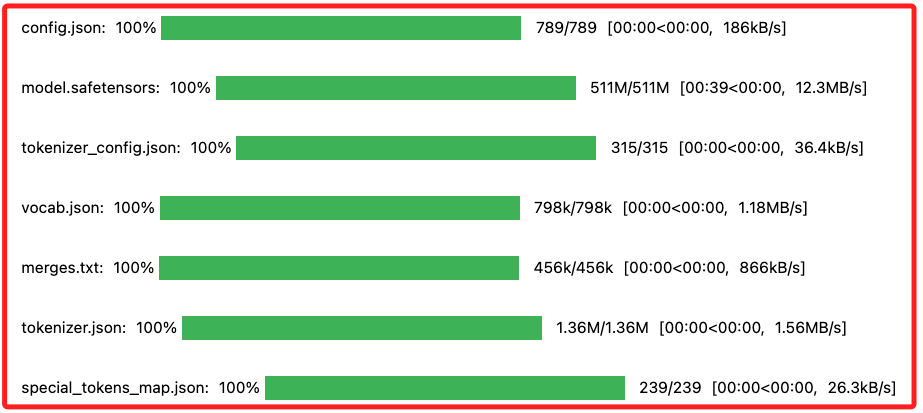

<br>

4. 程式碼。

    ```python
    from transformers import pipeline

    # 確保你已經安裝了 pytesseract
    import pytesseract

    # 創建文件問答的 pipeline
    vqa = pipeline(model="impira/layoutlm-document-qa")

    # 處理圖片並提出問題
    result = vqa(
        image="invoice.png",
        question="請問這一張發票的號碼？"
    )

    # 格式化輸出結果
    if result:
        for answer in result:
            text = answer.get('answer', 'N/A')
            confidence = answer.get('score', 'N/A')
            start = answer.get('start', 'N/A')
            end = answer.get('end', 'N/A')
            print(
                f"Answer: {text}\nConfidence: {confidence}\n"
                f"start: {start}\nend: {end}\n"
            )
    else:
        print("No answer found.")
    ```

<br>

5. 結果，其中的 `start` 和 `end` 參數表示答案在文本中的起始和結束位置，這些位置是指字串在整個文本中的索引。

    ```bash
    Answer: us-001
    Confidence: 0.0035401417408138514
    start: 15
    end: 15
    ```

<br>

6. 多個問題。

    ```python
    from transformers import pipeline

    # 確保你已經安裝了 pytesseract
    import pytesseract

    # 創建文件問答的 pipeline
    vqa = pipeline(model="impira/layoutlm-document-qa")

    # 定義圖片和問題組
    image_path = "invoice.png"
    questions = [
        "請問 Bill To 誰？",
        "請問 Invoice Date？",
        "請問 Invoice Number？"
    ]

    # 處理每個問題並格式化輸出結果
    for question in questions:
        result = vqa(image=image_path, question=question)

        if result:
            print(f"Question: {question}")
            for answer in result:
                text = answer.get('answer', 'N/A')
                confidence = answer.get('score', 'N/A')
                start = answer.get('start', 'N/A')
                end = answer.get('end', 'N/A')
                print(
                    f"Answer: {text}\nConfidence: {confidence}\n"
                    f"Start: {start}\nEnd: {end}\n"
                )
        else:
            print(f"No answer found for question: {question}")
        # 分隔不同問題的結果
        print("\n" + "="*50 + "\n")
    ```

<br>

7. 結果。

    ```bash
    Question: 請問 Bill To 誰？
    Answer: John Smith
    Confidence: 0.9599351286888123
    Start: 16
    End: 17


    ==================================================

    Question: 請問 Invoice Date？
    Answer: 1102/2019
    Confidence: 0.9988793730735779
    Start: 22
    End: 22


    ==================================================

    Question: 請問 Invoice Number？
    Answer: us-001
    Confidence: 0.9999278783798218
    Start: 15
    End: 15


    ==================================================
    ```

<br>

## 在 Gradio 上創建 Web 應用

1. 安裝包。

    ```bash
    pip install gradio
    ```

<br>

2. 使用 Gradio 創建網頁應用。

    ```python
    import gradio as gr
    from transformers import pipeline

    pipe = pipeline(
        "image-classification",
        model="google/vit-base-patch16-224"
    )
    gr.Interface.from_pipeline(pipe).launch()
    ```

<br>

3. 在瀏覽器中開啟 `http://127.0.0.1:7860/`。

    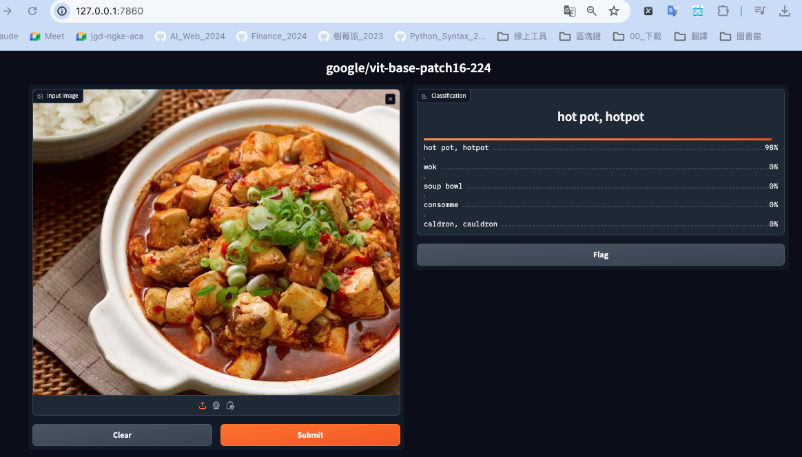

<br>

___

_END_