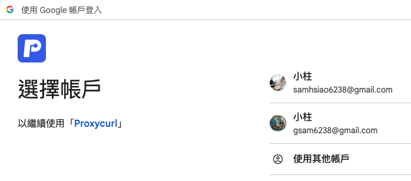
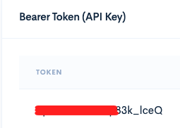
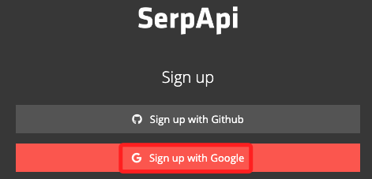
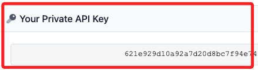
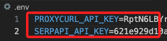
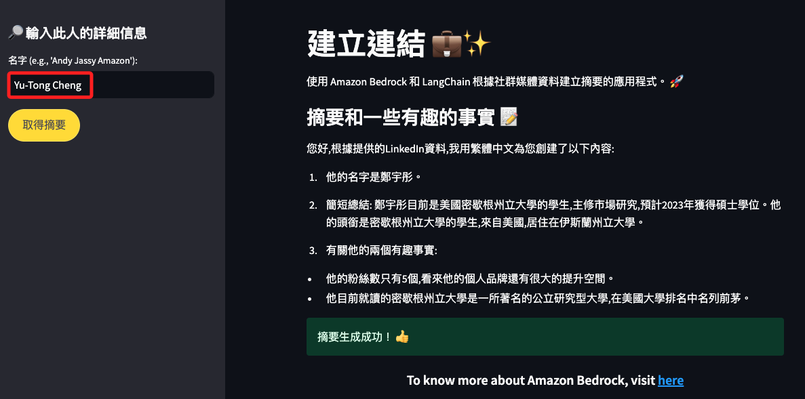

# 建立連結

_利用 Amazon Bedrock 和 LangChain 的 Streamlit 應用程式_

<br>

_我個人覺得這個專案很雞肋，實用性、可用性都極低，但其中涉及一些服務的應用，所以這裡還是演繹一下。_

<br>

## 說明

1. 這個範例可透過輸入某人姓名後搜尋其在 LinkedIn 個人資料，然後提供有關該人的簡潔摘要。

<br>

2. 程序是透過 `Amazon Bedrock` 進行深入研究數據並得出有意義的見解。

<br>

3. 另外使用 LangChain 作為語言處理，使得程式可以從 LinkedIn 詳細資訊中得出清晰的摘要。

<br>

## 取得 Proxycurl API Key

_Proxycurl 是一個專門用於獲取 LinkedIn 資料的 API_

<br>

1. 進入 [Proxycurl 註冊頁面](https://nubela.co/proxycurl/#/signup) 並創建一個新帳戶。

    

<br>

2. 可選擇 Google 帳號。

    

<br>

3. 進入後可取得 API Key。

    

<br>

## 取得 SerpAPI API Key

_SerpAPI 是一個搜索引擎結果頁面 (SERP) 的 API_

<br>

1. 訪問 [SerpAPI 註冊頁面](https://serpapi.com/users/sign_up) 並創建一個新帳戶。

    

<br>

2. 進入就會看到 API Key。

    

<br>

## 步驟

1. 要在 `.env` 中寫入 Proxycurl and Serpa API Key。

    ```bash
    PROXYCURL_API_KEY=<YOUR API KEY>
    SERPAPI_API_KEY=<YOUR API KEY>
    ```

<br>

2. 將前面步驟取得的兩個密鑰都寫入 `.env`

    

<br>

3. 安裝腳本所需套件。

    ```bash
    pip install -r requirements.txt
    ```

<br>

4. 啟動服務。

    ```bash
    streamlit run app.py
    ```

<br>

## 排除錯誤

1. 正在使用的 LangChain 庫中的一些類和方法已被棄用。

<br>

2. LinkedIn 查找代理沒有有效的工具來抓取 LinkedIn 資料。

<br>

## 更新 LangChain 的導入和使用

1. `Bedrock` 應從 `langchain_community.llms` 導入，而 `LLMChain` 應該使用 `RunnableSequence`。

<br>

2. 需要確保 `lookup` 函數和 `scrape_linkedin_profile` 函數正確工作並返回有效的 LinkedIn URL 和資料。

<br>

## 完整腳本

_修改後的_

<br>

1. 專案結構。

    ```bash
    .
    ├── agents
    │   └── linkedin_lookup_agent.py
    ├── app.py
    ├── requirements.txt
    ├── third_parties
    │   └── linkedin.py
    └── tools
        └── tools.py
    ```

<br>

2. app.py

    ```python
    import os
    from dotenv import load_dotenv
    import streamlit as st
    from langchain_core.prompts import PromptTemplate
    from langchain_aws import BedrockLLM
    # 導入自訂庫
    from third_parties.linkedin import scrape_linkedin_profile
    # 導入自訂庫中的 lookup，並使用別名 lookup_agent
    from agents.linkedin_lookup_agent import lookup as lookup_agent

    # 加載環境變量
    load_dotenv()


    def get_llm():
        bedrock_llm = BedrockLLM(
            # 模型
            model_id="anthropic.claude-v2",
            # 區域
            region_name=os.getenv("AWS_REGION"),
            # 模型參數
            model_kwargs={
                "temperature": 0.1,
                "max_tokens_to_sample": 4096},
        )
        return bedrock_llm


    def ice_break_with(name: str):
        # 調用自訂函數
        linkedin_profile_url = lookup_agent(name=name)
        if not linkedin_profile_url:
            return "未能找到該人的 LinkedIn 資料。"

        linkedin_data = scrape_linkedin_profile(
            linkedin_profile_url=linkedin_profile_url
        )
        if not linkedin_data:
            return "未能抓取該人的 LinkedIn 資料。"

        summary_template = """
        鑑於有關某人的 LinkedIn 資訊 {information}，請創建以下內容，並用繁體中文回答：
        1. 先介紹他的名字
        2. 簡短總結
        2. 關於他的兩個有趣的事實
        """

        summary_prompt_template = PromptTemplate(
            input_variables=["information"],
            template=summary_template,
        )

        llm = get_llm()
        chain = summary_prompt_template | llm

        result = chain.invoke({"information": linkedin_data})
        return result


    def main():
        st.title("建立連結 💼✨")
        st.write("使用 Amazon Bedrock 和 LangChain 根據社群媒體資料建立摘要的應用程式。 🚀")

        st.sidebar.header("🔎 輸入此人的詳細信息")
        name = st.sidebar.text_input("名字 (e.g., 'Andy Jassy Amazon'):")

        if st.sidebar.button("取得摘要"):
            with st.spinner("取得 LinkedIn 數據並建立摘要... 🔄"):
                result = ice_break_with(name)
            st.subheader("摘要和一些有趣的事實 📝")
            st.write(result)
            st.success("摘要生成成功！ 👍")

            st.markdown(
                "<h3 style='text-align: center; font-size: 20px;'>"
                " To know more about Amazon Bedrock, visit"
                " <a href='https://aws.amazon.com/bedrock/'"
                " target='_blank'>here</a> </h3>",
                unsafe_allow_html=True,
            )

        st.markdown(
            """
            <style>
                body {
                    color: #4f4f4f;
                    background-color: #F5F5F5;
                }
                .stButton>button {
                    color: #4f4f4f;
                    background-color: #FFD700;
                    border-radius: 30px;
                    padding: 10px 20px;
                    font-size: 1.2em;
                }
            </style>
        """,
            unsafe_allow_html=True,
        )


    if __name__ == "__main__":
        load_dotenv()
        main()

    ```

<br>

3. linkedin_lookup_agent.py

    ```python
    from tools.tools import get_profile_url
    from dotenv import load_dotenv
    from langchain.prompts import PromptTemplate
    from langchain.llms.bedrock import Bedrock
    from langchain.agents import initialize_agent, Tool, AgentType


    def get_llm():
        bedrock_llm = Bedrock(
            model_id="anthropic.claude-v2",
            model_kwargs={
                "temperature": 0.1,
                "max_tokens_to_sample": 4096
            }
        )
        return bedrock_llm


    # 搜尋，使用一個佔位符 `name_of_person`
    def lookup(name: str) -> str:
        load_dotenv()
        # 建立模板字串
        template = """
        請使用全名 {name_of_person} LinkedIn 進行搜尋，給我一個指向這個人的 LinkedIn 個人資料頁面的連結。
        你的答案必須僅包含 LinkedIn 個人資料的 URL。
        """

        tools_for_agent = [
            Tool(
                name="Crawl Google 4 linkedin profile page",
                func=get_profile_url,
                description="useful for when you need get the LinkedIn Page URL",
            ),
        ]
        # 建立 LLM 物件
        llm = get_llm()
        # 建立 langchain.agents 物件
        agent_chain = initialize_agent(
            tools_for_agent,
            llm,
            agent=AgentType.ZERO_SHOT_REACT_DESCRIPTION,
            verbose=True
        )
        # 建立模板對象，使用模板字串 `template`
        prompt_template = PromptTemplate(
            input_variables=["name_of_person"],
            template=template
        )

        # 取的 LLM 的輸出
        try:
            # 透過 angchain.agents 物件執行 LLM
            linkedin_username = agent_chain.run(
                handle_parsing_errors=True,
                # 輸入
                input=prompt_template.format_prompt(
                    name_of_person=f"{name} LinkedIn"
                )
            )
        except ValueError as e:
            print("解析 LLM 發生錯誤：", e)
            return None

        return linkedin_username

    ```

<br>

4. linkedin.py

    ```python
    import os
    import requests


    def scrape_linkedin_profile(linkedin_profile_url):
        """scrape information from LinkedIn profiles,
        Manually scrape the information from the LinkedIn profile"""
        api_endpoint = "https://nubela.co/proxycurl/api/v2/linkedin"
        header_dic = {
            "Authorization": f'Bearer {os.environ.get("PROXYCURL_API_KEY")}'
        }

        # For production
        response = requests.get(
            api_endpoint, params={"url": linkedin_profile_url}, headers=header_dic
        )

        data = response.json()
        data = {
            k: v
            for k, v in data.items()
            if v not in ([], "", "", None) and k
            not in [
                "people_also_viewed",
                "certifications",
                "accomplishment_publications",
                "accomplishment_honors_awards",
                "accomplishment_projects",
            ]
        }
        if data.get("groups"):
            for group_dict in data.get("groups"):
                group_dict.pop("profile_pic_url")

        return data

    ```

<br>

5. tools.py

    ```python
    from langchain.utilities import SerpAPIWrapper
    import requests


    class CustomSerpAPIWrapper(SerpAPIWrapper):
        def __init__(self):
            super(CustomSerpAPIWrapper, self).__init__()

        @staticmethod
        def _process_response(res: dict) -> str:
            """Process response from SerpAPI."""
            if "error" in res.keys():
                raise ValueError(f"Got error from SerpAPI: {res['error']}")
            if "organic_results" in res.keys():
                for result in res["organic_results"]:
                    if "linkedin.com/in/" in result["link"]:
                        return result["link"]
            return "No good search result found"


    def get_profile_url(name: str):
        """搜尋 Linkedin 或 Twitter 個人資料頁面"""
        search = CustomSerpAPIWrapper()
        res = search.run(f"{name} LinkedIn site:linkedin.com")

        # 檢查帶有輸入名稱的直接 URL 是否有效
        direct_url = f"https://tw.linkedin.com/in/{name}"
        response = requests.get(direct_url)
        if response.status_code == 200:
            return direct_url

        return res

    ```

<br>

## 運行後

1. 輸入名義後點擊 `取得摘要`。

    

<br>

2. 結果。

    

<br>

___

_END_
