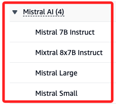

# 範例二

_官方範例_

<br>

## 說明

1. 以下範例將透過幾個步驟進行。

    ```python
    # 導入函式庫
    # 載入環境變數並建立常數
    # 建立客戶端
    # 提問
    # 建立模型所需參數
    # 調用模型
    # 解析回覆
    ```

<br>

## 環境設置

1. 導入函式庫。

    ```python
    import json
    # 這個 SDK 使用 boto3
    import boto3
    import base64
    from dotenv import load_dotenv
    import os
    ```

<br>

2. 載入環境變數並建立常數。

    ```python
    # 環境變數
    load_dotenv()

    AWS_ACCESS_KEY_ID = os.getenv("AWS_ACCESS_KEY_ID")
    AWS_SECRET_ACCESS_KEY = os.getenv("AWS_SECRET_ACCESS_KEY")
    AWS_REGION = os.getenv("AWS_REGION")
    ```

<br>

3. 建立客戶端。

    ```python
    # Bedrock 客戶端
    bedrock = boto3.client(
        service_name="bedrock",
        aws_access_key_id=AWS_ACCESS_KEY_ID,
        aws_secret_access_key=AWS_SECRET_ACCESS_KEY,
        region_name=AWS_REGION
    )

    # 模型推理客戶端
    bedrock_runtime = boto3.client(
        service_name="bedrock-runtime",
        aws_access_key_id=AWS_ACCESS_KEY_ID,
        aws_secret_access_key=AWS_SECRET_ACCESS_KEY,
        region_name=AWS_REGION
    )
    ```

<br>

4. 若要查詢模型的 ID。

    ```python
    # 查詢全部的基礎模型
    all_llms = [ 
        model['modelId']
        for model in bedrock.list_foundation_models()['modelSummaries']
    ]
    print(all_llms)
    ```

<br>

## 使用 `anthropic.claude-v2`

1. 提問。

    ```python
    prompt_data = """
    你能創作一首關於一位資料科學家同時也是一位非常優秀的歌手的詩嗎？
    """
    ```

<br>

2. 建立提問的 JSON。

    ```python
    body = {
        "anthropic_version": "bedrock-2023-05-31",
        "max_tokens": 1024,
        "messages": [
            {
                "role": "user",
                "content": [
                    {
                        "type": "text",
                        "text": prompt_data
                    }
                ]
            }
        ],
    }
    ```

<br>

3. 模型所需參數。

    ```python
    # 將正文編碼為 JSON 字串
    body = json.dumps(body)
    model_id = "anthropic.claude-v2"
    accept = 'application/json'
    contentType = 'application/json'
    ```

<br>

4. 調用模型取得回覆。

    ```python
    response = bedrock_runtime.invoke_model(
        body=body,
        modelId=model_id,
        accept=accept,
        contentType=contentType
    )
    ```

<br>

5. 回覆也是 JSON，所以透過函數進行解析，然後遍歷所需的部分。

    ```python
    # 解析回覆
    response_body = json.loads(
        response.get("body").read()
    )
    # 遍歷回覆中的內容
    for output in response_body.get("content", []):
        print(output["text"])
    ```

<br>

## 使用 `Anthropic Claude v3 Sonnet`

1. 讀取圖片檔案。

    ```python
    with open("棒球場.jpg", "rb") as image_file:
        encoded_string = base64.b64encode(image_file.read())
        base64_string = encoded_string.decode('utf-8')
    ```

<br>

2. 建立 payload，這部分可再參考官方文件，確認為何要建立 payload，而不是直接建立 `bod` 區塊的字典即可。

    ```python
    payload = {
        "modelId": "anthropic.claude-3-sonnet-20240229-v1:0",
        "contentType": "application/json",
        "accept": "application/json",
        "body": {
            "anthropic_version": "bedrock-2023-05-31",
            "max_tokens": 1000,
            "messages": [
                {
                    "role": "user",
                    "content": [
                        {
                            "type": "image",
                            "source": {
                                "type": "base64",
                                "media_type": "image/png",
                                "data": base64_string
                            }
                        },
                        {
                            "type": "text",
                            "text": "Write me a detailed description of this photo."
                        }
                    ]
                }
            ]
        }
    }
    ```

<br>

3. 模型所需參數。

    ```python
    # 取出 `body` 並以 `utf-8` 解碼
    body_bytes = json.dumps(payload['body']).encode('utf-8')
    model_id = "anthropic.claude-3-sonnet-20240229-v1:0"
    accept = 'application/json'
    contentType = 'application/json'
    ```

<br>

4. 取得回覆。

    ```python
    response = bedrock_runtime.invoke_model(
        body=body_bytes,
        modelId=model_id,
        accept=accept,
        contentType=contentType
    )
    ```

<br>

5. 回覆是 JSON 格式，取出其中的 `body`。

    ```python
    response_body = json.loads(
        response.get("body").read()
    )
    print(
        response_body.get('content')[0].get('text')
    )
    ```

<br>

6. 得到以下的答案。

    ```bash
    此圖描繪了夜間比賽期間的職業棒球場。體育場看台上擠滿了觀眾，球場上燈光明亮。
    比賽場地本身是原始的綠色，具有獨特的菱形形狀和內場標記。可以看到球員們站在場上，專注於比賽。
    外場牆上設有大型電子記分板和廣告顯示屏，展示可口可樂等企業贊助商。
    體育場獨特的建築元素，如高聳的輕型支柱也清晰可見。
    總體而言，該圖像捕捉到了美國職棒大聯盟比賽的充滿活力的氛圍、人群的活力、球場的戲劇性
    以及現代體育場的標誌性特徵。
    ```

<br>

7. 可透過以下程式碼查看圖片。

    ```python
    from IPython.display import Image

    img_path = "棒球場.jpg"
    Image(filename=img_path, width=1000, height=1000)
    ```

    

<br>

## 使用 `mistral.mixtral-8x7b-instruct-v0:1` 模型

1. 提出申請。

    

<br>

2. 提問。

    ```python
    prompt_data = """
    編寫一個 Python 函數將攝氏度轉換為華氏度。
    如果水在 100°C 沸騰，那麼華氏度是多少？
    """
    ```

<br>

3. 模型所需參數。

    ```python
    body = json.dumps({ 
        'prompt': prompt_data,
        'max_tokens': 200,
        'top_p': 0.9,
        'temperature': 0.2,
    })
    modelId = 'mistral.mixtral-8x7b-instruct-v0:1'
    accept = 'application/json'
    contentType = 'application/json'
    ```

<br>

4. 調用模型。

    ```python
    response = bedrock_runtime.invoke_model(
        # Encode to bytes
        body=body.encode('utf-8'),
        modelId=modelId, 
        accept=accept, 
        contentType=contentType
    )
    ```

<br>

5. 解析回覆並輸出。

    ```python
    response_body = json.loads(
        response.get('body').read().decode('utf-8')
    )
    print(response_body.get('outputs')[0].get('text'))
    ```

<br>

6. 得到結果。

    ```bash
    def celsius_to_fahrenheit(celsius):
        return (celsius * 9/5) + 32

    print(celsius_to_fahrenheit(100))
    ```

<br>

___

_END_