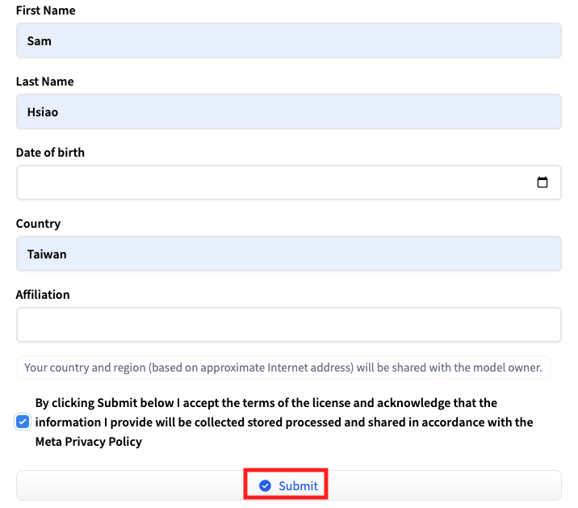
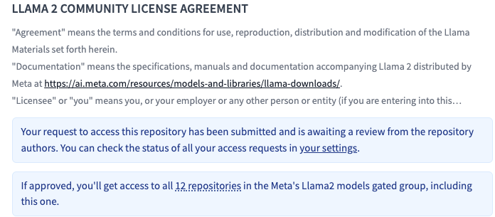
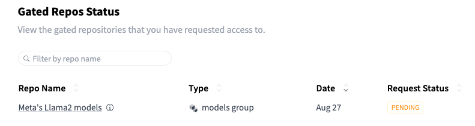
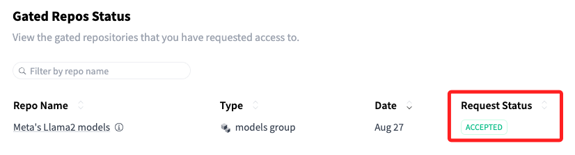
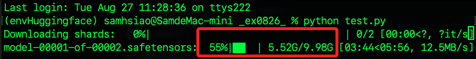
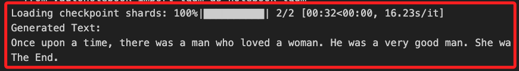
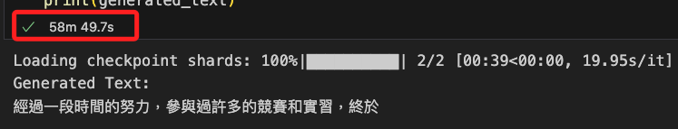

# LLaMA 

_相關技術文件可參考 [官網](https://llama.meta.com/)，最新的模型 `Llama 3.1` 已（2024/07/31）在 Amazon Bedrock 和 Azure AI 上提供_

<br>

## 簡介

1. LLaMA (Large Language Model Meta AI) 是 Meta 開發的一系列大型語言模型（Large Language Models, LLMs），這些模型旨在執行各種自然語言處理（NLP）任務，如文本生成、翻譯、摘要、問題回答等。

<br>

2. LLaMA 模型是基於 Transformer 架構的語言模型，所謂的 Transformer 架構是一種用於自然語言處理任務的神經網絡模型架構，由 Vaswani 等人在 2017 年的論文《Attention is All You Need》中提出；Transformer 引入名為 `自注意力機制（Self-Attention Mechanism）` 的創新方法，改變 NLP 領域的模型設計方式。

<br>

3. LLaMA 模型相當大，需要相當的 GPU 記憶體和計算能力，建議使用高性能 GPU 設備來運行這些模型，LLaMA 的不同版本有不同的參數數量，越大的模型通常效果更好，但同時需要更多的資源來運行。

<br>

## LLaMA 的主要特點

1. 大規模參數：擁有數十億個參數，可以捕捉語言中的複雜模式。

<br>

2. 開源性：Meta 將 LLaMA 作為開源模型提供給研究人員和開發者，使其能夠在不同的應用場景中進行測試和優化。

<br>

3. 多功能性：能夠處理從文本分類到生成任務的各種 NLP 任務。

<br>

## 應用

_以下使用 Python 應用 LLaMA 模型進行文本生成。_

<br>

1. 安裝所需的 Python 庫：PyTorch 和 Transformers。

    ```bash
    pip install torch transformers
    ```

<br>

2. 因為 LLaMA 模型不是像其他模型一樣托管在 Hugging Face 的公共模型庫中，而是由 Meta 開發和管理的，需要先通過授權和下載步驟，所以先 [登入官網申請授權](https://huggingface.co/meta-llama/Llama-2-7b)。

    

<br>

3. 申請後等候審核。

    

<br>

4. 可以進入 `Settings` 中的 `Gated Repos Status` 查看。

    

<br>

5. 核准後會顯示為 `ACCEPTED`。

    

<br>

## 運行腳本

_使用 Python 和 Hugging Face Transformers 庫來載入和使用 LLaMA 模型進行簡單的文本生成任務。_

1. 建立任意 Python 腳本後在終端機中運行；要使用 NoteBook 也是可以的，只是透過 `.py` 腳本運行可以看比較清楚揭露的資訊。

    ```python
    # 載入 LLaMA 的預訓練模型和相應的 tokenizer
    from transformers import AutoTokenizer, AutoModelForCausalLM

    # 載入預訓練的 LLaMA 模型和 tokenizer
    # 這裡使用 LLaMA-7B 作為範例
    model_name = "meta-llama/Llama-2-7b-hf"  
    tokenizer = AutoTokenizer.from_pretrained(model_name)
    model = AutoModelForCausalLM.from_pretrained(model_name)

    # 將模型設置為評估模式（`model.eval()`）
    # 防止模型在生成時進行梯度更新
    model.eval()

    # 定義初始的輸入文本（`input_text`）
    # 這裡使用 `很久以前、從前`
    input_text = "Once upon a time"
    # 將其轉換為模型可處理的 ID 格式
    # 將輸入的自然語言文本轉換為模型的輸入格式（張量形式）
    # 這裡 return_tensors='pt' 指定返回 PyTorch 的張量格式
    # 特別注意，在這個腳本尚未導入 PyTorch
    input_ids = tokenizer.encode(input_text, return_tensors='pt')

    # 生成文本
    # 最大生成長度為 50 個 token
    # 生成序列的數量 = 1
    output = model.generate(
        input_ids, max_length=50, 
        num_return_sequences=1
    )

    # 解碼生成的文本
    # 將生成的 ID 序列轉換回可讀的文本格式
    generated_text = tokenizer.decode(
        output[0], 
        skip_special_tokens=True
    )
    # 輸出
    print("Generated Text:")
    print(generated_text)
    ```

<br>

2. 模型挺大的，要等一段時間。

    

<br>

3. 一段時間後會輸出結果。

    

<br>

4. 更換一個 Prompt，真的需要很久的時間來回覆。

    ```python
    input_text = "經過一段時間的努力"
    ```

    

<br>

## 導入 PyTorch

_延續前面的步驟，如果要使用 GPU 來加速模型推理，需要手動將模型和輸入數據移動到 GPU；另外，在 M1、M2 的 Mac 上運行代碼，是要檢查 MPS 的可用性。_

<br>

1. 載入了預訓練的模型和 tokenizer，假如使用 Jupyter Notebook 運行，可跳過前兩個步驟。

    ```python
    from transformers import AutoTokenizer, AutoModelForCausalLM

    # 設定模型名稱
    model_name = "meta-llama/Llama-2-7b-hf"  

    # 載入 tokenizer 和模型
    tokenizer = AutoTokenizer.from_pretrained(model_name)
    model = AutoModelForCausalLM.from_pretrained(model_name)
    ```

<br>

2. 可重新定義了 input_ids，並通過 tokenizer 得到張量。

    ```python
    input_text = "經過一段時間的努力"
    input_ids = tokenizer.encode(
        input_text, 
        return_tensors='pt'
    )
    ```

<br>

3. 完成以上步驟，在 Mac 系統上使用 MPS（Metal Performance Shaders）； MPS 是 Apple 基於 Metal 框架提供的高性能計算 API，專門為 Mac 和 iOS 設備設計，可為內建的 GPU 加速提供高效的數據並行計算。

    ```python
    import torch

    # 檢查 MPS 是否可用，適用於 Apple M1/M2
    if torch.backends.mps.is_available():
        device = torch.device("mps")
        print("MPS is available. Using MPS for computation.")
    else:
        device = torch.device("cpu")
        print("MPS is not available. Using CPU for computation.")

    # 將模型移動到 MPS（如果有）
    model.to(device)

    # 將輸入張量移動到 MPS
    input_ids = input_ids.to(device)

    # 生成文本
    output = model.generate(
        input_ids, max_length=50, 
        num_return_sequences=1
    )

    # 解碼生成的文本
    generated_text = tokenizer.decode(
        output[0],
        skip_special_tokens=True
    )

    print("Generated Text:")
    print(generated_text)
    ```

<br>

4. 在其他類型設備中若要使用 GPU，可運行以下代碼；這裡省略了檢查結果的輸出。

    ```python
    import torch

    # 檢查是否有可用的 GPU
    device = torch.device(
        "cuda" if torch.cuda.is_available() else "cpu"
    )

    # 將模型移動到 GPU（如果有）
    model.to(device)

    # 將輸入張量移動到 GPU
    input_ids = input_ids.to(device)

    # 生成文本
    output = model.generate(
        input_ids, max_length=50, 
        num_return_sequences=1
    )

    # 解碼生成的文本
    generated_text = tokenizer.decode(
        output[0],
        skip_special_tokens=True
    )

    print("Generated Text:")
    print(generated_text)
    ```

<br>

___

_END_

