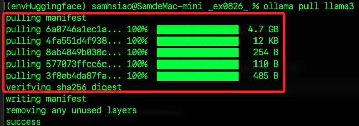
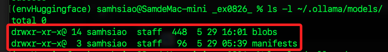
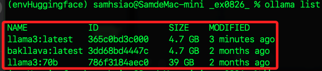
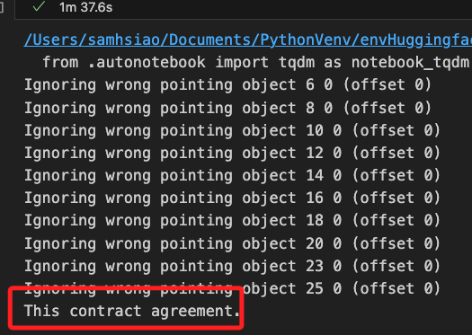
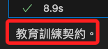

# LlamaIndex 本地模型

<br>

## 說明

1. LlamaIndex 支持使用本地模型，以下將使用 `BAAI` 的 `bge-base-en-v1.5` 作為嵌入模型，並通過 Ollama 工具加載 Llama3 模型。

<br>

2. 安裝與 HuggingFace 和 Ollama 相關的擴展包。

    ```bash
    pip install llama-index-embeddings-huggingface
    pip install llama-index-llms-ollama
    ```

<br>

3. `Ollama` 是一個用於在本地設置 LLM 的工具，目前支持 OSX 和 Linux，安裝 Ollama 後，通過以下命令下載 Llama3 模型；需要至少 32GB 的 RAM 來運行 Llama3 模型。

    ```bash
    ollama pull llama3
    ```

<br>

3. 完成安裝，路徑在本地的 `~/.ollama/models/`。

    

<br>

4. 可透過指令查詢。

    ```bash
    ls -l ~/.ollama/models/
    ```

    

<br>

5. 檢查 Ollama 中已安裝的所有模型。

    ```bash
    ollama list
    ```

    

<br>

## 開發

1. 創建一個腳本，並寫入以下代碼。

    ```python
    from llama_index.core import (
        VectorStoreIndex, SimpleDirectoryReader, Settings
    )
    from llama_index.embeddings.huggingface import HuggingFaceEmbedding
    from llama_index.llms.ollama import Ollama

    documents = SimpleDirectoryReader("data").load_data()

    Settings.embed_model = HuggingFaceEmbedding(
        model_name="BAAI/bge-base-en-v1.5"
    )
    Settings.llm = Ollama(
        model="llama3", request_timeout=360.0
    )

    index = VectorStoreIndex.from_documents(documents)
    ```

<br>

2. 查詢數據。

    ```python
    query_engine = index.as_query_engine()
    response = query_engine.query("這份文件在說什麼？")
    print(response)
    ```

    

<br>

3. 繼續提問。

    ```python
    response = query_engine.query("怎樣的契約？")
    print(response)
    ```

    

<br>

## 補充說明

1. 關於 `TqdmWarning 警告`，這是一個來自 `tqdm` 模組的警告，提示 `IProgress` 模塊未找到，這通常在使用 Jupyter Notebook 環境時出現，提示可能需要更新 Jupyter 和 ipywidgets 以使用進度條功能；因為這個警告對程序的主要功能沒有影響，可以忽略或者按照提示更新相關模塊。

<br>

2. 關於 `Ignoring wrong pointing object 警告`，這些警告與文件解析有關，表示在讀取 PDF 文件時，解析器遇到了某些無效或意外的物件指針，這些警告表明文件的某些部分可能不是完全按照標準格式編寫，但最終文本內容仍然被正確讀取；同樣的，這些警告同樣不會影響文件的主要解析和處理結果。

<br>

___

_END_