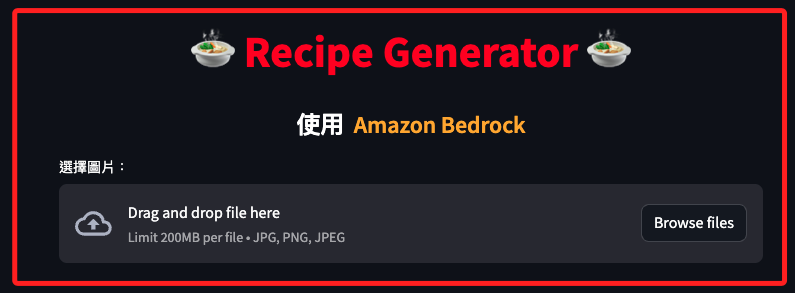
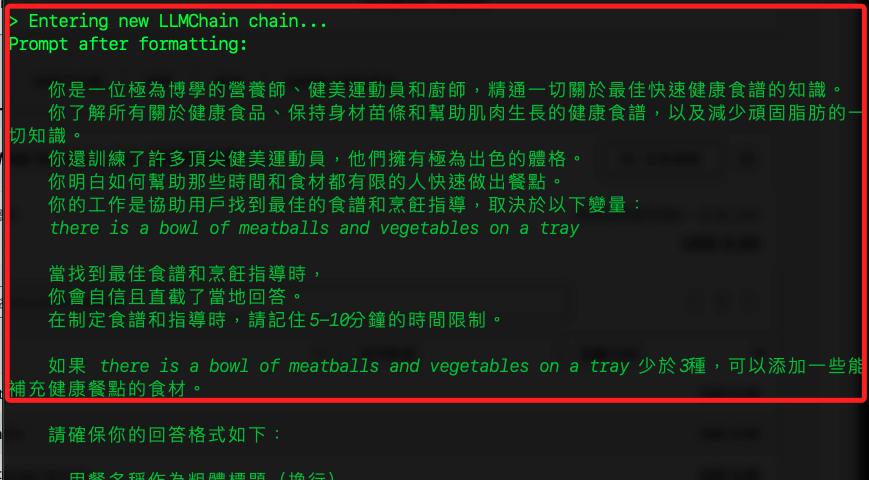
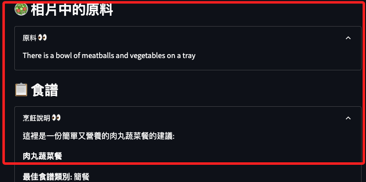
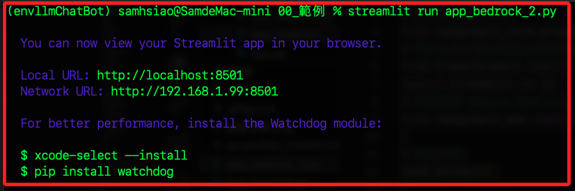

# 編輯腳本

<br>

## 步驟說明

1. 安裝套件。

    ```bash
    pip install boto3 transformers langchain-aws awscli
    ```

<br>

2. 程式碼，這是完整可運行的腳本。

    ```python
    import os
    from dotenv import load_dotenv
    # 用於生成提示模板
    from langchain_core.prompts import PromptTemplate
    # 處理大語言模型鏈
    from langchain.chains import LLMChain
    # 用於生成各種自然語言處理管道
    from transformers import pipeline
    import streamlit as st
    # 用於連接 Amazon Bedrock
    from langchain_aws import BedrockLLM

    # 環境參數
    load_dotenv()

    PAGE_CONFIG = {
        # 頁面標題
        "page_title": "Image to Recipe",
        # 頁面圖標
        "page_icon": ":chef:",
        # 頁面佈局為居中
        "layout": "centered",
    }
    # 設定頁面配置
    st.set_page_config(
        page_title=PAGE_CONFIG["page_title"],
        page_icon=PAGE_CONFIG["page_icon"],
        layout=PAGE_CONFIG["layout"],
    )
    #
    st.markdown(
        """
        <style>
            body {
                /*設定頁面的背景顏色*/
                background-color: #fafafa;
                /*設定頁面的字體顏色*/
                color: #333;
            }
            h1, h2 {
                /*設定標題的字體顏色*/
                color: #ff6347;
            }
            .fileUploader .btn {
                /*設定上傳按鈕的背景顏色*/
                background-color: #ff6347;
                /*設定上傳按鈕的字體顏色*/
                color: white;
            }
        </style>
        """,
        unsafe_allow_html=True,
    )


    # 定義函數以取得大語言模型
    def get_llm():
        # 無需直接傳遞AWS憑證
        bedrock_llm = BedrockLLM(
            # 使用 Claude v2 模型
            model_id="anthropic.claude-v2",
            # 設定 AWS 區域
            region_name=os.getenv("AWS_REGION"),
            # 設定模型參數
            model_kwargs={
                "temperature": 0.7,
                "max_tokens_to_sample": 4096},
        )
        # 返回大語言模型實例
        return bedrock_llm


    # 定義函數將圖像轉換為文字
    def image_to_text(url):
        # 顯示處理中的提示
        with st.spinner("Processing image..."):
            pipe = pipeline(
                "image-to-text",
                model="Salesforce/blip-image-captioning-large",
                max_new_tokens=1000,
            )
            # 取得圖像生成的文字
            text = pipe(url)[0]["generated_text"]
        # 返回生成的文字
        return text


    # 定義函數生成食譜
    def generate_recipe(ingredients):
        template = """
        你是一位極為博學的營養師、健美運動員和廚師，精通一切關於最佳快速健康食譜的知識。
        你了解所有關於健康食品、保持身材苗條和幫助肌肉生長的健康食譜，以及減少頑固脂肪的一切知識。
        你還訓練了許多頂尖健美運動員，他們擁有極為出色的體格。
        你明白如何幫助那些時間和食材都有限的人快速做出餐點。
        你的工作是協助用戶找到最佳的食譜和烹飪指導，取決於以下變量：
        {ingredients}

        當找到最佳食譜和烹飪指導時，
        你會自信且直截了當地回答。
        在制定食譜和指導時，請記住5-10分鐘的時間限制。

        如果 {ingredients} 少於3種，可以添加一些能補充健康餐點的食材。

        請確保你的回答格式如下：

        - 用餐名稱作為粗體標題（換行）

        - 最佳食譜類別（粗體）

        - 準備時間（標題）

        - 難度（粗體）：
            簡單

        - 食材（粗體）
            列出所有食材

        - 所需廚房工具（粗體）
            列出所需的廚房工具

        - 烹飪指導（粗體）
            列出所有製作餐點的指導步驟

        - 營養成分（粗體）：
            總卡路里
            列出每種食材的卡路里
            列出所有營養成分

        請務必簡明扼要。
        使指導易於理解並逐步進行。
        """

        # 顯示處理中的提示
        with st.spinner("Making the recipe for you..."):
            prompt = PromptTemplate(
                template=template,
                input_variables=["ingredients"]
            )
            llm = get_llm()
            recipe_chain = LLMChain(
                llm=llm,
                prompt=prompt,
                verbose=True
            )
            recipe = recipe_chain.run(ingredients)

        return recipe


    def main():

        st.markdown(
            "<h1 style='text-align: center; color: red;'>"
            "🍲 Recipe Generator 🍲 </h1>",
            unsafe_allow_html=True,
        )

        st.markdown(
            "<h2 style='text-align: center; font-size: 24px;"
            " color: white'>使用&nbsp;&nbsp;<span style='color: orange;'>"
            "Amazon Bedrock</span></h2>",
            unsafe_allow_html=True,
        )

        upload_file = st.file_uploader(
            "選擇圖片：",
            type=["jpg", "png"],
            accept_multiple_files=False
        )

        if upload_file is not None:
            file_bytes = upload_file.getvalue()
            with open(upload_file.name, "wb") as file:
                file.write(file_bytes)

            st.image(
                upload_file,
                caption="The uploaded image",
                use_column_width=True,
                width=250
            )

            st.markdown("### 🥗 相片中的原料")
            ingredients = image_to_text(upload_file.name)
            with st.expander("原料 👀"):
                st.write(ingredients.capitalize())

            st.markdown("### 📋 食譜")
            recipe = generate_recipe(ingredients=ingredients)
            with st.expander("烹飪說明 👀"):
                st.write(recipe)

            os.remove(upload_file.name)


    if __name__ == "__main__":
        load_dotenv()
        main()

    ```

<br>

## 說明事項

_針對官網範例的修正_

<br>

1. PromptTemplate 應從 langchain_core.prompts 引入。

2. LLMChain 應從 langchain.chains 引入。

3. Bedrock 應從 langchain_community.llms 引入。

4. st.set_page_config 需要使用關鍵字參數，而不是將字典直接傳遞給它。

5. 更新 Bedrock 導入，應該從 langchain_aws 模組而不是 langchain_community 模組導入 BedrockLLM。 

<br>

## 運行腳本

1. Streamlit 專案透過終端機運行。

    ```bash
    streamlit run app.py
    ```

<br>

2. 會啟動如下網頁。

    

<br>

3. 上傳圖片後，終端機會顯示資訊。

    

<br>

4. 完成後可以在網頁中透過下拉選單查看結果。

    

<br>

## 關於警告訊息

1. 運行時會出現以下警告。

    ```bash
    /Users/samhsiao/Documents/PythonVenv/envllmChatBot/lib/python3.11/site-packages/langchain_core/_api/deprecation.py:119: LangChainDeprecationWarning: The class `LLMChain` was deprecated in LangChain 0.1.17 and will be removed in 0.3.0. Use RunnableSequence, e.g., `prompt | llm` instead.
    warn_deprecated(
    /Users/samhsiao/Documents/PythonVenv/envllmChatBot/lib/python3.11/site-packages/langchain_core/_api/deprecation.py:119: LangChainDeprecationWarning: The method `Chain.run` was deprecated in langchain 0.1.0 and will be removed in 0.3.0. Use invoke instead.
    warn_deprecated(
    ```

<br>

2. `LLMChain` 類在 LangChain 版本 0.1.17 中已被棄用，並將在 0.3.0 版本中移除，建議替代使用 `RunnableSequence`，例如 `prompt | llm`。

<br>

3. `Chain.run` 方法在 LangChain 版本 0.1.0 中已被棄用，並將在 0.3.0 版本中移除，建議使用 `invoke` 方法。

<br>

## 針對警告進行更新

1. 替換 `LLMChain`。

    ```python
    # 用於生成提示模板
    # from langchain_core.prompts import PromptTemplate
    # 處理大語言模型鏈
    # from langchain.chains import LLMChain
    
    # 修改為
    # 用於生成提示模板
    from langchain_core.prompts import PromptTemplate
    ```

<br>

2. 替換 `Chain.run`。

    ```python
    # 舊方法
    # recipe_chain = LLMChain(
    #     llm=llm,
    #     prompt=prompt,
    #     verbose=True
    # )
    # recipe = recipe_chain.run(ingredients)

    # 修改為
    recipe_chain = prompt | llm
    recipe = recipe_chain.invoke({"ingredients": ingredients})
    ```

<br>

3. 更新套件。

    ```bash
    pip install --upgrade transformers
    ```

<br>

4. 修改後的完整程式碼。

    ```python
    import os
    from dotenv import load_dotenv
    # 用於生成提示模板
    from langchain_core.prompts import PromptTemplate
    # 用於生成各種自然語言處理管道
    from transformers import pipeline
    import streamlit as st
    # 用於連接 Amazon Bedrock
    from langchain_aws import BedrockLLM

    # 環境參數
    load_dotenv()


    # 定義函數以取得大語言模型
    def get_llm():
        bedrock_llm = BedrockLLM(
            model_id="anthropic.claude-v2",
            region_name=os.getenv("AWS_REGION"),
            model_kwargs={"temperature": 0.7, "max_tokens_to_sample": 4096},
        )
        return bedrock_llm


    # 定義函數將圖像轉換為文字
    def image_to_text(url):
        # 顯示處理中的提示
        with st.spinner("Processing image..."):
            pipe = pipeline(
                "image-to-text",
                model="Salesforce/blip-image-captioning-large",
                max_new_tokens=1000,
            )
            # 取得圖像生成的文字
            text = pipe(url)[0]["generated_text"]
        # 返回生成的文字
        return text


    # 定義函數生成食譜
    def generate_recipe(ingredients):
        template = """
        你是一位極為博學的營養師、健美運動員和廚師，精通一切關於最佳快速健康食譜的知識。
        你了解所有關於健康食品、保持身材苗條和幫助肌肉生長的健康食譜，以及減少頑固脂肪的一切知識。
        你還訓練了許多頂尖健美運動員，他們擁有極為出色的體格。
        你明白如何幫助那些時間和食材都有限的人快速做出餐點。
        你的工作是協助用戶找到最佳的食譜和烹飪指導，取決於以下變量：
        {ingredients}

        當找到最佳食譜和烹飪指導時，
        你會自信且直截了當地回答。
        在制定食譜和指導時，請記住5-10分鐘的時間限制。

        如果 {ingredients} 少於3種，可以添加一些能補充健康餐點的食材。

        請確保你的回答格式如下：

        - 用餐名稱作為粗體標題（換行）

        - 最佳食譜類別（粗體）

        - 準備時間（標題）

        - 難度（粗體）：
            簡單

        - 食材（粗體）
            列出所有食材

        - 所需廚房工具（粗體）
            列出所需的廚房工具

        - 烹飪指導（粗體）
            列出所有製作餐點的指導步驟

        - 營養成分（粗體）：
            總卡路里
            列出每種食材的卡路里
            列出所有營養成分

        請務必簡明扼要。
        使指導易於理解並逐步進行。
        """

        with st.spinner("Making the recipe for you..."):
            prompt = PromptTemplate(
                template=template, input_variables=["ingredients"]
            )
            llm = get_llm()
            recipe_chain = prompt | llm
            recipe = recipe_chain.invoke({"ingredients": ingredients})

        return recipe


    def main():

        st.markdown(
            "<h1 style='text-align: center; color: red;'>"
            "🍲 Recipe Generator 🍲 </h1>",
            unsafe_allow_html=True,
        )

        st.markdown(
            "<h2 style='text-align: center; font-size: 24px;"
            " color: white'>使用&nbsp;&nbsp;<span style='color: orange;'>"
            "Amazon Bedrock</span></h2>",
            unsafe_allow_html=True,
        )

        upload_file = st.file_uploader(
            "選擇圖片：",
            type=["jpg", "png"],
            accept_multiple_files=False
        )

        if upload_file is not None:
            file_bytes = upload_file.getvalue()
            with open(upload_file.name, "wb") as file:
                file.write(file_bytes)

            st.image(
                upload_file,
                caption="The uploaded image",
                use_column_width=True,
                width=250
            )

            st.markdown("### 🥗 相片中的原料")
            ingredients = image_to_text(upload_file.name)
            with st.expander("原料 👀"):
                st.write(ingredients.capitalize())

            st.markdown("### 📋 食譜")
            recipe = generate_recipe(ingredients=ingredients)
            with st.expander("烹飪說明 👀"):
                st.write(recipe)

            os.remove(upload_file.name)


    if __name__ == "__main__":
        load_dotenv()
        main()

    ```

<br>

5. 運行後不再出現警告。

    

<br>

___

_END_
