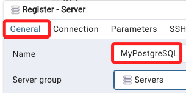
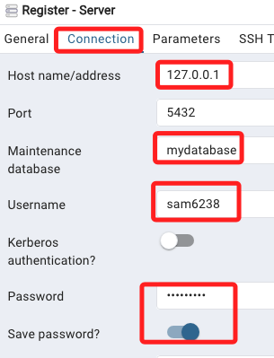
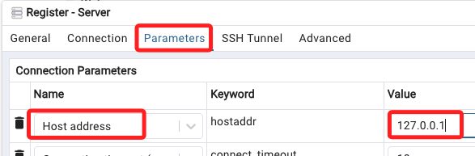
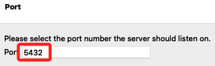
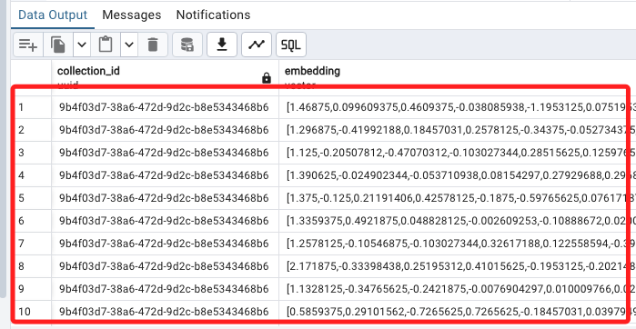

# 基本操作

_搭配範例 01 進行_

<br>

## 安裝 pgAdmin4

1. 特別注意，要從 [官網載點](https://www.pgadmin.org/download/pgadmin-4-macos/) 進行下載，截至最後更新日期 `2024/06/05` 的版本是 `8.7`。

<br>

2. 點擊安裝。

    

<br>

## 連線伺服器

1. 建立新的伺服器。

    

<br>

2. 命名為 `MyPostgreSQL`。

    

<br>

3. 分別輸入。

    

<br>

4. 在參數的部分輸入。

    

<br>

5. 點擊右下角 `Save`。

    

<br>

## 端口衝突

1. 預設端口使用 `5432`。

    

<br>

2. 若遇到端口佔用，查看 5432 佔用狀況，先進行查詢。

    ```bash
    lsof -i :5432
    ```

<br>

3. 若被佔用會顯示相關訊息。

    ```bash
    COMMAND    PID     USER   FD   TYPE             DEVICE SIZE/OFF NODE NAME
    postgres   935 samhsiao   10u  IPv6 0xacbfff31abcb4c37      0t0  TCP localhost:postgresql->localhost:57888 (ESTABLISHED)
    postgres  1803 samhsiao    7u  IPv6 0xacbfff3b42c2f437      0t0  TCP localhost:postgresql (LISTEN)
    postgres  1803 samhsiao    8u  IPv4 0xacbfff367bb5e107      0t0  TCP localhost:postgresql (LISTEN)
    Python   99837 samhsiao   76u  IPv6 0xacbfff31abcaa437      0t0  TCP localhost:57888->localhost:postgresql (ESTABLISHED)
    ```

<br>

4. 使用 `kill` 強制停用進程。

    ```bash
    kill -9 935
    kill -9 1803
    kill -9 99837
    ```

<br>

5. 接著啟動 PostgreSQL 服務。

    ```bash
    brew services start postgresql
    ```

<br>

## 在 PostgreSQL 中創建了用戶和資料庫

1. 確認已經啟動 PostgreSQL 了服務器。

    ```bash
    brew services start postgresql
    ```

<br>

2. 進入 PostgreSQL 命令行界面。

    ```bash
    psql postgres
    ```

<br>

3. 創建一個新的資料庫用戶。

    ```sql
    CREATE USER sam6238 WITH PASSWORD 'Sam112233';
    ```

<br>

4. 創建一個新的資料庫 `mydatabase`。

    ```sql
    CREATE DATABASE mydatabase OWNER sam6238;
    ```

<br>

5. 為新用戶賦予對新資料庫的所有權限。

    ```sql
    GRANT ALL PRIVILEGES ON DATABASE mydatabase TO sam6238;
    ```

<br>

6. 退出 PostgreSQL 命令行界面。

    ```sh
    \q
    ```

<br>

7. 若要停止服務。

    ```bash
    brew services stop postgresql
    ```

<br>

## 安裝 pgvector 擴展

1. 使用 brew。

    ```bash
    brew install pgvector
    ```

<br>

2. 在 PostgreSQL 命令行界面中創建 pgvector 擴展。

    ```sql
    CREATE EXTENSION vector;
    ```

<br>

3. 確認 pgvector 擴展文件是否存在於目錄下。

    ```bash
    ls /opt/homebrew/share/postgresql@14/extension/
    ```

<br>

## MacOS 使用 pgAdmin

1. 點擊 `Query Tool` 可開啟指令視窗。

    

<br>

2. 查詢指定集合。

    ```sql
    Select * from langchain_pg_collection;
    ```

    

<br>

3. 查詢向量儲存。

    ```sql
    Select langchain_pg_embedding.collection_id,
    langchain_pg_embedding.embedding,
    langchain_pg_embedding.document
    From langchain_pg_embedding
    ```

    

<br>

___

_END_