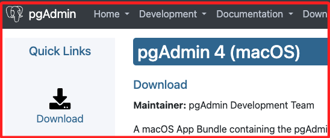
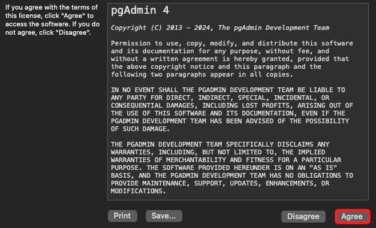
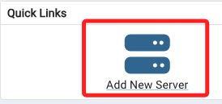
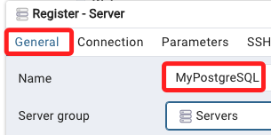
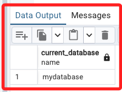
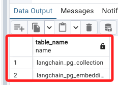
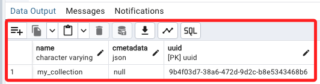
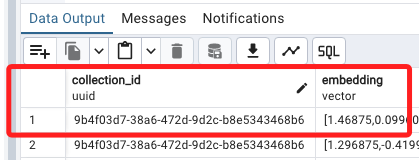

# pgAdmin 4 基本操作

_搭配範例進行操作_

<br>

## 安裝 pgAdmin 4

1. 特別注意，建議從 [官網載點](https://www.pgadmin.org/download/pgadmin-4-macos/) 進行下載，截至最後更新日期 `2024/06/05` 的版本是 `8.7`。

    

<br>

2. 點擊 `Agree` 便可進入安裝。

    

<br>

## 連線伺服器

1. 安裝完成先開啟應用程序，接著建立新的伺服器。

    

<br>

2. 命名為 `MyPostgreSQL`。

    

<br>

3. 切換到 `Connection` 頁籤，分別輸入 `Hostname`、`database`、`Username`、`Password`。

    

<br>

4. 在 `參數` 的部分輸入，選擇 `Host name address`，接著輸入 `127.0.0.1`。

    

<br>

5. 點擊右下角 `Save`。

    

<br>

## 端口衝突

_若發生端口衝突_

<br>

1. 預設端口使用 `5432`。

    

<br>

2. 若遇到端口佔用，先查看端口在 `5432` 的佔用狀況。

    ```bash
    lsof -i :5432
    ```

<br>

3. 若被佔用會顯示相關訊息。

    ```bash
    COMMAND    PID     USER   FD   TYPE             DEVICE SIZE/OFF NODE NAME
    postgres   935 samhsiao   10u  IPv6 0xacbfff31abcb4c37      0t0  TCP localhost:postgresql->localhost:57888 (ESTABLISHED)
    postgres  1803 samhsiao    7u  IPv6 0xacbfff3b42c2f437      0t0  TCP localhost:postgresql (LISTEN)
    postgres  1803 samhsiao    8u  IPv4 0xacbfff367bb5e107      0t0  TCP localhost:postgresql (LISTEN)
    Python   99837 samhsiao   76u  IPv6 0xacbfff31abcaa437      0t0  TCP localhost:57888->localhost:postgresql (ESTABLISHED)
    ```

<br>

4. 依據查詢的結果，使用 `kill` 指令強制停用進程 `PID`。

    ```bash
    kill -9 935
    kill -9 1803
    kill -9 99837
    ```

<br>

5. 接著啟動 PostgreSQL 服務。

    ```bash
    brew services start postgresql
    ```

<br>

## PostgreSQL 創建用戶和資料庫

1. 確認已經啟動 PostgreSQL 了服務器。

    ```bash
    brew services start postgresql
    ```

<br>

2. 進入 PostgreSQL 命令行界面。

    ```bash
    psql postgres
    ```

<br>

3. 創建一個新的資料庫用戶同時設定密碼，這裡示範名稱是 `sam6238`、密碼是 `Sam112233`。

    ```sql
    CREATE USER sam6238 WITH PASSWORD 'Sam112233';
    ```

<br>

4. 創建一個新的資料庫 `mydatabase`，可同時指定擁有者為前一個步驟新增的用戶 `sam6238`。

    ```sql
    CREATE DATABASE mydatabase OWNER sam6238;
    ```

<br>

5. 為新用戶 `sam6238` 賦予對新資料庫 `mydatabase` 的所有權限。

    ```sql
    GRANT ALL PRIVILEGES ON DATABASE mydatabase TO sam6238;
    ```

<br>

6. 退出 PostgreSQL 命令行界面。

    ```sh
    \q
    ```

<br>

7. 若要停止服務。

    ```bash
    brew services stop postgresql
    ```

<br>

## 安裝 pgvector 擴展

1. MacOS 可使用 Homebrew 進行安裝。

    ```bash
    brew install pgvector
    ```

<br>

2. 在 PostgreSQL 命令行中創建 pgvector 擴展。

    ```sql
    CREATE EXTENSION vector;
    ```

<br>

3. 在終端機中確認 pgvector 擴展文件是否存在於目錄下。

    ```bash
    ls /opt/homebrew/share/postgresql@14/extension/
    ```
    
<br>

4. 或使用更精確的查詢指令。

    ```bash
    ls /opt/homebrew/share/postgresql@14/extension/*pg*
    ```

<br>

## 使用 pgAdmin 4 桌面應用

1. 點擊 `Query Tool` 可開啟語法視窗。

    

<br>

2. 查詢當前資料庫。

    ```sql
    SELECT current_database();
    ```

    

<br>

3. 列出 `public` 模式中的所有表格名稱。

    ```sql
    -- 指定查詢的目的是選擇 table_name 欄位，這會返回所有符合條件的表格名稱
    SELECT table_name
    -- 是一個系統視圖，包含當前資料庫中所有表格的相關資訊
    FROM postgres.information_schema.tables
    -- 條件用於篩選 table_schema 欄位值為 'public' 的表格
    WHERE table_schema = 'public';
    ```

    

<br>

4. 查詢指定資料表。

    ```sql
    Select * from langchain_pg_collection;
    ```

    

<br>

5. 查詢指定資料表。

    ```sql
    Select * from langchain_pg_embedding;
    ```

    

<br>

6. 查詢向量儲存。

    ```sql
    Select langchain_pg_embedding.collection_id,
    langchain_pg_embedding.embedding,
    langchain_pg_embedding.document
    From langchain_pg_embedding
    ```

    

<br>

___

_END_