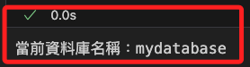
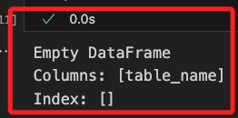
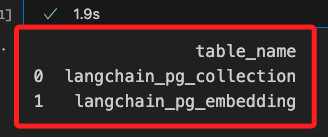
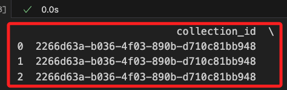
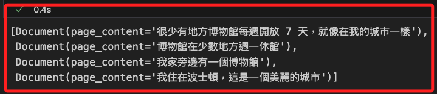
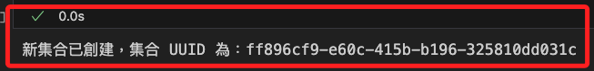
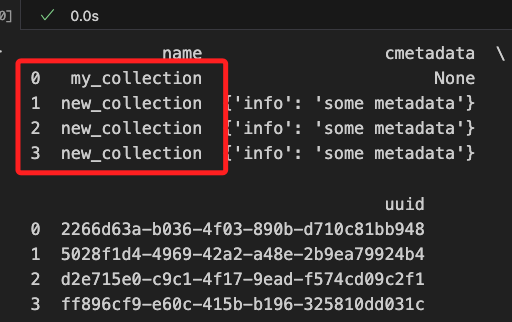
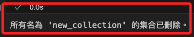
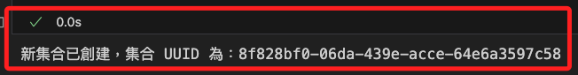
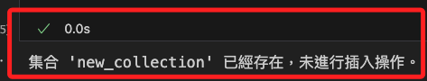

# 建立向量儲存

<br>

## 基礎環境建置

1. 導入函式庫。

    ```python
    # BedrockEmbeddings 類別是用來將文本轉換成嵌入向量的工具
    from langchain.embeddings import BedrockEmbeddings
    from langchain.vectorstores.pgvector import PGVector, DistanceStrategy
    import pandas as pd
    from sqlalchemy import create_engine, text
    import os
    from dotenv import load_dotenv


    # 載入環境參數
    load_dotenv()
    ```

<br>

2. 設定連線資訊。

    ```python
    # 集合名稱
    COLLECTION_NAME = "my_collection"

    # 連線參數
    CONNECTION_STRING = PGVector.connection_string_from_db_params(
        driver=os.getenv("PGVECTOR_DRIVER"),
        user=os.getenv("PGVECTOR_USER"),
        password=os.getenv("PGVECTOR_PASSWORD"),
        host=os.getenv("PGVECTOR_HOST"),
        port=os.getenv("PGVECTOR_PORT"),
        database=os.getenv("PGVECTOR_DATABASE"),
    )
    
<br>

3. 連線並查詢。

    ```python
    # 建立 SQLAlchemy 引擎
    engine = create_engine(CONNECTION_STRING)

    # 執行查詢來獲取當前資料庫名稱
    query = "SELECT current_database();"

    with engine.connect() as connection:
        result = connection.execute(text(query))
        current_database = result.fetchone()[0]

    print(f"當前資料庫名稱：{current_database}")
    ```

    

<br>

4. 查詢當前資料表。

    ```python
    # 查詢資料表名稱
    query = """
        SELECT table_name
        FROM information_schema.tables
        WHERE table_schema = 'public';
    """

    # 建立與資料庫的連接並執行查詢
    with engine.connect() as connection:
        result = connection.execute(text(query))
        tables = result.fetchall()

    # 將結果轉換為 DataFrame 並顯示
    df = pd.DataFrame(tables, columns=['table_name'])
    print(df)
    ```

    

<br>

## 向量儲存

1. 建立操作向量的實體。

    ```python
    # 創建一個實例，用來將文本轉換成嵌入向量
    embeddings = BedrockEmbeddings()

    # 建立 VectorDB 儲存實例
    my_vector_store = PGVector(
        collection_name=COLLECTION_NAME,
        connection_string=CONNECTION_STRING,
        embedding_function=embeddings,
        distance_strategy=DistanceStrategy.EUCLIDEAN,
    )
    ```

<br>

2. 建立之後若再進行資料表的查詢，會發現已經建立了兩個資料表。

    

<br>

3. 查詢集合 `langchain_pg_collection` 的內容：`集合` 是一個特定用途的 `資料表`，用來儲存集合的 `元數據` 和 `標識符（UUID）`，以便更好地管理和查詢。

    ```python
    # 取得環境參數
    _DATABASE=os.getenv("PGVECTOR_DATABASE")
    _USER=os.getenv("PGVECTOR_USER")
    _PASSWORD=os.getenv("PGVECTOR_PASSWORD")
    _HOST=os.getenv("PGVECTOR_HOST")
    _PORT=os.getenv("PGVECTOR_PORT")

    # 連接到 PostgreSQL 資料庫
    engine = create_engine(
        f'postgresql+psycopg2://{_USER}:{_PASSWORD}@{_HOST}:{_PORT}/{_DATABASE}'
    )

    # 查詢資料表內容並將結果存儲在 DataFrame 中
    query = "SELECT * FROM langchain_pg_collection;"

    # 建立與資料庫的連接並執行查詢
    with engine.connect() as connection:
        df = pd.read_sql(query, connection)
    # 結果
    print(df)
    ```

<br>

4. 結果顯示資料表目前只包含 `基本的集合資訊` 而沒有其他相關的嵌入或向量數據。

    ```bash
                name cmetadata                                  uuid
    0  my_collection      None  e2a6b652-4ad5-4d5d-be6f-3e430f249780
    ```

<br>

5. 查詢資料表 `langchain_pg_embedding` 的內容：這是實際用作儲存數據的資料表，比如嵌入向量和相關資訊。

    ```python
    # 查詢資料表內容並將結果存儲在 DataFrame 中
    query = "Select * from langchain_pg_embedding;"

    # 建立與資料庫的連接並執行查詢
    with engine.connect() as connection:
        df = pd.read_sql(query, connection)
    # 結果
    print(df)
    ```

<br>

6. 結果顯示目前資料表中沒有任何記錄。

    ```bash
    Empty DataFrame
    Columns: [collection_id, embedding, document, cmetadata, custom_id, uuid]
    Index: []
    ```

<br>

## 查詢資料表

_使用 `psycopg2` 或 `sqlalchemy` 進行查詢_

<br>

1. 安裝資料庫必要的庫。

    ```bash
    pip install psycopg2-binary sqlalchemy python-dotenv
    ```

<br>

2. 使用 `psycopg2` 查詢當前建立的資料表。

    ```python
    import psycopg2
    import pandas as pd
    import os
    from dotenv import load_dotenv

    load_dotenv()

    # 連接到 PostgreSQL 資料庫
    conn = psycopg2.connect(
        dbname=os.getenv("PGVECTOR_DATABASE"),
        user=os.getenv("PGVECTOR_USER"),
        password=os.getenv("PGVECTOR_PASSWORD"),
        host=os.getenv("PGVECTOR_HOST"),
        port=os.getenv("PGVECTOR_PORT")
    )

    # 建立游標物件
    cur = conn.cursor()
    # 執行 SQL 查詢
    cur.execute("""
        SELECT table_name
        FROM information_schema.tables
        WHERE table_schema = 'public';
    """)
    # 獲取查詢結果
    tables = cur.fetchall()
    # 將結果轉換為 DataFrame（可選）
    df = pd.DataFrame(tables, columns=['table_name'])
    # 關閉游標和連接
    cur.close()
    conn.close()
    # 結果
    print(df)
    ```

    

<br>

3. 使用 `SQLAlchemy` 查詢。

    ```python
    from sqlalchemy import create_engine
    import pandas as pd
    import os
    from dotenv import load_dotenv

    load_dotenv()

    _DATABASE=os.getenv("PGVECTOR_DATABASE")
    _USER=os.getenv("PGVECTOR_USER")
    _PASSWORD=os.getenv("PGVECTOR_PASSWORD")
    _HOST=os.getenv("PGVECTOR_HOST")
    _PORT=os.getenv("PGVECTOR_PORT")

    # 連接到 PostgreSQL 資料庫
    engine = create_engine(
        f'postgresql+psycopg2://{_USER}:'
        f'{_PASSWORD}@{_HOST}:{_PORT}/{_DATABASE}'
    )
    # 執行 SQL 查詢並將結果存儲在 DataFrame 中
    query = """
        SELECT table_name
        FROM information_schema.tables
        WHERE table_schema = 'public';
    """
    # 執行 SQL 查詢並將結果存儲在 DataFrame 中
    df = pd.read_sql(query, engine)
    # 結果
    print(df)
    ```

    

<br>

## 建立向量資料

1. 建立三筆向量數據。

    ```python
    texts = ["新德里是印度的首都", "歡迎來到印度", "我今天要去踢足球"]

    # Text --> Embeddings --> Vectors --> Aurora
    my_vector_store.from_texts(
        texts=texts,
        collection_name=COLLECTION_NAME,
        connection_string=CONNECTION_STRING,
        embedding=embeddings,
    )
    ```

<br>

2. 可使用前面的腳本進行查詢向量資料表，但集合內容是不變的。

    ```python
    # 查詢資料表內容並將結果存儲在 DataFrame 中
    query = "Select * from langchain_pg_embedding;"
    ```

    

<br>

## 測試相似度搜尋

1. 先添加更多資料。

    ```python
    texts = [
        "今晚的天空晴朗",
        "貓是好奇的動物",
        "巴黎正在下雨",
        "學習 Python 可以很有趣",
        "和朋友一起喝咖啡味道更好",
        "我住在波士頓，這是一個美麗的城市",
        "我家旁邊有一個博物館",
        "音樂將人們聚集在一起",
        "博物館在少數地方週一休館",
        "很少有地方博物館每週開放 7 天，就像在我的城市一樣"
    ]

    # Text --> Embeddings --> Vectors --> Aurora
    my_vector_store.from_texts(
        texts=texts,
        collection_name=COLLECTION_NAME,
        connection_string=CONNECTION_STRING,
        embedding=embeddings,
    )
    ```

<br>

2. 進行向量搜尋。

    ```python
    my_vector_store.similarity_search(
        query="任何城市的博物館都是全天開放嗎",
        # 從搜索結果中返回最相似的4個結果
        k=4
    )
    ```

    

<br>

## 建立新的向量集合

1. `向量資料` 實際的儲存位置是在 `langchain_pg_embedding` 資料表中，而 `langchain_pg_collection` 資料表則用來管理和組織這些向量的集合。

<br>

2. 當有需要將一組相關的向量組織成一個集合時，可在 `langchain_pg_collection` 表中添加一條新紀錄來標識這個集合，這時集合才會添加數據。

<br>

3. 具體舉例創建新集合。

    ```python
    # 生成新的 UUID
    new_uuid = str(uuid.uuid4())

    # 插入新集合的 SQL 語句
    insert_collection_query = """
    INSERT INTO langchain_pg_collection (name, cmetadata, uuid)
    VALUES ('new_collection', '{"info": "some metadata"}', :uuid)
    RETURNING uuid;
    """

    # 執行插入集合並獲取新集合的 UUID
    with engine.begin() as connection:  # 使用 begin() 確保提交
        result = connection.execute(text(insert_collection_query), {"uuid": new_uuid})
        new_collection_id = result.fetchone()[0]

    print(f"新集合已創建，集合 UUID 為：{new_collection_id}")
    ```

    

<br>

4. 查詢當前集合。

    ```python
    # 查詢所有集合的 SQL 語句
    query_collections = "SELECT * FROM langchain_pg_collection;"

    # 建立與資料庫的連接並執行查詢
    with engine.connect() as connection:
        collections_df = pd.read_sql(query_collections, connection)

    # 顯示結果
    print(collections_df)
    ```

<br>

5. 重複運行這個步驟發現集合因為 ID 不同，所以同名集合會被重複建立。

    

<br>

6. 先進行刪除：刪除指定名稱的集合。

    ```python
    # 刪除所有名為 `new_collection` 的集合
    delete_query = """
    DELETE FROM langchain_pg_collection
    WHERE name = 'new_collection';
    """

    with engine.begin() as connection:
        connection.execute(text(delete_query))
        print("所有名為 'new_collection' 的集合已刪除。")
    ```

    

<br>

7. 建立時會先檢查。

    ```python
    # 先檢查是否存在名為 `new_collection` 的集合
    check_query = """
    SELECT COUNT(*)
    FROM langchain_pg_collection
    WHERE name = 'new_collection';
    """

    with engine.connect() as connection:
        result = connection.execute(text(check_query))
        count = result.scalar()

    if count == 0:
        # 生成新的 UUID
        new_uuid = str(uuid.uuid4())

        # 插入新集合的 SQL 語句
        insert_collection_query = """
        INSERT INTO langchain_pg_collection (name, cmetadata, uuid)
        VALUES ('new_collection', '{"info": "some metadata"}', :uuid)
        RETURNING uuid;
        """

        # 執行插入集合並獲取新集合的 UUID
        with engine.begin() as connection:  # 使用 begin() 確保提交
            result = connection.execute(text(insert_collection_query), {"uuid": new_uuid})
            new_collection_id = result.fetchone()[0]

        print(f"新集合已創建，集合 UUID 為：{new_collection_id}")
    else:
        print("集合 'new_collection' 已經存在，未進行插入操作。")
    ```

    

<br>

8. 重複運行則會顯示集合已經存在。

    

<br>

___

_END_