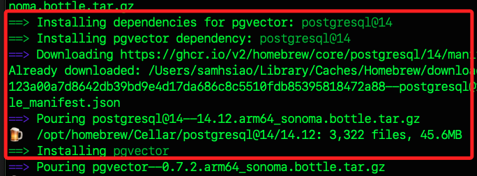

# 安裝 PostgreSQL

<br>

## 在 _MacOS_ 安裝

<br>

1. 安裝前，先檢查是否已經安裝或安裝版本。

    ```bash
    brew services list
    ```

<br>

2. 如果尚未安裝 PostgreSQL，使用 Homebrew 來安裝。

    ```bash
    brew install postgresql@15
    ```

<br>

3. 補充說明，在本地資料夾 `/opt/homebrew/Cellar/` 內的是由 Homebrew 安裝的所有套件，每個套件都有自己的一個子目錄，這些子目錄中包含該套件的不同版本；而指令 `brew services list` 顯示的是 Homebrew 管理的服務及其當前狀態，這些服務也是由 Homebrew 安裝和管理的，但僅限那些可作為服務運行的套件；所以要徹底刪除某套件時，可進行查詢。

<br>

## 關於可選拓展 `pgvector`

1. 安裝可選的拓展，`pgvector` 用於在 PostgreSQL 中進行向量搜索和相似度匹配。

    ```bash
    brew install pgvector
    ```

<br>

2. 經由安裝訊息可知，安裝預設使用了 `postgresql@14`。

    

<br>

3. 查詢可以發現此時安裝了 `14` 與 `15`，但都沒有啟動，在要使用 `pgvector` 的專案中，必須啟動 `postgresql@14`。

<br>

## 啟動

1. 透過 `brew services` 來啟動服務。

    ```bash
    brew services start postgresql@15
    ```

<br>

2. 檢查服務的狀態來確保其已啟動。

    ```bash
    brew services list
    ```

<br>

3. 停止服務。

    ```bash
    brew services stop postgresql@15
    ```

<br>

4. 卸載 PostgreSQL 15。

    ```bash
    brew uninstall postgresql@15
    ```

<br>

5. 因為 `pgvector` 可能依賴於 PostgreSQL 導致無法卸載，可以先卸載 `pgvector`。

    ```bash
    brew uninstall pgvector
    ```

<br>

___

_END_