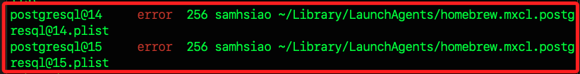
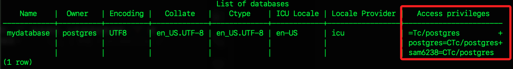

# 使用命令行操作資料庫

<br>

## PostgreSQL 建立用戶和資料庫

1. 啟動 PostgreSQL 服務器。

    ```bash
    brew services start postgresql@15
    ```

<br>

2. 若出現錯誤，可先透過 `brew` 查詢當前正在運行的 PostgreSQL 版本。

    ```bash
    brew services list
    ````

    

<br>

3. 將錯誤的服務逐一停止後，服務後重新啟動。

    ```bash
    brew services stop postgresql@15
    brew services stop postgresql@14
    ```

<br>

4. 進入本機 PostgreSQL 指定資料庫 `mydatabase`。

    ```bash
    psql mydatabase
    ```

<br>

5. 若要進入伺服器的 PostgreSQL。

    ```bash
    # 指令說明
    psql -h [NAS_IP] -p [映射的端口] -U sam6238 -d mydatabase

    # 實際指令
    psql -h 192.168.1.240 -p 5431 -U sam6238 -d mydatabase
    ```

<br>

## 查詢指令

1. 查詢當前資料庫。

    ```sql
    SELECT current_database();
    ```

<br>

2. 查看當前使用者。

    ```sql
    SELECT current_user;
    ```

<br>

3. 查看所有資料庫。

    ```sql
    \l
    # 或是
    \list
    ```

<br>

4. 查看所有使用者。

    ```sql
    \du
    ```

<br>

5. 檢查指定資料庫 `mydatabase` 的訪問權限；`C` 建立權限，允許建立新資料庫；`T` 連接權限，允許連接到資料庫；`c` 建立臨時表的權限。

    ```bash
    \l mydatabase
    ```

    

<br>

## 建立資料庫成員

1. 建立一個新的資料庫用戶同時設定密碼，這裡示範名稱是 `sam6238`、密碼是 `Sam112233`。

    ```sql
    CREATE USER sam6238 WITH PASSWORD 'Sam112233';
    ```

<br>

2. 建立一個新的資料庫 `mydatabase`，可同時指定擁有者為前一個步驟新增的用戶 `sam6238`。

    ```sql
    CREATE DATABASE mydatabase OWNER sam6238;
    ```

<br>

3. 為新用戶 `sam6238` 賦予對新資料庫 `mydatabase` 的所有權限。

    ```sql
    GRANT ALL PRIVILEGES ON DATABASE mydatabase TO sam6238;
    ```

<br>

4. 退出 PostgreSQL 命令行界面。

    ```sql
    \q
    ```

<br>

## 安裝 pgvector 擴展

1. MacOS 可使用 Homebrew 進行安裝。

    ```bash
    brew install pgvector
    ```

<br>

2. 在 PostgreSQL 命令行中建立 pgvector 擴展。

    ```sql
    CREATE EXTENSION vector;
    ```

<br>

3. 在終端機中確認 pgvector 擴展文件是否存在於目錄下。

    ```bash
    ls /opt/homebrew/share/postgresql@14/extension/
    ```
    
<br>

4. 或使用更精確的查詢指令。

    ```bash
    ls /opt/homebrew/share/postgresql@14/extension/*pg*
    ```

<br>