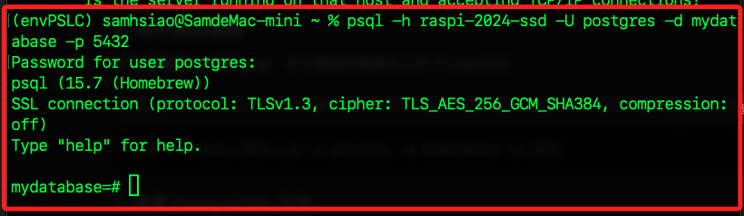

# 樹莓派安裝 PostgreSQL

_以下安裝包含 pgvector_

<br>

## 說明

1. 首先，更新樹莓派上的系統包。

    ```bash
    sudo apt-get update && sudo apt-get upgrade -y
    ```

<br>

2. 安裝 PostgreSQL 和相關的依賴包。

    ```bash
    sudo apt install postgresql postgresql-contrib -y
    ```

<br>

3. 設定為開機啟動，並立即啟動 PostgreSQL 服務。

    ```bash
    sudo systemctl enable postgresql
    sudo systemctl start postgresql
    ```

<br>

4. 切換到 PostgreSQL 用戶。

    ```bash
    sudo -i -u postgres
    ```

<br>

5. 啟動資料庫。

    ```bash
    psql
    ```

<br>

6. 在 PostgreSQL 提示符下設置密碼。

    ```sql
    \password postgres
    ```

<br>

7. 退出資料庫。

    ```sql
    \q
    ```

<br>

8. 退出 PostgreSQL 用戶。

    ```bash
    exit
    ```

<br>

## 安裝和配置 pgvector

1. 安裝必要的編譯工具。

    ```bash
    sudo apt install build-essential git postgresql-server-dev-all -y
    ```

<br>

## 從官方庫下載 pgvector 源碼並編譯安裝

1. 進入預設的臨時資料夾。

    ```bash
    cd /tmp
    ```

<br>

2. 下載並解壓縮文件。

    ```bash    
    git clone --branch v0.7.2 https://github.com/pgvector/pgvector.git
    ```

<br>

3. 進入解壓縮的文件夾。

    ```bash
    cd pgvector
    ```

<br>

4. 按照 Makefile 中的規則來編譯源代碼並生成可執行文件或其他目標文件。

    ```bash
    make
    ```

<br>

5. 用來安裝已經編譯好的軟件。make install 指令也會讀取 Makefile 中的規則，將編譯產生的可執行文件、庫文件、配置文件等拷貝到系統的合適位置，通常是 /usr/local/bin、/usr/local/lib 等目錄。

    ```bash
    sudo make install
    ```

<br>

## 啟用 pgvector 擴展

1. 連接到 PostgreSQL 的預設資料庫 postgres。

    ```bash
    psql -h localhost -U postgres -d postgres
    ```

<br>

2. 建立新的資料庫 mydatabase，切記加上 `;`，否則指令不會完成，完成時會顯示 `CREATE DATABASE`。

    ```sql
    CREATE DATABASE mydatabase;
    ```

<br>

3. 退出。

    ```sql
    \q
    ```

<br>

4. 再次使用 `psql` 連接到 PostgreSQL。

    ```bash
    psql -h localhost -U postgres -d mydatabase
    ```

<br>

## 啟用 pgvector 擴展

_在需要使用的 `個別資料庫` 中進行啟用 pgvector 擴展_

<br>

1. 在 psql 提示符下執行，成功建立時會顯示 `CREATE EXTENSION`。

    ```sql
    CREATE EXTENSION vector;
    ```

<br>

## 使用 pgvector

1. 建立包含向量列的表

    ```sql
    CREATE TABLE items (id bigserial PRIMARY KEY, embedding vector(3));
    ```

<br>

2. 插入向量數據。

    ```sql
    INSERT INTO items (embedding) VALUES ('[1,2,3]'), ('[4,5,6]');
    ```

<br>

3. 按 L2 距離檢索最近鄰

    ```sql
    SELECT * FROM items ORDER BY embedding <-> '[3,1,2]' LIMIT 5;
    ```

<br>

## 遠程連線樹莓派 PostgreSQL

1. 編輯 postgresql.conf 文件。

    ```bash
    sudo nano /etc/postgresql/15/main/postgresql.conf
    ```

<br>

2. 找到其中的 `listen_addresses = 'localhost'` 設定並進行修改，將參數值改為 `*` 表示允許外部連接。

    ```bash
    # 改為
    listen_addresses = '*'
    # listen_addresses = 'localhost'	
    ```

<br>

3. 編輯 pg_hba.conf 文件。允許外部 IP 地址的連接

    ```bash
    sudo nano /etc/postgresql/15/main/pg_hba.conf
    ```

<br>

4. 在最尾端添加以下內容，允許從所有 IP 地址連接。

    ```bash
    host    all             all             0.0.0.0/0               md5
    ```

<br>

5. 每次修改配置文件後，必須重啟 PostgreSQL 服務以應用更改。

    ```bash
    sudo systemctl restart postgresql
    ```

<br>

6. 若有錯誤可檢查日誌。

    ```bash
    sudo tail -f /var/log/postgresql/postgresql-15-main.log
    ```

<br>

7. 從本機進行連線樹莓派 PostgreSQL。

    ```bash
    psql -h raspi-2024-ssd -U postgres -d mydatabase -p 5432
    ```

    

<br>

## 建立新使用者並轉移權限

_在 PostgreSQL 中，直接重命名使用者帳號是不被直接支持的，可建立一個新的使用者並轉移權限來達到同樣的效果。_

<br>

1. 建立使用者；特別注意，'使用者密碼' 必須包含括號，比如說 `'123456'`。

    ```sql
    CREATE USER '使用者名稱' WITH SUPERUSER PASSWORD '使用者密碼';
    ```

<br>

2. 將所有的資料庫改變擁有者。

    ```sql
    DO $$ 
    DECLARE 
        r RECORD;
    BEGIN 
        FOR r IN (SELECT datname FROM pg_database WHERE datistemplate = false) LOOP 
            EXECUTE 'ALTER DATABASE ' || quote_ident(r.datname) || ' OWNER TO 新使用者名稱';
        END LOOP;
    END $$;
    ```

<br>

3. 將當前資料庫的所有的表格改變擁有者。

    ```sql
    DO $$ 
    DECLARE 
        r RECORD;
    BEGIN 
        FOR r IN (SELECT tablename FROM pg_tables WHERE tableowner = 'postgres') LOOP 
            EXECUTE 'ALTER TABLE ' || quote_ident(r.tablename) || ' OWNER TO 新使用者名稱';
        END LOOP;
    END $$;
    ```

<br>

4. 將當前資料庫的所有的序列改變擁有者。

    ```sql
    DO $$ 
    DECLARE 
        r RECORD;
    BEGIN 
        FOR r IN (SELECT sequence_name FROM information_schema.sequences WHERE sequence_schema = 'public') LOOP 
            EXECUTE 'ALTER SEQUENCE ' || quote_ident(r.sequence_name) || ' OWNER TO 新使用者名稱';
        END LOOP;
    END $$;
    ```

<br>

5. 將當前資料庫的所有的視圖改變擁有者。

    ```sql
    DO $$ 
    DECLARE 
        r RECORD;
    BEGIN 
        FOR r IN (SELECT table_name FROM information_schema.views WHERE table_schema = 'public') LOOP 
            EXECUTE 'ALTER VIEW ' || quote_ident(r.table_name) || ' OWNER TO 新使用者名稱';
        END LOOP;
    END $$;
    ```

<br>

6. 在確認所有權限已經轉移後，可刪除原 postgres 使用者。

    ```sql
    DROP USER postgres;
    ```

<br>

## 檢查

1. 列出所有資料庫並檢查擁有者。

    ```sql
    SELECT datname, pg_catalog.pg_get_userbyid(datdba) AS owner
    FROM pg_database
    WHERE datistemplate = false;
    ```

<br>

2. 檢查當前資料庫中所有表格的擁有者。

    ```sql
    SELECT tablename, tableowner
    FROM pg_tables
    WHERE schemaname = 'public';
    ```

<br>

3. 檢查當前資料庫中所有序列的擁有者。

    ```sql
    SELECT sequence_name, sequence_schema,
        pg_catalog.pg_get_userbyid(c.relowner) AS owner
    FROM information_schema.sequences s
    JOIN pg_catalog.pg_class c ON s.sequence_name = c.relname
    WHERE sequence_schema = 'public';
    ```

<br>

4. 檢查當前資料庫中所有視圖的擁有者。

    ```sql
    SELECT table_name, table_schema, pg_catalog.pg_get_userbyid(c.relowner) AS owner
    FROM information_schema.views v
    JOIN pg_catalog.pg_class c ON v.table_name = c.relname
    WHERE table_schema = 'public';
    ```

<br>

5. 嘗試建立一個測試視圖來確認查詢的正確性。

    ```sql
    CREATE VIEW test_view AS
    SELECT 1 AS test_column;

    SELECT table_name, table_schema, pg_catalog.pg_get_userbyid(c.relowner) AS owner
    FROM information_schema.views v
    JOIN pg_catalog.pg_class c ON v.table_name = c.relname
    WHERE table_schema = 'public';
    ```

<br>

___

_END_