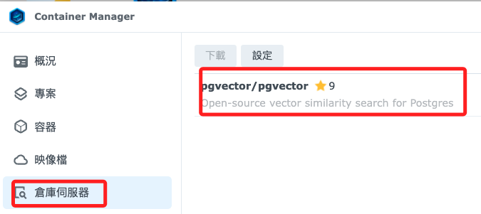
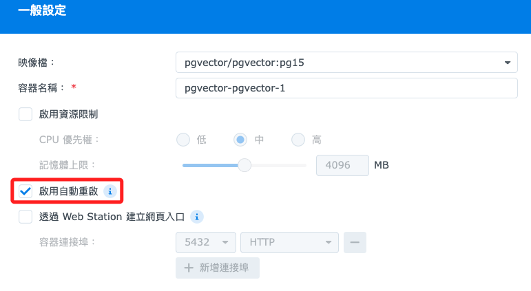
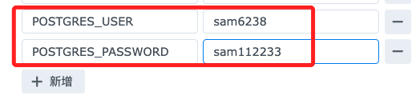
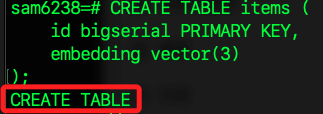
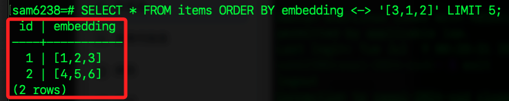

# 群暉中安裝 pgvector

[鏡像地址](https://hub.docker.com/r/pgvector/pgvector)

<br>

## 說明

1. 搜尋 `pgvector/pgvector`

    

<br>

2. 嘗試下載 `pg15`。

    

<br>

3. 勾選 `啟用自動重啟`，其餘皆預設。

    

<br>

4. 端口設置為 `5433`。

    

<br>

5. 可在本地電腦先檢查端口。

    ```bash
    lsof -i :5433
    ```

<br>

6. 添加兩個環境參數。

    ```bash
    POSTGRES_USER=
    POSTGRES_PASSWORD=
    ```

    

<br>

7. 在儲存空間部分，先點擊 `新增` 建立一個資料夾 `pgvector`。

    

<br>

8. 接著先選擇 `docker`。

    

<br>

9. 再輸入 `/pgvector`。

    

<br>

10. 點擊下一步，然後點擊 `完成`。

    

<br>

## 連線

1. 連線指令。

    ```bash
    psql -h 192.168.1.240 -p 5433 -U sam6238
    ```

<br>

## 測試 pgvector

_如果沒有報錯並能夠成功檢索數據，則表示 `pgvector` 安裝並運行正常_

<br>

1. 在 PostgreSQL 數據庫中執行以下命令來創建 `vector` 擴展。

    ```sql
    CREATE EXTENSION vector;
    ```

    

<br>

2. 創建一個包含向量列的表格 `items`。

    ```sql
    CREATE TABLE items (
        id bigserial PRIMARY KEY,
        embedding vector(3)
    );
    ```

    

<br>

3. 插入一些向量數據到 `items` 表中。

    ```sql
    INSERT INTO items (embedding) VALUES ('[1,2,3]'), ('[4,5,6]');
    ```

    

<br>

4. 使用 `pgvector` 的距離函數來檢索數據，例如按 L2 距離排序。

    ```sql
    SELECT * FROM items ORDER BY embedding <-> '[3,1,2]' LIMIT 5;
    ```

    

<br>

___

_END_

