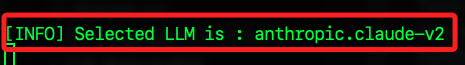
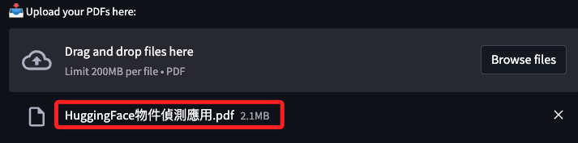
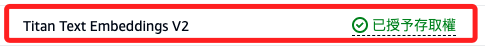
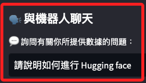
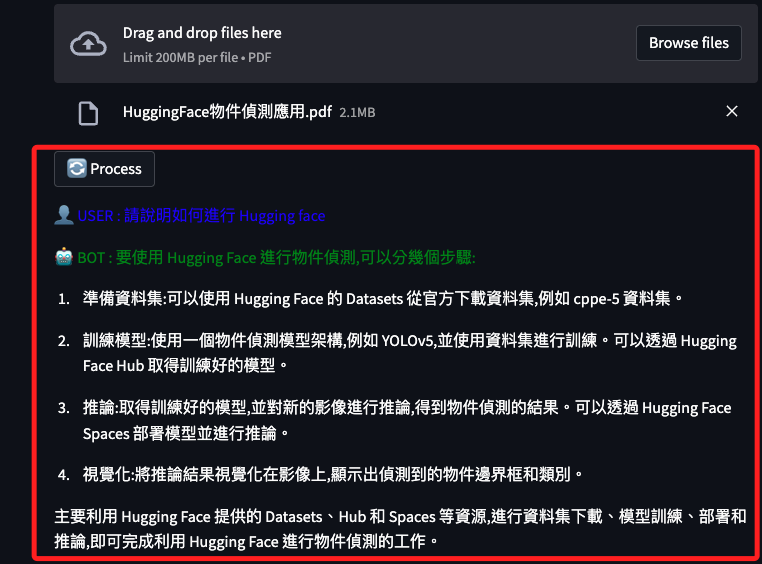

# 高階機器人

_使用 PostgreSQL 作為向量儲存、使用 Anthropic 模型_

<br>

## 運作過程

_這個專案是一個 `Streamlit 應用`，使用 `PostgreSQL` 和 `pgvector` 進行 `向量儲存` 和 `向量檢索`，並且利用 `AWS 的 Anthropic 模型` 來回答用戶的問題。_

<br>

1. 在 `數據清洗` 部分，使用 `PyPDF2` 讀取 PDF 文件，提取並過濾掉 NUL 字串；另外，使用 `RecursiveCharacterTextSplitter` 將文本分割成更小的文本塊，以便更有效地進行處理和檢索。

<br>

2. 在 `生成嵌入向量` 部分，使用 `BedrockEmbeddings` 生成文本嵌入向量，並使用 `PGVector` 將嵌入向量儲存到 `PostgreSQL` 中；特別注意，相同的文件每次進行處理生成的向量儲存可能會有所不同，因為嵌入模型和處理過程中的隨機性會影響結果。

<br>

3. 在 `長期記憶` 部分，使用 `ConversationBufferMemory` 和 `PostgresChatMessageHistory` 管理和儲存對話歷史；另外，使用 `ConversationalRetrievalChain` 建立基於檢索的對話鏈。

<br>

4. 在 `生成回答` 部分，使用檢索到的文本向量作為上下文，通過選擇的 LLM 模型如 `anthropic.claude-v2` 生成自然語言回答。

<br>

## 使用套件

_本專案將使用到以下的套件_

<br>

1. Streamlit。

2. PyPDF2：用於處理 PDF 文件。

3. LangChain：_後續將詳細說明_。

4. boto3：用於與 AWS 服務進行互動的 SDK，支持操作 S3、DynamoDB、EC2 等多種 AWS 服務。

5. tempfile：用於建立臨時文件和目錄，提供了一個安全的方式來建立臨時文件，這些文件在使用後可以自動刪除。

6. time：提供時間相關的功能，支持取得當前時間、進行時間計算、模擬延遲等操作。

7. hashlib：用於生成哈希值和進行加密操作，支持多種哈希算法，如 MD5、SHA-1、SHA-256 等，用於生成數據的唯一標識符。

8. secrets：用於生成安全的隨機數和密碼，提供了更高安全性的隨機數生成方法，適用於加密密鑰、隨機標識符等場合。

9. logging：提供記錄和跟蹤應用運行過程中發生的事件，支持多種日誌級別（如 DEBUG、INFO、WARNING、ERROR、CRITICAL），便於進行應用的故障排除和性能分析。

<br>

## LangChain 模組或類

_本專案將使用到的 LangChain 模組或類如下，其中 vectorstores.pgvector 是模組_

<br>

1. vectorstores.pgvector：使用 pgvector 進行向量儲存，支持高效的向量檢索操作。

2. memory.ConversationBufferMemory：用於管理對話的內存，以便能夠追蹤對話上下文。

3. chains.ConversationalRetrievalChain：用於建立一個基於檢索的對話鏈。

4. text_splitter.RecursiveCharacterTextSplitter：用於將長文本分割成更小的文本塊，以便更有效地進行處理和檢索。

5. llms.bedrock.Bedrock：用於與 Bedrock LLM 進行互動，支持不同的 LLM 模型。

6. embeddings.BedrockEmbeddings：用於生成文本的嵌入表示，以便在向量儲存中使用。

7. document_loaders.S3FileLoader：用於從 S3 中載入文件。

8. document_loaders.csv_loader.CSVLoader：用於載入和處理 CSV 文件。

9. document_loaders.YoutubeLoader：用於從 YouTube 載入和處理字幕或轉錄文本。

10. document_loaders.UnstructuredPowerPointLoader：用於處理和載入 PowerPoint 文件。

11. document_loaders.Docx2txtLoader：用於處理和載入 Word 文件。

12. memory.PostgresChatMessageHistory：用於管理和儲存對話歷史的 PostgreSQL 記錄。

<br>

## 準備工作

1. 本專案使用了多種套件，避免版本衝突，建議建立新的虛擬環境來運行專案；這裡沿用前面資料庫基本操作時建立的 `envPSLC`；以下各點指令僅作提示，程序不再贅述。

    ```bash
    python -m venv envPSLC
    ```

<br>

2. 啟動虛擬環境，或寫入 `.zshrc`。

    ```bash
    source /Users/samhsiao/Documents/PythonVenv/envPSLC/bin/activate
    ```

<br>

3. 建立並進入專案資料夾。 

    ```bash
    cd ~/Desktop && mkdir _exPSLC_ && cd _exPSLC_
    ```

<br>

4. 建立主腳本、套件管理文件、環境變數管理文件、原始檔控制文件；若沿用之前資料夾，僅需建立前兩項。

    ```bash
    touch app.py requirements.txt .env .gitignore
    
    # 若沿用之前資料夾，僅需建立前兩項
    touch app.py requirements.txt
    ```

<br>

5. 啟動 VSCode。

    ```bash
    code .
    ```

<br>

6. 在 `.gitignore` 文件中寫入 `.env`。

    ```bash
    .env
    ```

<br>

## 安裝套件

1. 編輯 `requirements.txt` 文件，並指定各套件的版本。

    ```bash
    SQLAlchemy==2.0.19
    streamlit==1.12.0
    streamlit-chat==0.1.1
    langchain==0.0.312
    boto3==1.28.61
    botocore==1.31.61
    altair==4.0.0
    pydantic==1.10.9
    psycopg==3.1.10
    psycopg-binary==3.1.10
    psycopg2-binary==2.9.6
    pgvector==0.2.3
    fake-useragent==1.3.0
    beautifulsoup4==4.12.2
    PyPDF2==3.0.1
    youtube-transcript-api
    unstructured
    python-pptx
    unstructured[pdf]
    python-dotenv==1.0.0
    ```

<br>

2. 先主動更新 pip。

    ```bash
    pip install --upgrade pip
    ````

<br>

3. 在這些套件中，仍有部分會自動使用過時的 `setup.py install` 方法進行安裝，而不是以 `PEP 517/518 標準` 使用 `pyproject.toml` 文件，這導因於套件的設置，所以在安裝時加入參數 `--use-pep517`；請確實觀察安裝過程無錯誤訊息。

    ```bash
    pip install --use-pep517 -r requirements.txt
    ```

<br>

## 建立環境變數

1. 編輯 `.env` 文件管理敏感資訊，並確認所有密鑰皆已寫入；與之前相同，並無添加項目。

    ```json
    PGVECTOR_DRIVER='psycopg2'
    PGVECTOR_USER=<自己的資料庫帳號>
    PGVECTOR_PASSWORD=<自己的資料庫密碼>
    PGVECTOR_HOST='localhost'
    PGVECTOR_PORT=5432
    PGVECTOR_DATABASE=<要使用的資料庫名稱>
    ```

<br>

2. 在腳本中使用這些環境參數。

    ```python
    PGVECTOR_DRIVER = os.getenv('PGVECTOR_DRIVER')
    PGVECTOR_USER = os.getenv('PGVECTOR_USER')
    PGVECTOR_PASSWORD = os.getenv('PGVECTOR_PASSWORD')
    PGVECTOR_HOST = os.getenv('PGVECTOR_HOST')
    PGVECTOR_PORT = os.getenv('PGVECTOR_PORT')
    PGVECTOR_DATABASE = os.getenv('PGVECTOR_DATABASE')
    ```

<br>

3. _特別注意_，因為使用 `os.getenv()` 在腳本最開始處取得環境參數，所以也要在腳本最開始處調用 `load_dotenv()` 以載入環境變數；若使用 `os.environ.get()`，則可以在 `if __name__ == '__main__'` 區塊再調用 `load_dotenv()` 來載入環境參數。

<br>

## os.getenv() vs os.environ.get()

_兩者的差異在於載入環境變數的時機和方式_

<br>

1. `os.getenv()` 在調用時會直接搜尋環境變數，因此必須在腳本一開始調用 `load_dotenv()` 來載入環境變數，否則 `os.getenv()` 將無法獲取正確的值。

<br>

2. `os.environ.get()` 搜尋的是當前環境中的變數，可以在任何時候搜尋，只要在搜尋之前環境變數已經被載入到 os.environ 中。因此，可以在腳本運行過程中的任何地方載入環境變數。

<br>

## 專案開發

1. 編輯主腳本 `app.py`，避免佔用篇幅，請滑動到講義最下方複製；編輯完成進行啟用。

    ```bash
    streamlit run app.py
    ```

<br>

2. 啟動後在終端機會顯示。

    

<br>

3. 示範載入一個 PDF，點擊 `Process`。

    

<br>

4. 出現錯誤。

    ```bash
    取得向量儲存發生錯誤：Error raised by inference endpoint: An error occurred (AccessDeniedException) when calling the InvokeModel operation: You don't have access to the model with the specified model ID.
    ```

<br>

5. 經查當前腳本預設使用的是 `v1`，尚未取得 `AWS` 的許可。

    ```python
    embeddings = BedrockEmbeddings(
        model_id="amazon.titan-embed-text-v1",
        region_name="us-east-1"
    )
    ```

<br>

6. 進入 AWS 申請 `v2`，這個模型會立即取得授權，無需等待。

    

<br>

7. 改寫腳本。

    ```python
    embeddings = BedrockEmbeddings(
        model_id="amazon.titan-embed-text-v2",
        region_name="us-east-1"
    )
    ```

<br>

8. 再次運行發生錯誤。

    ```bash
    取得向量儲存發生錯誤：Error raised by inference endpoint: An error occurred (ValidationException) when calling the InvokeModel operation: The provided model identifier is invalid.
    ```

<br>

9. 透過之前的功能腳本查詢模型 ID 應該是 `v2:0`

    ```python
    model_id="amazon.titan-embed-text-v2:0"
    ```

<br>

10. 修改後運行還是出錯。

    ```bash
    取得向量儲存發生錯誤：A string literal cannot contain NUL (0x00) characters.
    ```

<br>

11. 這是因為提供的 PDF 文本中存在 `NUL 字串（0x00）`，這會導致系統無法正常處理這些數據，因為使用 `PGVector.from_texts` 或 `PGVector` 時，這種字串會導致無法儲存或處理文本數據，需要在讀取和處理 PDF 文件時過濾掉這些 NUL 字串；以下修改 `get_pdf_text` 以及 `get_text_chunks` 函數以加入過濾 NUL 字串的邏輯。

    ```python
    # get_pdf_text
    def get_pdf_text(pdf_docs):
        text = ""
        for pdf in pdf_docs:
            pdf_reader = PdfReader(pdf)
            for page in pdf_reader.pages:
                # text += page.extract_text()
                # 改用 page_text，後面再傳回
                page_text = page.extract_text()
                # 過濾掉 NUL 字串
                if page_text:
                    text += page_text.replace('\x00', '')
        return text


    # get_text_chunks
    def get_text_chunks(text):
        # 確保在分割文本塊前過濾掉 NUL 字串
        cleaned_text = text.replace('\x00', '')
        text_splitter = RecursiveCharacterTextSplitter(
            separators=["\n\n", "\n", ".", "!", "?", ",", " ", ""],
            chunk_size=512,
            chunk_overlap=103,
            length_function=len,
        )
        chunks = text_splitter.split_text(cleaned_text)
        return chunks
    ```

<br>

12. 再次提交 `PDF` 文件後正確讀取，在側邊欄可輸入要提問的問題。

    

<br>

13. 下方會顯示答案。

    

<br>

## 完整腳本

1. 程式碼。

    ```python
    import streamlit as st
    from PyPDF2 import PdfReader
    from langchain.vectorstores.pgvector import PGVector
    from langchain.memory import ConversationBufferMemory
    from langchain.chains import ConversationalRetrievalChain
    from langchain.text_splitter import RecursiveCharacterTextSplitter
    from langchain.llms.bedrock import Bedrock
    from langchain.embeddings import BedrockEmbeddings
    from langchain.document_loaders import S3FileLoader
    from langchain.document_loaders.csv_loader import CSVLoader
    from langchain.document_loaders import YoutubeLoader
    from langchain.document_loaders import UnstructuredPowerPointLoader
    from langchain.document_loaders import Docx2txtLoader
    from langchain.memory import PostgresChatMessageHistory
    import boto3
    import tempfile
    import time
    import hashlib
    import secrets
    import os
    from dotenv import load_dotenv
    import logging

    # 載入環境變數
    load_dotenv()
    # 注意，`environ.get` 或 `os.getenv` 兩者在本質上是有差異的
    # 但我偏向程式碼整潔，所以在程序一開始之處就載入 `load_dotenv()`
    # 這樣的載入方式使用 `environ.get` 或 `os.getenv` 並無差異
    PGVECTOR_DRIVER = os.getenv("PGVECTOR_DRIVER")
    PGVECTOR_USER = os.getenv("PGVECTOR_USER")
    PGVECTOR_PASSWORD = os.getenv("PGVECTOR_PASSWORD")
    PGVECTOR_HOST = os.getenv("PGVECTOR_HOST")
    PGVECTOR_PORT = os.getenv("PGVECTOR_PORT")
    PGVECTOR_DATABASE = os.getenv("PGVECTOR_DATABASE")
    #
    logging.getLogger("botocore").setLevel(logging.ERROR)


    # 這函數僅作為在有連線錯誤時檢測之用，應用中並無調用
    def debug_01():
        # 檢查資料庫的 URI 是否正確；這裡因為太長，所以進行摺行
        CONNECTION_STRING = f"://{PGVECTOR_USER}:{PGVECTOR_PASSWORD}"
        f"@{PGVECTOR_HOST}:{PGVECTOR_PORT}/{PGVECTOR_DATABASE}"
        # 確保正確輸出連接字串，便於檢查
        print(f"CONNECTION_STRING: {CONNECTION_STRING}")


    # 定義應用的標題，傳入字串
    def styled_header(text):
        header_html = f"""
        <div style="background-color:#4CAF50;text-align:center;padding:10px">
        <h1 style="color:white;text-align:center;">{text}</h1>
        </div>
        """
        return header_html


    # 定義子標題：傳入字串，其他參數有預設值
    def styled_subheader(
        text,
        font_size="24px",
        color="#8A2BE2",
        background_color="#f0e5ff"
    ):
        subheader_html = f"""
        <div style="box-shadow:0 2px 10px #ddd; padding: 5px;"
        " background-color: {background_color};"
        " border-radius: 5px; margin: 10px 0; text-align: center;">
            <h3 style="color: {color}; font-size: {font_size};"
            " margin: 0;">{text}</h3>
        </div>
        """
        return subheader_html


    def generate_session_id():
        t = int(time.time() * 1000)
        r = secrets.randbelow(1000000)
        return hashlib.md5(
            bytes(str(t) + str(r), "utf-8"),
            usedforsecurity=False
        ).hexdigest()


    def get_pdf_text(pdf_docs):
        text = ""
        for pdf in pdf_docs:
            pdf_reader = PdfReader(pdf)
            for page in pdf_reader.pages:
                # text += page.extract_text()
                # 改用 page_text，後面再傳回
                page_text = page.extract_text()
                # 過濾掉 NUL 字串
                if page_text:
                    text += page_text.replace('\x00', '')
        return text


    def get_text_chunks(text):
        # 確保在分割文本塊前過濾掉 NUL 字串
        cleaned_text = text.replace('\x00', '')
        text_splitter = RecursiveCharacterTextSplitter(
            separators=["\n\n", "\n", ".", "!", "?", ",", " ", ""],
            chunk_size=512,
            chunk_overlap=103,
            length_function=len,
        )
        # chunks = text_splitter.split_text(text)
        chunks = text_splitter.split_text(cleaned_text)
        return chunks


    def get_vectorstore(text_chunks):
        embeddings = BedrockEmbeddings(
            model_id="amazon.titan-embed-text-v2:0",
            # 預設是 `-2`，這裡改一下
            region_name="us-east-1"
        )
        try:
            if text_chunks is None:
                return PGVector(
                    connection_string=CONNECTION_STRING,
                    embedding_function=embeddings,
                )
            return PGVector.from_texts(
                texts=text_chunks,
                embedding=embeddings,
                connection_string=CONNECTION_STRING
            )
        except Exception as e:
            # 原本的腳本是引發錯誤
            # raise e
            # 改為輸出錯誤看一下
            print(f'取得向量儲存發生錯誤：{e}')


    def get_bedrock_llm(selected_llm):
        print(f"[INFO] Selected LLM is : {selected_llm}")
        if selected_llm in [
            "anthropic.claude-v2",
            "anthropic.claude-v1",
            "anthropic.claude-instant-v1",
        ]:
            llm = Bedrock(
                model_id=selected_llm,
                model_kwargs={"max_tokens_to_sample": 4096}
            )

        elif selected_llm in [
            "amazon.titan-tg1-large",
            "amazon.titan-text-express-v1",
            "amazon.titan-text-lite-v1",
        ]:
            llm = Bedrock(
                model_id=selected_llm,
                model_kwargs={
                    "maxTokenCount": 4096,
                    "stopSequences": [],
                    "temperature": 0,
                    "topP": 1,
                },
            )
        else:
            raise ValueError(f"Unsupported LLM: {selected_llm}")

        return llm


    def get_conversation_chain(vectorstore, selected_llm):
        # 註解掉
        # llm = Bedrock(
        #     model_id="anthropic.claude-instant-v1",
        #     region_name="us-west-2"
        # )
        llm = get_bedrock_llm(selected_llm)
        _connection_string = CONNECTION_STRING.replace(
            "+psycopg2", "").replace(":5432", "")
        message_history = PostgresChatMessageHistory(
            connection_string=_connection_string, session_id=generate_session_id()
        )
        memory = ConversationBufferMemory(
            memory_key="chat_history",
            chat_memory=message_history,
            return_source_documents=True,
            return_messages=True,
        )
        conversation_chain = ConversationalRetrievalChain.from_llm(
            llm=llm, retriever=vectorstore.as_retriever(), memory=memory
        )
        return conversation_chain


    def color_text(text, color="black"):
        return f'<span style="color:{color}">{text}</span>'


    bot_template = "🤖 BOT : {0}"
    user_template = "👤 USER : {0}"


    def handle_userinput(user_question):
        bot_template = "🤖 BOT : {0}"
        user_template = "👤 USER : {0}"
        try:
            response = st.session_state.conversation({"question": user_question})
            st.markdown(
                color_text(
                    user_template.format(response["question"]),
                    color="blue"
                ),
                unsafe_allow_html=True,
            )
            st.markdown(
                color_text(
                    bot_template.format(response["answer"]),
                    color="green"
                ),
                unsafe_allow_html=True,
            )
            print("Response", response)
        except ValueError as e:
            st.write(e)
            st.write("😞 抱歉，請換個方式再問一次。")
            return
        st.session_state.chat_history = response["chat_history"]
        for i, message in enumerate(st.session_state.chat_history):
            if i % 2 == 0:
                st.markdown(
                    color_text(
                        user_template.format(message.content),
                        color="blue"
                    ),
                    unsafe_allow_html=True,
                )

            else:
                st.markdown(
                    color_text(
                        bot_template.format(message.content),
                        color="green"
                    ),
                    unsafe_allow_html=True,
                )


    def main():
        # 更新標題樣式
        st.markdown(
            styled_header(
                "AI 問答系統：使用 pgvector, Amazon Aurora"
                " & Amazon Bedrock 📚🦜"
            ),
            # 允許在 markdown 字串中使用 HTML 代碼
            unsafe_allow_html=True
        )

        # 來源形式列表
        options = [
            "📄 PDFs",
            "☁️ S3 Bucket",
            "📺 Youtube",
            "📑 CSV", "🖼️ PPT",
            "📝 Word"
        ]
        # 使用單選按鈕而不是選擇框
        st.markdown(
            styled_subheader("📌 選擇一個來源 📌"),
            # 允許在 markdown 字串中使用 HTML 代碼
            unsafe_allow_html=True
        )

        # 網頁元件，選擇來源
        selected_source = st.radio("", options)

        # 添加 LLM 選單元件
        st.markdown(
            styled_subheader("🤖 選擇一個模型 🤖"),
            unsafe_allow_html=True
        )

        # 模型列表
        llm_options = [
            "anthropic.claude-v2",
            "anthropic.claude-instant-v1",
            "amazon.titan-tg1-large",
            "amazon.titan-text-express-v1",
            "amazon.titan-text-lite-v1",
        ]

        # 網頁元件，選擇模型：這個 radio 特別加上參數，僅僅是用來對比前一個
        selected_llm = st.radio("Choose an LLM", options=llm_options)

        # PDF
        if selected_source == "📄 PDFs":
            pdf_docs = st.file_uploader(
                "📥 這裡上傳 PDF 文件：",
                type="pdf",
                accept_multiple_files=True
            )
            if st.button("🔄 進行"):
                with st.spinner("🔧 進行中 ..."):
                    raw_text = get_pdf_text(pdf_docs)
                    text_chunks = get_text_chunks(raw_text)
                    vectorstore = get_vectorstore(text_chunks)
                    if vectorstore is None:
                        st.write("初始化向量儲存失敗。")
                        return
                    st.session_state.conversation = get_conversation_chain(
                        vectorstore, selected_llm
                    )
        elif selected_source == "☁️ S3 Bucket":
            s3_client = boto3.client("s3")
            # 這些物件儲存在 aurora-genai-2023 儲存桶中
            # 輸入適當的儲存桶名稱
            response = s3_client.list_objects_v2(
                # 將儲存桶名稱變更為自己的儲存桶名稱
                Bucket="aurora-genai-2023",
                Prefix="documentEmbeddings/"
            )
            document_keys = [
                obj["Key"].split("/")[1]
                for obj in response["Contents"]
            ][1:]
            user_input = st.selectbox(
                "Select an S3 document and click on 'Process'",
                document_keys
            )
            if st.button("Process"):
                with st.spinner("Processing"):
                    prefix = "documentEmbeddings/" + user_input
                    loader = S3FileLoader("aurora-genai-2023", prefix)
                    docs = loader.load()
                    for i in docs:
                        text_chunks = get_text_chunks(i.page_content)
                        vectorstore = get_vectorstore(text_chunks)
                        if vectorstore is None:
                            st.write("Failed to initialize vector store.")
                            return
                    st.session_state.conversation = get_conversation_chain(
                        vectorstore, selected_llm
                    )
        elif selected_source == "📑 CSV":
            csv_docs = st.file_uploader(
                "Upload your CSV here and click on 'Process'",
                type="csv",
                accept_multiple_files=False,
            )
            if st.button("Process"):
                with st.spinner("Processing"):
                    with tempfile.NamedTemporaryFile(delete=False) as tmp_file:
                        tmp_file.write(csv_docs.getvalue())
                        tmp_file_path = tmp_file.name
                    loader = CSVLoader(
                        file_path=tmp_file_path,
                        encoding="utf-8",
                        csv_args={"delimiter": ","},
                    )
                    docs = loader.load()
                    for i in docs:
                        text_chunks = get_text_chunks(i.page_content)
                        vectorstore = get_vectorstore(text_chunks)
                        if vectorstore is None:
                            st.write("Failed to initialize vector store.")
                            return
                    st.session_state.conversation = get_conversation_chain(
                        vectorstore, selected_llm
                    )
        elif selected_source == "📺 Youtube":
            user_input = st.text_input("輸入 YouTube 連結並點擊「Process」")
            if st.button("Process"):
                with st.spinner("Processing"):
                    loader = YoutubeLoader.from_youtube_url(user_input)
                    transcript = loader.load()
                    for i in transcript:
                        text_chunks = get_text_chunks(i.page_content)
                        vectorstore = get_vectorstore(text_chunks)
                        if vectorstore is None:
                            st.write("無法初始化向量儲存。")
                            return
                    st.session_state.conversation = get_conversation_chain(
                        vectorstore, selected_llm
                    )

        elif selected_source == "🖼️ PPT":
            ppt_docs = st.file_uploader(
                "在此上傳您的 PPT，然後按一下「Process」",
                type=["ppt", "pptx"],
                accept_multiple_files=False,
            )
            if st.button("Process"):
                with st.spinner("Processing"):
                    with tempfile.NamedTemporaryFile(delete=False) as tmp_file:
                        tmp_file.write(ppt_docs.getvalue())
                        tmp_file_path = tmp_file.name
                    loader = UnstructuredPowerPointLoader(tmp_file_path)
                    docs = loader.load()
                    for i in docs:
                        text_chunks = get_text_chunks(i.page_content)
                        vectorstore = get_vectorstore(text_chunks)
                        if vectorstore is None:
                            st.write("無法初始化向量儲存。")
                            return
                    st.session_state.conversation = get_conversation_chain(
                        vectorstore, selected_llm
                    )

        elif selected_source == "📝 Word":
            word_docs = st.file_uploader(
                "在此處上傳您的 Word 文件，然後按一下「Process」",
                type=["docx"],
                accept_multiple_files=False,
            )
            if st.button("Process"):
                with st.spinner("Processing"):
                    with tempfile.NamedTemporaryFile(delete=False) as tmp_file:
                        tmp_file.write(word_docs.getvalue())
                        tmp_file_path = tmp_file.name
                    loader = Docx2txtLoader(tmp_file_path)
                    docs = loader.load()
                    for i in docs:
                        text_chunks = get_text_chunks(i.page_content)
                        vectorstore = get_vectorstore(text_chunks)
                        if vectorstore is None:
                            st.write("無法初始化向量儲存。")
                            return
                    st.session_state.conversation = get_conversation_chain(
                        vectorstore, selected_llm
                    )

        st.sidebar.header("🗣️ 與機器人聊天")
        user_question = st.sidebar.text_input("💬 詢問有關你所提供數據的問題：")
        if user_question:
            handle_userinput(user_question)

        if "conversation" not in st.session_state:
            st.session_state.conversation = get_conversation_chain(
                get_vectorstore(None), selected_llm
            )
        if "chat_history" not in st.session_state:
            st.session_state.chat_history = None


    # 輸入資料庫名稱
    if __name__ == "__main__":
        # 若在 `__main__` 中載入則必須使用 `environ.get` 來讀取並寫入環境參數
        # load_dotenv()

        CONNECTION_STRING = PGVector.connection_string_from_db_params(
            driver=PGVECTOR_DRIVER,
            user=PGVECTOR_USER,
            password=PGVECTOR_PASSWORD,
            host=PGVECTOR_HOST,
            port=PGVECTOR_PORT,
            database=PGVECTOR_DATABASE,
        )

        main()

    ```

<br>

___

_END_