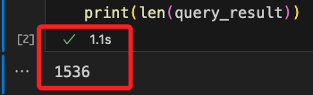
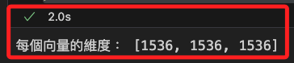

# 嵌入向量 Embedding Vector

_將數據轉換為嵌入向量_

<br>

## 說明

1. 從 LangChain 的 embedding 模組中導入 BedrockEmbeddings 類。

    ```python
    # BedrockEmbeddings 類別是用來將文本轉換成嵌入向量的工具
    from langchain.embeddings import BedrockEmbeddings
    ```

<br>

2. 嵌入一個句子。

    ```python
    # 建立嵌入向量的物件
    embeddings = BedrockEmbeddings()
    # 自訂一段字串
    text = "新德里是印度的首都"
    # 透過嵌入向量物件將字串文字轉換為嵌入向量
    query_result = embeddings.embed_query(text)
    # 向量的長度就是向量的維度
    print(len(query_result))
    ```

<br>

3. 觀察向量的長度，這就是向量的維度。

    

<br>

4. 嵌入列表。

    ```python
    # 建立一個 BedrockEmbeddings 類別的實例
    embeddings = BedrockEmbeddings()
    texts = ["新德里是印度的首都", "歡迎來到印度", "我今天要去踢足球"]
    # 改用 embed_documents 將列表轉換為嵌入向量
    doc_vectors = embeddings.embed_documents(texts)
    # 向量的長度就是向量的維度
    print(f"每個向量的維度： {[len(i) for i in doc_vectors]}")
    ```

<br>

5. 顯示的長度列表就是維度的列表。

    

<br>

___

_END_