# 安裝 Docker

_在三個系統的安裝皆不同，以下為 Windows 系統的安裝指引_

<br>

## 先安裝 WSL

_就是子系統 Windows Subsystem for Linux_

<br>

1. 假如是使用專案版以上。

    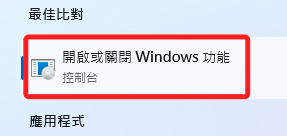

<br>

2. 可直接進入控制台勾選設定選項。

    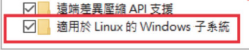

<br>

3. 假如在其他沒有這個選項的版本：如家用版。

    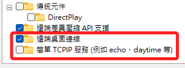

<br>

4. 可使用終端機進行安裝。

    ```bash
    wsl --install
    ```

<br>

5. 完成時需要重新開機

    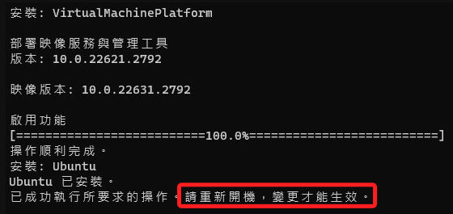

    _假如是在有還原卡的設備，進行到這個步驟就玩完了，雖然還有其他處置方式，這裡先略過。_

<br>

## 安裝 Linux 環境

_這只是補充，非必要的步驟_

<br>

1. 完成 WSL 設置後可進入商店。

    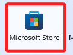

<br>

2. 搜尋 `Ubuntu` 的相關應用。

    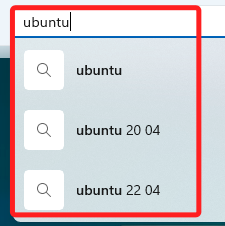

<br>

3. 任意安裝一個來測試。

    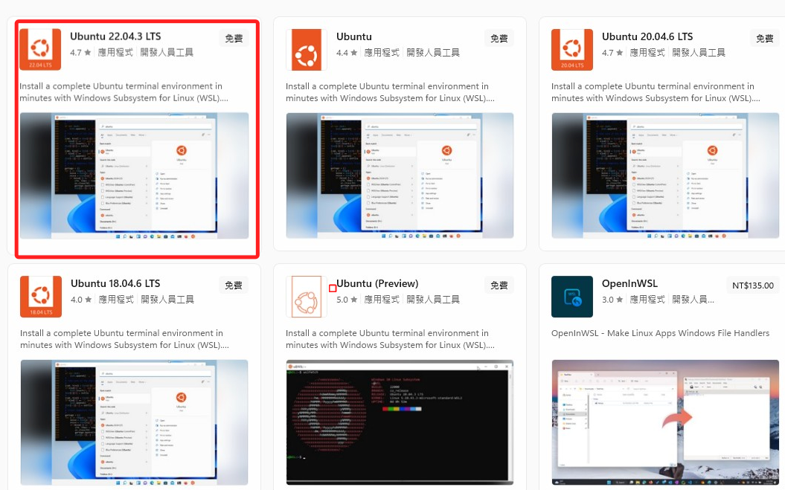

<br>

4. 會顯示要安裝一段時間，其實很快。

    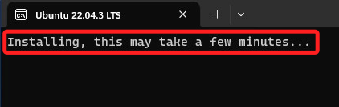

<br>

5. 接著自定義帳號並輸入兩次密碼。

    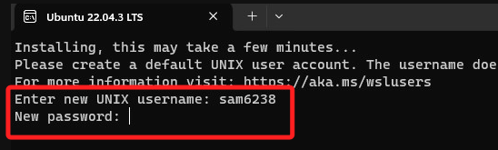

<br>

6. 至此同學就有熟悉的 Linux 系統可以使用了。

    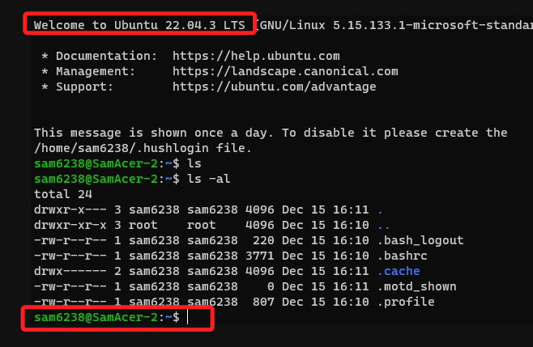

<br>

## 安裝 Docker

1. 進入 [官網](https://docs.docker.com/)

    _進入下載頁面的途徑很多，這只是其中之一。_

    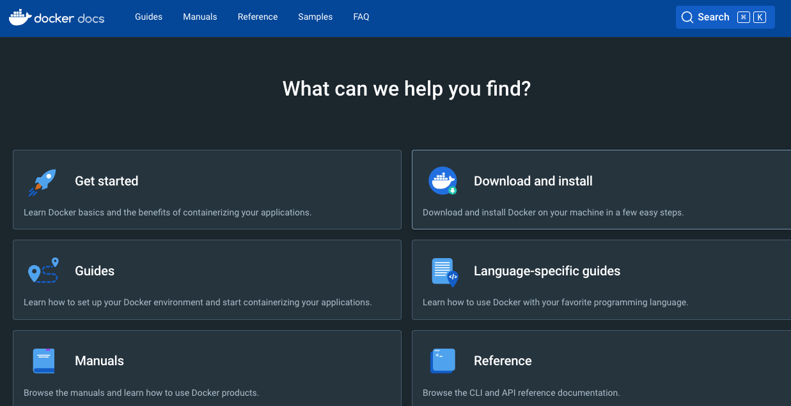

<br>

2. 選擇 Download and Install。

   

<br>

3. 選擇 Windows 版本。

   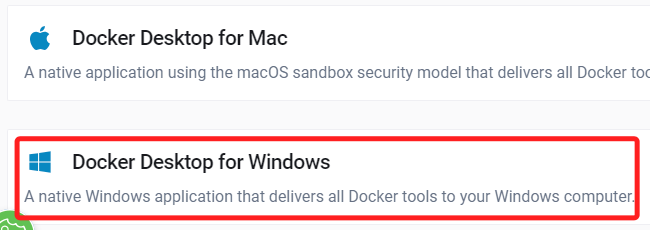

<br>

1. 下載 Desktop 桌面應用。

   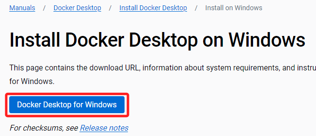

<br>

5. 下載完成，點擊 Installer 進行安裝。

   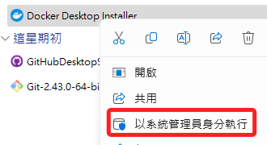

<br>

6. 這需要花一點時間，請耐心等待。

   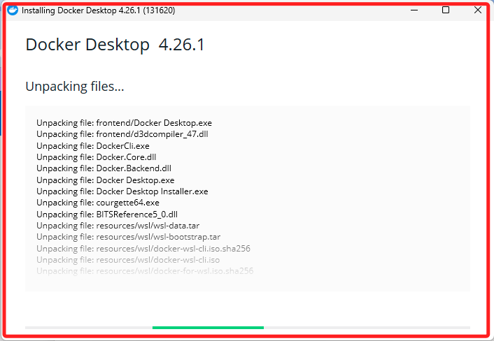

<br>

7. 安裝完成後，需要重新啟動 Windows 系統。

   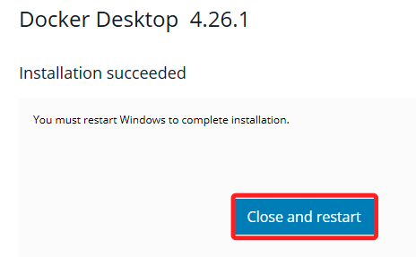

8. 重啟之後顯示


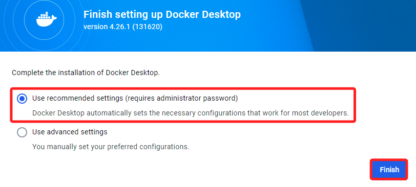

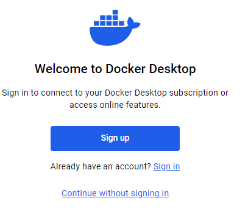

可以先完成登入
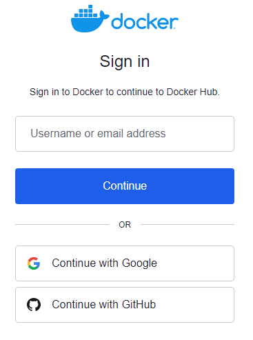

假如帳號為註冊過，會顯示


點擊桌面應用開啟
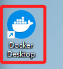

選取登入，會開啟網頁
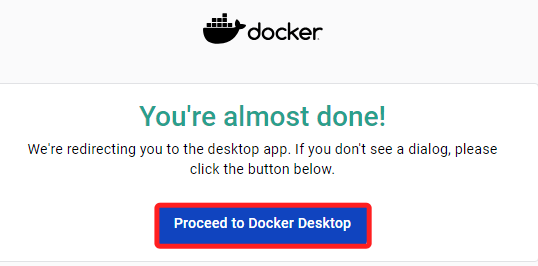

會出現錯誤
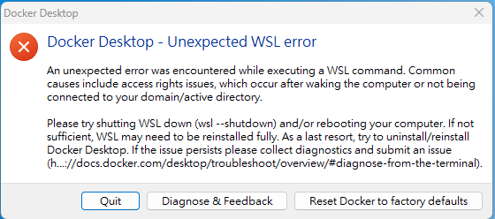

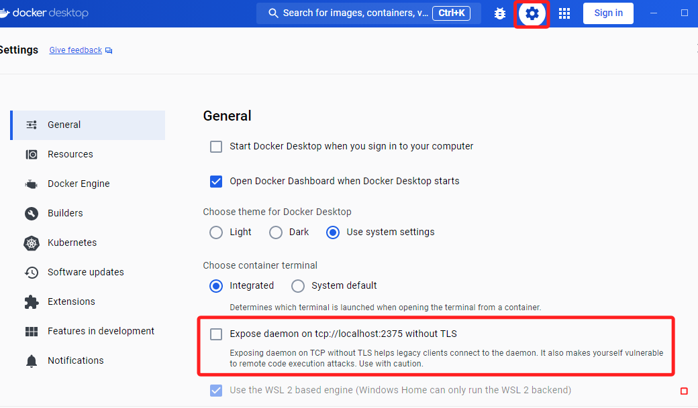


