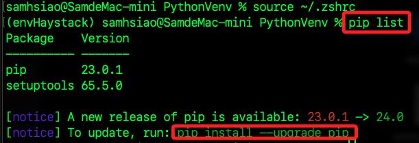
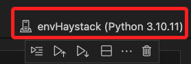
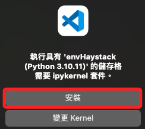
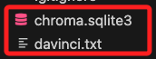
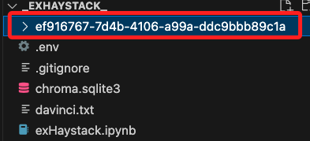

# 快速上手

_根據官方的說明建立簡單的問答系統_

<br>

## 建立虛擬環境

1. 要建立新的虛擬環境來進行操作，細節省略。

    ```bash
    python -m venv envHaystack
    ```

<br>

2. 修改環境參數並啟動虛擬環境。

    ```bash
    source ~/.zshrc
    ```

<br>

3. 建立完成時可查看當前套件環境，並依指示進行更新，確認這是一個乾淨的新環境，便可展開後續操作。

    

<br>

## 開始撰寫範例

1. 安裝官方套件 `Haystack` 和 `Chroma`。

    ```bash
    pip install haystack-ai chroma-haystack
    ```

<br>

2. 安裝處理敏感資訊所需套件，在專案中將用於設置 OpenAI 的 API Key。

    ```bash
    pip install python-dotenv
    ```

<br>

3. 在桌面或指定位置建立專案資料夾，這裡我依照慣例安裝在桌面，單純是便於練習後的刪除。

    ```bash
    cd ~/Desktop && mkdir _exHaystack_ && cd _exHaystack_
    ```

<br>

## 建立敏感文件管理

1. 建立 `.env` 與 `.gitignore` 文件。

    ```bash
    touch .env .gitignore
    ```

<br>

2. 開啟 VSCode。

    ```bash
    code .
    ```

<br>

3. 將 `.env` 寫入 `.gitignore`；以上這三步驟就是個良好習慣，無論專案是否進行原始檔管理。

<br>

4. 編輯 `.env`，寫入 `OPENAI_API_KEY`。

    ```json
    OPENAI_API_KEY=<填入自己的 API KEY>
    ```

<br>

5. 建立專案腳本，這個範例使用 Jupyter Notebook 即可。

    ```bash
    touch exHaystack.ipynb
    ```

<br>

6. 在 VSCode 中選取正確的核心。

    

<br>

7. 初次運行時會提示安裝核心。

    

<br>

## 編輯腳本

1. 透過腳本從網絡下載文件，並使用 `Haystack` 預設定義索引管道來索引文件；特別注意，腳本中隱式使用了 `OpenAI API`，所以一定要載入環境變數。

    ```python
    import urllib.request
    from haystack import Pipeline, PredefinedPipeline
    import os
    from dotenv import load_dotenv
    # 載入環境變數
    load_dotenv()
    os.environ["OPENAI_API_KEY"] = os.getenv("OPENAI_API_KEY")

    # 下載範例電子書文件
    urllib.request.urlretrieve(
        # 下載網址
        "https://www.gutenberg.org/cache/epub/7785/pg7785.txt",
        # 寫入本地文件名稱
        "davinci.txt"
    )

    # 使用預定義的索引管道
    indexing_pipeline = Pipeline.from_template(
        PredefinedPipeline.INDEXING
    )
    # 使用 Haystack 框架進行文件處理和索引
    indexing_pipeline.run(
        data={"sources": ["davinci.txt"]}
    )
    ```

<br>

2. 輸出的訊息分作兩部分，第一個部分是警告 `TqdmWarning: IProgress not found`，表示在使用進度條時，未找到 `ipywidgets` 模組，通常會在使用的核心第一次運行時提出警告並自動安裝，再次運行就不會出現警告了；假如沒有自動安裝，可使用以下指令手動安裝。

    ```bash
    pip install ipywidgets
    ```
3. 輸出的第二個部分說明索引過程的概覽，描述指出透過 text-embedding-ada-002 模型生成文本嵌入時，使用了 `12972` 個 Tokens，並且在索引過程中共寫入了 `50` 個文檔。

    ```json
    {
        'embedder': {
            // 包含嵌入模型的元數據
            'meta': {
                // 使用 OpenAI 的 text-embedding-ada-002 模型
                // 這是用於將文本轉換成嵌入向量的模型
                'model': 'text-embedding-ada-002',
                // 包含有關嵌入模型使用的詳細信息
                'usage': {
                    // 提示詞 tokens 數量是 `12972`
                    // 在生成嵌入向量時使用的文本總共包含 12972 個 tokens
                    'prompt_tokens': 12972,
                    'total_tokens': 12972
                }
            }
        },
        // 表示寫入的文件數量，表示在處理過程中一共生成並寫入了 50 個文件
        'writer': {'documents_written': 50}
    }
    ```

<br>

4. 另外會在專案根目錄內添加兩個文件，分別是文本文件 `davinci.txt` 以及資料庫文件 `chroma.sqlite3`；其中，文本文件是調用了 `urllib.request.urlretrieve` 所下載的；另外，在使用 `Haystack` 進行文件索引時，系統預設會建立一個 `SQLite` 文件 `chroma.sqlite3` 來保存數據，這就是 `Document Store` 的實現，而這個文件中包含了索引數據，用以支持快速檢索文件。

    

<br>

5. 另外還會生成一個資料夾 `ef916767-7d4b-4106-a99a-ddc9bbb89c1a`，其中包含多個二進位文件，這是 Haystack 為每次索引操作生成的唯一標識 (UUID)，用於區分不同索引操作的輸出結果，這可確保每次索引操作生成的數據不會互相衝突；特別注意的是，若要重新生成，必須重啟核心，重新生成時必須刪除資料庫文件，否則將回重建相同 UUID 的資料，文件夾名稱也會相同，刪除後重建則會建立全新的向量儲存資料。

    

<br>

## 建立問答

1. 建立 RAG 管道：使用預定義的 RAG 管道來回答問題。

    ```python
    from haystack import Pipeline, PredefinedPipeline

    # 建立 RAG 管道
    rag_pipeline = Pipeline.from_template(PredefinedPipeline.RAG)

    # 提出問題
    query = """
    有哪些主角出現？
    請按重要性以條目方式列出主要的10個角色，並簡單介紹他們。
    請以繁體中文回答。
    """
    # 結果
    result = rag_pipeline.run(
        data={
            "prompt_builder": {"query": query},
            "text_embedder": {"text": query}
        }
    )

    # 輸出答案
    print(result["llm"]["replies"][0])
    ```

<br>

2. 得到以下結果，特別注意，每次運行會得到近似但不完全相同的文本。

    ```bash
    主要角色：
    1. 達文西（Leonardo da Vinci）：意大利文藝復興時期的多才多藝的天才，是本文的主角。他是一位畫家、科學家、哲學家和工程師。
    2. 米蘭公爵路多維科·斯福爾扎（Ludovico Sforza）：米蘭的統治者，委託達文西為他創作許多著名的作品，如《最後的晚餐》和《安吉亞里之戰》。
    3. 猶大·依斯加略（Judas Iscariot）：聖經中背叛耶穌基督的門徒之一，在達文西的《最後的晚餐》中被描繪出來。
    4. 聖約翰（St. John）：耶穌基督的門徒之一，也是達文西的畫作《最後的晚餐》中的一個重要人物。
    5. 西蒙·伯多祿（Simon Peter）：另一位耶穌基督的門徒，也在《最後的晚餐》中被描繪出來。
    6. 聖母瑪利亞（Virgin Mary）：耶穌基督的母親，在達文西的畫作中常常出現。
    7. 芭芭拉·德莫迪奧（Barbara De Modio）：據說是達文西的模特和愛人之一。
    8. 弗朗西斯科·梅爾齊（Francesco Melzi）：達文西的助手和學生，後來成為了他的主要繼承人。
    9. 咖特琳娜（Caterina）：達文西的母親，後來嫁給了另一人。
    10. 本文中提到的其他畫作的人物，如《蒙娜麗莎》和《瑪丹娜》。
    ```

<br>

3. 可替換問題發問。

    ```bash
    query = """
    故事的主角是誰？出生資訊為何？一生有何著作？
    請以繁體中文回答。
    """
    ```

<br>

4. 不同提問方式以及補述的 Prompt 都將引導不同的回答。

    ```bash
    故事的主角是Leonardo da Vinci。他的出生地是意大利的小鎮Vinci，在1452年出生。他是一位多才多藝的天才，一生留下了許多重要的著作，包括《最後的晚餐》、《蒙娜麗莎》和《羅克的聖母》等。Leonardo da Vinci被稱為基督教時代甚至所有時代最通才的天才。"
    ```

<br>

___

_END_