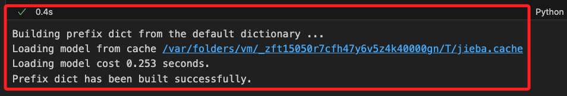

# 補充資料庫的操作

<br>

## 準備工作

1. 建立新的腳本。

    ```bash
    touch ex資料庫.ipynb
    ```

<br>

2. 以下範例操作會使用到套件。

    ```bash
    pip install jieba langchain_core
    ```

<br>

## 說明

1. 建立資料庫 `dynasties.db`。

    ```python
    import sqlite3

    # 連接到 SQLite 資料庫，如果不存在，則會自動建立，
    conn = sqlite3.connect('dynasties.db')
    cursor = conn.cursor()

    # 使用資料庫語法建立表格
    cursor.execute('''
        CREATE TABLE IF NOT EXISTS Dynasties (
            id INTEGER PRIMARY KEY AUTOINCREMENT,
            dynasty TEXT,
            start_year INTEGER,
            end_year INTEGER,
            content TEXT
        )
    ''')

    # 提交更改
    conn.commit()
    # 關閉連接
    conn.close()
    ```

<br>

2. 執行後會建立資料庫檔案 `dynasties.db`，點即可查看到內有兩個空的資料表。

    

<br>

3. 使用其他範例中的文件來建立資料庫內容，相關於中國歷史上朝代的數據。

    ```python
    import sqlite3
    import jieba
    from langchain_core.documents import Document

    # 定義分詞函數
    def tokenize(text):
        return ' '.join(jieba.cut(text))

    # 建立文件
    documents = [
        Document(
            page_content=tokenize("秦朝（公元前221年－公元前206年）是中國歷史上第一個統一的多民族中央集權制國家，開創了中國封建社會的先河。"),
            metadata={"dynasty": "秦朝", "start_year": -221, "end_year": -206}
        ),
        Document(
            page_content=tokenize("漢朝（公元前202年－公元220年）分為西漢和東漢，是中國歷史上的一個重要朝代，開創了文景之治和漢武盛世。"),
            metadata={"dynasty": "漢朝", "start_year": -202, "end_year": 220}
        ),
        Document(
            page_content=tokenize("唐朝（公元618年－公元907年）是中國歷史上的一個鼎盛時期，文化、經濟、軍事都達到了新的高峰。"),
            metadata={"dynasty": "唐朝", "start_year": 618, "end_year": 907}
        ),
        Document(
            page_content=tokenize("宋朝（公元960年－公元1279年）分為北宋和南宋，兩宋時期的經濟和文化發展繁榮。"),
            metadata={"dynasty": "宋朝", "start_year": 960, "end_year": 1279}
        ),
        Document(
            page_content=tokenize("元朝（公元1271年－公元1368年）是中國歷史上第一個由少數民族建立的全國統一王朝。"),
            metadata={"dynasty": "元朝", "start_year": 1271, "end_year": 1368}
        ),
        Document(
            page_content=tokenize("明朝（公元1368年－公元1644年）是中國歷史上最後一個由漢族建立的大一統王朝。"),
            metadata={"dynasty": "明朝", "start_year": 1368, "end_year": 1644}
        ),
        Document(
            page_content=tokenize("清朝（公元1644年－公元1912年）是中國歷史上的最後一個封建王朝，也是中國歷史上第二個由少數民族建立的統一王朝。"),
            metadata={"dynasty": "清朝", "start_year": 1644, "end_year": 1912}
        )
    ]

    # 連接到 SQLite 資料庫
    conn = sqlite3.connect('dynasties.db')
    cursor = conn.cursor()

    # 插入文件到資料庫
    for doc in documents:
        cursor.execute('''
            INSERT INTO Dynasties (dynasty, start_year, end_year, content)
            VALUES (?, ?, ?, ?)
        ''', (
            doc.metadata['dynasty'],
            doc.metadata['start_year'],
            doc.metadata['end_year'],
            doc.page_content
        ))

    # 提交更改並關閉連接
    conn.commit()
    conn.close()
    ```

    

<br>

4. 可點擊資料庫文件 `dynasties.db`，觀察資料庫是否確實寫入，可看到確實加入七筆資料。

    

<br>

5. 接著使用代碼進行資料庫的查詢，以下的操作是進行條件篩選，查詢資料庫中的 `秦朝` 資料。

    ```python
    # 連接到 SQLite 資料庫
    conn = sqlite3.connect('dynasties.db')
    cursor = conn.cursor()

    # 查詢相關的文件
    query = "秦朝"
    cursor.execute("SELECT * FROM Dynasties WHERE dynasty = ?", (query,))
    rows = cursor.fetchall()

    # 輸出查詢結果
    print(f"查詢 '{query}' 的結果:")
    for row in rows:
        print(f"- {row[4]}")  # row[4] 是 content 列

    # 關閉連接
    conn.close()
    ```

    _結果_

    查詢 '秦朝' 的結果:
    - 秦朝 （ 公元前 221 年 － 公元前 206 年 ） 是 中國 歷史 上 第一 個統 一 的 多 民族 中央 集權 制國家 ， 開創 了 中國 封建 社會 的 先河 。

<br>

___

_END_