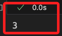
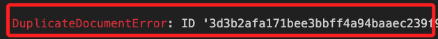
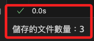

# 使用元數據過濾文件

_根據給定的元數據過濾文件_

<br>

## 說明

1. 使用的模組：InMemoryDocumentStore, InMemoryBM25Retriever。

<br>

2. 儘管新的檢索技術很實用，但有時只想在特定文件上執行搜索，可以是任何與特定用戶相關的所有文件，或在某個日期之後發布的文件等情況時可使用元數據過濾。

<br>

## 進行開發

1. 安裝 `Haystack 2.0`，這在前面的步驟已經有安裝過。

    ```bash
    pip install haystack-ai
    ```

<br>

2. 建立範例腳本 `ex02.ipynb`。

    ```bash
    touch ex02.ipynb
    ```

<br>

3. 導入必要庫。

    ```python
    from datetime import datetime
    from haystack import Document
    from haystack.document_stores.in_memory import InMemoryDocumentStore
    from haystack.components.retrievers.in_memory import InMemoryBM25Retriever
    ```

<br>

4. 準備文件：這裡示範手動編輯建立 `3` 個包含 `元數據` 的簡單文件如下，然後會在後續步驟中將這些文件寫入 `InMemoryDocumentStore`，當然也可以使用其他可用的 `文件儲存`，例如 `OpenSearch`、`Chroma`、`Pinecone` 等。

    ```python
    # 建立文件
    documents = [
        Document(
            content="Use pip to install a basic version of Haystack's latest release: pip install farm-haystack. All the core Haystack components live in the haystack repo. But there's also the haystack-extras repo which contains components that are not as widely used, and you need to install them separately.",
            meta={"version": 1.15, "date": datetime(2023, 3, 30)},
        ),
        Document(
            content="Use pip to install a basic version of Haystack's latest release: pip install farm-haystack[inference]. All the core Haystack components live in the haystack repo. But there's also the haystack-extras repo which contains components that are not as widely used, and you need to install them separately.",
            meta={"version": 1.22, "date": datetime(2023, 11, 7)},
        ),
        Document(
            content="Use pip to install only the Haystack 2.0 code: pip install haystack-ai. The haystack-ai package is built on the main branch which is an unstable beta version, but it's useful if you want to try the new features as soon as they are merged.",
            meta={"version": 2.0, "date": datetime(2023, 12, 4)},
        ),
    ]
    ```


<br>

4. 建立腳本將前面編輯的文件寫入內存，然後將內存文件寫入文件儲存；有關如何將文件寫入不同文件儲存的更多說明可參考 [索引不同文件類型](https://haystack.deepset.ai/docs/2.0/indexing)；另外，關於可對元數據使用的 `比較運算子` 如 `NOT、AND` 等的說明請參考 [元數據過濾文件](https://haystack.deepset.ai/docs/2.0/meta_filtering)。

    ```python
    # 初始化內存文件儲存
    document_store = InMemoryDocumentStore(
        bm25_algorithm="BM25Plus"
    )
    # 將內存文件儲存寫入文件儲存
    document_store.write_documents(
        documents=documents
    )
    ```

<br>

5. 函數 `write_documents` 在寫入文件後會傳回寫入文件的數量，使用 `Jupyter Notebook` 時會在最後顯示文件數量 `3`。

    

<br>

## 查看文件相關資訊

1. 若是寫入後還想查看這個關於長度的資訊，不可再次嘗試寫入，否則會出現 `DuplicateDocumentError` 錯誤，這表示試圖將已經存在的文件再次寫入到內存文件儲存中，並且這些文件有重複的 ID。

    ```python
    # 將內存文件儲存寫入文件儲存
    docs = document_store.write_documents(
        documents=documents,
        policy=DuplicatePolicy.SKIP
    )
    # 查看回傳值
    print(docs)
    ```

    

<br>

2. 可透過 Python 內建函數 `dir` 來列出物件可用的方法和屬性。

    ```python
    # 列出所有可用的方法和屬性
    print(dir(document_store))
    ```

<br>

3. 輸出結果如下，這是一個列表，其中有一個計算的方法 `count_documents()` 可用。

    ```python
    ['__class__', '__delattr__', '__dict__', '__dir__', '__doc__', '__eq__', '__format__', '__ge__', '__getattribute__', '__gt__', '__hash__', '__init__', '__init_subclass__', '__le__', '__lt__', '__module__', '__ne__', '__new__', '__reduce__', '__reduce_ex__', '__repr__', '__setattr__', '__sizeof__', '__str__', '__subclasshook__', '__weakref__', '_avg_doc_len', '_bm25_attr', '_compute_query_embedding_similarity_scores', '_dispatch_bm25', '_freq_vocab_for_idf', '_score_bm25l', '_score_bm25okapi', '_score_bm25plus', '_tokenize_bm25', 'bm25_algorithm', 'bm25_algorithm_inst', 'bm25_parameters', 'bm25_retrieval', 'bm25_tokenization_regex', 'count_documents', 'delete_documents', 'embedding_retrieval', 'embedding_similarity_function', 'filter_documents', 'from_dict', 'index', 'storage', 'to_dict', 'tokenizer', 'write_documents']
    ```

<br>

4. 透過這個方法查看，若有其他需求，可比照相同模式處理。

    ```python
    # 查看文件的總數
    document_count = document_store.count_documents()
    print(f"儲存的文件數量：{document_count}")
    ```

    

<br>

## 繼續進行開發

1. 建立文件搜索管道：建立一個簡單的文件搜索管道，其中包含檢索器。可嘗試更改這個管道以執行更多操作，例如生成問題的答案或其他功能。

    ```python
    from haystack import Pipeline

    # 初始化管道
    pipeline = Pipeline()
    # 添加內存 BM25 檢索器到管道
    pipeline.add_component(
        instance=InMemoryBM25Retriever(document_store=document_store),
        name="retriever"
    )
    ```

<br>

2. 進行元數據過濾：通過過濾文件來回答問題，過濾條件為 `version > 1.21`。

    ```python
    # 提問並進行元數據過濾
    query = "Haystack installation"
    result = pipeline.run(
        data={
            "retriever": {
                "query": query,
                "filters": {
                    "field": "meta.version",
                    "operator": ">", "value": 1.21
                }
            }
        }
    )

    # 輸出結果
    print(result)
    ```

<br>

3. 以上步驟會輸出以下結果，若整理這個輸出查看會發現輸出的本身也有錯誤，這是因為基於內容太長被省略的片段中包含括號之類的符號所致，嘗試整理後顯示如下；觀察後可知 `Document` 在原本的資料上添加了 `id` 及 `socre`。

    ```python
    {
        'retriever': {
            'documents': [
                Document(
                    id='b536...',
                    content: 'Use pip to ...',
                    meta: {
                        'version': 1.22,
                        'date': datetime.datetime(2023, 11, 7, 0, 0)
                    },
                    score: 0.37481165807926137
                ),
                Document(
                    id='8ac1f8...', 
                    content: 'Use pip to ...',
                    meta: {
                        'version': 2.0,
                        'date': datetime.datetime(2023, 12, 4, 0, 0)
                    },
                    score: 0.34124689226266874
                )
            ]
        }
    }
    ```

<br>

## 關於 score

1. 在 Haystack 中，`score` 表示 `文件` 與 `查詢` 之間的 `相似度分數`，這個分數由檢索或排序算法計算，在這個範例中使用的是 `BM25 檢索方法`，並指定在管道之中，特別注意，`BM25` 的數值範圍沒有固定的上限，可以是任何 `非負數值`，值越高表示匹配程度越高。

<br>

2. `score` 會用於 `排序` 檢索結果，高分數的文件通常會排在搜索結果的前面。補充說明一下，`BM25` 算法會基於查詢詞在文件中的出現 `次數（詞頻）` 和 `文件長度`，以及詞在所有文件中出現的 `頻率（逆文件頻率）` 來計算相似度；而在使用 `向量檢索方法` 時，相似度可能是基於文件和查詢向量之間的 `餘弦相似度` 來計算的。

<br>

## 單一條件檢索

1. 添加 `邏輯運算子` 到過濾條件中，進行檢索 `文件版本大於 1.21`。

    ```python
    # 提問並進行元數據過濾
    query = "Haystack installation"
    result = pipeline.run(
        data={
            "retriever": {
                "query": query,
                "filters": {
                    "field": "meta.version",
                    "operator": ">", "value": 1.21
                }
            }
        }
    )

    # 輸出結果
    print(result)
    ```

<br>

2. 結果顯示：特別注意，這個排版是手動進行編輯的。

    ```python
    {'retriever': {'documents': [
        Document(
            id='b53625...',
            content: 'Use pip to ...',
            meta: {
                'version': 1.22,
                'date': datetime.datetime(2023, 11, 7, 0, 0)
            },
            score: 0.37481165807926137
        ),
        Document(
            id='8ac1f8119...',
            content: 'Use pip to ...',
            meta: {
                'version': 2.0,
                'date': datetime.datetime(2023, 12, 4, 0, 0)
            },
            score: 0.34124689226266874
        )
    ]}}
    ```

<br>

## 複合條件檢索

1. 兩個以上的條件可使用運算子 `AND` 進行檢索，條件設置為 `文件版本大於 1.21` 並且 `日期晚於 2023/11/7`。

    ```python
    # 提問並進行複合條件過濾
    query = "Haystack installation"
    result = pipeline.run(
        data={
            "retriever": {
                "query": query,
                "filters": {
                    "operator": "AND",
                    "conditions": [
                        {
                            "field": "meta.version",
                            "operator": ">",
                            "value": 1.21
                        },
                        {
                            "field": "meta.date", 
                            "operator": ">",
                            "value": datetime(2023, 11, 7)
                        },
                    ],
                },
            }
        }
    )

    # 輸出結果
    print(result)
    ```

<br>

4. 結果：特別注意，這個排版是手動進行編輯的。。

    ```python
    {'retriever': {'documents': [
        Document(
            id='8ac1f8119...',
            content: 'Use pip to ...',
            meta: {
                'version': 2.0,
                'date': datetime.datetime(2023, 12, 4, 0, 0)
            },
            score: 0.34124689226266874
        )
    ]}}
    ```

<br>

## 優化輸出

1. 在原檢索條件輸出時進行格式優化，以 `單一檢索` 的範例為例。

    ```python
    # 提問並進行元數據過濾
    query = "Haystack installation"
    result = pipeline.run(
        data={
            "retriever": {
                "query": query,
                "filters": {
                    "field": "meta.version",
                    "operator": ">", "value": 1.21
                }
            }
        }
    )

    # 優化輸出結果
    for idx, doc in enumerate(result['retriever']['documents']):
        print(f"Document {idx + 1}:")
        print(f"ID: {doc.id}")
        # 只顯示前 100 個字元
        print(f"Content: {doc.content[:100]}...")
        print(f"Meta: {doc.meta}")
        print("-" * 40)
    ```

<br>

2. 輸出結果。

    ```bash
    Document 1:
    ID: b53625c67fee5ba5ac6dc86e7ca0adff567bf8376e86ae4b3fc6f6f858ccf1e5
    Content: Use pip to install a basic version of Haystack's latest release: pip install farm-haystack[inference...
    Meta: {'version': 1.22, 'date': datetime.datetime(2023, 11, 7, 0, 0)}
    ----------------------------------------
    Document 2:
    ID: 8ac1f8119bdec5c898d5a5c69f49ff47f64056bce1a0f95073e34493bbaf9354
    Content: Use pip to install only the Haystack 2.0 code: pip install haystack-ai. The haystack-ai package is b...
    Meta: {'version': 2.0, 'date': datetime.datetime(2023, 12, 4, 0, 0)}
    ----------------------------------------
    ```

<br>

3. 在原檢索條件輸出時進行格式優化，以 `複合檢索` 的範例為例。

    ```python
    # 提問並進行複合條件過濾
    query = "Haystack installation"
    result = pipeline.run(
        data={
            "retriever": {
                "query": query,
                "filters": {
                    "operator": "AND",
                    "conditions": [
                        {
                            "field": "meta.version",
                            "operator": ">",
                            "value": 1.21
                        },
                        {
                            "field": "meta.date", 
                            "operator": ">",
                            "value": datetime(2023, 11, 7)
                        },
                    ],
                },
            }
        }
    )

    # 優化輸出結果
    for idx, doc in enumerate(result['retriever']['documents']):
        print(f"Document {idx + 1}:")
        print(f"ID: {doc.id}")
        # 只顯示前 100 個字元
        print(f"Content: {doc.content[:100]}...")
        print(f"Meta: {doc.meta}")
        print("-" * 40)
    ```

<br>

4. 結果顯示。

    ```bash
    Document 1:
    ID: 8ac1f8119bdec5c898d5a5c69f49ff47f64056bce1a0f95073e34493bbaf9354
    Content: Use pip to install only the Haystack 2.0 code: pip install haystack-ai. The haystack-ai package is b...
    Meta: {'version': 2.0, 'date': datetime.datetime(2023, 12, 4, 0, 0)}
    ----------------------------------------
    ```

<br>

_接下來要進行中文檢索，請參考下一個小節_

<br>

___

_END_
