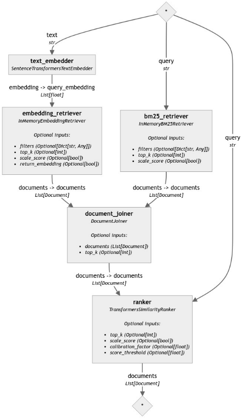
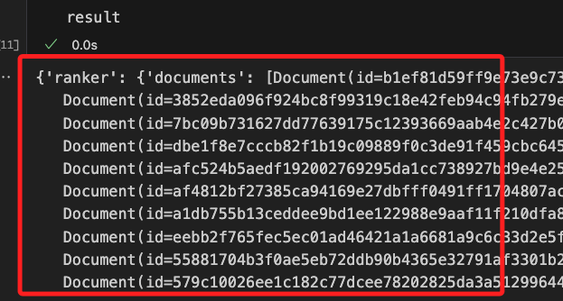
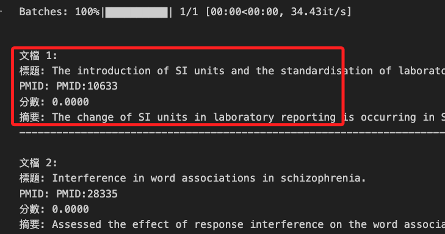
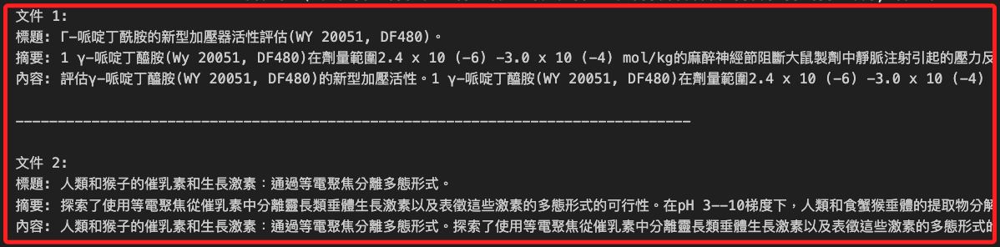

# 建立混合檢索管道

_可參考 [混合文件檢索](https://haystack.deepset.ai/blog/hybrid-retrieval)。_

<br>

## 使用的元件

1. `DocumentSplitter`

2. `SentenceTransformersDocumentEmbedder`

3. `DocumentJoiner`

4. `InMemoryDocumentStore`

5. `InMemoryBM25Retriever`

6. `InMemoryEmbeddingRetriever`

7. `TransformersSimilarityRanker`

<br>

## 說明

1. 使用 [Haystack 2.0](https://haystack.deepset.ai/overview/quick-start)，可參考官方 [Haystack 2.0 文件](https://haystack.deepset.ai/docs/latest)。

<br>

2. `混合檢索` 結合了基於 `關鍵詞` 和 `基於嵌入` 的 `檢索技術`，其中 `基於嵌入` 的方法在理解查詢的上下文細節方面表現出色，而基於關鍵詞的方法則在匹配具體的關鍵詞上具有優勢。

<br>

3. 在許多情況下，例如在特定領域如醫療保健中，簡單的 `基於關鍵詞的方法（如 BM25）` 表現優於 `密集檢索`，因為 `密集模型` 需要在數據上進行訓練。

<br>

4. `InMemoryDocumentStore` 是最簡單的 `DocumentStore`，它不需要任何外部依賴，是較小項目和調試的理想選擇，但對於較大的文件集合來說，它並不太適合生產系統。`Haystack` 支持的不同類型的外部資料庫，請參閱 [DocumentStore Integrations](https://haystack.deepset.ai/docs/latest/components/stores)。

<br>

## 安裝 Haystack

1. 使用 pip 安裝 Haystack 2.0 及其他所需的包。

    ```bash
    pip install haystack-ai
    pip install "datasets>=2.6.1"
    pip install "sentence-transformers>=2.2.0"
    pip install accelerate
    ```

<br>

2. 初始化 DocumentStore：通過初始化 `DocumentStore` 來開始建立問答系統。`DocumentStore` 用於儲存系統用於搜尋問題答案的文件。在本範例中將使用 `InMemoryDocumentStore`。

    ```python
    from haystack.document_stores.in_memory import InMemoryDocumentStore

    document_store = InMemoryDocumentStore()
    ```

<br>

3. 在 `Hugging Face Hub` 上有許多來自 PubMed 的數據集，所以範例將使用 `anakin87/medrag-pubmed-chunk`，透過 `for-in` 從數據集中建立文件，在 `PubMed` 的數據集中，每個數據點都有 4 個特徵。

   - `pmid`

   - `title`

   - `content`: 摘要

   - `contents`: 摘要 + 標題

<br>

4. 在搜索時將使用 `contents` 特徵，而其他特徵將作為元數據儲存，並用於輸出搜索結果或進行元數據篩選。

    ```python
    from datasets import load_dataset
    from haystack import Document

    dataset = load_dataset(
        "anakin87/medrag-pubmed-chunk",
        split="train"
    )

    docs = []
    for doc in dataset:
        docs.append(
            Document(
                content=doc["contents"],
                meta={
                    "title": doc["title"],
                    "abstract": doc["content"],
                    "pmid": doc["id"]
                }
            )
        )
    ```

<br>

## 使用管道索引文件

_建立一個管道，將數據儲存在 `文件儲存 document store` 中並生成嵌入_

<br>

1. 使用 `DocumentSplitter` 將文件分割為 512 個詞的塊。

<br>

2. 使用 `SentenceTransformersDocumentEmbedder` 來建立用於密集檢索的文件嵌入；作為嵌入模型，將使用 `Hugging Face` 上的 `BAAI/bge-small-en-v1.5`。可嘗試在 `Hugging Face` 上測試其他 `模型` 或使用其他 `嵌入器` 來切換模型提供商；如果太過耗時，可將更改較小的嵌入模型，如 `sentence-transformers/all-MiniLM-L6-v2` 或 `sentence-transformers/all-mpnet-base-v2`。請確保根據模型的 token 限制更新 `split_length`。

<br>

3. 使用 `DocumentWriter` 將文件寫入文件儲存。

<br>

4. 在 MacOS 上需安裝以下套件。

    ```bash
    pip install torch torchvision torchaudio
    ```

<br>

6. 程式碼。

    ```python
    from haystack.components.writers import DocumentWriter
    from haystack.components.embedders import SentenceTransformersDocumentEmbedder
    from haystack.components.preprocessors.document_splitter import DocumentSplitter
    from haystack import Pipeline
    from haystack.utils import ComponentDevice

    document_splitter = DocumentSplitter(
        split_by="word",
        split_length=512,
        split_overlap=32
    )
    document_embedder = SentenceTransformersDocumentEmbedder(
        model="BAAI/bge-small-en-v1.5",
        # MacOS 不使用 CUDA
        # device=ComponentDevice.from_str("cuda:0")
        device=ComponentDevice.from_str("cpu")
    )
    document_writer = DocumentWriter(document_store)

    indexing_pipeline = Pipeline()
    indexing_pipeline.add_component("document_splitter", document_splitter)
    indexing_pipeline.add_component("document_embedder", document_embedder)
    indexing_pipeline.add_component("document_writer", document_writer)

    indexing_pipeline.connect("document_splitter", "document_embedder")
    indexing_pipeline.connect("document_embedder", "document_writer")

    indexing_pipeline.run({"document_splitter": {"documents": docs}})
    ```

    _至此文件已儲存在 `InMemoryDocumentStore` 中並生成了嵌入，接下來可建立混合檢索管道_

<br>

## 建立混合檢索管道

1. 混合檢索是指結合多種檢索方法以增強整體性能。

<br>

2. 在搜索系統的上下文中，混合檢索管道同時執行傳統的基於關鍵詞的搜索和密集向量搜索，隨後使用交叉編碼器模型對結果進行排名。

<br>

3. 這種組合允許搜索系統利用不同方法的優勢，提供更準確和多樣的結果。

<br>

## 步驟

1. 初始化檢索器和嵌入器：初始化 `InMemoryEmbeddingRetriever` 和 `InMemoryBM25Retriever` 以執行密集檢索和基於關鍵詞的檢索。對於密集檢索，還需要一個 `SentenceTransformersTextEmbedder` 來使用相同的嵌入模型 `BAAI/bge-small-en-v1.5` 計算搜索查詢的嵌入，該模型在索引管道中已使用。

    ```python
    from haystack.components.retrievers.in_memory import InMemoryBM25Retriever, InMemoryEmbeddingRetriever
    from haystack.components.embedders import SentenceTransformersTextEmbedder

    text_embedder = SentenceTransformersTextEmbedder(
        model="BAAI/bge-small-en-v1.5",
        # device=ComponentDevice.from_str("cuda:0")
        device=ComponentDevice.from_str("cpu")
    )
    embedding_retriever = InMemoryEmbeddingRetriever(document_store)
    bm25_retriever = InMemoryBM25Retriever(document_store)
    ```

<br>

2. 合併檢索結果：Haystack 提供了多種在 `DocumentJoiner` 中的合併方法，以適應不同的使用場景，如合併（merge）和倒數融合（reciprocal_rank_fusion）。在此範例中，將使用默認的串聯模式（concatenate）將來自兩個檢索器的文件合併，因為 `Ranker` 將是主要元件，用於按相關性對文件進行排名。

    ```python
    from haystack.components.joiners import DocumentJoiner

    document_joiner = DocumentJoiner()
    ```

<br>

3. 對結果進行排名：使用 `TransformersSimilarityRanker` 根據給定搜索查詢對所有檢索到的文件的相關性進行打分。此範例中，將使用 `BAAI/bge-reranker-base` 模型來對檢索到的文件進行排名，但可以將此模型更改為 Hugging Face 上的其他交叉編碼器模型。

    ```python
    from haystack.components.rankers import TransformersSimilarityRanker

    ranker = TransformersSimilarityRanker(model="BAAI/bge-reranker-base")
    ```

<br>

4. 在這個步驟若出現 `ImportError` 錯誤。

    ```json
    ImportError: Failed to import 'accelerate'. Run 'pip install transformers[torch,sentencepiece]'. Original error: No module named 'accelerate'
    ```

<br>

5. 針對提示安裝套件，特別注意，`zsh（Z shell）` 對括號有特殊處理，將它們解釋為模式匹配符號，要使用 `引號` 來避免這些特殊字串被解釋為 `模式匹配符號`。

    ```bash
    pip install accelerate 'transformers[torch,sentencepiece]'
    ```

<br>

6. 建立混合檢索管道：將所有初始化的元件添加到的管道中並進行連接。

    ```python
    from haystack import Pipeline

    hybrid_retrieval = Pipeline()
    hybrid_retrieval.add_component("text_embedder", text_embedder)
    hybrid_retrieval.add_component("embedding_retriever", embedding_retriever)
    hybrid_retrieval.add_component("bm25_retriever", bm25_retriever)
    hybrid_retrieval.add_component("document_joiner", document_joiner)
    hybrid_retrieval.add_component("ranker", ranker)

    hybrid_retrieval.connect("text_embedder", "embedding_retriever")
    hybrid_retrieval.connect("bm25_retriever", "document_joiner")
    hybrid_retrieval.connect("embedding_retriever", "document_joiner")
    hybrid_retrieval.connect("document_joiner", "ranker")
    ```

<br>

7. 這個步驟將輸出如下訊息。

    ```bash
    <haystack.core.pipeline.pipeline.Pipeline object at 0x3280baef0>

    🚅 Components
        - text_embedder: SentenceTransformersTextEmbedder
        - embedding_retriever: InMemoryEmbeddingRetriever
        - bm25_retriever: InMemoryBM25Retriever
        - document_joiner: DocumentJoiner
        - ranker: TransformersSimilarityRanker

    🛤️ Connections
        - text_embedder.embedding -> embedding_retriever.query_embedding (List[float])
        - embedding_retriever.documents -> document_joiner.documents (List[Document])
        - bm25_retriever.documents -> document_joiner.documents (List[Document])
        - document_joiner.documents -> ranker.documents (List[Document])
    ```

<br>

8. 可視化管道（可選）：要了解如何建立混合檢索管道，使用 `draw()` 方法。如果在 Google Colab 上運行此筆記本，生成的文件將保存在側邊欄的 `Files` 部分。

    ```python
    hybrid_retrieval.draw("hybrid-retrieval.png")
    ```

<br>

9. 會輸出一張圖。

    

<br>

## 測試混合檢索

1. 將查詢傳遞給 `text_embedder`, `bm25_retriever` 和 `ranker`，並運行檢索管道。

    ```python
    # 嬰兒呼吸暫停
    query = "apnea in infants"

    result = hybrid_retrieval.run(
        {
            "text_embedder": {"text": query},
            "bm25_retriever": {"query": query},
            "ranker": {"query": query}
        }
    )
    # 查看一下
    print(result)
    ```

    


<br>

2. 建立一個函數來輸出搜索結果的頁面。

    ```python
    def pretty_print_results(prediction):
        for doc in prediction["documents"]:
            print(doc.meta["title"], "\t", doc.score)
            print(doc.meta["abstract"])
            print("\n", "\n")
            
    pretty_print_results(result["ranker"])
    ```

    

<br>

3. 進一步優化輸出格式。

    ```python
    def pretty_print_results(prediction):
        # 檢查是否有文件被檢索到
        if not prediction["ranker"]["documents"]:
            print("沒有檢索到相關文件。")
            return

        # 美化輸出
        for idx, doc in enumerate(prediction["ranker"]["documents"]):
            print(f"\n文件 {idx + 1}:")
            print(f"標題: {doc.meta.get('title', '無標題')}")
            print(f"PMID: {doc.meta.get('pmid', '無PMID')}")
            print(f"分數: {doc.score:.4f}")
            print(f"摘要: {doc.meta.get('abstract', '無摘要')}")
            print("-" * 80)

    # 美化並輸出結果
    pretty_print_results(result)
    ```

    

<br>

## 中文檢索

1. 如同之前的範例一樣，若要進行中文檢索，必須進行中文分詞，首先是安裝分詞套件。

    ```bash
    pip install jieba translate
    ```

<br>

2. 導入庫，在進行檢索之前，對查詢和文本進行分詞。

    ```python
    import jieba

    # 定義分詞函數
    def tokenize(text):
        return " ".join(jieba.cut(text))

    # 對查詢進行分詞
    query = "嬰兒呼吸暫停該怎辦？"
    tokenized_query = tokenize(query)
    # 查看分詞後的問題
    print(tokenized_query)

    result = hybrid_retrieval.run(
        {
            "text_embedder": {"text": tokenized_query},
            "bm25_retriever": {"query": tokenized_query},
            "ranker": {"query": tokenized_query}
        }
    )

    # 輸出美化版結果
    pretty_print_results(result)
    ```

<br>

3. 因為文件是英文的，所以以英文輸出。

    

<br>

4. 使用翻譯庫 `translate` 進行自動翻譯，首先安裝庫。

    ```bash
    pip install translate
    ```

<br>

5. 程式碼。

    ```python
    from translate import Translator
    import jieba

    # 初始化翻譯器
    translator = Translator(to_lang="zh-tw")

    # 定義分詞函數
    def tokenize(text):
        return " ".join(jieba.cut(text))

    # 定義文本截斷函數
    def truncate_text(text, max_length=400):
        if len(text) > max_length:
            return text[:max_length] + "..."
        return text

    # 定義翻譯函數
    def translate_to_chinese(text):
        return translator.translate(text)

    # 對查詢進行分詞
    query = "嬰兒呼吸暫停急救措施"
    tokenized_query = tokenize(query)

    # 查看分詞後的查詢
    print(f"分詞後的查詢: {tokenized_query}")

    # 進行檢索
    result = hybrid_retrieval.run(
        {
            "text_embedder": {"text": tokenized_query},
            "bm25_retriever": {"query": tokenized_query},
            "ranker": {"query": tokenized_query}
        }
    )

    # 檢查結果是否有內容
    print("檢索結果:")
    pprint.pprint(result)

    # 美化輸出結果並進行翻譯
    def pretty_print_and_translate_results(prediction):
        if "ranker" not in prediction or not prediction["ranker"]["documents"]:
            print("沒有找到相關文件。")
            return

        for idx, doc in enumerate(prediction["ranker"]["documents"], start=1):
            truncated_title = truncate_text(doc.meta['title'])
            truncated_abstract = truncate_text(doc.meta['abstract'])
            truncated_content = truncate_text(doc.content)

            translated_title = translate_to_chinese(truncated_title)
            translated_abstract = translate_to_chinese(truncated_abstract)
            translated_content = translate_to_chinese(truncated_content)

            print(f"文件 {idx}:")
            print(f"標題: {translated_title}")
            print(f"摘要: {translated_abstract}")
            print(f"內容: {translated_content}")
            print("\n" + "-" * 80 + "\n")

    # 輸出並翻譯結果
    pretty_print_and_translate_results(result)
    ```

<br>

6. 但這個套件有諸多限額，如下顯示的每日限額 `YOU USE ALL AVAILABLE FREE TRANSLATIONS FOR TODAY`。

    

<br>

7. 另外，每句長度也有限制 `QUERY LENGTH LIMIT EXCEEDED. MAX ALLOWED QUERY : 500 CHARS`，這部分添加一個 `截斷函數` 並設置參數 `max_length` 將翻譯文本縮短到限制以內；另外，這裡僅作示範，所以透過切片 `[:2]`輸出前兩個項目。

    ```python
    from translate import Translator
    import jieba

    # 初始化翻譯器
    translator = Translator(to_lang="zh-tw")

    # 定義分詞函數
    def tokenize(text):
        return " ".join(jieba.cut(text))

    # 定義文本截斷函數
    def truncate_text(text, max_length=400):
        if len(text) > max_length:
            return text[:max_length] + "..."
        return text

    # 定義翻譯函數
    def translate_to_chinese(text):
        return translator.translate(text)

    # 對查詢進行分詞
    query = "嬰兒呼吸暫停急救措施"
    tokenized_query = tokenize(query)

    # 查看分詞後的查詢
    print(f"分詞後的查詢: {tokenized_query}")

    # 進行檢索
    result = hybrid_retrieval.run(
        {
            "text_embedder": {"text": tokenized_query},
            "bm25_retriever": {"query": tokenized_query},
            "ranker": {"query": tokenized_query}
        }
    )

    # 檢查結果是否有內容
    print("檢索結果:")
    pprint.pprint(result)

    # 美化輸出結果並進行翻譯
    def pretty_print_and_translate_results(prediction):
        if "ranker" not in prediction or not prediction["ranker"]["documents"]:
            print("沒有找到相關文件。")
            return
        # 這裡僅作示範，所以輸出前兩項目即可 [:2]
        for idx, doc in enumerate(prediction["ranker"]["documents"][:2], start=1):
            truncated_title = truncate_text(doc.meta['title'])
            truncated_abstract = truncate_text(doc.meta['abstract'])
            truncated_content = truncate_text(doc.content)

            translated_title = translate_to_chinese(truncated_title)
            translated_abstract = translate_to_chinese(truncated_abstract)
            translated_content = translate_to_chinese(truncated_content)

            print(f"文件 {idx}:")
            print(f"標題: {translated_title}")
            print(f"摘要: {translated_abstract}")
            print(f"內容: {translated_content}")
            print("\n" + "-" * 80 + "\n")

    # 輸出並翻譯結果
    pretty_print_and_translate_results(result)

    ```

<br>

8. 輸出結果如下。

    

<br>

_暫且到這_

<br>

___

_END_