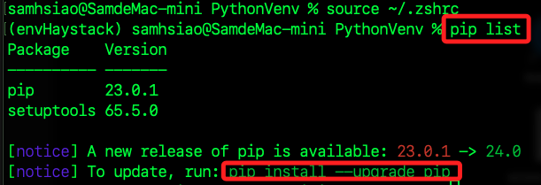

# 快速上手

_根據官方的說明建立簡單的問答系統_

<br>

## 建立虛擬環境

1. 要建立新的虛擬環境來進行操作，細節省略。

    ```bash
    python -m venv envHaystack
    ```

<br>

2. 修改環境參數並啟動虛擬環境。

    ```bash
    source ~/.zshrc
    ```

<br>

3. 建立完成時可查看當前套件環境，並依指示進行更新，確認這是一個乾淨的新環境，便可展開後續操作。

    

<br>

## 開始撰寫範例

1. 安裝官方套件 `Haystack` 和 `Chroma`。

    ```bash
    pip install haystack-ai chroma-haystack
    ```

<br>

2. 安裝套件用以設置 OpenAI 的 API Key。

    ```bash
    pip install python-dotenv
    ```

<br>

## 建立敏感文件管理

1. 建立 `.env` 與 `.gitignore` 文件。

<br>

2. 寫入 `OPENAI_API_KEY`。

    ```json
    OPENAI_API_KEY=<填入自己的 API KEY>
    ```

<br>

3. 將 `.env` 寫入 `.gitignore`。

<br>

## 繼續編輯腳本

1. 透過腳本從網絡下載文件，並使用 `Haystack` 預設定義索引管道來索引文件；特別注意，腳本中隱式使用了 `OpenAI API`，所以一定要載入環境變數。

    ```python
    import urllib.request
    from haystack import Pipeline, PredefinedPipeline
    import os
    from dotenv import load_dotenv
    # 載入環境變數
    load_dotenv()
    os.environ["OPENAI_API_KEY"] = os.getenv("OPENAI_API_KEY")

    # 下載範例電子書文件
    urllib.request.urlretrieve(
        # 下載網址
        "https://www.gutenberg.org/cache/epub/7785/pg7785.txt",
        # 寫入本地文件名稱
        "davinci.txt"
    )

    # 使用預定義的索引管道
    indexing_pipeline = Pipeline.from_template(
        PredefinedPipeline.INDEXING
    )
    # 使用 Haystack 框架進行文件處理和索引
    indexing_pipeline.run(
        data={"sources": ["davinci.txt"]}
    )
    ```

<br>

2. 說明輸出的訊息。

    ```json
    {
        'embedder': {
            // 包含嵌入模型的元數據
            'meta': {
                // 使用 OpenAI 的 text-embedding-ada-002 模型
                // 這是用於將文本轉換成嵌入向量的模型
                'model': 'text-embedding-ada-002',
                // 包含有關嵌入模型使用的詳細信息
                'usage': {
                    // 提示詞 tokens 數量是 `12972`
                    // 在生成嵌入向量時使用的文本總共包含 12972 個 tokens
                    'prompt_tokens': 12972,
                    'total_tokens': 12972
                }
            }
        },
        // 表示寫入的文檔數量，表示在處理過程中一共生成並寫入了 50 個文檔
        'writer': {'documents_written': 50}
    }
    ```

<br>

3. 另外會添加兩個文件，分別是文本文件 `davinci.txt` 以及資料庫文件 `chroma.sqlite3`，其中文本文件是調用了 `urllib.request.urlretrieve` 所下載的；另外，在使用 `Haystack` 進行文檔索引時，系統預設會建立一個 `SQLite` 文件 `chroma.sqlite3` 來保存數據，這就是 `Document Store` 的實現，而這個文件中包含了索引數據，用以支持快速檢索文件。

<br>

4. 建立 RAG 管道：使用預定義的 RAG 管道來回答問題。

    ```python
    from haystack import Pipeline, PredefinedPipeline

    # 建立 RAG 管道
    rag_pipeline = Pipeline.from_template(PredefinedPipeline.RAG)

    # 提出問題
    query = "他是誰？叫什麼名字？出生地在哪裡？他往生的時候是幾歲？"
    # 結果
    result = rag_pipeline.run(
        data={
            "prompt_builder": {"query": query},
            "text_embedder": {"text": query}
        }
    )

    # 輸出答案
    print(result["llm"]["replies"][0])
    ```

<br>

3. 得到以下結果，特別注意，每次運行會得到近似但不完全相同的文本。

    他是利安納多‧達‧文西（Leonardo da Vinci），出生在意大利的小鎮文奇（Vinci），在1519年的復活節前夕去世，享年67歲。

<br>

## 補充資料庫的操作

1. 建立。

    ```python
    import sqlite3

    # 連接到 SQLite 資料庫，如果不存在，則會自動創建，
    conn = sqlite3.connect('dynasties.db')
    cursor = conn.cursor()

    # 使用資料庫語法創建表格
    cursor.execute('''
        CREATE TABLE IF NOT EXISTS Dynasties (
            id INTEGER PRIMARY KEY AUTOINCREMENT,
            dynasty TEXT,
            start_year INTEGER,
            end_year INTEGER,
            content TEXT
        )
    ''')

    # 提交更改
    conn.commit()
    # 關閉連接
    conn.close()
    ```

<br>

2. 執行後會建立一個資料庫檔案 `.db`，內有兩個空的資料表。

    

<br>

3. 使用前面範例中的文件來建立資料庫內容。

    ```python
    import sqlite3
    import jieba
    from langchain_core.documents import Document

    # 定義分詞函數
    def tokenize(text):
        return ' '.join(jieba.cut(text))

    # 創建文檔
    documents = [
        Document(
            page_content=tokenize("秦朝（公元前221年－公元前206年）是中國歷史上第一個統一的多民族中央集權制國家，開創了中國封建社會的先河。"),
            metadata={"dynasty": "秦朝", "start_year": -221, "end_year": -206}
        ),
        Document(
            page_content=tokenize("漢朝（公元前202年－公元220年）分為西漢和東漢，是中國歷史上的一個重要朝代，開創了文景之治和漢武盛世。"),
            metadata={"dynasty": "漢朝", "start_year": -202, "end_year": 220}
        ),
        Document(
            page_content=tokenize("唐朝（公元618年－公元907年）是中國歷史上的一個鼎盛時期，文化、經濟、軍事都達到了新的高峰。"),
            metadata={"dynasty": "唐朝", "start_year": 618, "end_year": 907}
        ),
        Document(
            page_content=tokenize("宋朝（公元960年－公元1279年）分為北宋和南宋，兩宋時期的經濟和文化發展繁榮。"),
            metadata={"dynasty": "宋朝", "start_year": 960, "end_year": 1279}
        ),
        Document(
            page_content=tokenize("元朝（公元1271年－公元1368年）是中國歷史上第一個由少數民族建立的全國統一王朝。"),
            metadata={"dynasty": "元朝", "start_year": 1271, "end_year": 1368}
        ),
        Document(
            page_content=tokenize("明朝（公元1368年－公元1644年）是中國歷史上最後一個由漢族建立的大一統王朝。"),
            metadata={"dynasty": "明朝", "start_year": 1368, "end_year": 1644}
        ),
        Document(
            page_content=tokenize("清朝（公元1644年－公元1912年）是中國歷史上的最後一個封建王朝，也是中國歷史上第二個由少數民族建立的統一王朝。"),
            metadata={"dynasty": "清朝", "start_year": 1644, "end_year": 1912}
        )
    ]

    # 連接到 SQLite 資料庫
    conn = sqlite3.connect('dynasties.db')
    cursor = conn.cursor()

    # 插入文檔到資料庫
    for doc in documents:
        cursor.execute('''
            INSERT INTO Dynasties (dynasty, start_year, end_year, content)
            VALUES (?, ?, ?, ?)
        ''', (
            doc.metadata['dynasty'],
            doc.metadata['start_year'],
            doc.metadata['end_year'],
            doc.page_content
        ))

    # 提交更改並關閉連接
    conn.commit()
    conn.close()
    ```

    

<br>

4. 可觀察資料庫是否確實寫入。

    

<br>

5. 接著進行查詢資料庫。

    ```python
    # 連接到 SQLite 資料庫
    conn = sqlite3.connect('dynasties.db')
    cursor = conn.cursor()

    # 查詢相關的文檔
    query = "秦朝"
    cursor.execute("SELECT * FROM Dynasties WHERE dynasty = ?", (query,))
    rows = cursor.fetchall()

    # 輸出查詢結果
    print(f"查詢 '{query}' 的結果:")
    for row in rows:
        print(f"- {row[4]}")  # row[4] 是 content 列

    # 關閉連接
    conn.close()
    ```

    _結果_

    查詢 '秦朝' 的結果:
    - 秦朝 （ 公元前 221 年 － 公元前 206 年 ） 是 中國 歷史 上 第一 個統 一 的 多 民族 中央 集權 制國家 ， 開創 了 中國 封建 社會 的 先河 。

<br>

___

_END_