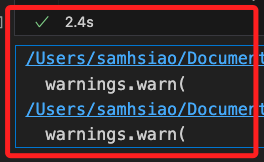
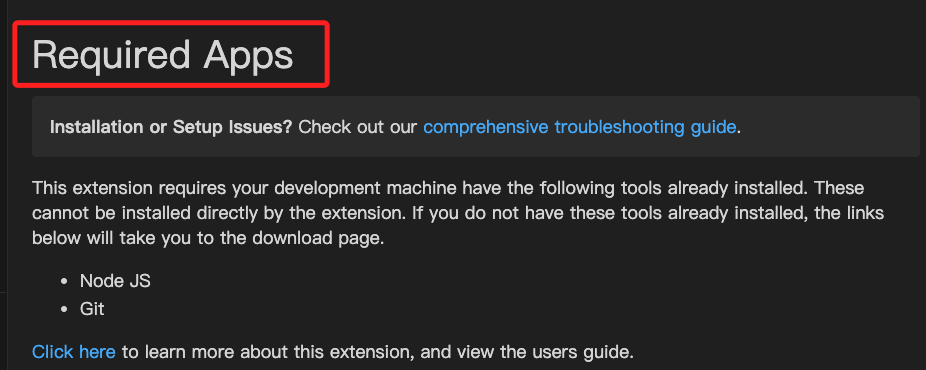
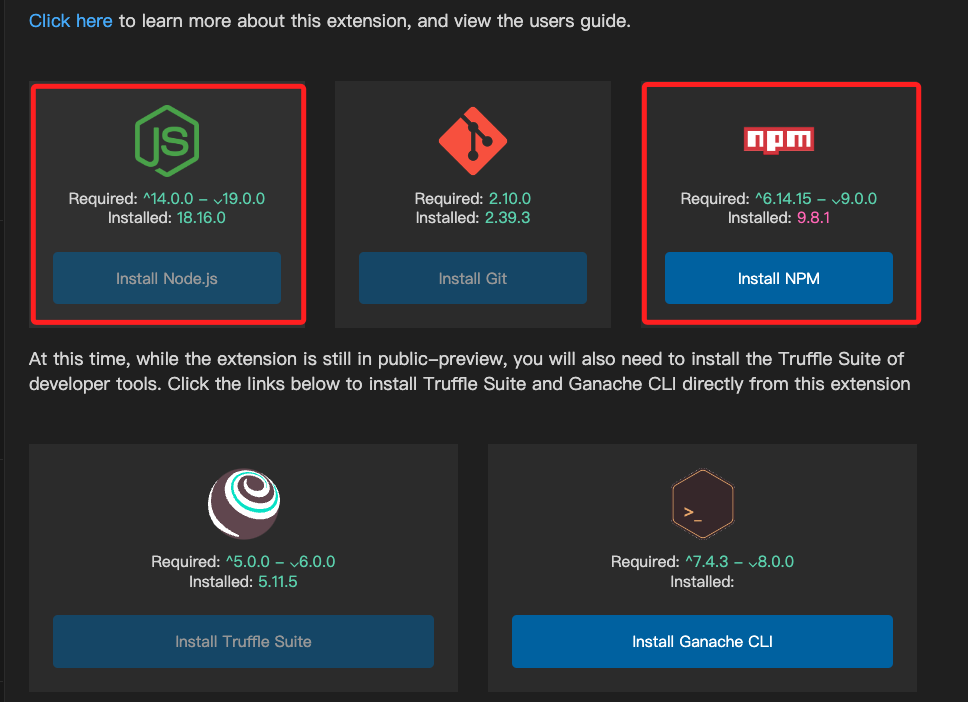
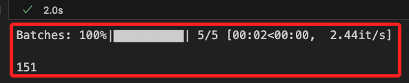
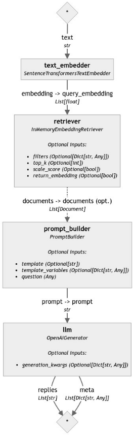

# 使用 RAG 建立問答管道

_使用 PromptBuilder 和 OpenAIGenerator 來建立帶有檢索增強的生成問答管道。_


_Creating Your First QA Pipeline with Retrieval-Augmentation_

<br>

## 說明

1. 這個範例是官方在 `2024/04/25` 發佈的 [官方教程](https://haystack.deepset.ai/tutorials/27_first_rag_pipeline)，使用 `Haystack 2.0` 建立 RAG 的生成問答管道，並會使用 `OpenAI API`。

<br>

2. 將使用 `七大奇蹟` 的維基百科頁面作為文件，也可自行替換為任何文本。

<br>

## 使用組件

1. InMemoryDocumentStore：用於儲存和管理文件。

<br>

2. SentenceTransformersDocumentEmbedder：用於將文件轉換為嵌入向量。

<br>

3. SentenceTransformersTextEmbedder：將用戶的查詢轉換為嵌入向量。

<br>

4. InMemoryEmbeddingRetriever：用於根據嵌入向量在內存中檢索相關文件。

<br>

5. PromptBuilder：用於建立模板提示。

<br>

6. OpenAIGenerator：使用 OpenAI 的生成模型來生成文本的模組。

<br>

## 開始進行

1. 安裝 Haystack 2.0 和其他所需的套件，並透過條件指定版本。

    ```bash
    pip install haystack-ai "datasets>=2.6.1" "sentence-transformers>=2.2.0"
    ```

<br>

2. 建立環境變量：這個範例在後續會使用到 `OpenAI API` 來建立生成器 `OpenAIGenerator`。

    ```python
    from getpass import getpass
    import os
    from dotenv import load_dotenv

    # 載入環境變數
    load_dotenv()
    os.environ["OPENAI_API_KEY"] = os.getenv("OPENAI_API_KEY")
    # 假如沒有找到環境變數就手動輸入
    if "OPENAI_API_KEY" not in os.environ:
        os.environ["OPENAI_API_KEY"] = getpass("Enter OpenAI API key:")
    ```

<br>

3. 禁用 `tokenizers` 的 `並行處理` 以 `避免死鎖`，詳最後面說明。

    ```python
    import os
    # 禁用 tokenizers 的並行處理，詳最後面的說明
    os.environ["TOKENIZERS_PARALLELISM"] = "false"
    ```

<br>

## 建立資料集

1. 抓取數據：使用 `七大奇蹟` 的維基百科頁面作為文件，這個數據是已經預處理並上傳到 `Hugging Face Space：Seven Wonders` 的數據，所以下載後不需進行任何額外的清理或分割。

    ```python
    from datasets import load_dataset
    from haystack import Document

    # 加載數據集
    dataset = load_dataset(
        "bilgeyucel/seven-wonders", split="train"
    )
    docs = [
        Document(content=doc["content"],
        meta=doc["meta"]) for doc in dataset
    ]
    ```

<br>

## 建立儲存

1. 將下載的數據 `嵌入索引` 到 `DocumentStore`，這裡使用 `內存文件儲存` 對象 `InMemoryDocumentStore` 作為 `文件儲存`。

    ```python
    from haystack.document_stores.in_memory import InMemoryDocumentStore

    # 初始化內存文件儲存
    document_store = InMemoryDocumentStore()
    ```

<br>

2. 建立 `文件嵌入器`：在文件嵌入器中指定模型，並透過嵌入器將數據儲存在 `DocumentStore` 中， 建議在實體建立後先調用 `warm_up()` 來下載嵌入模型，如此可加速後續管道的相關作業效率。

    ```python
    from haystack.components.embedders import SentenceTransformersDocumentEmbedder

    # 初始化 `文件嵌入器`
    # 將整個文件嵌入到一個向量表示中，以捕捉文件整體的語義信息
    doc_embedder = SentenceTransformersDocumentEmbedder(
        model="sentence-transformers/all-MiniLM-L6-v2"
    )
    # 加載嵌入器，這是一種優化手段，用於預先加載和初始化資源密集型組件
    # 可確保系統在運行時能迅速響應並保持高效的運行狀態
    # 可有效避免首次運行的延遲問題，提升整體系統的性能和穩定性
    doc_embedder.warm_up()
    ```

<br>

3. 出現兩個警告，這兩個都是版本棄用提醒，但都是由函數內建調用所引發，所以無法處理也無須理會。

    

<br>

## 關於開發環境

1. 若在 VSCode 中運行本範例可能會顯示如下的相關提示，這僅是表明某些擴充功能被要求在 VSCode 環境中進行安裝，如果下方訊息中有尚未安裝的工具，可點擊圖標連結進入下載頁面。

    

<br>

2. 除此，通知中可能還包含了版本過舊的插件，其中已經安裝的會呈現反白，接著可分別點擊進行安裝，安裝了即便用不上也不影響 VSCode 運作，可放心安裝。

    

<br>

## 寫入文件

_回到範例操作_

<br>

1. 運行 `文件嵌入器 doc_embedder` 將每個文件 `建立嵌入` 並 `嵌入儲存` 在文件對象的 `embedding` 欄位中。然後使用 `write_documents()` 方法將文件寫入 DocumentStore。

    ```python
    # 將文件轉換成嵌入表示
    # 這裡的嵌入是將每個文件的文本轉換成對應的向量，捕捉其語義信息
    docs_with_embeddings = doc_embedder.run(docs)
    # 將包含嵌入的文件寫入到 document_store 中
    # 這一步將文件及其對應的嵌入向量保存到內存中的 document_store
    document_store.write_documents(
        docs_with_embeddings["documents"]
    )
    ```

    

<br>

## 建立管道的文本嵌入器、索引器、生成器

_以下是一個建立管道的流程_

<br>

1. 建立 `文本嵌入器`：與前一個步驟的 `文件嵌入器` 有所不同， `文本嵌入器` 用於處理較短的文本數據，適用於需要比較文本語義的情境，而建立的嵌入可由 `檢索器` 從 `DocumentStore` 進行檢索。_請注意_，在模型的選用上，需與之前 `文件嵌入器` 相同。

    ```python
    from haystack.components.embedders import SentenceTransformersTextEmbedder

    # 建立 `文本` 嵌入器
    text_embedder = SentenceTransformersTextEmbedder(
        model="sentence-transformers/all-MiniLM-L6-v2"
    )
    ```

<br>

2. 建立 `檢索器`：這是一個嵌入索引器，透過內存嵌入索引器對象 `InMemoryEmbeddingRetriever` 來使用之前透過內存文件儲存器對象  `InMemoryDocumentStore` 所嵌入的文件進行檢索。

    ```python
    from haystack.components.retrievers.in_memory import InMemoryEmbeddingRetriever

    # 建立 `內存嵌入檢索器`
    retriever = InMemoryEmbeddingRetriever(document_store)
    ```

<br>

3. 建立 `生成器`：`生成器` 可與 LLM 進行互動，預設會讀取環境變數中的 `OPENAI_API_KEY` 變量值，這在前面步驟已進行寫入。

    ```python
    from haystack.components.generators import OpenAIGenerator

    # 初始化 OpenAI 生成器
    generator = OpenAIGenerator(model="gpt-4-turbo")
    ```

<br>

## 定義提示模板

_模板使用的是 `Jinja2` 循環語法_

<br>

1. 自定義提示模板用於在 RAG 中進行生成問答任務，`提示 Prompt` 應該接受 `兩個參數`，分別是從 `文件儲存` 檢索到的 `文件上下文 document.content` 以及用戶的問題 `question`，並使用 `Jinja2` 循環語法組合到提示中，最終將這個組合完成的提示提供給模型進行回答，也就是模板中最後的 `答案：`。

    ```python
    from haystack.components.builders import PromptBuilder

    # 定義模板提示
    template = """
    根據以下信息，回答問題。

    上下文:
    
        {{ document.content }}
    

    問題: {{question}}
    答案:
    """
    ```

<br>

2. 建立提示建構器 `PromptBuilder` 對象，並將前一個步驟建立的 `模板` 傳給建構器作為參數。

    ```python
    # 初始化提示生成器
    prompt_builder = PromptBuilder(template=template)
    ```

<br>

## 建立管道

1. 建立管道。

    ```python
    from haystack import Pipeline

    # 初始化管道
    basic_rag_pipeline = Pipeline()
    ```

<br>

2. 添加組件到管道。

    ```python
    # 添加組件到管道
    basic_rag_pipeline.add_component("text_embedder", text_embedder)
    basic_rag_pipeline.add_component("retriever", retriever)
    basic_rag_pipeline.add_component("prompt_builder", prompt_builder)
    basic_rag_pipeline.add_component("llm", generator)
    ```

<br>

3. 連接組件。

    ```python
    # 連接組件
    # 將 `text_embedder` 的 `embedding` 輸出連接到 `retriever` 的 `query_embedding` 輸入
    basic_rag_pipeline.connect(
        "text_embedder.embedding",
        "retriever.query_embedding"
    )
    # 因為 `prompt_builder` 有兩個輸入 `documents` 和 `question`
    # 而這裡顯式連接了 `retriever` 到 `prompt_builder` 的 `documents`
    basic_rag_pipeline.connect(
        "retriever",
        "prompt_builder.documents"
    )
    # 將 `prompt_builder` 連接到 `llm`
    basic_rag_pipeline.connect(
        "prompt_builder",
        "llm"
    )
    ```

<br>

4. 組件完成連接時會輸出以下訊息，這裡逐行說明一下詳細內容。

    ```bash
    # 這是一個 Pipeline 對象，記憶體位置在 0x377e1a8c0，這位置不重要
    <haystack.core.pipeline.pipeline.Pipeline object at 0x377e1a8c0>
    # 組件
    🚅 Components
        # 嵌入器組件，使用 Sentence Transformers 模型將文本轉換成嵌入向量
        - text_embedder: SentenceTransformersTextEmbedder
        
        # 檢索器組件，從內存中根據嵌入向量檢索相關的文件
        # 使用嵌入向量進行相似性檢索
        - retriever: InMemoryEmbeddingRetriever
        
        # 提示生成器，根據檢索到的文件來建立提示 Prompt
        # 這些提示會被用來生成輸出或進行進一步的處理
        - prompt_builder: PromptBuilder
        
        # 大型語言模型生成器組件，使用 OpenAI 的生成器來生成自然語言文本回應
        - llm: OpenAIGenerator

    # 連接
    🛤️ Connections
        # 組件將文本轉換為嵌入向量（embedding）
        # 這些嵌入向量作為 retriever 組件的輸入查詢嵌入（query_embedding）
        - text_embedder.embedding -> retriever.query_embedding (List[float])
        
        # 組件根據查詢嵌入檢索到的相關文件（documents）
        # 這些文件被傳遞給 prompt_builder 組件
        - retriever.documents -> prompt_builder.documents (List[Document])
        
        # 組件根據文件生成一個提示（prompt）
        # 這個提示被傳遞給 llm 組件來生成最終的自然語言回應
        - prompt_builder.prompt -> llm.prompt (str)
    ```

<br>

5. 可透過自訂義模組觀察並輸出管道現況圖。

    ```python
    from utils.draw_pipeline import draw_and_display

    draw_and_display(basic_rag_pipeline, "ex03_1_pipe.png")
    ```

    

<br>

6. 提問。

    ```python
    # 這僅僅是提問的範例供作參考
    '''
    Rhodes 雕像是什麼樣子的？
    巴比倫花園在哪裡？
    人們為什麼要建造吉薩大金字塔？
    人們為什麼參觀阿耳忒彌斯神殿？
    羅德島巨像的重要性是什麼？
    摩索拉斯墓發生了什麼事？
    羅德島巨像是怎麼崩潰的？
    '''
    # 提問
    question = "人們為什麼參觀阿耳忒彌斯神殿？"
    ```

<br>

6. 運行管道 `run()`，管道中有兩個參數且兩個參數皆使用提示模板的 `question` 作為傳入值。

    ```python
    response = basic_rag_pipeline.run({
        "text_embedder": {"text": question},
        "prompt_builder": {"question": question}
    })

    # 輸出答案
    print(response["llm"]["replies"][0])
    ```

    _Rhodes 雕像是什麼樣子的？答案：_

    Rhodes 雕像，也稱為羅得島的太陽神赫利俄斯巨像（Colossus of Rhodes），是一座代表希臘太陽神赫利俄斯的巨大青銅雕像。根據當時的描述，這座雕像高約70肘，即大約33米（108英尺），這使它成為古代世界中最高的雕像之一，大約與現代自由女神像從腳到頭冠的高度相當。雕像由鐵條組成的內架和銅板形成的表皮構成，內部填充石塊，支撐著整座雕像的結構。雕像本身約位於羅得島港口入口附近的一個15米高的白色大理石基座上。雕像的頭部有著标准化的面貌，特點包括卷曲的頭髮和均匀分布的金屬火焰狀尖刺，這些特徵與當時羅得島的硬幣上的圖像相似。

    _人們為什麼參觀阿耳忒彌斯神殿？答案：_
    
    人們參觀阿耳忒彌斯神殿的原因多樣。首先，這座神殿是一個重要的宗教地標，供奉著女神阿耳忒彌斯，吸引了許多虔誠的朝聖者前來參拜和獻祭。其次，神殿本身的建築和藝術價值也吸引了不少遊客和學者，例如神殿的豐富細節和精緻雕刻。此外，神殿還提供了庇護，對於逃避迫害或懲罰的人來說是一個避難所，這項功能也使得許多尋求保護的人士前來。最後，許多商人、國王和觀光客也會造訪此地，他們可能是出於對神殿的好奇或者文化旅遊的目的。因此，阿耳忒彌斯神殿成為了一個結合宗教、文化和歷史的多功能景點。

<br>

## 其他警告

1. 假如在回答中出現以下警告提示。

    ```bash
    huggingface/tokenizers: The current process just got forked, after parallelism has already been used. Disabling parallelism to avoid deadlocks...
    To disable this warning, you can either:
        - Avoid using `tokenizers` before the fork if possible
        - Explicitly set the environment variable TOKENIZERS_PARALLELISM=(true | false)
    ```

<br>

2. 這個警告訊息是由於 `huggingface` 的 `tokenizers 庫` 在進行 `文本分詞` 時使用了 `多線程並行` 處理，而這個 `並行處理` 可能在 `進程分叉（fork）` 後導致 `死鎖`。具體來說，_這與 `tokenizers` 的內部實現有關_，是因為 `OpenAIGenerator` 或 `SentenceTransformers` 模型在加載和處理數據時使用了多線程操作的關係，並非導因於任何顯性在代碼中進行的操作。

<br>

3. 可嘗試在代碼最前面設定環境變數來禁用 `tokenizers` 的 `並行處理` 避免死鎖。

    ```python
    import os
    # 禁用 tokenizers 的並行處理
    os.environ["TOKENIZERS_PARALLELISM"] = "false"
    ```

<br>

___

_END_