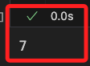
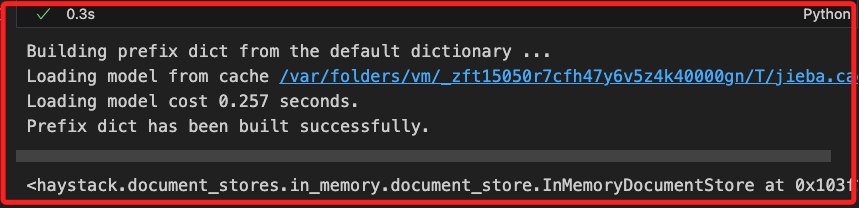
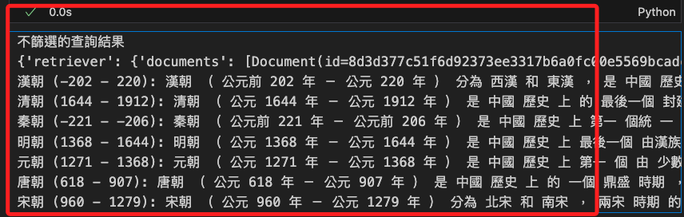
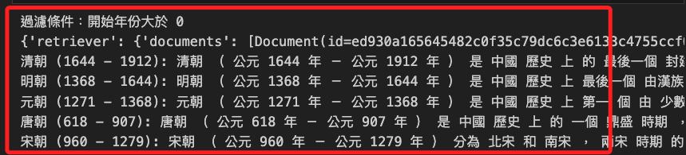
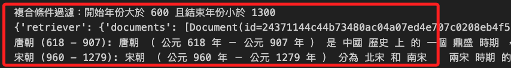

# 中文檢索

<br>

## 說明

1. 在處理中文文本時，因為中文是沒有明顯分隔符的語言，所以必須進行分詞處理，這與英文有顯著的不同。

<br>

2. 承上，中文文本的處理需使用分詞工具，接下來的範例中將使用 `jieba` 將中文句子分割成單詞，這可幫助檢索系統正確地理解和處理中文文本。

<br>

3. 安裝 `jieba` 分詞套件。 

    ```bash
    pip install jieba
    ```

<br>

## 開始

1. 準備包含元數據的文件，並對其進行儲存。

    ```python
    # 導入分詞套件
    import jieba
    from haystack import Document
    from haystack.document_stores.in_memory import InMemoryDocumentStore
    from haystack.components.retrievers.in_memory import InMemoryBM25Retriever

    # 使用 jieba 進行分詞
    def tokenize(content):
        return ' '.join(jieba.cut(content))

    # 創建文件並設置元數據，並使用 jieba 分詞
    documents = [
        Document(
            content=tokenize("秦朝（公元前221年－公元前206年）是中國歷史上第一個統一的多民族中央集權制國家，開創了中國封建社會的先河。"),
            meta={"dynasty": "秦朝", "start_year": -221, "end_year": -206},
        ),
        Document(
            content=tokenize("漢朝（公元前202年－公元220年）分為西漢和東漢，是中國歷史上的一個重要朝代，開創了文景之治和漢武盛世。"),
            meta={"dynasty": "漢朝", "start_year": -202, "end_year": 220},
        ),
        Document(
            content=tokenize("唐朝（公元618年－公元907年）是中國歷史上的一個鼎盛時期，文化、經濟、軍事都達到了新的高峰。"),
            meta={"dynasty": "唐朝", "start_year": 618, "end_year": 907},
        ),
        Document(
            content=tokenize("宋朝（公元960年－公元1279年）分為北宋和南宋，兩宋時期的經濟和文化發展繁榮。"),
            meta={"dynasty": "宋朝", "start_year": 960, "end_year": 1279},
        ),
        Document(
            content=tokenize("元朝（公元1271年－公元1368年）是中國歷史上第一個由少數民族建立的全國統一王朝。"),
            meta={"dynasty": "元朝", "start_year": 1271, "end_year": 1368},
        ),
        Document(
            content=tokenize("明朝（公元1368年－公元1644年）是中國歷史上最後一個由漢族建立的大一統王朝。"),
            meta={"dynasty": "明朝", "start_year": 1368, "end_year": 1644},
        ),
        Document(
            content=tokenize("清朝（公元1644年－公元1912年）是中國歷史上的最後一個封建王朝，也是中國歷史上第二個由少數民族建立的統一王朝。"),
            meta={"dynasty": "清朝", "start_year": 1644, "end_year": 1912},
        ),
    ]

    # 初始化內存文件儲存
    document_store = InMemoryDocumentStore(bm25_algorithm="BM25Plus")
    # 將文件寫入文件儲存
    document_store.write_documents(documents=documents)
    ```

<br>

2. 完成後可查看文件數量。

    

<br>

3. 打印 `document_store` 可查看儲存過程中消耗的時間等資訊。

    ```python
    document_store
    ```

    

<br>

## 進行檢索

1. 初始化 `管道` 並添加 `檢索器 add_component`。

    ```python
    from haystack import Pipeline

    # 初始化管道
    pipeline = Pipeline()
    # 添加內存 BM25 檢索器到管道
    pipeline.add_component(
        instance=InMemoryBM25Retriever(document_store=document_store),
        name="retriever"
    )
    ```

<br>

2. 不篩選查詢。

    ```python
    # 提問
    query = "中國歷史上的朝代"
    # 查詢也必須進行分詞
    query_tokenized = tokenize(query)

    # 不篩選，先輸出所有文件進行觀察
    result = pipeline.run(
        data={"retriever": {"query": query_tokenized}}
    )
    # 輸出結果
    print("不篩選的查詢結果")
    print(result)
    for doc in result["retriever"]["documents"]:
        print(
            f"{doc.meta['dynasty']} ({doc.meta['start_year']} - {doc.meta['end_year']}): {doc.content}"
        )
    ```

<br>

5. _結果_。

    

<br>

6. 篩選紀元大於某個指定年。

    ```python
    # 進行元數據過濾
    result = pipeline.run(
        data={
            "retriever": {
                "query": query_tokenized,
                "filters": {
                    "start_year": {"$gt": 0}
                }
            }
        }
    )

    # 輸出結果
    print("過濾條件：開始年份大於 0")
    print(result)
    for doc in result["retriever"]["documents"]:
        print(
            f"{doc.meta['dynasty']} ({doc.meta['start_year']} - {doc.meta['end_year']}): {doc.content}"
        )
    ```

<br>

7. _結果：可以觀察並未排序_。

    

<br>

8. 篩選紀元在指定區間的朝代。

    ```python
    # 提問並進行複合條件過濾
    result = pipeline.run(
        data={
            "retriever": {
                "query": query_tokenized,
                "filters": {
                    "$and": [
                        {"start_year": {"$gt": 600}},
                        {"end_year": {"$lt": 1300}}
                    ]
                }
            }
        }
    )

    # 輸出結果
    print("複合條件過濾：開始年份大於 600 且結束年份小於 1300")
    print(result)
    for doc in result["retriever"]["documents"]:
        print(
            f"{doc.meta['dynasty']} ({doc.meta['start_year']} - {doc.meta['end_year']}): {doc.content}"
        )
    ```

<br>

9. 結果。

    

<br>


## 寫入資料庫

1. 安裝套件。

```bash
pip install langchain_community rank_bm25
pip install torch sentence-transformers
```

2. 搭配
```python

```
___

_END_