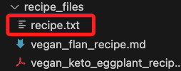
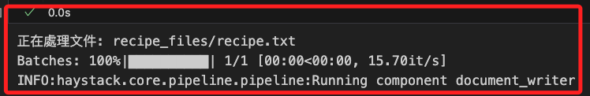
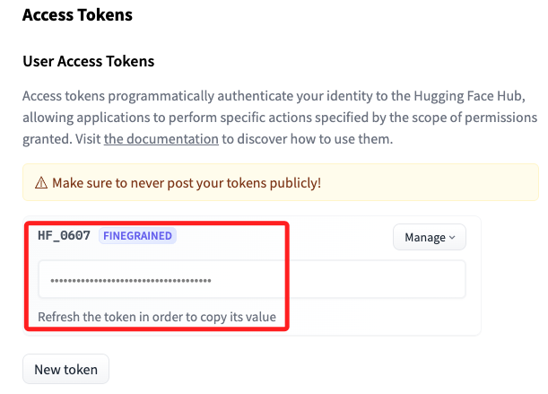
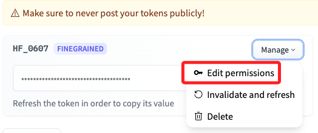
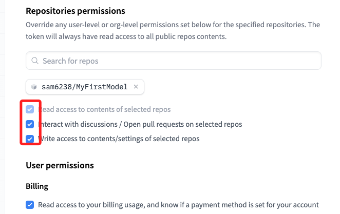
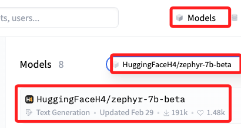

# 預處理不同文件類型

_使用 `FileTypeRouter`_

<br>

## 說明

1. 使用 [Haystack 2.0](https://haystack.deepset.ai/overview/quick-start)，可查詢官方 [Haystack 2.0 文件](https://haystack.deepset.ai/docs/latest).

<br>

2. 建立索引管道後，還可搭配 `Hugging Face API` 來彙整文件儲存構建 RAG 管道。

<br>

3. 這個範例的目標是構建一個索引管道，該管道可以預處理不同類型的文件，包括 Markdown、TXT 和 PDF 文件。每種文件類型都需要使用特定的文件轉換器來進行處理。這些轉換器將各自的文件格式轉換為標準的 Haystack 文件格式。

<br>

## 文件轉換器

1. MarkdownToDocument：將 Markdown 文件轉換為 Haystack 文件。

<br>

2. TextFileToDocument：將文本文件（如 TXT）轉換為 Haystack 文件。

<br>

3. PyPDFToDocument：將 PDF 文件轉換為 Haystack 文件。

<br>

## 索引管道的其他步驟

_一旦所有文件都被轉換為 Haystack 文件格式，索引管道的其餘部分主要包括以下幾個標準步驟_

<br>

1. 文件清理（DocumentCleaner）：去除文件中的多餘空白和其他不需要的字符，使文件更加整潔。

<br>

2. 文件分塊（DocumentSplitter）：將文件分成小塊（例如每塊 150 個單詞），這樣可以更方便地進行檢索和分析，並且可以避免丟失上下文。

<br>

3. 創建嵌入（SentenceTransformersDocumentEmbedder）：使用嵌入模型（例如 `sentence-transformers/all-MiniLM-L6-v2`）為文件創建嵌入向量，這些向量用於後續的文本檢索和查詢。

<br>

4. 寫入文件儲存（DocumentWriter）：最後，將處理好的文件寫入到文件儲存（例如 `InMemoryDocumentStore`）中，這樣可以在後續的查詢中進行高效檢索。

<br>

## 其他重要模組

1. FileTypeRouter：是一個路由器，用於根據文件的 MIME 類型將文件路由到不同的模組或轉換器。當文件來自不同的數據源，且每個文件的類型不同（如 PDF、Markdown 或 TXT 文件）時，FileTypeRouter 可以根據文件的 MIME 類型將其路由到相應的文件轉換器進行處理，這樣可以確保每個文件都能被正確地轉換成 Haystack 文件格式。

<br>

2. DocumentJoiner：用於將來自不同管道分支的文件合併成一個統一的文件列表，當不同的文件類型被不同的轉換器處理並生成 Haystack 文件後，DocumentJoiner 將這些分散的文件合併成一個統一的文件列表，以便後續的清理、分塊和嵌入處理。

<br>

## 開始

1. 安裝依賴。

    ```bash
    pip install haystack-ai
    pip install "sentence-transformers>=2.2.0" "huggingface_hub>=0.22.0"
    pip install markdown-it-py mdit_plain pypdf
    # 下載文件
    pip install gdown
    ```

<br>

2. 下載所有文件。

    ```python
    # 導入庫
    import gdown
    # 下載網址
    url = "https://drive.google.com/drive/folders/1n9yqq5Gl_HWfND5bTlrCwAOycMDt5EMj"
    # 儲存的資料夾
    output_dir = "recipe_files"
    # 以靜默方式下載到指定資料夾中
    gdown.download_folder(
        url,
        quiet=True,
        output=output_dir
    )
    ```

<br>

3. 下載的資料有三個，格式分別為 `Markdown`、`PDF`、`TXT`。

    

<br>

4. 創建 `索引文件` 的 `管道`，首先描述一下這個流程：首先要使用 `InMemoryDocumentStore` 處理 `文件儲存`，需要為數據中的每種類型的文件使用不同的 `文件轉換器類`，而 `FileTypeRouter` 可為每種類型的文件連接到適當的轉換器。轉換後的 Haystack 文件便可使用 `DocumentJoiner` 模組將這些文件合併成一個 `文件列表`，然後一起傳遞給索引管道的其餘部分。

    ```python
    from haystack.components.writers import DocumentWriter
    from haystack.components.converters import MarkdownToDocument, PyPDFToDocument, TextFileToDocument
    from haystack.components.preprocessors import DocumentSplitter, DocumentCleaner
    from haystack.components.routers import FileTypeRouter
    from haystack.components.joiners import DocumentJoiner
    from haystack.components.embedders import SentenceTransformersDocumentEmbedder
    from haystack import Pipeline
    from haystack.document_stores.in_memory import InMemoryDocumentStore

    # 建立一個文件儲存實體
    document_store = InMemoryDocumentStore()
    # 組件：建立文件轉換路由器
    file_type_router = FileTypeRouter(
        mime_types=[
            "text/plain",
            "application/pdf",
            "text/markdown"
        ]
    )
    # 分別針對文件類型指定轉換器組件
    # 組件：TXT
    text_file_converter = TextFileToDocument()
    # 組件：Markdown
    markdown_converter = MarkdownToDocument()
    # 組件：PDF
    pdf_converter = PyPDFToDocument()
    # 組件：文件合併器實體
    document_joiner = DocumentJoiner()
    ```

<br>

4. 數據清洗：使用 `DocumentCleaner` 刪除空白，然後 `DocumentSplitter` 將它們分成 `150` 字的塊，並進行一些重疊以避免丟失上下文。

    ```python
    # 組件：刪除空白器
    document_cleaner = DocumentCleaner()
    # 組件：切割文件器
    document_splitter = DocumentSplitter(
        split_by="word",
        split_length=150,
        split_overlap=50
    )
    ```

<br>

5. 添加一個 `SentenceTransformersDocumentEmbedder` 來創建文件的嵌入，然後使用 `DocumentWriter` 將這些文件寫入內存文件儲存。

    ```python
    # 組件：文件嵌入器
    document_embedder = SentenceTransformersDocumentEmbedder(
        model="sentence-transformers/all-MiniLM-L6-v2"
    )
    # 組件：寫入文件儲存
    document_writer = DocumentWriter(document_store)
    ```

<br>

6. 創建所有模組後，將它們添加到 `索引管道` 中。

    ```python
    # 建立索引管道實體
    preprocessing_pipeline = Pipeline()
    # 添加以上各種組件
    preprocessing_pipeline.add_component(
        # 文件轉換路由器
        instance=file_type_router, name="file_type_router"
    )
    preprocessing_pipeline.add_component(
        # TXT 文件轉換
        instance=text_file_converter, name="text_file_converter"
    )
    preprocessing_pipeline.add_component(
        # MD 文件轉換
        instance=markdown_converter, name="markdown_converter"
    )
    preprocessing_pipeline.add_component(
        # PDF 文件轉換
        instance=pdf_converter, name="pypdf_converter"
    )
    preprocessing_pipeline.add_component(
        # 文件合併
        instance=document_joiner, name="document_joiner"
    )
    preprocessing_pipeline.add_component(
        # 刪除空白
        instance=document_cleaner, name="document_cleaner"
    )
    preprocessing_pipeline.add_component(
        # 文件切割
        instance=document_splitter, name="document_splitter"
    )
    preprocessing_pipeline.add_component(
        # 文件嵌入
        instance=document_embedder, name="document_embedder"
    )
    preprocessing_pipeline.add_component(
        # 寫入文件儲存
        instance=document_writer, name="document_writer"
    )
    ```

<br>

7. 接下來，設定 `預處理管道`的 `connect` 方法，將不同類型的文件進行轉換、清理、嵌入後寫入文件儲存中。

    ```python
    preprocessing_pipeline.connect(
        # 處理 text/plain 類型文件，將其傳遞給 text_file_converter 進行轉換
        "file_type_router.text/plain", "text_file_converter.sources"
    )
    preprocessing_pipeline.connect(
        # 處理 application/pdf 類型文件，將其傳遞給 pypdf_converter
        # 也就是這個預處理管道可接收 PDF 文件，並通過 PDF 轉換器進行處理
        "file_type_router.application/pdf", "pypdf_converter.sources"
    )
    preprocessing_pipeline.connect(
        # 處理 Markdown 文件，並通過 Markdown 轉換器來處理
        "file_type_router.text/markdown", "markdown_converter.sources"
    )
    preprocessing_pipeline.connect(
        # 將經過文本轉換器處理的文件傳遞給文件合併器
        "text_file_converter", "document_joiner"
    )
    preprocessing_pipeline.connect(
        # 處理 application/pdf 類型文件，將其傳遞給 pypdf_converter
        "pypdf_converter", "document_joiner"
    )
    preprocessing_pipeline.connect(
        "markdown_converter", "document_joiner"
    )
    preprocessing_pipeline.connect(
        # document_joiner 是用於合併不同的文件片段的組件
        "document_joiner", "document_cleaner"
    )
    preprocessing_pipeline.connect(
        # 將文件合併器的輸出連接到文件清理器
        "document_cleaner", "document_splitter"
    )
    preprocessing_pipeline.connect(
        # 將拆分後的文件傳給 document_embedder，用於生成這些片段的嵌入向量
        # 這樣每個文件片段都會被轉換成嵌入向量，便於後續的檢索和分析
        "document_splitter", "document_embedder"
    )
    preprocessing_pipeline.connect(
        # 將嵌入後的文件傳遞給 document_writer
        # 最終將這些嵌入寫入到文件儲存中
        "document_embedder", "document_writer"
    )
    ```

<br>

8. 輸出如下，以上完成資料的預處理。

    ```bash
    <haystack.core.pipeline.pipeline.Pipeline object at 0x3173b1480>
    🚅 Components
    - file_type_router: FileTypeRouter
    - text_file_converter: TextFileToDocument
    - markdown_converter: MarkdownToDocument
    - pypdf_converter: PyPDFToDocument
    - document_joiner: DocumentJoiner
    - document_cleaner: DocumentCleaner
    - document_splitter: DocumentSplitter
    - document_embedder: SentenceTransformersDocumentEmbedder
    - document_writer: DocumentWriter
    🛤️ Connections
    - file_type_router.text/plain -> text_file_converter.sources (List[Path])
    - file_type_router.application/pdf -> pypdf_converter.sources (List[Path])
    - file_type_router.text/markdown -> markdown_converter.sources (List[Path])
    - text_file_converter.documents -> document_joiner.documents (List[Document])
    - markdown_converter.documents -> document_joiner.documents (List[Document])
    - pypdf_converter.documents -> document_joiner.documents (List[Document])
    - document_joiner.documents -> document_cleaner.documents (List[Document])
    - document_cleaner.documents -> document_splitter.documents (List[Document])
    - document_splitter.documents -> document_embedder.documents (List[Document])
    - document_embedder.documents -> document_writer.documents (List[Document])
    ```

<br>

## 在 RAG 管道中使用這些文件

1. 用食譜文件 `recipe.txt` 來測試這個管道：說明一下這個食譜文件下載的時候全名是 `vegan_sunflower_hemp_cheese_recipe.txt`，我手動進行修改為短名稱，目的是在閱讀輸出的時候比較簡潔。

    

<br>

2. 程式碼。

    ```python
    from pathlib import Path

    # 測試文件路徑是否存在
    file_path = Path("recipe_files/recipe.txt")
    if file_path.exists():
        print(f"正在處理文件: {file_path}")

        try:
            # 設置日誌級別以查看處理過程
            import logging
            logging.basicConfig(level=logging.INFO)
            
            preprocessing_pipeline.run(
                {"file_type_router": {"sources": [file_path]}}
            )
        except Exception as e:
            print(f"處理過程中出現錯誤: {e}")
    else:
        print(f"文件 {file_path} 不存在。")

    ```

    

<br>

## 使用

1. 在下一個步驟中將會使用到 `HuggingFaceAPIGenerator`，因此需要擁有一個 `Hugging Face API Key`，若還沒有密鑰請前往 [官網](https://huggingface.co/settings/tokens) 建立。

    

<br>

2. 務必確保 `Hugging Face Token` 具有相對的權限，可在選單中進行權限編輯。

    

<br>

3. 在此階段可將全部權限勾選開啟，包含後續未顯示在圖片中的權限項目。

    

<br>

4. 另外對於將使用到的 `HuggingFaceH4/zephyr-7b-beta` 模型，可在 `Models` 頁籤中確認模型 ID。

    

<br>

5. 寫入 `.env` 文件。

    ```json
    HF_API_TOKEN=<寫入自己的 API KEY>
    ```

<br>

## 建立腳本回答問題

1. 完成設置後，編寫腳本構建一個 `RAG 管道` 來根據剛剛創建的文件回答查詢。
    ```python
    import os
    from getpass import getpass
    from dotenv import load_dotenv

    # 環境變數
    load_dotenv()
    os.environ["HF_API_TOKEN"] = os.getenv("HF_API_TOKEN")
    # 檢查是否已經寫入
    if "HF_API_TOKEN" not in os.environ:
        # 尚未寫入則透過 `getpass` 進行設定
        os.environ["HF_API_TOKEN"] = getpass("Enter Hugging Face token:")
    ```

<br>

2. 該管道接收提示，從文件儲存中搜索相關文件，並將這些文件傳遞給 LLM 以形成答案。

    ```python
    from haystack.components.embedders import SentenceTransformersTextEmbedder
    from haystack.components.retrievers.in_memory import InMemoryEmbeddingRetriever
    from haystack.components.builders import PromptBuilder
    from haystack.components.generators import HuggingFaceAPIGenerator

    template = """
    Answer the questions based on the given context.

    Context:
    
        {{ document.content }}
    

    Question: {{ question }}
    Answer:
    """
    pipe = Pipeline()
    pipe.add_component("embedder", SentenceTransformersTextEmbedder(model="sentence-transformers/all-MiniLM-L6-v2"))
    pipe.add_component("retriever", InMemoryEmbeddingRetriever(document_store=document_store))
    pipe.add_component("prompt_builder", PromptBuilder(template=template))
    pipe.add_component(
        "llm",
        HuggingFaceAPIGenerator(api_type="serverless_inference_api", api_params={"model": "HuggingFaceH4/zephyr-7b-beta"}),
    )

    pipe.connect("embedder.embedding", "retriever.query_embedding")
    pipe.connect("retriever", "prompt_builder.documents")
    pipe.connect("prompt_builder", "llm")
    ```

<br>

3. 會輸出以下訊息。

    ```bash
    <haystack.core.pipeline.pipeline.Pipeline object at 0x36b59c040>
    🚅 Components
    - embedder: SentenceTransformersTextEmbedder
    - retriever: InMemoryEmbeddingRetriever
    - prompt_builder: PromptBuilder
    - llm: HuggingFaceAPIGenerator
    🛤️ Connections
    - embedder.embedding -> retriever.query_embedding (List[float])
    - retriever.documents -> prompt_builder.documents (List[Document])
    - prompt_builder.prompt -> llm.prompt (str)
    ```

<br>

4. 如果一切正確，以下代碼將會得到一份完整的購物清單，包括所有的食譜來源。

    ```python
    # 提問：製作純素酮茄子烤寬麵條、純素柿子餡餅和純素大麻起司需要哪些原料？
    question = (
        "What ingredients would I need to make vegan keto eggplant lasagna, vegan persimmon flan, and vegan hemp cheese?"
    )

    pipe.run(
        {
            "embedder": {"text": question},
            "prompt_builder": {"question": question},
            "llm": {"generation_kwargs": {"max_new_tokens": 350}},
        }
    )
    ```

<br>

5. 輸出結果。

    ```json
    {
        'llm': {
            'replies': [
                ' For vegan keto eggplant lasagna, you would need eggplant, tomato sauce, vegan cheese (such as mozzarella or parmesan), lasagna noodles made from low-carb ingredients (such as zucchini or mushrooms), and any additional seasonings or herbs you prefer. For vegan persimmon flan, you would need persimmons, coconut milk, agar agar (a vegan substitute for gelatin), sugar, and vanilla extract. For vegan hemp cheese, you would need sunflower seeds, hemp hearts, miso paste, nutritional yeast, rejuvelac (a fermented liquid made from sprouted grains), salt, and any additional flavorings you prefer.'
            ],
            'meta': [{
                'model': 'HuggingFaceH4/zephyr-7b-beta',
                'finish_reason': 'eos_token',
                'usage': {'completion_tokens': 168}
            }]
        }
    }
    ```

<br>

___

_END_