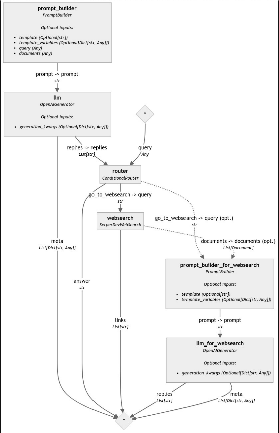
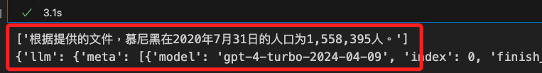

# 有條件的路由管道


_Building Fallbacks to Websearch with Conditional Routing_

<br>

## 說明

1. 這是在 `2024/04/25` 發佈的 [官方教程](https://haystack.deepset.ai/tutorials/36_building_fallbacks_with_conditional_routing)。

<br>

2. 使用 `Haystack` 建立具有 `有條件的路由（Conditional Routing）` 的 `管道`；所謂 `有條件的路由` 是指在 `數據集` 中找不到答案時，可退回 `在網絡進行搜尋`。

<br>

3. 在使用 `檢索增強生成（RAG）` 進行應用開發時，`檢索步驟` 是 `LLMs` 生成 `回應` 的主要信息來源，當數據庫缺乏所需信息，改用網絡作為 `RAG 應用` 的數據來源是一種實用的解決方案；這可通過在系統中實現 `條件路由機制` 控制數據流，設計在某些情況下利用網絡作為數據源的系統。

<br>

4. 簡言之，這個範例的目標就是建立一個具有 `條件路由`的 `管道`，當在數據集中找不到答案時，可以自動改用網絡進行搜索。

<br>

## 使用的組件與 API

1. `ConditionalRouter`：根據 `條件` 將數據 `路由` 到不同的 `管道分支`，根據指定的條件決定數據流向。

<br>

2. `SerperDevWebSearch`：進行網頁搜索以獲取相關資料和信息，通常用於從網路上查詢和檢索數據。

<br>

3. `PromptBuilder`：用於構建和生成提示模板，幫助生成模型理解和處理輸入數據並生成合適的回應。

<br>

4. `OpenAIGenerator`：利用 OpenAI 的模型生成文本回應，通常用於自然語言生成任務如回答問題或文本創建。

<br>

5. `OpenAI API`：提供 OpenAI 模型的接口，用於自然語言處理和生成任務，包括聊天機器人、文本生成等應用。

<br>

6. `Serper API`：這是 Google 提供的網頁搜索和數據檢索服務的接口，用於在程序中進行網頁搜索以獲取和處理外部信息。

<br>

## 關於 serper

_集成了網絡搜索引擎的功能，允許用戶在他們的應用中進行高效的網頁搜索。_

<br>

1. 進行 [官網](https://serper.dev/) 後登入或註冊。

    

<br>

2. 註冊完成點擊 `API Key` 來生成密鑰，並將密鑰寫入 `.env`，鍵的名稱使用 `SERPERDEV_API_KEY`。

    

<br>

3. 補充介紹 `serper` 名稱的由來，應該是 `SERP` 這個縮寫加上尾綴 `er` 而來，而 `SERP` 是 `Search Engine Results Page` 的縮寫，也就是 `搜索引擎結果頁面` 的意思。

<br>

## 開始開發

1. 安裝 Haystack 2.0。

    ```bash
    pip install haystack-ai
    ```

<br>

2. 建立環境變數，相關細節不再贅述。

    ```python
    from getpass import getpass
    import os
    from dotenv import load_dotenv

    # 載入環境變數
    load_dotenv()
    # 兩個 API 的密鑰
    os.environ["OPENAI_API_KEY"] = os.getenv("OPENAI_API_KEY")
    os.environ["SERPERDEV_API_KEY"] = os.getenv("SERPERDEV_API_KEY")
    # 判斷是否存在，不存在可透過手動輸入
    if "OPENAI_API_KEY" not in os.environ:
        os.environ["OPENAI_API_KEY"] = getpass("Enter OpenAI API key:")
    if "SERPERDEV_API_KEY" not in os.environ:
        os.environ["SERPERDEV_API_KEY"] = getpass("Enter Serper API key:")
    ```

<br>

## 建立文件

1. 建立一個提供搜尋的文件，內容是關於 `慕尼黑` 的種種描述，這將用於在代碼中進行搜索答案。

    ```python
    # 用於建立文件
    from haystack.dataclasses import Document

    # 定義一個文件，內容描述了德國南部巴伐利亞州首府慕尼黑
    documents = [
        Document(
            content="""慕尼黑是德國南部巴伐利亞州的首府，充滿了豐富的文化遺產和現代城市的優雅。位於伊薩爾河畔，慕尼黑以其華麗的建築而聞名，如馬麗恩廣場的慕尼黑新市政廳和寧芬堡宮的宏偉壯觀。這座城市是藝術愛好者的天堂，擁有世界級的博物館，如阿爾特·皮納科特克，收藏了許多著名藝術家的傑作。慕尼黑也因其熱鬧的啤酒花園而聞名，當地人和遊客聚集在這裡享受城市著名的啤酒和傳統巴伐利亞美食。每年的慕尼黑啤酒節是世界上最大的啤酒節，吸引了來自世界各地的數百萬遊客。除了豐富的文化和美食享受外，慕尼黑還擁有如英國花園這樣的美麗公園，為繁忙的都市提供了一個寧靜的避風港。遊客們為慕尼黑的熱情好客所打動，使得這裡成為了想要體驗古老魅力和現代魅力的旅行者必去的目的地。"""
        )
    ]
    ```

<br>

## 建立模板

_在這個範例中會使用到兩個模板，分別是 `提示模板` 與 `網路搜尋模板`_

<br>

1. 自定義 `提示模板`：這個模板將用來指導 `LLM` 進行回答，明確指示若在提供的文件中沒有足夠的上下文來回答時，將直接回覆 `no_answer`；在後續步驟會將這個 `提示` 傳給 `PromptBuilder` 對象作為參數，而 `有條件的路由` 就是當 `LLM` 回覆 `no_answer` 這個 `關鍵詞`時會依據指示退回到的網絡進行搜索，屆時就會使用到另一個模板 `網路搜尋模板`。

    ```python
    # 定義一個提示模板，指導 LLM 回答查詢
    prompt_template = """
    根據文件回答下列問題。
    如果答案未包含在文件中，請回覆
    'no_answer'

    Query: {{query}}

    Documents:
    
        {{document.content}}
    
    """
    ```

<br>

## 建立組件

1. 建立組件：提示生成器。 

    ```python
    from haystack.components.builders.prompt_builder import PromptBuilder
    # 使用定義的模板建立 PromptBuilder
    prompt_builder = PromptBuilder(template=prompt_template)
    ```

<br>

2. 建立組件：語言模型生成器。

    ```python
    from haystack.components.generators import OpenAIGenerator
    # 初始化 OpenAIGenerator，使用 gpt-4-turbo 模型
    llm = OpenAIGenerator(model="gpt-4-turbo")
    ```

<br>

## 建立網路搜索

1. 建立網路搜索模板。

    ```python
    # 定義一個提示模板，用於網絡搜索
    prompt_for_websearch = """
    根據從 Web 檢索到的文件，回答以下查詢。
    你的答案應表明你的答案是透過網路搜尋產生的。

    Query: {{query}}
    Documents:
    
        {{document.content}}
    
    """
    ```

<br>

## 建立管道

1. 建立管道對象。

    ```python
    from haystack import Pipeline

    # 建立管道
    pipe = Pipeline()
    ```

<br>

## 建立一般組件

1. 建立組件：網絡搜索器。

    ```python
    from haystack.components.websearch.serper_dev import SerperDevWebSearch

    # 初始化網絡搜索組件
    websearch = SerperDevWebSearch()
    ```

<br>

2. 建立組件：提示生成器。

    ```python
    from haystack.components.builders.prompt_builder import PromptBuilder
    # 使用網絡搜索提示模板建立 PromptBuilder
    prompt_builder_for_websearch = PromptBuilder(template=prompt_for_websearch)
    ```

<br>

3. 建立組件：回答生成器。

    ```python
    from haystack.components.generators import OpenAIGenerator
    # 初始化 OpenAIGenerator，使用 gpt-4-turbo 模型
    llm_for_websearch = OpenAIGenerator(model="gpt-4-turbo")
    ```

<br>

## 建立條件路由組件

1. 所謂 `路由器` 是根據特定條件處理 `數據路由` 的組件，需要為每個路由定義 `一個條件`、`一個輸出`、`一個輸出名稱` 和 `一個輸出類型`，每個條件路由（`ConditionalRouter`）對象充當這個組件的 `輸出`，可以連接到相同 `管道` 中的其他 `組件`。

<br>

1. 定義兩個路由規則：如果 `LLM` 回覆 `no_answer` 關鍵詞，管道應該進行 `網絡搜索`，也就是將把原始查詢作為輸出值傳遞給下一個 `組件`，在這種情況下，下一個組件將是 `SerperDevWebSearch`，並且 `輸出名稱` 將是 `go_to_websearch`。除此，提供的文件已足夠回答問題，管道執行在此結束，並將 `LLM` 回覆的答案作為名為 `answer` 的輸出。

3. 建立組件：條件路由器 `ConditionalRouter`。

    ```python
    from haystack.components.routers import ConditionalRouter

    # 定義路由規則
    routes = [
        {
            # 如果 LLM 回覆中包含 'no_answer'
            "condition": "{{'no_answer' in replies[0]}}",
            # 將查詢作為輸出
            "output": "{{query}}",
            # 輸出名稱
            "output_name": "go_to_websearch",
            # 輸出類型
            "output_type": str
        },
        {
            # 如果 LLM 回覆中不包含 'no_answer'
            "condition": "{{'no_answer' not in replies[0]}}",
            # 將回覆的答案作為輸出
            "output": "{{replies[0]}}",
            # 輸出名稱
            "output_name": "answer",
            # 輸出類型
            "output_type": str
        }
    ]

    # 初始化 ConditionalRouter
    router = ConditionalRouter(routes)
    ```

<br>


2. 將組件添加到 `管道`。

    ```python
    # 添加組件到管道
    pipe.add_component("prompt_builder", prompt_builder)
    pipe.add_component("llm", llm)
    pipe.add_component("router", router)
    pipe.add_component("websearch", websearch)
    pipe.add_component("prompt_builder_for_websearch", prompt_builder_for_websearch)
    pipe.add_component("llm_for_websearch", llm_for_websearch)
    ```

<br>

3. 連接組件。

    ```python
    # 連接管道中的組件
    # 連接 prompt_builder 到 llm
    pipe.connect(
        "prompt_builder", "llm"
    )
    # 連接 llm 的回覆到 router
    pipe.connect(
        "llm.replies", "router.replies"
    )
    # 連接 router 的 go_to_websearch 到 websearch 的查詢
    pipe.connect(
        "router.go_to_websearch", "websearch.query"
    )
    # 連接 router 的 go_to_websearch 到 prompt_builder_for_websearch 的查詢
    pipe.connect(
        "router.go_to_websearch", "prompt_builder_for_websearch.query"
    )
    # 連接 websearch 的文件到 prompt_builder_for_websearch
    pipe.connect(
        "websearch.documents", "prompt_builder_for_websearch.documents"
    )
    # 連接 prompt_builder_for_websearch 到 llm_for_websearch
    pipe.connect(
        "prompt_builder_for_websearch", "llm_for_websearch"
    )
    ```

<br>

4. 完成連接會輸出結果。

    ```bash
    <haystack.core.pipeline.pipeline.Pipeline object at 0x30df951b0>

    🚅 Components
        - prompt_builder: PromptBuilder
        - llm: OpenAIGenerator
        - router: ConditionalRouter
        - websearch: SerperDevWebSearch
        - prompt_builder_for_websearch: PromptBuilder
        - llm_for_websearch: OpenAIGenerator

    🛤️ Connections
        - prompt_builder.prompt -> llm.prompt (str)
        - llm.replies -> router.replies (List[str])
        - router.go_to_websearch -> websearch.query (str)
        - router.go_to_websearch -> prompt_builder_for_websearch.query (str)
        - websearch.documents -> prompt_builder_for_websearch.documents (List[Document])
        - prompt_builder_for_websearch.prompt -> llm_for_websearch.prompt (str)
    ```

<br>

5. 使用自訂拓展繪製管道圖。

    ```python
    from utils.draw_pipeline import draw_and_display

    draw_and_display(pipe, "ex09_1_pipe.png")
    ```

    

<br>

## 運行管道

1. 提問並運行管道 `run()`，將 `提問（query）` 傳遞給 `prompt_builder` 和 `router`，❗ 特別注意，在實際應用中，文件通常由 `檢索器` 提供，這裡基於簡化示範，將自行定義的文件直接提供給 `prompt_builder`。

    ```python
    # 定義查詢
    query = "慕尼黑在哪裡？"

    # 運行管道
    result = pipe.run({
        "prompt_builder": {
            "query": query,
            "documents": documents
        },
        "router": {"query": query}
    })

    # 輸出來自 ConditionalRouter 的 `answer`
    print(result["router"]["answer"])
    # ✅ 答案可以在定義的文件中找到。
    ```

<br>

2. 結果會顯示。

    

<br>

3. 嘗試在沒有答案的給定文件中查詢，測試網絡搜索是否按預期工作。

    ```python
    # 定義查詢
    query = "慕尼黑有多少人口？"

    # 運行管道
    result = pipe.run({
        "prompt_builder": {
            "query": query,
            "documents": documents
        },
        "router": {"query": query}
    })

    # 輸出使用網絡搜索文件生成的 `replies`
    print(result["llm_for_websearch"]["replies"])

    # 查看完整結果，你將看到網絡搜索組件還提供了從網上檢索到的文件鏈接：
    print(result)
    ```

<br>

4. 輸出結果。

    

<br>

5. 其中會輸出一個資訊字典如下，在網路搜尋來源包含維基百科、百度百科、wicco 等多個來源。

    ```python
    {
        "llm": {
            "meta": [
                {
                    "model": "gpt-4-turbo-2024-04-09",
                    "index": 0,
                    "finish_reason": "stop",
                    "usage": {
                        "completion_tokens": 2,
                        "prompt_tokens": 557,
                        "total_tokens": 559,
                    },
                }
            ]
        },
        "websearch": {
            "links": [
                "https://zh.wikipedia.org/zh-hans/%E6%85%95%E5%B0%BC%E9%BB%91",
                "https://zh.wikipedia.org/zh-hans/%E5%BE%B7%E5%9B%BD%E5%9F%8E%E5%B8%82%E5%88%97%E8%A1%A8_(%E6%8C%89%E4%BA%BA%E5%8F%A3%E6%8E%92%E5%88%97)",
                "https://baike.baidu.com/item/%E6%85%95%E5%B0%BC%E9%BB%91%E5%B8%82/12766218",
                "https://www.wicco.net/city/149",
                "http://goabroad.sohu.com/20090421/n263520876.shtml",
                "https://www.tatsachen-ueber-deutschland.de/zh-hans/gailan/duocaizhiguo",
                "https://yuanhang.buaa.edu.cn/yhwx/info/1240/4953.htm",
                "http://fao.sz.gov.cn/ztzl/lszt/gjmcszft/content/post_11844.html",
                "https://www.epochtimes.com/gb/11/11/29/n3443938.htm",
                "https://www.aklishi.com/sjls/ozls/20438.html",
            ]
        },
        "llm_for_websearch": {
            "replies": ["根据提供的文件，慕尼黑在2020年7月31日的人口为1,558,395人。"],
            "meta": [
                {
                    "model": "gpt-4-turbo-2024-04-09",
                    "index": 0,
                    "finish_reason": "stop",
                    "usage": {
                        "completion_tokens": 33,
                        "prompt_tokens": 876,
                        "total_tokens": 909,
                    },
                }
            ],
        },
    }
    ```

<br>

## 補充說明

1. 定義新的數據。

    ```python
    # 定義一個新的文件，內容是維基百科對於台灣的描述
    documents_tw = [
        Document(
            content="臺灣（俗字寫作台灣），西方國家亦稱福爾摩沙（葡萄牙語：Formosa），是位於東亞、太平洋西北側的島嶼，地處琉球群島與菲律賓群島之間，西隔臺灣海峽與中國大陸相望，海峽距離約130公里，周圍海域從3點鐘方向以順時鐘排序分別為太平洋（菲律賓海）、巴士海峽、南海、臺灣海峽、東海。面積約3.6萬平方公里，在當前全球各島嶼面積排名中位居第38（或39），島上約七成面積之地形為山地與丘陵，平原主要集中於西部沿海，地形海拔變化大，最高點3952公尺。全島被北回歸線貫穿，氣候炎熱，夏季偏長，介於熱帶與亞熱帶地帶之間，北回歸線以北為副熱帶季風氣候、以南為熱帶季風氣候[6][7]，自然景觀與生態系資源豐富多元[8]。臺灣面積約3.6萬平方公里，在當前全球各島嶼面積排名中位居第38（或39），為板塊碰撞隆起形成的大陸島，是東亞島弧之一部分（由菲律賓板塊潛入歐亞板塊形成）。島上約七成面積之地形為山地與丘陵，平原主要集中於西部沿海，地形海拔變化大，最高點3952公尺。全島被北回歸線貫穿，氣候炎熱，夏季偏長，介於熱帶與亞熱帶地帶之間，北回歸線以北為副熱帶季風氣候、以南為熱帶季風氣候[9][10]，自然景觀與生態系資源豐富多元[8]。人口約2300萬人，超過七成集中於西部的五大都會區，其中以行政中心臺北為核心的臺北都會區最大，約700萬人。族群構成以漢族、原住民族為主：原住民族由多個屬於南島民族的部族組成，漢族則依民系及移民年代的不同而分為閩南（河洛）、客家與外省族群，其中閩南裔為臺灣最大族群。約三萬年前冰河時期開始有人類遷移至台灣活動，自古為原住民族世居之地[11]，原住民族在17世紀中葉以前一直居於主體民族地位；隨著漢族不斷從中國大陸移入與墾殖，漢族遂取代原住民族成為臺灣的最大民族。自有信史記錄以來，臺灣歷史上曾經歷多個原住民聯盟和政權、荷西時期、明鄭時期、清治時期、日治時期等多次政權遞嬗，最近一次為1945年進入戰後時期由中華民國統治。1949年中華民國政府播遷臺灣造成兩岸分治的局面後，臺灣成為中華民國有效統治領土的主要部分[d]。隨著1987年戒嚴時代結束，臺灣逐漸淡化過往戒嚴時代形塑的中國史觀，政治上走向自由化與民主化，以中國國民黨及民主進步黨兩黨為首的政黨政治、統獨議題、以及公民社會的形成，加之以東南亞新住民的定居，產生出多元文化主義[12][13]，使得臺灣文化呈現多元並立的面貌。而由此原因再加上一中原則，使得現今「臺灣」成為中華民國的通稱。歷經1860年臺灣開港以來至日治時期所打下的現代化基礎[14]，以及中華民國政府遷臺後運用美援所進行的一系列的經濟建設，加上國際上冷戰對峙的格局，臺灣自1960年代起在經濟與社會發展上突飛猛進，締造「臺灣奇蹟」，名列亞洲四小龍之一；之後在1990年代躋身已開發國家之列，目前無論人均所得或人類發展指數均具世界先進國家水準[15]。臺灣擁有蓬勃的製造業及尖端科技，在半導體、資訊科技、通訊、電子精密製造等領域執牛耳。貿易方面主要透過高科技產業賺取外匯，經濟發展上以高科技產業與服務業為中心，亦朝向文化產業及觀光業發展[16]。台灣以移民為主的人文結構，亦帶來多元的政治觀點。自大航海時代以來，台灣文化就在明鄭、清朝的統治與西方列強的衝擊中經歷多次大變動，並在近代開始產生臺灣主體意識思想。"
        )
    ]
    ```

<br>

2. 進行查詢。

```python
# 定義查詢
query_tw = "台灣的總統是誰？"

# 運行管道
result_tw = pipe.run({
    "prompt_builder": {
        "query": query_tw,
        "documents": documents_tw
    },
    "router": {"query": query_tw}
})

# 查看完整結果
print(result_tw)

# 檢查結果是否包含本地答案
if "router" in result_tw:
    router_result = result_tw["router"]
    # 檢查是否有 router 資訊來判斷是否進行了本地檢索
    if "answer" in router_result and router_result["answer"]:
        ans = router_result["answer"]
        print(f"本地檢索存在：{ans}。")
    else:
        print("本地檢索未找到答案。")
# 假如本地無答案，檢查是否有網絡搜索結果
elif "llm_for_websearch" in result_tw:
    llm_for_websearch_result = result_tw["llm_for_websearch"]
    if "replies" in llm_for_websearch_result and llm_for_websearch_result["replies"]:
        print("網絡搜索答案:", llm_for_websearch_result["replies"])
    else:
        print("進行網絡搜索但未找到答案。")
else:
    print("本地與網路搜索皆無結果。")

# 檢查 router 結果
if "router" in result_tw and "answer" in result_tw["router"]:
    print("Router 在本地文本有找到答案:", result_tw["router"]["answer"])
else:
    print("Router 在本地文本未找到答案，並將 query 傳遞給 websearch")
```

<br>

## 實測一：本地無答案

1. 提問

    ```python
    query_tw = "台灣省新竹市的人口是多少？"
    ```

<br>

2. 結果。

    ```json
    {
        // 都會有 llm
        "llm": {
            "meta": [{
                "model": "gpt-4-turbo-2024-04-09",
                "index": 0,
                "finish_reason": "stop",
                "usage": {
                    "completion_tokens": 2,
                    "prompt_tokens": 2002,
                    "total_tokens": 2004
                }
            }]
        }, 
        // 進行網路搜尋才會有 `websearch`
        "websearch": {
            "links": [
                "https:...",
                "https:..."
            ]
        },
        // 網路搜尋後會再透過 `llm_for_websearch` 進一步解析
        "llm_for_websearch": {
            "replies": [
                "根据从网络文档检索到的信息，新竹市的人口为437,337人。这一信息来自提供近年新竹市人口逐年统计的列表。"
            ],
            "meta": [{
                "model": "gpt-4-turbo-2024-04-09",
                "index": 0,
                "finish_reason": "stop",
                "usage": {
                    "completion_tokens": 50,
                    "prompt_tokens": 995,
                    "total_tokens": 1045
                }
            }]
        }
    }
    網絡搜索答案: [
        "根据从网络文档检索到的信息，新竹市的人口为437,337人。这一信息来自提供近年新竹市人口逐年统计的列表。"
    ]
    Router 未找到答案。
    ```

<br>

## 實測二：本地有答案

1. 提問。

    ```python
    query_tw = "台灣的人口是多少？"
    ```

<br>

2. 結果。

    ```json
    {
        // 都會進行
        "llm": {
            "meta": [{
                "model": "gpt-4-turbo-2024-04-09",
                "index": 0,
                "finish_reason": "stop",
                "usage": {
                    "completion_tokens": 9,
                    "prompt_tokens": 1997,
                    "total_tokens": 2006
                }
            }]
        },
        // 本地文件
        "router": {"answer": "人口約2300萬人"}
    }
    本地檢索存在：台灣的人口約2300萬人。。
    Router 提供的答案: 台灣的人口約2300萬人。
    ```

<br>

## 實測三

1. 提問。

    ```python
    query_tw = "台灣的總統是誰？"
    ```

<br>

2. 結果

    ```json
    {
        // 都會有這部分，說明搜尋的基本資訊
        "llm": {
            "meta": [{
                "model": "gpt-4-turbo-2024-04-09",
                "index": 0,
                "finish_reason": "stop",
                "usage": {
                    "completion_tokens": 2,
                    "prompt_tokens": 2000,
                    "total_tokens": 2002
                }
            }]
        },
        "websearch": {"links": [
            "https:...",
            "https:...",
        ]},
        "llm_for_websearch": {
            "replies": [
                "根據上述文件，台灣的總統是賴清德。文件中提到“準總統賴清德將於520正式上任，成為中華民國第16任總統”表明他已經當選並準備就職。"
            ],
            "meta": [{
                "model": "gpt-4-turbo-2024-04-09",
                "index": 0,
                "finish_reason": "stop",
                "usage": {
                    "completion_tokens": 93,
                    "prompt_tokens": 1077,
                    "total_tokens": 1170
                }
            }]
        }
    }
    網絡搜索答案: [
        "根據上述文件，台灣的總統是賴清德。文件中提到“準總統賴清德將於520正式上任，成為中華民國第16任總統”表明他已經當選並準備就職。"
    ]
    Router 在本地文本未找到答案，並將 query 傳遞給 websearch
    ```

<br>

___

_END_