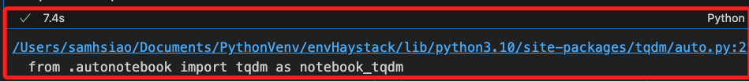
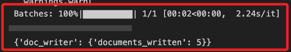
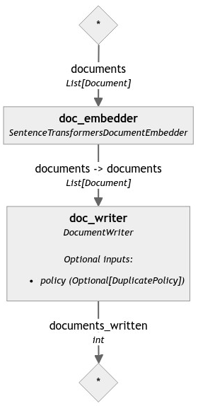
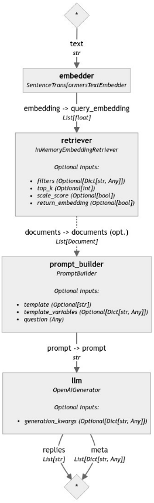
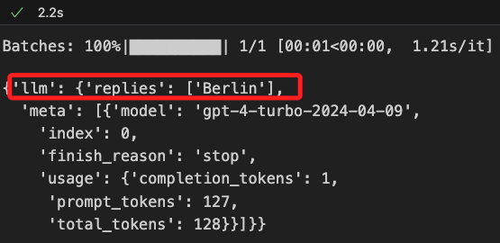
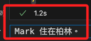
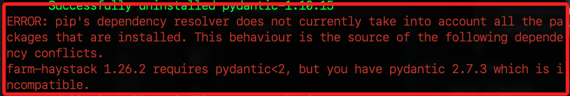

# Chat App


_Building a Chat Application with Function Calling_

<br>

## 說明

1. 這是官方在 `2024/04/25` 發布的 [官方教程](https://haystack.deepset.ai/tutorials/40_building_chat_application_with_function_calling)，建立一個具有 `函數調用` 功能的 `聊天應用程序` 。

<br>

2. 使用到的組件包含 `InMemoryDocumentStore`、`SentenceTransformersDocumentEmbedder`、`SentenceTransformersTextEmbedder`、`InMemoryEmbeddingRetriever`、`PromptBuilder`、`OpenAIGenerator`、`OpenAIChatGenerator`，另外也會使用 `OpenAI API`。

<br>

3. 這個範例的目的是使用 `OpenAI` 的 `函數調用功能 `來建立具備 `類代理行為` 的聊天應用程序，將 Haystack 管道轉換為函數調用工具，以及使用 OpenAI 的 Chat Completion API 通過 OpenAIChatGenerator 來實現類代理行為的應用程序。相關文件可參考 Haystack 的 [OpenAIChatGenerator 文件](https://docs.haystack.deepset.ai/docs/openaichatgenerator)。

<br>

4. OpenAI 的 `函數調用功能` 將 `LLM` 連接到外部工具，通過向 `OpenAI API` 調用提供函數列表及其規範可輕鬆建立聊天助手，這些助手可以通過調用外部 API 來回答問題或從文本中提取結構化信息。

<br>

## 開發之前

1. 安裝 `Haystack 2.0` 和 `sentence-transformers`：這是官方範例指定的版本。

    ```bash
    pip install haystack-ai "sentence-transformers>=2.2.0"
    ```

<br>

## OpenAIChatGenerator vs OpenAIGenerator

_先簡介兩者差異_

<br>

1. `OpenAIChatGenerator` 和 `OpenAIGenerator` 都是 `Haystack` 框架中的 `組件`，兩者都可使用 `OpenAI API` 進行 `NLP` 任務，但功能和使用場景有所不同。

<br>

2. `OpenAIChatGenerator` 支持調用 `OpenAI` 的函數調用功能，是專門設計用來與 `OpenAI` 的 `Chat Completion API` 交互，支持複雜對話的上下文管理和多輪對話，適合構建聊天機器人或需要上下文理解的應用。

<br>

3. `OpenAIChatGenerator` 使用 `ChatMessage` 列表進行通信，每個 `ChatMessage` 對象可以表示一條用戶或系統消息，並包含消息的角色和具體的文本內容，角色則可以是用戶或助手。

<br>

4. 在 `OpenAIGenerator` 部分則與 `OpenAIChatGenerator` 不同， `OpenAIGenerator` 是用來與 `OpenAI` 的 `Completion API` 互動的，主要用於生成 `單輪文本回答`，適合簡單的文本生成任務，如回答問題、文本續寫、翻譯、總結等，並且不支持上下文管理。

<br>

5. 以下程式碼展示如何使用 `haystack` 的 `OpenAIChatGenerator` 來生成一個對話系統，這裡會使用 `OpenAI API`，建立環境變數部分請參考後續步驟，這裡不贅述。

    ```python
    from haystack.dataclasses import ChatMessage
    from haystack.components.generators.chat import OpenAIChatGenerator

    # 建立系統消息和用戶消息的 ChatMessage 對象
    # 系統消息提示生成的回應應該始終使用繁體中文，即使輸入是其他語言
    # 用戶消息則是提問 "什麼是自然語言處理？要簡潔。"。
    messages = [
        ChatMessage.from_system(
            "即使某些輸入資料採用其他語言，也始終以繁體中文回應。"
        ),
        ChatMessage.from_user(
            "什麼是自然語言處理？要簡潔。"
        ),
    ]

    # 初始化 OpenAIChatGenerator
    chat_generator = OpenAIChatGenerator(model="gpt-4-turbo")
    # 傳入消息並運行生成對話
    response = chat_generator.run(messages=messages)
    # 輸出查看
    print(response)
    ```

<br>

6. 輸出如下結果。

    ```python
    {
        "replies": [
            ChatMessage(
                content="自然語言處理（NLP）是人工智能的一個分支，它使計算機能夠理解、解釋和生成人類語言。主要應用包括語音識別、語言翻譯和情感分析。",
                role=<ChatRole.ASSISTANT: "assistant">,
                name=None,
                meta={
                    "model": "gpt-4-turbo-2024-04-09",
                    "index": 0,
                    "finish_reason": "stop",
                    "usage": {
                        "completion_tokens": 82,
                        "prompt_tokens": 67,
                        "total_tokens": 149
                    }
                }
            )
        ]
    }
    ```

<br>

7. 優化輸出。

    ```python
    # 優化輸出結果，包含用戶消息
    for msg in messages:
        if msg.role == 'user':
            print(f"用戶: {msg.content}")
        elif msg.role == 'system':
            print(f"系統: {msg.content}")

    # 輸出生成的回應
    for reply in response['replies']:
        print(f"助理: {reply.content}")
    ```

    _結果：_
    ```bash
    系統: 即使某些輸入資料採用其他語言，也始終以繁體中文回應。
    用戶: 什麼是自然語言處理？要簡潔。
    助理: 自然語言處理（NLP）是人工智能的一個分支，專注於讓計算機理解、解釋、並生成人類語言的技術。其目的是讓機器能夠處理和回應語言數據，以支持各種應用，如語音識別、機器翻譯和情感分析等。
    ```

<br>

8. 簡介流式處理： `OpenAIChatGenerator` 支持流式處理，以下提供一個 `streaming_callback` 函數並重新運行 `chat_generator` 來查看差異。

    ```python
    from haystack.dataclasses import ChatMessage
    from haystack.components.generators.chat import OpenAIChatGenerator
    from haystack.components.generators.utils import print_streaming_chunk

    # 使用流式回調函數初始化 OpenAIChatGenerator
    chat_generator = OpenAIChatGenerator(
        model="gpt-4-turbo",
        streaming_callback=print_streaming_chunk
    )
    # 傳入消息並運行
    response = chat_generator.run(messages=messages)
    ```

<br>

## 警告排除

1. 運行中，假如出現如下的錯誤訊息 `TqdmWarning: IProgress not found. Please update jupyter and ipywidgets.`，這是提示了一個與 `tqdm` 和 `Jupyter` 或 `ipywidgets` 有關的問題。

    

<br>

2. 這只是一個功能性問題所以不加贅述，可透過以下指令進行排除。

    ```bash
    pip install --upgrade jupyter ipywidgets
    ```

<br>

## 進行開發

1. 建立環境變量。

    ```python
    from getpass import getpass
    import os
    from dotenv import load_dotenv

    # 載入環境變數
    load_dotenv()
    # 兩個 API 的密鑰
    os.environ["OPENAI_API_KEY"] = os.getenv("OPENAI_API_KEY")

    if "OPENAI_API_KEY" not in os.environ:
        os.environ["OPENAI_API_KEY"] = getpass("Enter OpenAI API key:")
    ```

<br>

2. 導入相關組件套件。

    ```python
    from haystack import Pipeline, Document
    from haystack.document_stores.in_memory import InMemoryDocumentStore
    from haystack.components.writers import DocumentWriter
    from haystack.components.embedders import SentenceTransformersDocumentEmbedder
    ```

<br>

3. 建立簡單的文件數據。

    ```python
    # 建立文件
    documents = [
        Document(content="My name is Jean and I live in Paris."),
        Document(content="My name is Mark and I live in Berlin."),
        Document(content="My name is Giorgio and I live in Rome."),
        Document(content="My name is Marta and I live in Madrid."),
        Document(content="My name is Harry and I live in London."),
    ]
    ```

<br>

4. 建立索引管道。

    ```python
    # 建立索引管道
    indexing_pipeline = Pipeline()
    ```

<br>

5. 加入管道組件。

    ```python
    # 初始化內存文件儲存組件
    document_store = InMemoryDocumentStore()    
    # 在管道中加入組件：將文件內容轉換成嵌入向量
    indexing_pipeline.add_component(
        instance=SentenceTransformersDocumentEmbedder(
            model="sentence-transformers/all-MiniLM-L6-v2"
        ),
        name="doc_embedder"
    )
    # 加入組件：將處理後的文件數據寫入到指定的文件儲存
    # 指定使用 `內存文件儲存`
    indexing_pipeline.add_component(
        instance=DocumentWriter(document_store=document_store),
        name="doc_writer"
    )
    ```

<br>

6. 連接組件。

    ```python
    # 連接嵌入器和文件寫入器
    indexing_pipeline.connect(
        "doc_embedder.documents",
        "doc_writer.documents"
    )
    ```

<br>

7. 輸出。

    ```bash
    <haystack.core.pipeline.pipeline.Pipeline object at 0x317e07d60>
    
    🚅 Components
        - doc_embedder: SentenceTransformersDocumentEmbedder
        - doc_writer: DocumentWriter
    
    🛤️ Connections
        - doc_embedder.documents -> doc_writer.documents (List[Document])
    ```

<br>

8. 運行管道。

    ```python
    # 運行管道
    indexing_pipeline.run({
        "doc_embedder": {"documents": documents}
    })
    ```

<br>

9. 運行後顯示。

    

<br>

10. 調用自訂函數。

    ```python
    from utils.draw_pipeline import draw_and_display

    draw_and_display(indexing_pipeline, "ex10_1_pipe.png")
    ```

    

<br>

## 建立管道

_建立基本的 RAG 管道_

<br>

1. 導入相關組件套件。

    ```python
    from haystack.components.embedders import SentenceTransformersTextEmbedder
    from haystack.components.retrievers.in_memory import InMemoryEmbeddingRetriever
    from haystack.components.builders import PromptBuilder
    from haystack.components.generators import OpenAIGenerator
    ```

<br>

2. 定義模板。

    ```python
    # 定義提示模板
    template = """
    根據給定的上下文回答問題。

    上下文:
    
        {{ document.content }}
    
    問題: {{ question }}
    答案:
    """
    ```

<br>

3. 建立管道。

    ```python
    # 建立 RAG 管道
    rag_pipe = Pipeline()
    ```

<br>

4. 建立組件。

    ```python
    rag_pipe.add_component(
        "embedder",
        SentenceTransformersTextEmbedder(
            model="sentence-transformers/all-MiniLM-L6-v2"
        )
    )
    rag_pipe.add_component(
        "retriever",
        InMemoryEmbeddingRetriever(
            document_store=document_store
        )
    )
    rag_pipe.add_component(
        "prompt_builder",
        PromptBuilder(
            template=template
        )
    )
    rag_pipe.add_component(
        "llm",
        OpenAIGenerator(model="gpt-4-turbo")
    )
    ```

<br>

5. 連結組件。

    ```python
    # 連接組件
    rag_pipe.connect(
        "embedder.embedding",
        "retriever.query_embedding"
    )
    rag_pipe.connect(
        "retriever",
        "prompt_builder.documents"
    )
    rag_pipe.connect(
        "prompt_builder",
        "llm"
    )
    ```

<br>

6. 會輸出以下訊息。

    ```bash
    <haystack.core.pipeline.pipeline.Pipeline object at 0x3169ca710>

    🚅 Components
        - embedder: SentenceTransformersTextEmbedder
        - retriever: InMemoryEmbeddingRetriever
        - prompt_builder: PromptBuilder
        - llm: OpenAIGenerator

    🛤️ Connections
        - embedder.embedding -> retriever.query_embedding (List[float])
        - retriever.documents -> prompt_builder.documents (List[Document])
        - prompt_builder.prompt -> llm.prompt (str)
    ```

<br>

7. 輸出管道圖。

    ```python
    draw_and_display(rag_pipe, "ex10_2_pipe.png")
    ```

    

<br>

## 運行管道

1. 使用一個查詢來測試管道，並確保它按照預期工作，然後再將其用作函數調用工具。

    ```python
    query = "Mark 住在哪裡？"
    rag_pipe.run({
        "embedder": {"text": query},
        "prompt_builder": {"question": query}
    })
    ```

<br>

2. 會顯示以下結果。

    

<br>

## 將 Haystack 管道轉換為工具

1. 將 `rag_pipe.run` 調用包裝成一個函數 `rag_pipeline_func`，這個 `rag_pipeline_func` 函數將接受一個查詢並返回來自 RAG 管道的 LLM 的回應，然後可將此函數作為工具引入到 `OpenAIChatGenerator` 中。

    ```python
    def rag_pipeline_func(query: str):
        result = rag_pipe.run({
            "embedder": {"text": query},
            "prompt_builder": {"question": query}
        })
        return {"reply": result["llm"]["replies"][0]}
    ```

<br>

## 建立工具列表

1. 除了 `rag_pipeline_func` 工具外，還建立一個名為 `get_current_weather` 的新工具，用於獲取 `城市的天氣信息`，以下函數中使用硬編碼的數據來展示功能。

    ```python
    WEATHER_INFO = {
        "Berlin": {
            "weather": "mostly sunny", "temperature": 7, "unit": "celsius"
        },
        "Paris": {
            "weather": "mostly cloudy", "temperature": 8, "unit": "celsius"
        },
        "Rome": {
            "weather": "sunny", "temperature": 14, "unit": "celsius"
        },
        "Madrid": {
            "weather": "sunny", "temperature": 10, "unit": "celsius"
        },
        "London": {
            "weather": "cloudy", "temperature": 9, "unit": "celsius"
        },
    }

    def get_current_weather(location: str):
        if location in WEATHER_INFO:
            return WEATHER_INFO[location]
        else:
            # 回退數據
            return {
                "weather": "sunny",
                "temperature": 21.8,
                "unit": "fahrenheit"
            }
    ```

<br>

2. 接下來，按照 `OpenAI` 的工具架構為 `rag_pipeline_func` 和 `get_current_weather` 添加函數說明。詳細說明 `rag_pipeline_func` 和 `query`，以便 OpenAI 可以生成適當的參數。

    ```python
    tools = [
        {
            "type": "function",
            "function": {
                "name": "rag_pipeline_func",
                "description": "獲取有關人們居住地點的信息",
                "parameters": {
                    "type": "object",
                    "properties": {
                        "query": {
                            "type": "string",
                            "description": "搜尋中使用的查詢。從用戶的消息中推斷出這一點。它應該是一個問題或一個陳述。",
                        }
                    },
                    "required": ["query"],
                },
            },
        },
        {
            "type": "function",
            "function": {
                "name": "get_current_weather",
                "description": "取得當前天氣",
                "parameters": {
                    "type": "object",
                    "properties": {
                        "location": {
                            "type": "string",
                            "description": "城市和州，例如加州舊金山"
                        }
                    },
                    "required": ["location"],
                },
            },
        },
    ]
    ```

<br>

## 使用工具運行 OpenAIChatGenerator

1. 要使用函數調用功能，您需要在 `OpenAIChatGenerator` 的 `run()` 方法中傳入工具列表作為 `generation_kwargs`。用系統消息指導模型使用提供的工具，然後作為用戶消息提供一個需要函數調用的查詢。

    ```python
    from haystack.dataclasses import ChatMessage
    from haystack.components.generators.chat import OpenAIChatGenerator
    from haystack.components.generators.utils import print_streaming_chunk

    # 建立消息列表，包含系統消息和用戶查詢
    messages = [
        ChatMessage.from_system(
            "不要假設將哪些值插入函數中。如果用戶要求不明確，請要求澄清。"
        ),
        ChatMessage.from_user("你能告訴我 Mark 住在哪裡嗎？"),
    ]

    # 初始化 OpenAIChatGenerator
    chat_generator = OpenAIChatGenerator(
        model="gpt-4-turbo",
        streaming_callback=print_streaming_chunk
    )
    # 傳入消息和工具列表並運行
    response = chat_generator.run(
        messages=messages,
        generation_kwargs={"tools": tools}
    )
    # 輸出查看
    print(response)
    ```

<br>

2. 將獲得一個以 JSON 格式顯示且包含 `工具名稱` 和 `參數` 的 `ChatMessage`。

    ```python
    {
        'replies': [
            ChatMessage(
                content='[{"index": 0, "id": "call_2ARyzeivzPqS0ETx3jVHt4ct", "function": {"arguments": "{\\"query\\":\\"Where does Mark live?\\"}", "name": "rag_pipeline_func"}, "type": "function"}]',
                role=<ChatRole.ASSISTANT: 'assistant'>,
                name=None,
                meta={
                    'model': 'gpt-4-turbo-2024-04-09',
                    'index': 0,
                    'finish_reason': 'tool_calls',
                    'usage': {}
                }
            )
        ]
    }
    ```

<br>

3. 接下來將消息內容字串解析為 JSON 並使用提供的參數調用相應的函數。

    ```python
    import json

    # 解析函數調用信息
    # 提取第一個回應中的 content
    content = response['replies'][0].content

    # 將 content 解析為 JSON
    # content 是一個 JSON 字串，需要轉換為 Python 字典
    function_calls = json.loads(content)

    # 提取第一個函數調用信息
    # 提取函數調用列表中的第一個元素
    function_call = function_calls[0]

    # 獲取函數名稱
    # 獲取函數名稱，這是我們需要調用的函數
    function_name = function_call['function']['name']

    # 解析函數參數
    # 將參數解析為字典格式
    function_args = json.loads(function_call['function']['arguments'])

    # 輸出函數名稱和參數
    print("Function Name:", function_name)
    print("Function Arguments:", function_args)

    # 可用函數字典
    available_functions = {
        "rag_pipeline_func": rag_pipeline_func,
        "get_current_weather": get_current_weather
    }

    # 搜尋相應的函數並使用給定的參數調用它
    if function_name in available_functions:
        # 根據函數名稱找到對應的函數
        function_to_call = available_functions[function_name]
        # 使用解包操作將參數傳遞給函數
        function_response = function_to_call(**function_args)
        # 輸出函數的返回值
        print("Function Response:", function_response)
    else:
        # 如果函數名稱未找到，輸出錯誤訊息
        print(f"Function {function_name} not found.")
    ```

<br>

4. 得到以下的輸出結果。

    ```bash
    Function Name: rag_pipeline_func
    Function Arguments: {'query': 'Mark lives in which location?'}
    Function Response: {'reply': 'Mark lives in Berlin, query was: Mark lives in which location?'}
    ```

<br>

5. 最後一步，通過將函數回應附加到消息列表作為新消息，使用 `ChatMessage.from_function()` 並重新運行 `OpenAIChatGenerator`，讓模型總結結果。

    ```python
    from haystack.dataclasses import ChatMessage

    # 建立函數回應消息
    function_message = ChatMessage.from_function(
        content=json.dumps(function_response),
        name=function_name
    )
    # 將函數回應消息添加到消息列表
    messages.append(function_message)

    # 再次運行 OpenAIChatGenerator
    response = chat_generator.run(
        messages=messages,
        generation_kwargs={"tools": tools}
    )
    ```

<br>

6. 輸出。

    

<br>

## 建立聊天應用程序

1. `OpenAI Chat Completions API` 並不會直接調用函數；相反，模型會生成可以在程式碼中調用的 JSON。因此，為了建立 `端到端` 的聊天應用程序，需要在每次消息中檢查 `OpenAI` 回應是否為 `工具調用`。如果是，需要使用提供的參數調用相應的函數，並將函數回應發送回 OpenAI。否則，將用戶和消息都附加到消息列表中，與模型進行常規對話。

<br>

2. 要為應用程序建立一個漂亮的用戶界面，可以使用帶有聊天界面的 `Gradio`。安裝 `gradio`，運行下面的程式碼單元，並使用輸入框與具有訪問權限的聊天應用程序進行交互。

    ```bash
    pip install gradio
    ```

<br>

3. 雖然 `gradio` 已成功安裝，但出現了一些依賴性衝突，這是因為 `farm-haystack` 需要的 `pydantic` 版本與 `gradio` 需要的版本不相容，`farm-haystack` 要求 pydantic 的版本必須 `小於 2`，但安裝的 pydantic 版本是 `2.7.3`，這裡先忽略不管，看看後續運作情況再來處理。

    

<br>

4. 程式碼。

    ```python
    import gradio as gr
    import json

    from haystack.dataclasses import ChatMessage
    from haystack.components.generators.chat import OpenAIChatGenerator

    # 定義工具函數
    def rag_pipeline_func(query: str):
        return {"reply": f"Giorgio 住在 Berlin, query was: {query}"}

    def get_current_weather(location: str):
        return {"weather": "sunny", "temperature": 20, "location": location}

    # 可用函數字典
    available_functions = {
        "rag_pipeline_func": rag_pipeline_func,
        "get_current_weather": get_current_weather
    }

    chat_generator = OpenAIChatGenerator(model="gpt-3.5-turbo")
    response = None
    messages = [
        ChatMessage.from_system(
            "不要假設將哪些值插入函數中。"
            "如果用戶要求不明確，請要求澄清。"
        )
    ]

    # 定義聊天機器人函數
    def chatbot_with_fc(message, history):
        messages.append(ChatMessage.from_user(message))
        response = chat_generator.run(messages=messages, generation_kwargs={"tools": tools})

        while True:
            # 如果 OpenAI 回應是一個工具調用
            if response and response["replies"][0].meta["finish_reason"] == "tool_calls":
                try:
                    function_calls = json.loads(response["replies"][0].content)
                except json.JSONDecodeError as e:
                    print(f"解析 JSON 發生錯誤：{e}")
                    break

                print(response["replies"][0])
                for function_call in function_calls:
                    # 解析函數調用信息
                    function_name = function_call["function"]["name"]
                    function_args = json.loads(function_call["function"]["arguments"])

                    # 檢查函數是否存在
                    if function_name in available_functions:
                        function_to_call = available_functions[function_name]
                        try:
                            # 使用解包操作將參數傳遞給函數
                            function_response = function_to_call(**function_args)
                        except TypeError as te:
                            print(f"函數調用錯誤：{te}")
                            continue

                        # 使用 `ChatMessage.from_function` 將函數回應添加到消息列表
                        messages.append(ChatMessage.from_function(content=json.dumps(function_response), name=function_name))
                        response = chat_generator.run(messages=messages, generation_kwargs={"tools": tools})
                    else:
                        print(f"函數 {function_name} 未找到")
                        continue
            else:
                if response:
                    messages.append(response["replies"][0])
                break
        return response["replies"][0].content if response else "No response generated."

    # 建立聊天界面
    demo = gr.ChatInterface(
        fn=chatbot_with_fc,
        examples=[
            "瑞典的首都是什麼？",
            "你能告訴我 Giorgio 住在哪裡嗎？",
            "馬德里的天氣怎麼樣？",
            "Madrid 的天氣怎麼樣？",
            "誰住在 London?",
            "Mark 住的地方的天氣怎麼樣？",
        ],
        title="請詢問有關天氣或人們居住的地方。",
    )
    ```

<br>

5. 啟動聊天視窗。

    ```python
    # 啟動聊天應用程序
    demo.launch()
    ```

<br>

6. 啟動 `Gradio` 的視窗界面。

    

<br>

7. 可以嘗試的查詢。

    ```bash
    "瑞典的首都是什麼？"：一個基本的查詢，沒有任何函數調用。
    "你能告訴我 Giorgio 住在哪裡嗎？"：一個基本的查詢，帶有一次函數調用。
    "馬德里的天氣怎麼樣？"
    "那裡現在是晴天嗎？"：查看消息是否被記錄並發送。
    "Jean 住的地方天氣怎麼樣？"：強制調用兩次函數。
    "今天的天氣怎麼樣？"：強制 OpenAI 詢問更多澄清問題。
    ```

<br>

___

_END_