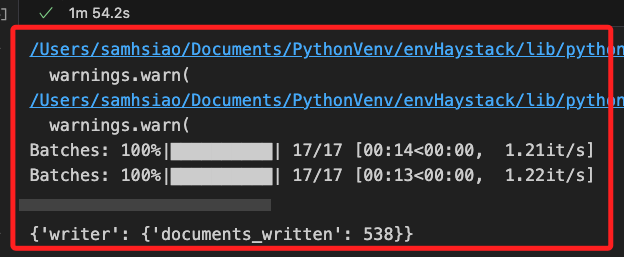
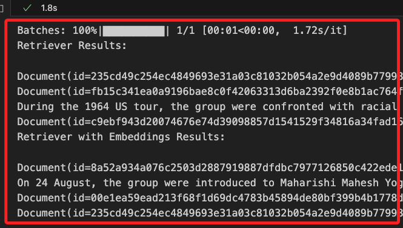
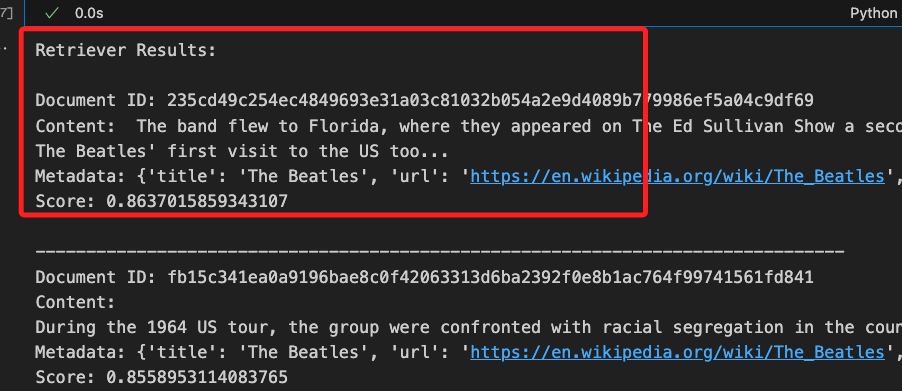

# 嵌入元數據


<br>

## 說明

1. 這是官方在 `2024/04/25` 所發佈的 [官方教程](https://haystack.deepset.ai/tutorials/39_embedding_metadata_for_improved_retrieval)。

<br>

2. 使用的組件包含：`InMemoryDocumentStore`、`InMemoryEmbeddingRetriever`、`SentenceTransformersDocumentEmbedder`、`SentenceTransformersTextEmbedder`。

<br>

3. 將文件索引到文件儲存中時可有兩種選擇：一是 `嵌入文件的文本`、二是 `嵌入文本和一些有意義的元數據`，在某些情況下，將 `有意義的元數據` 與文件內容一起嵌入可改進檢索效果。

<br>

4. 這個範例的目標就是在索引文件時 `嵌入元數據信息`，這可改進檢索效果，對於哪種類型的元數據適用當前所以需視狀況，此例中演示嵌入 `title` 元數據字段為嵌入模型提供良好的上下文，實作上將從維基百科獲取不同頁面，並將其與元數據（包括標題和 URL）一起索引到 `InMemoryDocumentStore` 中。

<br>

## 開始

1. 安裝 Haystack 2.0 和其他所需包。

    ```bash
    pip install haystack-ai wikipedia sentence-transformers
    ```

<br>

2. 將文件與元數據一起索引：建立一個管道，將小型範例數據集儲存在 `InMemoryDocumentStore` 中，並附加嵌入。

<br>

3. 使用 `SentenceTransformersDocumentEmbedder` 生成文件的嵌入，並將其寫入文件儲存，特別注意，在官方的範例上，錯誤導入了 `SentenceTransformersTextEmbedder`，以下已經做了修正。

    ```python
    from haystack.components.embedders import SentenceTransformersDocumentEmbedder

    # 建立嵌入器，並指定要嵌入的元數據字段
    embedder = SentenceTransformersDocumentEmbedder(
        meta_fields_to_embed=["url"]
    )
    ```

<br>

# 建立索引管道

1. 導入必要的函式庫。

    ```python
    from haystack import Pipeline
    from haystack.components.preprocessors import DocumentCleaner, DocumentSplitter
    from haystack.components.embedders import SentenceTransformersDocumentEmbedder
    from haystack.components.writers import DocumentWriter
    from haystack.document_stores.types import DuplicatePolicy
    from haystack.utils import ComponentDevice
    ```

<br>

2. 定義輔助函數。

    ```python
    # 定義一個輔助函數：建立索引管道
    def create_indexing_pipeline(
        document_store, metadata_fields_to_embed=None
    ):
        # 建立文件清理器
        document_cleaner = DocumentCleaner()
        # 建立文件分割器，按句子分割
        document_splitter = DocumentSplitter(
            split_by="sentence", split_length=2
        )
        # 建立文件嵌入器，並指定要嵌入的元數據字段
        document_embedder = SentenceTransformersDocumentEmbedder(
            model="thenlper/gte-large", meta_fields_to_embed=metadata_fields_to_embed
        )
        # 建立文件寫入器，使用覆寫策略
        document_writer = DocumentWriter(
            document_store=document_store,
            policy=DuplicatePolicy.OVERWRITE
        )
        # 建立管道
        indexing_pipeline = Pipeline()
        # 添加文件清理器
        indexing_pipeline.add_component(
            "cleaner", document_cleaner
        )
        # 添加文件分割器
        indexing_pipeline.add_component(
            "splitter", document_splitter
        )
        # 添加文件嵌入器
        indexing_pipeline.add_component(
            "embedder", document_embedder
        )
        # 添加文件寫入器
        indexing_pipeline.add_component(
            "writer", document_writer
        )

        # 連接管道組件
        indexing_pipeline.connect("cleaner", "splitter")
        indexing_pipeline.connect("splitter", "embedder")
        indexing_pipeline.connect("embedder", "writer")
        # 返回配置好的管道
        return indexing_pipeline
    ```

<br>

3. 導入建立索引所需庫。

    ```python
    import wikipedia
    from haystack import Document
    from haystack.document_stores.in_memory import InMemoryDocumentStore
    ```

<br>

4. 若要進行中文數據。

    ```python
    # 設置維基百科語言為中文
    wikipedia.set_lang("zh")
    ```

<br>

5. 將建立兩個索引管道從各種維基百科文章中索引文件，分別命名為 `indexing_pipeline`與 `indexing_with_metadata_pipeline`，其中 `indexing_pipeline` 僅進行索引文件的內容到 `document_store` 中；另外， `indexing_with_metadata_pipeline` 則將元數據字段與文件內容一起索引到 `document_store_with_embedded_metadata` 中。

    ```python
    # 定義需要檢索的樂隊名稱
    some_bands = """The Beatles,The Cure""".split(",")

    raw_docs = []

    # 從維基百科獲取每個樂隊的頁面，並建立文件
    for title in some_bands:
        page = wikipedia.page(
            title=title, auto_suggest=False
        )
        doc = Document(
            content=page.content,
            meta={
                "title": page.title,
                "url": page.url
            }
        )
        # 將建立的文件添加到列表中
        raw_docs.append(doc)

    # 建立內存文件儲存
    document_store = InMemoryDocumentStore(
        embedding_similarity_function="cosine"
    )
    document_store_with_embedded_metadata = InMemoryDocumentStore(
        embedding_similarity_function="cosine"
    )

    # 建立僅索引內容的管道
    indexing_pipeline = create_indexing_pipeline(
        document_store=document_store
    )

    # 建立索引內容和元數據的管道
    indexing_with_metadata_pipeline = create_indexing_pipeline(
        document_store=document_store_with_embedded_metadata,
        metadata_fields_to_embed=["title"]
    )

    # 執行管道以索引文件
    indexing_pipeline.run({
        "cleaner": {"documents": raw_docs}
    })
    indexing_with_metadata_pipeline.run({
        "cleaner": {"documents": raw_docs}
    })
    ```

<br>

4. 這需要花上一點時間。

    

<br>

## 比較有無嵌入元數據的檢索效果

1. 建立一個 `檢索管道` 並包含兩個檢索器 `retriever` 與 `retriever_with_embeddings`，其中 `retriever` 從未嵌入元數據的 `document_store` 中檢索；另外， `retriever_with_embeddings` 從嵌入了元數據的 `document_store_with_embedded_metadata` 中檢索，並比較這兩個檢索器的結果，看看嵌入元數據是否有助於檢索。

    ```python
    from haystack.components.embedders import SentenceTransformersTextEmbedder
    from haystack.components.retrievers.in_memory import InMemoryEmbeddingRetriever

    # 建立檢索管道
    retrieval_pipeline = Pipeline()
    retrieval_pipeline.add_component(
        "text_embedder",
        SentenceTransformersTextEmbedder(model="thenlper/gte-large")
    )
    retrieval_pipeline.add_component(
        "retriever", InMemoryEmbeddingRetriever(
            document_store=document_store,
            scale_score=False,
            top_k=3
        )
    )
    retrieval_pipeline.add_component(
        "retriever_with_embeddings",
        InMemoryEmbeddingRetriever(
            document_store=document_store_with_embedded_metadata,
            scale_score=False, top_k=3
        )
    )

    # 連接檢索管道組件
    retrieval_pipeline.connect(
        "text_embedder", "retriever"
    )
    retrieval_pipeline.connect(
        "text_embedder", "retriever_with_embeddings"
    )

    # 執行檢索並比較結果
    result = retrieval_pipeline.run({
        "text_embedder": {"text": "Have the Beatles ever been to Bangor?"}
    })
    # 輸出結果一
    print("Retriever Results:\n")
    # 遍歷
    for doc in result["retriever"]["documents"]:
        print(doc)
    # 輸出結果二
    print("Retriever with Embeddings Results:\n")
    # 遍歷
    for doc in result["retriever_with_embeddings"]["documents"]:
        print(doc)
    ```

<br>

2. 輸出結果。

    

<br>

3. 查看其中一個 `Document` 的內容。

    ```python
    Document(
        id='235cd49c254e...',
        content: ' The band flew to Florida, where they appeared on The Ed Sullivan Show a second time, again before 7...',
        meta: {
            'title': 'The Beatles',
            'url': 'https://en.wikipedia.org/wiki/The_Beatles',
            'source_id': '696b9b61e4f...',
            'page_number': 1
        },
        score: 0.8637015859343107
    )
    ```

<br>

## 優化輸出

1. 程式碼。

    ```python
    # 格式化輸出
    def format_document_output(documents, title):
        print(f"{title} Results:\n")
        for doc in documents:
            print(f"Document ID: {doc.id}")
            # 只顯示前200個字符
            print(f"Content: {doc.content[:200]}...")
            print(f"Metadata: {doc.meta}")
            print(f"Score: {doc.score}\n")
            print("-" * 80)

    # 輸出結果一
    format_document_output(
        result["retriever"]["documents"],
        "Retriever"
    )

    # 輸出結果二
    format_document_output(
        result["retriever_with_embeddings"]["documents"],
        "Retriever with Embeddings"
    )
    ```

<br>

2. 輸出結果。

    

<br>

## 實務上的應用與拓展

_在實務中，嵌入元數據與文本的檢索技術具有廣泛的應用_

<br>

1. 提高精確度：嵌入元數據可以在不明確查詢時，根據上下文提供更多的信息。例如，使用電子商務平台時，使用商品名稱、分類等元數據可以提高搜索的相關性。

<br>

2. 上下文檢索：在法律文件或技術文件中，元數據如文件標題、發佈日期等可以用來提供更豐富的上下文，從而提升檢索質量。

<br>

3. 個性化推薦：在推薦系統中，元數據如用戶喜好、過往行為記錄等，能幫助系統提供更準確的推薦結果。

<br>

4. 知識管理：在企業的知識管理系統中，將文件的作者、部門、日期等元數據嵌入，可以快速檢索到相關文件，提高工作效率。

<br>

___

_END_