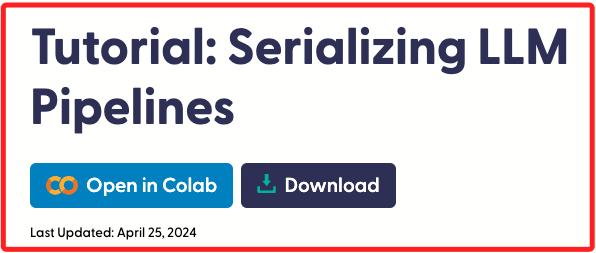
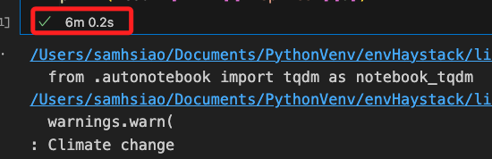
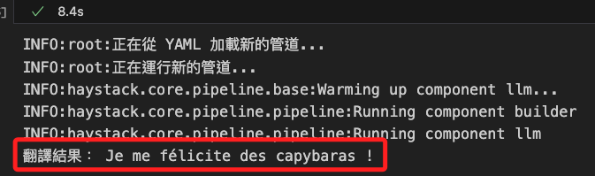

# 序列化 LLM 管道



<br>

## 說明 📚

1. 這是官方在 `2024/04/25` 發佈的 [官方範例](https://haystack.deepset.ai/tutorials/29_serializing_pipelines)。

<br>

2. 使用的組件包含 `HuggingFaceLocalGenerator`、`PromptBuilder`。

<br>

3. 本範例目標是在 `YAML` 和 `Python 程式碼` 之間進行 `序列化` 和 `反序列化`。

<br>

4. `序列化` 是將 `管道` 轉換為可以保存到磁碟或其他儲存介質的格式，以便之後可以再次載入和使用。

<br>

5. `Haystack` 支持將管道直接序列化為 `YAML` 格式，如此便可輕鬆地進行更改，這個範例將建立一個簡單的 Python 管道，將其序列化為 `YAML`，進行修改後再反序列化回 `Haystack` 管道。

<br>

## 開始

1. 安裝套件。

    ```bash
    pip install haystack-ai
    ```

<br>

## 建立日誌

1. 透過日誌可觀察細部過程與資訊。

    ```python
    # 添加日誌
    import logging

    # 設置日誌輸出級別
    logging.basicConfig(level=logging.INFO)

    # 在必要處添加其他日誌
    logging.info("其他訊息。")
    ```

<br>

## 建立簡單的管道

1. 建立一個簡單的管道，先讓用戶輸入一個主題，然後生成關於該主題的摘要，這裡使用的是 `google/flan-t5-large` 模型，並隨時可修改管道。注意，在這個管道中使用的是從 `Hugging Face` 獲取的 `本地模型`，會是一個相對較小的開源 LLM。

    ```python
    from haystack import Pipeline
    from haystack.components.builders import PromptBuilder
    from haystack.components.generators import HuggingFaceLocalGenerator

    # 添加日誌
    import logging

    # 設置日誌輸出級別
    logging.basicConfig(level=logging.INFO)

    # 定義模板，將用戶輸入的主題插入其中
    # 英文
    template = """
    Please create a summary about the following topic:
    {{ topic }}
    """

    # 建立 PromptBuilder，使用定義的模板
    builder = PromptBuilder(template=template)
    logging.info("PromptBuilder 已建立。")

    # 建立 HuggingFaceLocalGenerator，指定使用的模型和生成的參數
    logging.info("開始載入模型，這可能需要一些時間。")
    llm = HuggingFaceLocalGenerator(
        model="google/flan-t5-large",
        task="text2text-generation",
        generation_kwargs={"max_new_tokens": 300, "temperature": 0.7},
    )
    logging.info("HuggingFaceLocalGenerator 已建立並初始化。")

    # 建立管道
    pipeline = Pipeline()
    # 添加組件到管道
    pipeline.add_component(name="builder", instance=builder)
    pipeline.add_component(name="llm", instance=llm)

    # 連接管道中的組件
    pipeline.connect("builder", "llm")
    logging.info("管道組件已連接。")

    # 定義用戶輸入的主題
    topic = "Climate change"

    # 輸出生成的摘要
    logging.info("正在運行管道...")
    # 運行管道，生成關於主題的摘要
    result = pipeline.run(data={"builder": {"topic": topic}})
    summary = result["llm"]["replies"][0]
    print(f"查看整個 result：{result}")
    # 增加檢查生成的結果
    if summary.strip() == "":
        logging.warning("生成的摘要為空。")
    else:
        print("生成的摘要：", summary)
    ```

<br>

2. 初次使用時相當耗時，因為模型要從 Hugging Face 的伺服器下載，載入完模型後，還需要一些時間初始化模型，並將其載入記憶體並進行配置。

    

<br>

3. 最終得到的結果。

    ```bash
    查看整個 result：{
        'llm': {'replies': [
            'Climate change is a major threat to the planet.'
        ]}
    }
    生成的摘要： Climate change is a major threat to the planet.
    ```

<br>

## 將管道序列化為 YAML

1. `YAML` 是一種人類可讀的 `數據序列化語言`，通常用於 `配置文件` 和 `數據交換`，而 `序列化管道 YAML` 是指將一個複雜的對象或數據結構轉換為一種可以保存到文件、傳輸或儲存的 `文本格式`，這種 `文本格式` 可以是 `YAML`。

<br>

2. `Haystack` 內置支持 `YAML`，並使用 `dumps()` 方法將 `管道` 轉換為 `YAML`。

    ```python
    # 將管道序列化為 YAML
    yaml_pipeline = pipeline.dumps()
    print("管道的 YAML 表示：\n", yaml_pipeline)
    ```

<br>

3. 會得到如下所示的序列化後的管道 `YAML` 文件。

    ```yaml
    管道的 YAML 表示：
    components:
        builder:
            init_parameters:
            required_variables: null
            template: '

                Please create a summary about the following topic:

                {{ topic }}

                '
            variables: null
            type: haystack.components.builders.prompt_builder.PromptBuilder
        llm:
            init_parameters:
            generation_kwargs:
                max_new_tokens: 300
                temperature: 0.7
            huggingface_pipeline_kwargs:
                device: mps
                model: google/flan-t5-large
                task: text2text-generation
            stop_words: null
            streaming_callback: null
            token:
                env_vars:
                - HF_API_TOKEN
                strict: false
                type: env_var
            type: haystack.components.generators.hugging_face_local.HuggingFaceLocalGenerator
    connections:
    - receiver: llm.prompt
        sender: builder.prompt
    max_loops_allowed: 100
    metadata: {}
    ```

<br>

## 編輯 YAML 中的管道

1. 特別注意， `YAML` 文件對於縮排格式要求非常嚴謹，任何的格式錯誤都將導致解析失敗。

<br>

2. 修改序列化的管道文件 YAML，例如修改其中 `promptbuilder` 的模板，將提供的句子翻譯為法語。

    ```yaml
    yaml_pipeline = """
    components:
      builder:
        init_parameters:
          template: "\nPlease translate the following to French: \n{{ sentence }}\n"
        type: haystack.components.builders.prompt_builder.PromptBuilder
      llm:
        init_parameters:
          generation_kwargs:
            max_new_tokens: 150
          huggingface_pipeline_kwargs:
            device: cpu
            model: google/flan-t5-large
            task: text2text-generation
            token: null
          stop_words: null
        type: haystack.components.generators.hugging_face_local.HuggingFaceLocalGenerator
    connections:
    - receiver: llm.prompt
      sender: builder.prompt
    max_loops_allowed: 100
    metadata: {}
    """
    ```

<br>

## 將 YAML 管道反序列化回 Python

1. 通過調用 `loads()` 方法將管道反序列化。以下將反序列化編輯過的 `yaml_pipeline`。

    ```python
    # 將 YAML 管道載入為 Python 管道
    logging.info("正在從 YAML 載入新的管道...")
    new_pipeline = Pipeline.loads(yaml_pipeline)

    # 運行新管道，將句子翻譯為法語
    logging.info("正在運行新的管道...")
    new_result = new_pipeline.run(data={"builder": {"sentence": "你好，請問你的名字？"}})
    translation = new_result["llm"]["replies"][0]
    print("翻譯結果：", translation)
    ```

<br>

2. 成功翻譯會得到以下結果。

    

<br>

## 實務應用

1. 自動化內容生成：在實際業務中，這種管道可以用於自動生成內容，如新聞摘要、產品描述等。

<br>

2. 翻譯服務：可以配置不同的模型和模板，實現多語種翻譯和語言處理服務。

<br>

3. 知識管理：在企業知識庫中，序列化的管道可以用於文件分類、信息抽取等任務，提高知識管理效率。

<br>

## 拓展說明

1. 使用更強大的模型：可以替換 `google/flan-t5-large` 為其他更強大的模型，根據業務需求進行調整。

<br>

2. 擴展到多模態數據：不僅限於文本數據，可以加入圖像、語音等多模態數據的處理。

<br>

3. 集成其他服務：可以與其他機器學習或深度學習框架集成，實現更複雜的數據處理和分析。

<br>

## HuggingFaceLocalGenerator

_[官方文件](https://docs.haystack.deepset.ai/docs/huggingfacelocalgenerator)_

<br>

1. 常見於 `PromptBuilder` 之後，輸入 `"prompt"` 作為對 LLM 的提示字串，輸出的 `"replies"` 是由 LLM 生成的字串列表。

<br>

2. `HuggingFaceLocalGenerator` 是一個接口，允許使用本地運行的 `Hugging Face` 模型來生成文本，當 `LLM` 在本地運行時，可能需要強大的機器，這取決於所選模型及其參數數量。

<br>

3. 此組件設計用於 `文本生成`，而不是 `聊天`，如果需要使用 `Hugging Face LLM` 進行聊天，請使用 `HuggingFaceLocalChatGenerator`。

<br>

4. 對於遠程文件授權，此組件默認使用 `HF_API_TOKEN` 環境變數。或者，可以在初始化時傳遞 Hugging Face API 令牌。

    ```python
    local_generator = HuggingFaceLocalGenerator(
        token=Secret.from_token("<輸入自己的令牌>")
    )
    ```

<br>

5. 獨立使用。

    ```python
    from haystack.components.generators import HuggingFaceLocalGenerator

    # 初始化本地生成器，設置模型和生成參數
    generator = HuggingFaceLocalGenerator(
        model="google/flan-t5-large",
        task="text2text-generation",
        generation_kwargs={
            "max_new_tokens": 100,
            "temperature": 0.9,
        }
    )

    # 預熱生成器
    generator.warm_up()

    # 運行生成器，輸出結果
    # 美國現任總統是誰
    _answer= generator.run(
        "Who is the current president of the United States?"
    )
    print(_answer)
    ```

<br>

6. 這答案也差太多了點。

    ```python
    {'replies': ['dwight eisenhower']}
    ```

<br>

7. 在管道中使用。

    ```python
    from haystack import Pipeline
    from haystack.components.retrievers.in_memory import InMemoryBM25Retriever
    from haystack.components.builders.prompt_builder import PromptBuilder
    from haystack.components.generators import HuggingFaceLocalGenerator
    from haystack.document_stores.in_memory import InMemoryDocumentStore
    from haystack import Document

    # 初始化內存文件儲存，並寫入文件
    docstore = InMemoryDocumentStore()
    docstore.write_documents([
        Document(content="Rome is the capital of Italy"),
        Document(content="Paris is the capital of France")
    ])

    # 初始化本地生成器
    generator = HuggingFaceLocalGenerator(
        model="google/flan-t5-large",
        task="text2text-generation",
        generation_kwargs={
            "max_new_tokens": 100,
            "temperature": 0.9,
        }
    )

    # 查詢問題
    query = "What is the capital of France?"

    # 定義模板
    template = """
    Given the following information, answer the question.

    Context:
    
        {{ document.content }}
    

    Question: {{ query }}?
    """

    # 初始化管道，添加組件
    pipe = Pipeline()
    pipe.add_component("retriever", InMemoryBM25Retriever(document_store=docstore))
    pipe.add_component("prompt_builder", PromptBuilder(template=template))
    pipe.add_component("llm", generator)

    # 連接管道中的組件
    pipe.connect("retriever", "prompt_builder.documents")
    pipe.connect("prompt_builder", "llm")

    # 運行管道，輸出結果
    res = pipe.run({
        "prompt_builder": {
            "query": query
        },
        "retriever": {
            "query": query
        }
    })

    print(res)
    ```

<br>

8. 這答案還差不多。

```python
{'llm': {'replies': ['Paris']}}
```

<br>

___

_END_